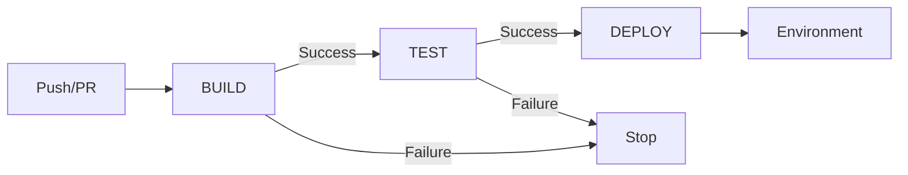
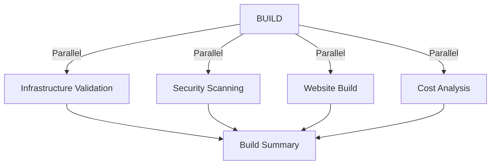

# 🚀 GitHub Actions Workflows Documentation

This directory contains enterprise-grade CI/CD workflows implementing a strict **BUILD → TEST → DEPLOY** pipeline with comprehensive security, testing, and monitoring.

## 📋 **Workflow Overview**

### **Core Pipeline Workflows**

| Workflow | Purpose | Duration | Triggers | Dependencies |
|----------|---------|----------|----------|--------------|
| **BUILD** | Infrastructure validation, security scanning, artifact preparation | ~5-10 min | Push, PRs, Manual | None |
| **TEST** | Policy validation, unit testing, environment health checks | ~10-15 min | BUILD success | BUILD ✅ |
| **DEPLOY** | Infrastructure and website deployment to environments | ~15-25 min | TEST success, Manual | TEST ✅ |

### **Specialized Workflows**

| Workflow | Purpose | When to Use | Access Level |
|----------|---------|-------------|--------------|
| **RELEASE** | Version management and release orchestration | Creating releases | Maintainers |
| **HOTFIX** | Emergency deployment pipeline | Critical production issues | Code owners only |
| **ROLLBACK** | Automated rollback capabilities | Failed deployments | Code owners only |

---

## 🏗️ **BUILD Workflow** (`build.yml`)

**Purpose**: Validates all changes before they proceed through the pipeline

### **Key Features:**
- ✅ Multi-scanner security analysis (Checkov + Trivy)
- ✅ Infrastructure validation via Terraform/OpenTofu
- ✅ Website content validation and building
- ✅ Cost estimation with budget compliance
- ✅ Parallel execution for optimal performance

### **Triggers:**
- Push to `main`, `feature/*`, `bugfix/*`, `hotfix/*`
- Pull requests to `main`
- Manual dispatch

### **Outputs:**
- Build artifacts for TEST phase
- Security scan results (SARIF format)
- Cost analysis reports
- Infrastructure validation status

---

## 🧪 **TEST Workflow** (`test.yml`)

**Purpose**: Comprehensive testing and policy validation

### **Key Features:**
- ✅ **Gate Job**: Only runs if BUILD succeeds
- ✅ Unit tests for all infrastructure modules
- ✅ Policy validation with OPA/Conftest
- ✅ Development environment health checks
- ✅ Usability testing for staging environments

### **Triggers:**
- Successful BUILD workflow completion
- Manual dispatch

### **Job Matrix:**
- Parallel unit testing: `[s3, cloudfront, waf, iam, monitoring]`
- Environment-specific health checks
- Comprehensive policy validation

---

## 🚀 **DEPLOY Workflow** (`deploy.yml`)

**Purpose**: Deploy infrastructure and content to target environments

### **Key Features:**
- ✅ **Gate Job**: Only runs if TEST succeeds
- ✅ Environment-aware deployment logic
- ✅ Production authorization with code owner approval
- ✅ Post-deployment validation and monitoring
- ✅ GitHub Deployments API integration

### **Environment Resolution:**
```
Feature Branches → Development (auto-deploy)
Main Branch     → Context-dependent
Manual Trigger  → User-specified
```

### **Protection Levels:**
- **Development**: Auto-deploy after successful tests
- **Staging**: Manual approval required
- **Production**: Code owner + reviewer approval

---

## 🔄 **Specialized Workflows**

### **RELEASE Workflow** (`release.yml`)
- Semantic versioning and release management
- Automated release notes generation
- Environment-specific deployment orchestration
- Integration with BUILD-TEST-DEPLOY pipeline

### **HOTFIX Workflow** (`hotfix.yml`)
- Emergency deployment capabilities
- Bypass normal approval processes (with authorization)
- Expedited testing and validation
- Code owner approval required

### **ROLLBACK Workflow** (`rollback.yml`)
- Automated infrastructure and content rollback
- State management and recovery
- Emergency response procedures

---

## 📊 **Workflow Architecture**

### **Sequential Flow (Standard Path):**


### **Parallel Execution Within Workflows:**


---

## 🔒 **Security & Best Practices**

### **Action Security:**
- ✅ All actions pinned to commit SHAs
- ✅ Minimal required permissions (OIDC)
- ✅ Secret management best practices
- ✅ Input validation and sanitization

### **Workflow Security:**
- ✅ Branch protection compatible
- ✅ Code owner approval for production
- ✅ Secure OIDC authentication with AWS
- ✅ Comprehensive audit logging

### **Performance Optimizations:**
- ✅ Intelligent caching strategies
- ✅ Parallel job execution where possible
- ✅ Optimized timeout values
- ✅ Early termination on failures

---

## 📝 **Configuration Management**

### **Global Settings:**
- **Shell**: `bash` (standardized across all workflows)
- **Timeouts**: Optimized based on job complexity (2-25 minutes)
- **Environment**: Consistent variables for AWS, Terraform, and tooling

### **Environment Variables:**
```yaml
TERM: xterm-256color
FORCE_COLOR: "1"
AWS_DEFAULT_REGION: us-east-1
TF_IN_AUTOMATION: true
CHECKOV_QUIET: true
```

### **Concurrency Controls:**
- Workflow-level concurrency groups
- Cancel-in-progress for optimization
- Environment-specific deployment locks

---

## 🚨 **Error Handling & Recovery**

### **Failure Response:**
- ✅ Automated cleanup on failure
- ✅ Comprehensive error reporting
- ✅ Performance metrics collection
- ✅ GitHub Deployments API status updates

### **Monitoring & Alerting:**
- Workflow success/failure notifications
- Performance metrics tracking
- Cost budget alerts
- Security finding notifications

---

## 📚 **Usage Examples**

### **Standard Development Flow:**
1. Create feature branch: `git checkout -b feature/new-functionality`
2. Make changes and push: `git push origin feature/new-functionality`
3. **BUILD** runs automatically → validates changes
4. **TEST** runs after BUILD succeeds → comprehensive validation
5. **DEPLOY** runs after TEST succeeds → deploys to development
6. Create PR to main for staging/production deployment

### **Manual Deployment:**
```bash
# Deploy to specific environment
gh workflow run deploy.yml --field environment=staging

# Force infrastructure-only deployment  
gh workflow run deploy.yml --field environment=prod --field deploy_website=false

# Emergency hotfix
gh workflow run hotfix.yml --field target_environment=production
```

### **Release Management:**
```bash
# Create release candidate
gh workflow run release.yml --field version_type=rc

# Create production release
gh workflow run release.yml --field version_type=minor
```

---

## 🔧 **Troubleshooting**

### **Common Issues:**

| Issue | Cause | Solution |
|-------|-------|----------|
| BUILD fails | Security findings | Review and fix security issues |
| TEST skipped | BUILD not successful | Check BUILD workflow results |
| DEPLOY fails | Missing approvals | Ensure proper authorization |
| Permission denied | OIDC configuration | Verify AWS role trust policy |

### **Debug Commands:**
```bash
# Check workflow runs
gh run list --workflow=build.yml --limit=5

# View specific run details
gh run view <run-id> --log

# Download artifacts
gh run download <run-id>
```

---

## 📈 **Performance Metrics**

### **Target Performance:**
- **BUILD Phase**: < 10 minutes
- **TEST Phase**: < 15 minutes  
- **DEPLOY Phase**: < 25 minutes
- **Overall Pipeline**: < 50 minutes

### **Success Rates:**
- **TARGET**: > 95% success rate
- **MONITORING**: Automated tracking via GitHub API
- **ALERTING**: Notifications for degraded performance

---

## 🤝 **Contributing**

### **Workflow Modifications:**
1. All changes require review and testing
2. Follow established patterns and conventions
3. Update documentation for any changes
4. Test in development environment first

### **Best Practices:**
- Keep workflows focused and single-purpose
- Use reusable components when possible
- Follow security best practices
- Maintain comprehensive documentation

---

*This documentation is automatically maintained and updated with each workflow enhancement.*