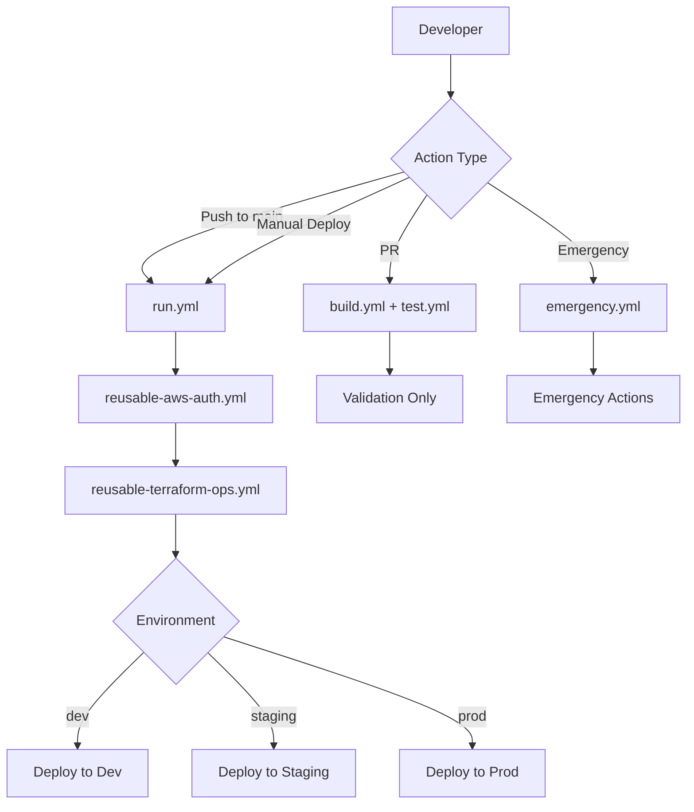

# GitHub Actions Workflows

**Automated CI/CD workflows for AWS Static Website Infrastructure**

## 📋 Overview

This directory contains GitHub Actions workflows that manage the complete lifecycle of AWS infrastructure and website deployments using OIDC authentication and Terraform/OpenTofu.

## 🔄 Relationship with Bootstrap Scripts

**The bootstrap scripts and these workflows are complementary:**

- **Bootstrap scripts** ([`scripts/bootstrap/`](../../scripts/bootstrap/)) create the foundational infrastructure (OIDC providers, IAM roles, Terraform backends)
- **These workflows** use that foundation to manage ongoing infrastructure and deployments

**See**: [When to Use Bootstrap Scripts vs Workflows](../../scripts/bootstrap/README.md#-when-to-use-bootstrap-scripts-vs-workflows)

Both systems use the same Terraform modules:
- `terraform/bootstrap` - Terraform state backends
- `terraform/foundations/github-oidc` - OIDC providers and roles
- `terraform/workloads/static-site` - Static website infrastructure

## 📁 Workflow Inventory

### Core Workflows

#### `run.yml` - Main Deployment Workflow
**Purpose**: Primary workflow for infrastructure and website deployments

**Triggers**:
- Manual dispatch (`workflow_dispatch`)
- Push to `main` branch (auto-deploy dev/staging)

**Inputs**:
- `environment` - Target environment (dev/staging/prod)
- `deploy_infrastructure` - Deploy AWS resources
- `deploy_website` - Deploy website content

**Usage**:
```bash
# Deploy everything to dev
gh workflow run run.yml \
  --field environment=dev \
  --field deploy_infrastructure=true \
  --field deploy_website=true

# Website-only update
gh workflow run run.yml \
  --field environment=staging \
  --field deploy_infrastructure=false \
  --field deploy_website=true
```

#### `organization-management.yml` - AWS Organizations Management
**Purpose**: Create and manage AWS Organizations structure via Terraform

**Triggers**:
- Manual dispatch
- Changes to `terraform/foundations/org-management/**`

**What it manages**:
- AWS Organization root
- Organizational Units (OUs)
- Member accounts (dev/staging/prod)
- Service Control Policies (SCPs)

**Note**: For initial organization creation, consider using [`scripts/bootstrap/bootstrap-organization.sh`](../../scripts/bootstrap/bootstrap-organization.sh) for faster iteration.

#### `bootstrap-distributed-backend.yml` - State Backend Creation
**Purpose**: Create Terraform state backends (S3 + DynamoDB + KMS)

**Triggers**: Manual dispatch

**Inputs**:
- `project_name` - Project identifier
- `environment` - Target environment
- `confirm_bootstrap` - Safety confirmation (`BOOTSTRAP-DISTRIBUTED`)

**Usage**:
```bash
gh workflow run bootstrap-distributed-backend.yml \
  --field project_name=static-site \
  --field environment=staging \
  --field confirm_bootstrap=BOOTSTRAP-DISTRIBUTED
```

**Equivalent script**: [`scripts/bootstrap/bootstrap-foundation.sh`](../../scripts/bootstrap/bootstrap-foundation.sh)

#### `emergency.yml` - Emergency Operations
**Purpose**: Rapid response for production incidents

**Triggers**: Manual dispatch only

**Capabilities**:
- Emergency rollback
- Circuit breaker activation
- Health check overrides

**⚠️ Production-only, requires elevated permissions**

### Reusable Workflows

#### `reusable-terraform-ops.yml`
**Purpose**: Standardized Terraform operations

**Inputs**:
- `environment` - Target environment
- `terraform_action` - Action (plan/apply/destroy)
- `working_directory` - Terraform root module path

**Features**:
- Automatic backend configuration
- State locking
- Plan/apply workflow
- Cost estimation

#### `reusable-cross-account-roles.yml`
**Purpose**: Create IAM roles for cross-account access

**Creates**:
- GitHub Actions deployment roles
- Cross-account trust policies

**Note**: Typically run once during initial setup, then managed via workflows

### Testing and Validation

#### `build.yml`
**Purpose**: Build and validate infrastructure code

**Triggers**:
- Pull requests
- Push to `main`

**Checks**:
- Terraform syntax validation
- Security scanning (Trivy, Checkov)
- Policy validation (OPA)
- Linting (yamllint, tflint)

#### `test.yml`
**Purpose**: Integration testing

**Runs**:
- Health checks
- Functional tests
- Performance validation

## 🚀 Getting Started

### Prerequisites

Before using these workflows, ensure:

1. **Bootstrap scripts have been run** (or manual OIDC setup completed):
   ```bash
   cd scripts/bootstrap
   ./bootstrap-organization.sh
   ./bootstrap-foundation.sh
   ```

2. **GitHub variables configured**:
   - `AWS_ACCOUNT_ID_DEV` - Dev account ID (e.g., 822529998967)
   - `AWS_ACCOUNT_ID_STAGING` - Staging account ID (e.g., 927588814642)
   - `AWS_ACCOUNT_ID_PROD` - Prod account ID (e.g., 546274483801)
   - `AWS_DEFAULT_REGION` - Default AWS region (e.g., us-east-1)
   - `OPENTOFU_VERSION` - OpenTofu version (e.g., 1.8.8)

3. **Repository references updated** (for forks):
   ```bash
   # Update OIDC trust policies to match your fork
   grep -r "github_repo" terraform/
   ```

### First Deployment

```bash
# 1. Ensure bootstrap is complete
./scripts/bootstrap/bootstrap-foundation.sh --skip-verify

# 2. Commit accounts.json (generated by bootstrap)
git add scripts/bootstrap/accounts.json
git commit -m "Add account IDs from bootstrap"
git push

# 3. Deploy to dev
gh workflow run run.yml \
  --field environment=dev \
  --field deploy_infrastructure=true \
  --field deploy_website=true

# 4. Monitor deployment
gh run watch
```

## 📊 Workflow Architecture



## 🔐 Security

### Direct OIDC Authentication

All workflows use **direct OIDC authentication** - a single-step process where GitHub directly assumes environment-specific IAM roles:

```yaml
- name: Configure AWS Credentials
  uses: aws-actions/configure-aws-credentials@v4
  with:
    role-to-assume: arn:aws:iam::${{ vars.AWS_ACCOUNT_ID_DEV }}:role/GitHubActions-StaticSite-Dev-Role
    role-session-name: github-actions-dev-${{ github.run_id }}
    aws-region: us-east-1
    audience: sts.amazonaws.com
```

**Key Points**:
- ✅ **No centralized role** - Workflows authenticate directly to target account roles
- ✅ **No long-lived credentials** - Uses OIDC tokens instead of AWS access keys
- ✅ **Short-lived sessions** - Temporary credentials expire after job completion
- ✅ **Repository scoping** - Roles trust only your specific GitHub repository
- ✅ **Complete audit trail** - All actions logged in CloudTrail

**Trust Policy Pattern**:
Each IAM role trusts the GitHub OIDC provider with repository-specific conditions:
```json
{
  "Effect": "Allow",
  "Principal": {
    "Federated": "arn:aws:iam::ACCOUNT_ID:oidc-provider/token.actions.githubusercontent.com"
  },
  "Action": "sts:AssumeRoleWithWebIdentity",
  "Condition": {
    "StringEquals": {
      "token.actions.githubusercontent.com:aud": "sts.amazonaws.com"
    },
    "StringLike": {
      "token.actions.githubusercontent.com:sub": "repo:YOUR_ORG/YOUR_REPO:*"
    }
  }
}
```

This is the **AWS-recommended pattern** for GitHub Actions as of 2025.

### Environment Protection

| Environment | Protection Rules | Approval Required |
|-------------|-----------------|-------------------|
| **dev** | None | No |
| **staging** | Branch protection | No |
| **prod** | Branch protection + Manual approval | Yes |

## 🛠️ Workflow Development

### Testing Workflow Changes

```bash
# 1. Create feature branch
git checkout -b workflow/update-deployment

# 2. Modify workflow
vim .github/workflows/run.yml

# 3. Validate syntax
yamllint .github/workflows/run.yml

# 4. Test in dev (requires push)
git push origin workflow/update-deployment

# 5. Trigger workflow on branch
gh workflow run run.yml --ref workflow/update-deployment
```

### Common Patterns

**Conditional execution**:
```yaml
- name: Deploy to prod
  if: github.event.inputs.environment == 'prod'
  run: |
    echo "Production deployment"
```

**Matrix strategy**:
```yaml
strategy:
  matrix:
    environment: [dev, staging, prod]
jobs:
  deploy:
    runs-on: ubuntu-latest
    steps:
      - uses: ./.github/workflows/reusable-terraform-ops.yml
        with:
          environment: ${{ matrix.environment }}
```

## 📚 Additional Resources

### Documentation
- [Bootstrap Scripts README](../../scripts/bootstrap/README.md) - Local bootstrap scripts
- [Destroy Scripts README](../../scripts/destroy/README.md) - Infrastructure cleanup
- [Deployment Guide](../../DEPLOYMENT.md) - Complete deployment walkthrough
- [Architecture Guide](../../docs/architecture.md) - System architecture

### Related Workflows
- [Terraform Bootstrap Module](../../terraform/bootstrap/) - State backend creation
- [GitHub OIDC Module](../../terraform/foundations/github-oidc/) - OIDC provider setup
- [Static Site Workload](../../terraform/workloads/static-site/) - Website infrastructure

## 🐛 Troubleshooting

### Workflow Failures

**Issue**: "Error: Could not assume role"
```bash
# Check OIDC provider exists
aws iam list-open-id-connect-providers

# Verify role trust policy
aws iam get-role --role-name GitHubActions-StaticSite-Dev-Role
```

**Issue**: "Error: Backend not configured"
```bash
# Run bootstrap script or workflow
./scripts/bootstrap/bootstrap-foundation.sh
# OR
gh workflow run bootstrap-distributed-backend.yml
```

**Issue**: "Error: Repository not authorized"
```bash
# Verify exact repository name (case-sensitive)
git remote get-url origin

# Update terraform.tfvars to match exactly
echo 'github_repo = "YourUsername/static-site"' > terraform/foundations/github-oidc/terraform.tfvars
```

### Debug Mode

Enable debug logging:
```bash
# Set repository secret
gh secret set ACTIONS_STEP_DEBUG --body "true"
gh secret set ACTIONS_RUNNER_DEBUG --body "true"
```

### Viewing Logs

```bash
# View latest run
gh run list --limit 1

# View specific run logs
gh run view RUN_ID --log

# Filter logs
gh run view --log | grep ERROR
```

## 🤝 Contributing

When adding new workflows:

1. ✅ Use reusable workflows where possible
2. ✅ Follow naming convention: `<purpose>-<scope>.yml`
3. ✅ Add comprehensive documentation headers
4. ✅ Include input validation
5. ✅ Use environment protection for prod
6. ✅ Test in dev environment first

---

**Last Updated**: 2025-10-07
**Workflow Version**: 2.0.0
