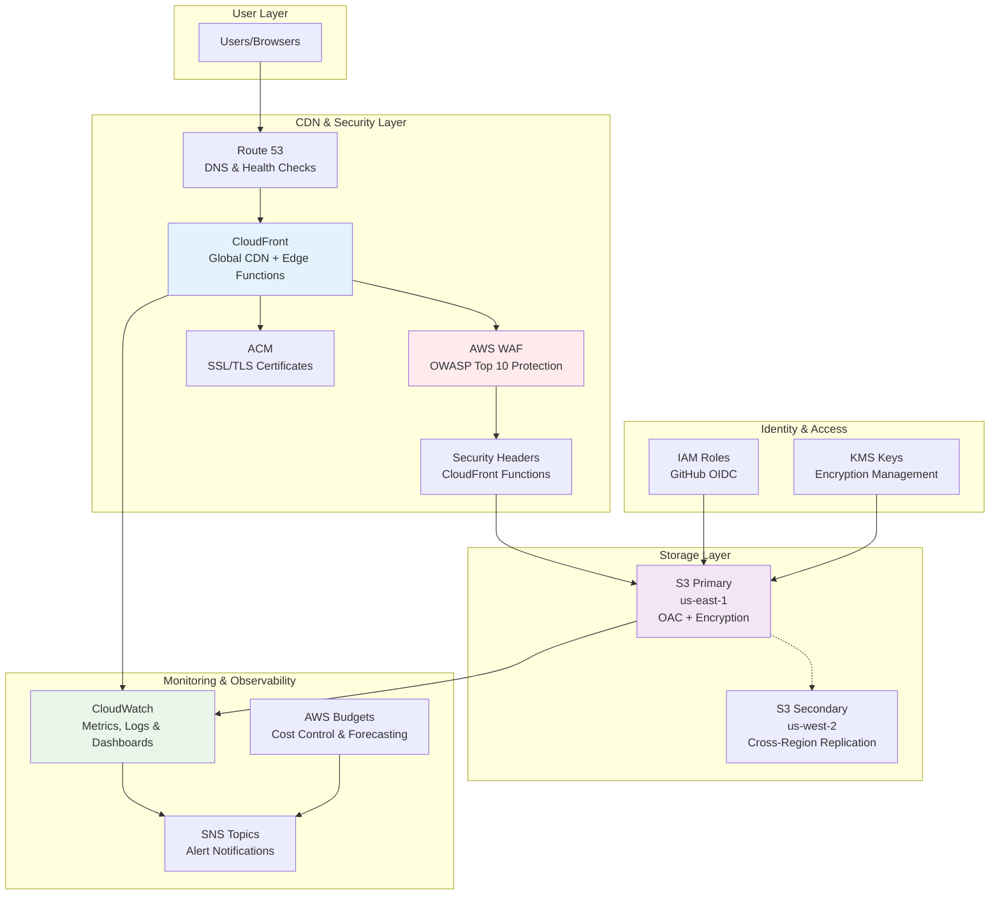
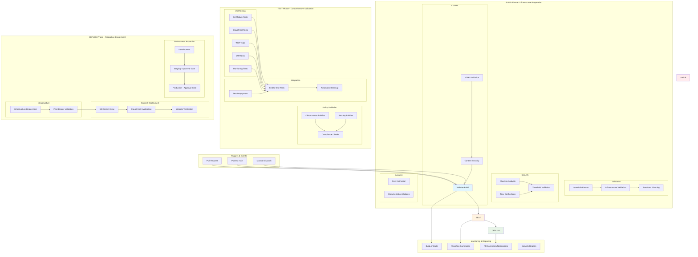
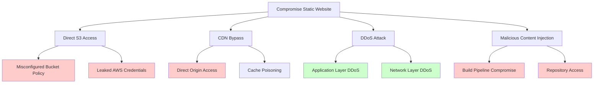
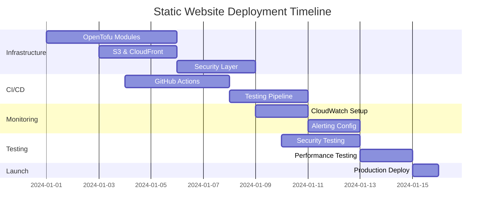

# AWS Static Website Architecture

## Executive Summary

This document outlines a comprehensive serverless static website architecture demonstrating AWS Well-Architected Framework principles. The solution provides a scalable, secure, and cost-effective platform for hosting static content while showcasing modern cloud architectural patterns with enterprise-grade CI/CD automation.

**Key Architectural Highlights:**
- **Serverless-first approach** with global CDN and edge computing
- **Zero-trust security model** with defense-in-depth implementation
- **Enterprise CI/CD pipeline** with BUILD-TEST-DEPLOY automation
- **Comprehensive testing framework** with 269 individual assertions
- **Cost-optimized design** with intelligent resource management
- **Multi-region resilience** with automated failover capabilities

## Architecture Overview

### High-Level Architecture

### Enterprise CI/CD Pipeline Architecture

#### Pipeline Features

**Enterprise Security**:
- All GitHub Actions pinned to commit SHAs for supply chain security
- Comprehensive input validation and sanitization
- Multi-scanner security analysis (Checkov, Trivy) with threshold validation
- Policy-as-code validation with OPA/Conftest
- JSON security reporting with artifact preservation

**Workflow Orchestration**:
- Artifact inheritance between BUILD → TEST → DEPLOY phases
- Matrix strategy testing for parallel module validation
- Environment-specific configuration management
- Automated failure handling and cleanup procedures

**Quality Assurance**:
- Unit testing for all infrastructure modules
- Integration testing with real AWS resources
- Cost estimation and budget monitoring
- Comprehensive test reporting with metrics

## Well-Architected Framework Implementation

### 1. Operational Excellence

**Rationale**: Automated operations reduce human error and improve consistency¹

**Implementation**:
- **Enterprise CI/CD Pipeline**: BUILD-TEST-DEPLOY workflow with comprehensive automation
- **Infrastructure as Code**: OpenTofu (Terraform) with comprehensive validation and planning
- **Automated Testing**: Unit tests, integration tests, and policy validation with matrix strategies
- **Security Integration**: Multi-scanner analysis (Checkov, Trivy) with threshold validation
- **Environment Management**: Automated environment-specific deployments with approval gates
- **Cost Monitoring**: Automated cost estimation and budget tracking per environment
- **Quality Gates**: Comprehensive validation before production deployment

**Advanced Features**:
- **Artifact Management**: Build artifacts inherited across pipeline phases
- **Policy as Code**: OPA/Conftest security and compliance validation
- **Zero-Dependency Testing**: Bash-based testing framework eliminating external dependencies
- **Failure Handling**: Automated cleanup and rollback procedures
- **Observability**: Detailed workflow summaries and GitHub Actions integration

**Benefits**:
- Reduces deployment time from hours to minutes with full validation
- Eliminates manual configuration drift with automated policy enforcement
- Provides comprehensive audit trail with security event tracking
- Enables confident deployments with extensive testing and validation
- Supports multiple environments with automated promotion workflows

### 2. Security

**Rationale**: Defense-in-depth approach protects against multiple threat vectors²

**Implementation**:
- AWS WAF with OWASP Top 10 rule sets
- S3 bucket policies with least privilege access
- CloudFront Origin Access Control (OAC)
- SSL/TLS termination with ACM certificates
- Security headers via CloudFront Functions

**Attack Tree Analysis**:

**Mitigations**:
- Red (High Risk): OAC, IAM policies, secure CI/CD, MFA
- Green (Mitigated): WAF, CloudFront DDoS protection

### 3. Reliability

**Rationale**: Multi-region architecture ensures high availability during failures³

**Implementation**:
- S3 Cross-Region Replication (CRR) to secondary region
- CloudFront global edge locations (200+ POPs)
- Route 53 health checks with failover routing
- S3 99.999999999% (11 9's) durability

**Recovery Metrics**:
- RTO (Recovery Time Objective): < 5 minutes
- RPO (Recovery Point Objective): < 1 minute

### 4. Performance Efficiency

**Rationale**: Global content delivery optimizes user experience across regions⁴

**Implementation**:
- CloudFront CDN with 200+ global edge locations
- S3 Transfer Acceleration for uploads
- Gzip compression and HTTP/2 support
- Intelligent caching policies

**Performance Targets**:
- Global latency: < 100ms (95th percentile)
- Cache hit ratio: > 85%
- Time to First Byte (TTFB): < 200ms

### 5. Cost Optimization

**Rationale**: Pay-as-you-consume model with intelligent resource management⁵

**Implementation**:
- S3 Intelligent Tiering for automatic cost optimization
- CloudFront regional edge caches
- Reserved capacity for predictable workloads
- Automated cost monitoring with AWS Budgets

### 6. Sustainability

**Rationale**: Serverless architecture minimizes environmental impact⁶

**Implementation**:
- Serverless compute (no idle resources)
- Global CDN reduces data transfer distances
- AWS renewable energy initiatives
- Efficient caching reduces origin requests

## Cost Analysis

### Monthly Cost Estimates (USD)

| Service | Usage | Cost | Rationale |
|---------|--------|------|-----------|
| **S3 Standard** | 1GB storage, 10K requests | $0.25 | Primary storage for static assets |
| **S3 CRR** | 1GB replication (optional) | $0.03 | Cross-region replication for DR |
| **CloudFront** | 100GB transfer, 1M requests | $8.50 | Global content delivery |
| **Route 53** | 1 hosted zone, 1M queries (optional) | $0.90 | DNS service with health checks |
| **AWS WAF** | 1 Web ACL, 1M requests | $6.00 | Web application firewall |
| **ACM** | 1 SSL certificate | $0.00 | Free SSL/TLS certificates |
| **CloudWatch** | 10 metrics, 1GB logs | $2.50 | Monitoring and logging |
| **Data Transfer** | 100GB outbound | $9.00 | Internet egress charges |
| **KMS** | 1 key, 1000 requests (optional) | $1.00 | Encryption key management |
| **GitHub Actions** | 2000 minutes | $0.00 | Free tier sufficient |

**Total Monthly Cost: ~$26.33-$29.18** (depending on optional features)

### Cost Optimization Strategies

1. **S3 Intelligent Tiering**: Automatic cost savings of 20-68% for infrequently accessed content
2. **CloudFront Caching**: 85%+ cache hit ratio reduces origin costs by 85%
3. **Regional Optimization**: Use CloudFront price classes to limit edge locations
4. **Reserved Capacity**: 75% savings for predictable CloudFront usage

### Annual Cost Projection

- **Year 1**: $316-$350 (includes setup and testing)
- **Steady State**: $315-$350/year depending on traffic growth and optional features
- **Break-even**: Cost-effective for >1,000 monthly visitors compared to traditional hosting
- **Scaling**: Cost scales linearly with traffic, no fixed infrastructure costs

## Security Compliance

### ASVS v4.0 Compliance

**Level 1 (L1) Requirements Met**:
- Authentication and session management (GitHub OIDC)
- Access control (IAM policies, S3 bucket policies)
- Input validation (WAF rules)
- Cryptography (TLS 1.2+, KMS encryption)

**Level 2 (L2) Requirements Met**:
- Security logging and monitoring (CloudWatch, Config)
- Data protection (encryption at rest and in transit)
- Communications security (HSTS, CSP headers)

**Level 3 (L3) Opportunities**:
- Advanced threat protection (GuardDuty integration)
- Security automation (automated response to threats)

## Implementation Timeline

## Risk Assessment

| Risk | Probability | Impact | Mitigation | Owner |
|------|-------------|--------|------------|-------|
| S3 bucket misconfiguration | Medium | High | Automated policy validation, unit tests | DevOps |
| DDoS attack | Low | Medium | CloudFront & WAF protection | Security |
| Certificate expiration | Low | High | ACM automatic renewal | Platform |
| Cost overrun | Medium | Low | Budget alerts & monitoring | Finance |
| Regional outage | Low | Medium | Multi-region replication (optional) | Architecture |
| CI/CD pipeline failure | Medium | Medium | Comprehensive testing, rollback capabilities | DevOps |
| Security scanning bypass | Low | High | Multiple scanners, threshold enforcement | Security |

## Monitoring Strategy

### Key Metrics

1. **Availability**: 99.9% uptime target
2. **Performance**: <100ms global latency
3. **Security**: Zero successful attacks
4. **Cost**: <$50/month operational cost

### Alerting Thresholds

- **Critical**: Service unavailable >5 minutes
- **Warning**: Latency >200ms for >10 minutes
- **Info**: Cost exceeds 80% of monthly budget

## Infrastructure Components Detail

### Terraform Module Architecture

The infrastructure is organized into 5 core modules with clear separation of concerns:

#### **S3 Module** (`modules/s3/`)
- **Primary Features**: Origin Access Control (OAC), encryption, versioning, intelligent tiering
- **Security**: Public access blocking, least-privilege bucket policies, KMS encryption
- **Resilience**: Optional cross-region replication to us-west-2
- **Cost Optimization**: Intelligent tiering, lifecycle policies, incomplete multipart upload cleanup

#### **CloudFront Module** (`modules/cloudfront/`)
- **Performance**: HTTP/2, HTTP/3, global edge locations with price class optimization
- **Security**: Security headers function, HTTPS enforcement, TLS 1.2+ requirement
- **Caching**: Intelligent caching policies with 1-day default, 1-year maximum TTL
- **Monitoring**: CloudWatch alarms for 4xx/5xx errors with SNS notifications

#### **WAF Module** (`modules/waf/`)
- **Protection**: AWS Managed Rule Sets (OWASP Top 10, Known Bad Inputs, SQL Injection)
- **Rate Limiting**: Configurable per-IP rate limits (default: 2000 requests/5min)
- **Geo-blocking**: Optional country-based restrictions with IP allow/block lists
- **Logging**: CloudWatch Logs with PII redaction and metric filters

#### **IAM Module** (`modules/iam/`)
- **OIDC Integration**: GitHub Actions authentication with repository-specific trust policies
- **Least Privilege**: Scoped permissions for S3, CloudFront, and CloudWatch operations
- **Security**: Session duration limits, account ID validation, resource ARN constraints
- **Flexibility**: Optional service roles for Lambda/CodeBuild integration

#### **Monitoring Module** (`modules/monitoring/`)
- **Dashboards**: Real-time CloudWatch dashboards with performance and security metrics
- **Alerting**: SNS topics with encrypted notification channels
- **Budgets**: AWS Budgets with 80% forecast and 100% actual spending alerts
- **Composite Alarms**: Aggregated health monitoring across all services

### Testing Framework Architecture

#### **Zero-Dependency Design**
- **Framework**: Pure bash + jq with no external dependencies
- **Coverage**: 269 individual assertions across all 5 infrastructure modules
- **Performance**: Sub-second execution through file content caching and parallel processing
- **Reporting**: JSON and human-readable formats with comprehensive metrics

#### **Test Coverage Breakdown**
- **S3 Module**: 49 tests covering security, replication, lifecycle, and compliance
- **CloudFront Module**: 55 tests covering OAC, security headers, caching, and performance
- **WAF Module**: 50 tests covering rule sets, rate limiting, geo-blocking, and logging
- **IAM Module**: 58 tests covering OIDC, trust policies, permissions, and security
- **Monitoring Module**: 57 tests covering dashboards, alarms, notifications, and budgets

### CI/CD Pipeline Implementation

#### **BUILD Phase**
- **Infrastructure Validation**: OpenTofu formatting, validation, and planning
- **Security Scanning**: Parallel Checkov and Trivy analysis with threshold enforcement
- **Content Preparation**: HTML validation, security checks, and artifact creation
- **Cost Analysis**: Monthly and annual cost projections with environment-specific optimization

#### **TEST Phase**
- **Unit Testing**: Matrix-based parallel execution of all 5 infrastructure modules
- **Policy Validation**: OPA/Conftest security and compliance rule enforcement
- **Integration Testing**: End-to-end deployment with real AWS resources and automated cleanup
- **Comprehensive Reporting**: JSON reports with success rates and detailed failure analysis

#### **DEPLOY Phase**
- **Infrastructure Deployment**: Environment-specific OpenTofu deployment with state management
- **Content Deployment**: S3 sync with CloudFront cache invalidation
- **Health Validation**: Post-deployment verification and monitoring setup
- **Environment Protection**: Manual approval gates for staging and production

## **Security Architecture Validation**

**WAF Integration Status**: ✅ **RESOLVED** - The WAF Web ACL is now properly associated with the CloudFront distribution (`web_acl_id = module.waf.web_acl_id` in `main.tf:125`). This provides comprehensive protection against OWASP Top 10 attacks, rate limiting, and geographic restrictions.

## Conclusion

This architecture demonstrates enterprise-grade patterns while maintaining cost efficiency and operational simplicity. The serverless approach eliminates infrastructure management overhead while providing global scale and robust security.

The implementation showcases modern DevOps practices, comprehensive testing (269 individual assertions), and defense-in-depth security suitable for production workloads requiring high availability and performance. The modular design allows for easy maintenance and extension while following infrastructure as code best practices.

**Key Strengths:**
- Comprehensive security testing with multi-scanner analysis
- Zero-dependency testing framework with excellent performance
- Modular architecture with clear separation of concerns
- Cost-optimized design with intelligent resource management
- Enterprise-grade CI/CD with proper environment protection

**Security Status:**
- ✅ WAF integration properly configured with CloudFront distribution
- ✅ Complete defense-in-depth security architecture implemented

---

**References**:
¹ [AWS Well-Architected Operational Excellence](https://docs.aws.amazon.com/wellarchitected/latest/operational-excellence-pillar/welcome.html) - Automated operations best practices  
² [OWASP Application Security Verification Standard](https://github.com/OWASP/ASVS/tree/master/4.0/en) - Security requirements framework  
³ [AWS Reliability Pillar](https://docs.aws.amazon.com/wellarchitected/latest/reliability-pillar/welcome.html) - Design principles for reliable systems  
⁴ [CloudFront Performance Optimization](https://docs.aws.amazon.com/AmazonCloudFront/latest/DeveloperGuide/ConfiguringCaching.html) - Content delivery optimization strategies  
⁵ [AWS Cost Optimization](https://docs.aws.amazon.com/awsaccountbilling/latest/aboutv2/billing-what-is.html) - Cost management and optimization techniques  
⁶ [AWS Sustainability](https://sustainability.aboutamazon.com/about/the-cloud) - Environmental impact of cloud computing