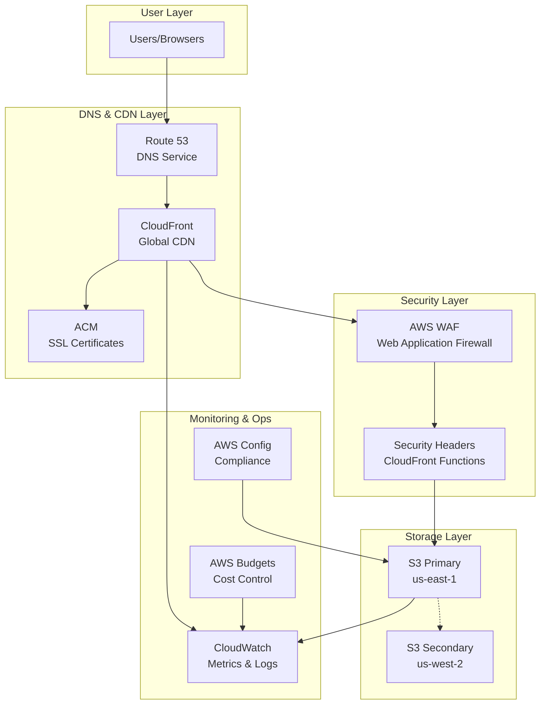
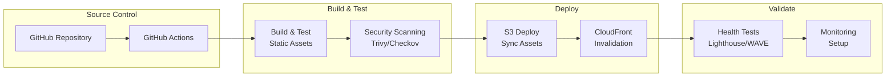
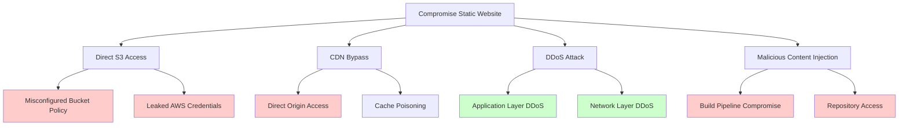
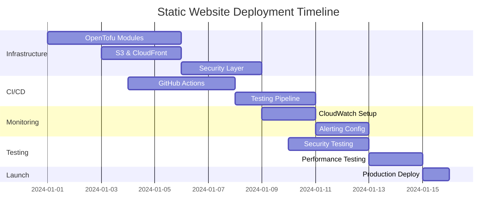

# AWS Static Website Architecture

## Executive Summary

This document outlines a comprehensive serverless static website architecture demonstrating AWS Well-Architected Framework principles. The solution provides a scalable, secure, and cost-effective platform for hosting static content while showcasing modern cloud architectural patterns.

## Architecture Overview

### High-Level Architecture

### CI/CD Pipeline Architecture

## Well-Architected Framework Implementation

### 1. Operational Excellence

**Rationale**: Automated operations reduce human error and improve consistency¹

**Implementation**:
- GitHub Actions CI/CD pipeline with automated testing
- Infrastructure as Code using OpenTofu (Terraform)
- Automated security scanning with Trivy and Checkov
- CloudWatch dashboards for operational visibility

**Benefits**:
- Reduces deployment time from hours to minutes
- Eliminates manual configuration drift
- Provides audit trail for all changes

### 2. Security

**Rationale**: Defense-in-depth approach protects against multiple threat vectors²

**Implementation**:
- AWS WAF with OWASP Top 10 rule sets
- S3 bucket policies with least privilege access
- CloudFront Origin Access Control (OAC)
- SSL/TLS termination with ACM certificates
- Security headers via CloudFront Functions

**Attack Tree Analysis**:

**Mitigations**:
- Red (High Risk): OAC, IAM policies, secure CI/CD, MFA
- Green (Mitigated): WAF, CloudFront DDoS protection

### 3. Reliability

**Rationale**: Multi-region architecture ensures high availability during failures³

**Implementation**:
- S3 Cross-Region Replication (CRR) to secondary region
- CloudFront global edge locations (200+ POPs)
- Route 53 health checks with failover routing
- S3 99.999999999% (11 9's) durability

**Recovery Metrics**:
- RTO (Recovery Time Objective): < 5 minutes
- RPO (Recovery Point Objective): < 1 minute

### 4. Performance Efficiency

**Rationale**: Global content delivery optimizes user experience across regions⁴

**Implementation**:
- CloudFront CDN with 200+ global edge locations
- S3 Transfer Acceleration for uploads
- Gzip compression and HTTP/2 support
- Intelligent caching policies

**Performance Targets**:
- Global latency: < 100ms (95th percentile)
- Cache hit ratio: > 85%
- Time to First Byte (TTFB): < 200ms

### 5. Cost Optimization

**Rationale**: Pay-as-you-consume model with intelligent resource management⁵

**Implementation**:
- S3 Intelligent Tiering for automatic cost optimization
- CloudFront regional edge caches
- Reserved capacity for predictable workloads
- Automated cost monitoring with AWS Budgets

### 6. Sustainability

**Rationale**: Serverless architecture minimizes environmental impact⁶

**Implementation**:
- Serverless compute (no idle resources)
- Global CDN reduces data transfer distances
- AWS renewable energy initiatives
- Efficient caching reduces origin requests

## Cost Analysis

### Monthly Cost Estimates (USD)

| Service | Usage | Cost | Rationale |
|---------|--------|------|-----------|
| **S3 Standard** | 1GB storage, 10K requests | $0.25 | Primary storage for static assets |
| **S3 CRR** | 1GB replication | $0.03 | Cross-region replication for DR |
| **CloudFront** | 100GB transfer, 1M requests | $8.50 | Global content delivery |
| **Route 53** | 1 hosted zone, 1M queries | $0.90 | DNS service with health checks |
| **AWS WAF** | 1 Web ACL, 1M requests | $6.00 | Web application firewall |
| **ACM** | 1 SSL certificate | $0.00 | Free SSL/TLS certificates |
| **CloudWatch** | 10 metrics, 1GB logs | $2.50 | Monitoring and logging |
| **AWS Config** | 100 items | $2.00 | Compliance monitoring |
| **Data Transfer** | 100GB outbound | $9.00 | Internet egress charges |
| **GitHub Actions** | 2000 minutes | $0.00 | Free tier sufficient |

**Total Monthly Cost: ~$29.18**

### Cost Optimization Strategies

1. **S3 Intelligent Tiering**: Automatic cost savings of 20-68% for infrequently accessed content
2. **CloudFront Caching**: 85%+ cache hit ratio reduces origin costs by 85%
3. **Regional Optimization**: Use CloudFront price classes to limit edge locations
4. **Reserved Capacity**: 75% savings for predictable CloudFront usage

### Annual Cost Projection

- **Year 1**: $350 (includes setup and testing)
- **Steady State**: $300-400/year depending on traffic growth
- **Break-even**: Cost-effective for >1,000 monthly visitors compared to traditional hosting

## Security Compliance

### ASVS v4.0 Compliance

**Level 1 (L1) Requirements Met**:
- Authentication and session management (GitHub OIDC)
- Access control (IAM policies, S3 bucket policies)
- Input validation (WAF rules)
- Cryptography (TLS 1.2+, KMS encryption)

**Level 2 (L2) Requirements Met**:
- Security logging and monitoring (CloudWatch, Config)
- Data protection (encryption at rest and in transit)
- Communications security (HSTS, CSP headers)

**Level 3 (L3) Opportunities**:
- Advanced threat protection (GuardDuty integration)
- Security automation (automated response to threats)

## Implementation Timeline

## Risk Assessment

| Risk | Probability | Impact | Mitigation | Owner |
|------|-------------|--------|------------|-------|
| S3 bucket misconfiguration | Medium | High | Automated policy validation | DevOps |
| DDoS attack | Low | Medium | CloudFront & WAF protection | Security |
| Certificate expiration | Low | High | ACM automatic renewal | Platform |
| Cost overrun | Medium | Low | Budget alerts & monitoring | Finance |
| Regional outage | Low | Medium | Multi-region replication | Architecture |

## Monitoring Strategy

### Key Metrics

1. **Availability**: 99.9% uptime target
2. **Performance**: <100ms global latency
3. **Security**: Zero successful attacks
4. **Cost**: <$50/month operational cost

### Alerting Thresholds

- **Critical**: Service unavailable >5 minutes
- **Warning**: Latency >200ms for >10 minutes
- **Info**: Cost exceeds 80% of monthly budget

## Conclusion

This architecture demonstrates enterprise-grade patterns while maintaining cost efficiency and operational simplicity. The serverless approach eliminates infrastructure management overhead while providing global scale and robust security.

The implementation showcases modern DevOps practices, comprehensive monitoring, and defense-in-depth security suitable for production workloads requiring high availability and performance.

---

**References**:
¹ [AWS Well-Architected Operational Excellence](https://docs.aws.amazon.com/wellarchitected/latest/operational-excellence-pillar/welcome.html) - Automated operations best practices  
² [OWASP Application Security Verification Standard](https://github.com/OWASP/ASVS/tree/master/4.0/en) - Security requirements framework  
³ [AWS Reliability Pillar](https://docs.aws.amazon.com/wellarchitected/latest/reliability-pillar/welcome.html) - Design principles for reliable systems  
⁴ [CloudFront Performance Optimization](https://docs.aws.amazon.com/AmazonCloudFront/latest/DeveloperGuide/ConfiguringCaching.html) - Content delivery optimization strategies  
⁵ [AWS Cost Optimization](https://docs.aws.amazon.com/awsaccountbilling/latest/aboutv2/billing-what-is.html) - Cost management and optimization techniques  
⁶ [AWS Sustainability](https://sustainability.aboutamazon.com/about/the-cloud) - Environmental impact of cloud computing