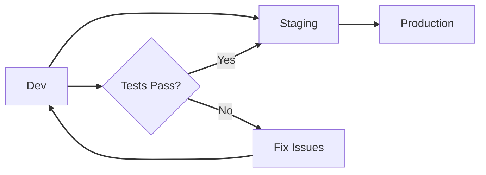

# 🚀 Deployment Guide

**Complete deployment instructions for AWS Static Website Infrastructure**

Choose your path based on experience level and available time:

| Path | Time | Experience | Documentation |
|------|------|------------|---------------|
| **🚀 Quick Start** | 5 min | Experienced | [Jump to Quick Start](#-quick-start-5-minutes) |
| **📖 Standard Setup** | 30 min | Intermediate | [Jump to Standard Setup](#-standard-setup-30-minutes) |
| **🔧 Advanced Patterns** | Variable | Advanced | [Jump to Advanced](#-advanced-deployment-patterns) |

---

## 🎯 Choosing Your Deployment Path

**Before you begin, choose the right approach based on your AWS account setup:**

### Fresh AWS Account (No Existing Infrastructure)

**Recommended approach: Bootstrap Scripts → Workflows**

Use the [bootstrap scripts](scripts/bootstrap/) to quickly set up foundational infrastructure:

```bash
# 1. Create AWS Organization and member accounts
./scripts/bootstrap/bootstrap-organization.sh

# 2. Create OIDC providers, IAM roles, and Terraform backends
./scripts/bootstrap/bootstrap-foundation.sh

# 3. Continue with GitHub Actions for day-2 operations
```

**Why this approach?**
- ✅ Fastest path to deployment (~10 minutes)
- ✅ No manual AWS Organization setup required
- ✅ Direct CLI control for troubleshooting
- ✅ Idempotent and can be re-run safely

**See**: [Bootstrap Scripts Documentation](scripts/bootstrap/README.md)

### Existing AWS Account (With Organizations)

**Recommended approach: Manual accounts.json → Bootstrap Foundation → Workflows**

If you already have AWS Organizations with member accounts:

```bash
# 1. Create accounts.json with your existing account IDs
cat > scripts/bootstrap/accounts.json <<EOF
{
  "management": "YOUR_MGMT_ACCOUNT_ID",
  "dev": "YOUR_DEV_ACCOUNT_ID",
  "staging": "YOUR_STAGING_ACCOUNT_ID",
  "prod": "YOUR_PROD_ACCOUNT_ID"
}
EOF

# 2. Run foundation bootstrap only
./scripts/bootstrap/bootstrap-foundation.sh

# 3. Continue with GitHub Actions workflows
```

**Why this approach?**
- ✅ Works with existing AWS Organizations
- ✅ Doesn't modify existing account structure
- ✅ Creates only necessary OIDC/IAM resources
- ✅ Preserves existing governance

### Using GitHub Actions Workflows Only

**Recommended for: Teams with existing Terraform state management**

If you prefer to manage everything via workflows:

```bash
# 1. Manually configure GitHub secrets/variables
gh variable set AWS_ACCOUNT_ID_DEV --body "123456789012"

# 2. Run organization workflow (if needed)
gh workflow run organization-management.yml

# 3. Run bootstrap workflow
gh workflow run bootstrap-distributed-backend.yml \
  --field environment=dev \
  --field confirm_bootstrap=BOOTSTRAP-DISTRIBUTED

# 4. Deploy infrastructure
gh workflow run run.yml --field environment=dev
```

**Why this approach?**
- ✅ Everything in version control
- ✅ Full audit trail via GitHub Actions
- ✅ Supports team collaboration with PR reviews
- ✅ Declarative Terraform state management

**See**: [GitHub Actions Workflows Documentation](.github/workflows/README.md)

### Decision Matrix

| Factor | Bootstrap Scripts | Workflows Only |
|--------|------------------|----------------|
| **Fresh AWS Account** | ✅ Recommended | Possible but slower |
| **Existing AWS Org** | ✅ Foundation only | ✅ Works well |
| **Speed** | Fast (~10 min) | Slower (~20 min) |
| **Local Control** | ✅ Yes | Limited |
| **Audit Trail** | Basic (logs) | ✅ Full (GitHub) |
| **Team Collaboration** | Manual | ✅ PR-based |
| **Troubleshooting** | ✅ Easy (direct CLI) | Harder (workflow logs) |
| **Day-2 Operations** | Manual | ✅ Automated |

**Recommendation**: Use **bootstrap scripts for initial setup**, then **workflows for ongoing operations**.

---

## 🚀 Quick Start (5 Minutes)

**For experienced users with AWS and GitHub already configured.**

### Prerequisites
✅ AWS Account with configured profiles
✅ GitHub repository fork with OIDC configured
✅ GitHub CLI (`gh`) installed

### Deploy to Development

```bash
# Clone your fork
git clone https://github.com/<your-username>/static-site.git
cd static-site

# Deploy infrastructure and website
gh workflow run run.yml \
  --field environment=dev \
  --field deploy_infrastructure=true \
  --field deploy_website=true

# Monitor deployment
gh run watch
```

**⏱️ Deployment time: ~2 minutes**

### Deploy to Staging/Production

```bash
# Bootstrap environment (one-time setup)
gh workflow run bootstrap-distributed-backend.yml \
  --field project_name=static-site \
  --field environment=staging \
  --field confirm_bootstrap=BOOTSTRAP-DISTRIBUTED

# Deploy
gh workflow run run.yml \
  --field environment=staging \
  --field deploy_infrastructure=true \
  --field deploy_website=true
```

**⏱️ Bootstrap: ~3 minutes | Deployment: ~2 minutes**

### Verify Deployment

```bash
# Check status
gh run list --limit 1

# Test website (get URL from workflow output)
curl -I $(gh run view --log | grep "Website URL" | awk '{print $NF}')
```

**✅ Quick Start Complete!** For troubleshooting, see [Common Issues](#troubleshooting).

---

## 📖 Standard Setup (30 Minutes)

**Step-by-step deployment with explanations for intermediate users.**

### Table of Contents
1. [Prerequisites](#prerequisites)
2. [Fork Configuration](#fork-configuration)
3. [Manual Setup](#manual-setup)
4. [Bootstrap Infrastructure](#bootstrap-infrastructure)
5. [Deploy Environments](#deploy-environments)
6. [Verification](#verification)

---

### Prerequisites

#### Required Tools

```bash
# Check installations
aws --version      # Expected: aws-cli/2.x.x
tofu --version     # Expected: OpenTofu v1.6.0+
gh --version       # Expected: gh version 2.x.x
jq --version       # Expected: jq-1.6+
```

#### Install Missing Tools

**macOS:**
```bash
brew install awscli opentofu gh jq
```

**Linux:**
```bash
# AWS CLI
curl "https://awscli.amazonaws.com/awscli-exe-linux-x86_64.zip" -o "awscliv2.zip"
unzip awscliv2.zip && sudo ./aws/install

# OpenTofu
wget https://github.com/opentofu/opentofu/releases/download/v1.6.0/tofu_1.6.0_linux_amd64.zip
unzip tofu_1.6.0_linux_amd64.zip && sudo mv tofu /usr/local/bin/

# GitHub CLI
curl -fsSL https://cli.github.com/packages/githubcli-archive-keyring.gpg | sudo dd of=/usr/share/keyrings/githubcli-archive-keyring.gpg
echo "deb [arch=$(dpkg --print-architecture) signed-by=/usr/share/keyrings/githubcli-archive-keyring.gpg] https://cli.github.com/packages stable main" | sudo tee /etc/apt/sources.list.d/github-cli.list > /dev/null
sudo apt update && sudo apt install gh

# jq
sudo apt install jq
```

#### AWS Account Access

You need access to AWS accounts for your environments:

| Environment | Purpose | Recommended Setup |
|-------------|---------|-------------------|
| Development | Testing and iteration | Required |
| Staging | Pre-production validation | Optional but recommended |
| Production | Live website | Optional |

**Configure AWS profiles:**

```bash
# Edit ~/.aws/config
# Note: region is defined in scripts/bootstrap/config.sh (default: us-east-2)
cat >> ~/.aws/config << 'EOF'
[profile dev-deploy]
region = us-east-2
account_id = YOUR_DEV_ACCOUNT_ID

[profile staging-deploy]
region = us-east-2
account_id = YOUR_STAGING_ACCOUNT_ID

[profile prod-deploy]
region = us-east-2
account_id = YOUR_PROD_ACCOUNT_ID
EOF

# Configure credentials
aws configure --profile dev-deploy
```

---

### Fork Configuration

**⚠️ CRITICAL for forked repositories**

#### Update Repository References

1. **Update Terraform variables:**

```bash
# Create terraform.tfvars file
cat > terraform/foundations/org-management/terraform.tfvars << 'EOF'
github_repo = "YOUR_USERNAME/static-site"
EOF
```

2. **Update documentation references:**

```bash
# Find all references to original repository
grep -r "Celtikill/static-site" . --exclude-dir=.git

# Replace with your fork (macOS)
find . -type f -name "*.md" -exec sed -i '' 's/Celtikill\/static-site/YOUR_USERNAME\/static-site/g' {} +

# Replace with your fork (Linux)
find . -type f -name "*.md" -exec sed -i 's/Celtikill\/static-site/YOUR_USERNAME\/static-site/g' {} +
```

3. **Update environment-specific account IDs:**

```bash
# Edit terraform/environments/dev/main.tf
# Update default values for aws_account_id_*
```

#### Why This Matters

- **OIDC Authentication**: GitHub Actions uses repository-specific JWT tokens
- **IAM Trust Policies**: Must match your exact repository name (case-sensitive)
- **Documentation Links**: Should point to your fork, not the original

**💡 Tip**: GitHub repository names are case-sensitive. Ensure exact match!

---

### Manual Setup

These steps can be completed manually or automatically via the bootstrap scripts.

#### Step 1: Configure GitHub Variables

The bootstrap script `scripts/bootstrap/configure-github.sh` automatically configures all required GitHub variables. For manual configuration:

1. Navigate to your repository on GitHub
2. Go to **Settings → Secrets and variables → Actions → Variables**
3. Add the following:

**Repository Variables:**
```
AWS_ACCOUNT_ID_DEV      = YOUR_DEV_ACCOUNT_ID
AWS_ACCOUNT_ID_STAGING  = YOUR_STAGING_ACCOUNT_ID
AWS_ACCOUNT_ID_PROD     = YOUR_PROD_ACCOUNT_ID
AWS_ACCOUNT_ID_MANAGEMENT = YOUR_MGMT_ACCOUNT_ID
AWS_DEFAULT_REGION      = us-east-2  (see scripts/bootstrap/config.sh)
REPLICA_REGION          = us-west-2
OPENTOFU_VERSION        = 1.6.1
DEFAULT_ENVIRONMENT     = dev
MONTHLY_BUDGET_LIMIT    = 40
ALERT_EMAIL_ADDRESSES   = ["your-email@example.com"]
```

> **Note**: With Direct OIDC authentication, **no AWS secrets are required** in GitHub. Authentication uses OIDC tokens automatically generated by GitHub Actions.

#### Step 2: Verify GitHub Configuration

```bash
# List configured variables
gh variable list

# Verify no AWS secrets are needed (OIDC handles authentication)
gh secret list
```

Expected variables:
```
AWS_ACCOUNT_ID_DEV
AWS_ACCOUNT_ID_STAGING
AWS_ACCOUNT_ID_PROD
AWS_ACCOUNT_ID_MANAGEMENT
AWS_DEFAULT_REGION
REPLICA_REGION
OPENTOFU_VERSION
DEFAULT_ENVIRONMENT
MONTHLY_BUDGET_LIMIT
ALERT_EMAIL_ADDRESSES
```

---

### Bootstrap Infrastructure

Bootstrap creates foundational infrastructure (S3 backends, DynamoDB tables, IAM roles).

#### Development Environment

```bash
# Set AWS profile
export AWS_PROFILE=dev-deploy

# Navigate to GitHub OIDC directory
cd terraform/foundations/github-oidc

# Initialize and apply
tofu init
tofu plan
tofu apply

# Navigate to bootstrap directory
cd ../../bootstrap

# Bootstrap dev state backend
tofu init
tofu apply \
  -var="environment=dev" \
  -var="aws_account_id=YOUR_DEV_ACCOUNT_ID"
```

**Expected resources created:**
- S3 bucket: `static-site-state-dev-YOUR_DEV_ACCOUNT_ID`
- DynamoDB table: `static-site-locks-dev`
- KMS key for encryption
- OIDC provider: `token.actions.githubusercontent.com`
- IAM deployment role: `GitHubActions-Static-site-dev`
- IAM console role: `static-site-ReadOnly-dev`

#### Staging Environment (Optional)

```bash
export AWS_PROFILE=staging-deploy
cd terraform/bootstrap

tofu apply \
  -var="environment=staging" \
  -var="aws_account_id=YOUR_STAGING_ACCOUNT_ID"
```

#### Production Environment (Optional)

```bash
export AWS_PROFILE=prod-deploy
cd terraform/bootstrap

tofu apply \
  -var="environment=prod" \
  -var="aws_account_id=YOUR_PROD_ACCOUNT_ID"
```

#### Verify Bootstrap Success

```bash
# Check S3 buckets
aws s3 ls | grep static-site-state

# Check OIDC provider
aws iam list-open-id-connect-providers

# Check IAM deployment roles
aws iam list-roles | grep GitHubActions-Static-site

# Check IAM console roles
aws iam list-roles | grep ReadOnly
```

---

### Deploy Environments

From this point forward, GitHub Actions handles deployment automatically.

#### Development Deployment

```bash
# Trigger deployment workflow
gh workflow run run.yml \
  --field environment=dev \
  --field deploy_infrastructure=true \
  --field deploy_website=true

# Monitor progress
gh run watch

# Or view in browser
gh run list --limit 5
```

**What gets deployed:**
- ✅ S3 bucket for website content
- ✅ CloudFront distribution (optional, based on cost settings)
- ✅ WAF rules (if CloudFront enabled)
- ✅ CloudWatch monitoring and dashboards
- ✅ SNS topics for alerts
- ✅ Website content uploaded

**⏱️ Deployment time: ~1m49s**

#### Staging Deployment

```bash
gh workflow run run.yml \
  --field environment=staging \
  --field deploy_infrastructure=true \
  --field deploy_website=true
```

#### Production Deployment

**⚠️ Requires manual workflow dispatch (no auto-deploy)**

```bash
gh workflow run run.yml \
  --field environment=prod \
  --field deploy_infrastructure=true \
  --field deploy_website=true
```

**Production deployments include:**
- Manual authorization gate
- Enhanced security scanning
- Strict policy enforcement
- Full monitoring stack

---

### Verification

#### Automated Checks

The deployment pipeline automatically validates:
- ✅ HTTP health check (200 OK response)
- ✅ CloudWatch dashboards active
- ✅ Security headers present
- ✅ WAF rules active (if enabled)
- ✅ Budget compliance

#### Manual Verification

```bash
# 1. Check deployment status
gh run view --log | grep "DEPLOYMENT SUCCESSFUL"

# 2. Get website URL
cd terraform/environments/dev
tofu output website_url

# 3. Test website accessibility
curl -I $(tofu output -raw website_url)
# Expected: HTTP/1.1 200 OK

# 4. Check CloudFront (if enabled)
tofu output cloudfront_url

# 5. View CloudWatch dashboard
tofu output cloudwatch_dashboard_url
```

#### Health Check Script

```bash
#!/bin/bash
# Save as check-deployment.sh

ENVIRONMENT=${1:-dev}
cd terraform/environments/$ENVIRONMENT

echo "🔍 Checking $ENVIRONMENT deployment..."

# Test website
URL=$(tofu output -raw website_url 2>/dev/null)
if [ -n "$URL" ]; then
  STATUS=$(curl -s -o /dev/null -w "%{http_code}" "$URL")
  if [ "$STATUS" = "200" ]; then
    echo "✅ Website accessible: $URL"
  else
    echo "❌ Website returned: HTTP $STATUS"
  fi
fi

# Check CloudFront
CF_URL=$(tofu output -raw cloudfront_url 2>/dev/null)
if [ -n "$CF_URL" ] && [ "$CF_URL" != "null" ]; then
  echo "✅ CloudFront enabled: $CF_URL"
else
  echo "ℹ️  CloudFront disabled (cost optimized)"
fi

# Check monitoring
DASHBOARD=$(tofu output -raw cloudwatch_dashboard_url 2>/dev/null)
if [ -n "$DASHBOARD" ]; then
  echo "✅ Monitoring active: $DASHBOARD"
fi

echo ""
echo "🎉 Deployment verification complete!"
```

---

## 🔧 Advanced Deployment Patterns

### Infrastructure-Only Deployment

Deploy or update infrastructure without website content changes:

```bash
gh workflow run run.yml \
  --field environment=dev \
  --field deploy_infrastructure=true \
  --field deploy_website=false
```

**Use cases:**
- Update AWS resource configurations
- Modify security settings
- Change monitoring thresholds
- Scale infrastructure resources

### Website-Only Deployment

Deploy website content without infrastructure changes:

```bash
gh workflow run run.yml \
  --field environment=dev \
  --field deploy_infrastructure=false \
  --field deploy_website=true
```

**Use cases:**
- Update HTML/CSS/JS files
- Quick content changes
- Rapid iteration on design
- Hotfixes for website issues

**⏱️ Deployment time: ~20-30 seconds**

### Progressive Deployment Strategy

Deploy changes through environments progressively:



**Process:**

```bash
# 1. Deploy to dev
gh workflow run run.yml --field environment=dev

# 2. Validate in dev
./check-deployment.sh dev

# 3. Deploy to staging (after validation)
gh workflow run run.yml --field environment=staging

# 4. Final validation
./check-deployment.sh staging

# 5. Deploy to production (after approval)
gh workflow run run.yml --field environment=prod
```

### Rollback Procedures

#### Emergency Rollback

For critical production issues:

```bash
# 1. Identify last known good deployment
gh run list --limit 10 --json conclusion,createdAt,headSha

# 2. Revert code to previous commit
git revert HEAD
git push origin main

# 3. Trigger automatic redeployment
# (Or use emergency workflow if available)
gh workflow run emergency.yml \
  --field environment=prod \
  --field rollback_to_previous=true
```

#### Website Content Rollback

Fast rollback of website content only:

```bash
# 1. Restore previous website version from S3
aws s3 sync s3://static-site-prod-backup/ s3://static-site-prod/ --delete

# 2. Invalidate CloudFront cache
DIST_ID=$(cd terraform/environments/prod && tofu output -raw cloudfront_distribution_id)
aws cloudfront create-invalidation --distribution-id $DIST_ID --paths "/*"
```

### Cost Optimization by Environment

| Component | Dev | Staging | Production |
|-----------|-----|---------|------------|
| **CloudFront** | Disabled ($0) | Enabled (~$5) | Enabled (~$10) |
| **WAF** | Basic Rules | Standard | Enhanced |
| **Replication** | Disabled | Enabled | Enabled |
| **Route 53** | Disabled | Enabled | Enabled |
| **Monthly Cost** | $1-5 | $15-25 | $25-50 |

**Toggle features via Terraform variables:**

```hcl
# terraform/workloads/static-site/variables.tf
variable "enable_cloudfront" {
  default = false  # Set true for staging/prod
}

variable "enable_waf" {
  default = false  # Requires CloudFront
}

variable "enable_cross_region_replication" {
  default = false  # Set true for prod
}
```

---

## 🔒 Security Considerations

### Production Deployment Security

Production deployments enforce additional security controls:

1. **Manual Authorization**: Requires `workflow_dispatch` (no auto-deploy)
2. **Enhanced Scanning**: STRICT policy enforcement (zero tolerance)
3. **Compliance Validation**: All security scans must pass
4. **Audit Trail**: All actions logged to CloudTrail

### MFA Configuration

**Console Access**: MFA required at login (enforced by AWS)

```bash
# Configure MFA device
aws iam list-mfa-devices

# Assume role with MFA (if needed for CLI)
aws sts assume-role \
  --role-arn arn:aws:iam::ACCOUNT_ID:role/RoleName \
  --role-session-name my-session \
  --serial-number arn:aws:iam::ACCOUNT_ID:mfa/username \
  --token-code 123456
```

### Security Best Practices

1. ✅ Use environment-specific IAM roles (least privilege)
2. ✅ No direct production access (all changes via CI/CD)
3. ✅ Mandatory security scanning (Checkov + Trivy)
4. ✅ OPA policy validation (compliance gates)
5. ✅ Audit all deployments (CloudTrail logging)

---

## 🐛 Troubleshooting

### Common Issues

#### Issue: "Access Denied" during bootstrap or deployment

**Symptom**: AssumeRoleWithWebIdentity fails during GitHub Actions workflow

**Solution**:
```bash
# Check OIDC provider exists in target account
aws iam list-open-id-connect-providers

# Verify deployment role trust policy (dev example)
aws iam get-role --role-name GitHubActions-Static-site-dev \
  --query 'Role.AssumeRolePolicyDocument'

# Check repository name matches exactly (case-sensitive!)
# Trust policy must match: repo:YourUsername/static-site:*
git remote get-url origin

# Verify accounts.json is accurate
cat scripts/bootstrap/accounts.json
```

#### Issue: "BucketAlreadyExists" during bootstrap

**Symptom**: S3 bucket creation fails

**Solution**: S3 bucket names must be globally unique
```bash
# Add suffix to bucket names in bootstrap/main.tf
locals {
  bucket_name = "static-site-state-${var.environment}-${var.aws_account_id}-${random_string.suffix.result}"
}
```

#### Issue: GitHub Actions authentication failure

**Symptom**: "Not authorized to perform sts:AssumeRoleWithWebIdentity"

**Common Causes**:
1. Repository name case mismatch
2. GitHub OIDC provider not configured
3. IAM trust policy doesn't match repository

**Solution**:
```bash
# Verify exact repository name
git remote get-url origin

# Update terraform.tfvars with exact match
echo 'github_repo = "YourUsername/static-site"' > terraform/foundations/org-management/terraform.tfvars

# Reapply OIDC configuration
cd terraform/foundations/github-oidc
tofu apply
```

#### Issue: Terraform state lock

**Symptom**: "Error acquiring the state lock"

**Solution**:
```bash
# Force unlock (use with caution)
cd terraform/environments/dev
tofu force-unlock LOCK_ID

# Or wait for lock to expire (typically 5 minutes)
```

### Debug Commands

```bash
# Validate Terraform configuration
cd terraform/environments/dev
tofu validate
tofu fmt -check

# Test AWS credentials
aws sts get-caller-identity
aws s3 ls

# Check GitHub workflow syntax
yamllint -d relaxed .github/workflows/*.yml

# View detailed deployment logs
gh run view RUN_ID --log | less
```

### Getting Help

For additional support:

1. **Troubleshooting Guide**: [docs/troubleshooting.md](docs/troubleshooting.md)
2. **Reference Guide**: [docs/reference.md](docs/reference.md)
3. **Architecture Guide**: [docs/architecture.md](docs/architecture.md)
4. **GitHub Issues**: [Report a bug](https://github.com/Celtikill/static-site/issues)

---

## 📚 Next Steps

### After Successful Deployment

1. **Configure Custom Domain** (Optional)
   - Set up Route 53 hosted zone
   - Request ACM certificate
   - Update CloudFront distribution

2. **Set Up Monitoring**
   - Configure CloudWatch alerts
   - Set up SNS notification channels
   - Review cost and usage reports

3. **Deploy Additional Environments**
   - Bootstrap staging environment
   - Bootstrap production environment
   - Configure environment-specific settings

4. **Explore Advanced Features**
   - Custom error pages
   - Geographic restrictions
   - Advanced WAF rules
   - Blue/green deployments

### Additional Documentation

- **[Architecture Guide](docs/architecture.md)** - Technical architecture details
- **[Permissions Architecture](docs/permissions-architecture.md)** - IAM deep-dive
- **[CI/CD Pipeline](docs/ci-cd.md)** - GitHub Actions workflows (coming soon)
- **[Security Policy](SECURITY.md)** - Security practices and vulnerability reporting
- **[Contributing Guide](docs/CONTRIBUTING.md)** - Development guidelines (coming soon)

---

## 🎉 Success Checklist

- [ ] All required tools installed
- [ ] AWS accounts configured
- [ ] GitHub secrets and variables configured
- [ ] OIDC provider created
- [ ] State backends bootstrapped
- [ ] Development environment deployed
- [ ] Website accessible via URL
- [ ] CloudWatch monitoring active
- [ ] GitHub Actions workflows passing

**Congratulations on deploying your AWS Static Website Infrastructure!** 🚀

---

**Last Updated**: 2025-11-04
**Guide Version**: 2.1.0 (Updated for Direct OIDC authentication)
