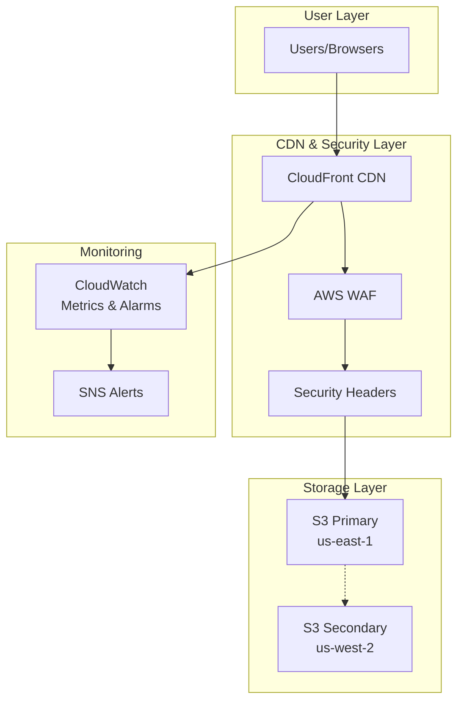
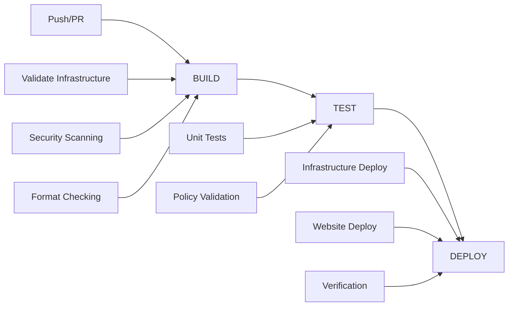

# AWS Well-Architected Static Website

[](https://github.com/celtikill/static-site/actions/workflows/build.yml)
[](https://github.com/celtikill/static-site/actions/workflows/test.yml)
[](https://github.com/celtikill/static-site/actions/workflows/deploy.yml)
[](https://opensource.org/licenses/Apache-2.0)
[](https://github.com/OWASP/ASVS)

Enterprise-grade serverless static website infrastructure using AWS Well-Architected Framework principles. Production-ready template with comprehensive security, monitoring, and cost optimization.

## 🏗️ Architecture



## ✨ Features

### 🛡️ Security
- **AWS WAF** with OWASP Top 10 protection and rate limiting
- **Security headers** via CloudFront Functions (HSTS, CSP, X-Frame-Options)
- **GitHub OIDC** for keyless CI/CD deployments ([Setup Guide](docs/oidc-authentication.md))
- **End-to-end encryption** (KMS + TLS 1.2+)
- **ASVS Level 1 & 2** compliance

### 🚀 Performance
- **Global CDN** with 200+ edge locations
- **HTTP/2 and HTTP/3** support
- **Intelligent caching** and compression
- **Origin Access Control** (OAC) for S3 security

### 💰 Cost Optimization (~$30/month)
- **S3 Intelligent Tiering** for automatic savings
- **CloudFront regional caching**
- **Automated cost monitoring** with budget alerts

### 📊 Monitoring
- **Real-time CloudWatch dashboards**
- **Composite alarms** for website health
- **SNS email notifications**
- **Performance and security metrics**

### 🔄 CI/CD Pipeline
- **BUILD-TEST-DEPLOY** workflows with GitHub Actions
- **Infrastructure as Code** with OpenTofu 1.6+
- **Automated security scanning** (tfsec, Checkov, Trivy)
- **Unit tests** for all infrastructure modules
- **Zero-downtime deployments**

## 🚀 Quick Start

### Prerequisites
- AWS CLI configured with appropriate credentials
- OpenTofu 1.6+ installed
- GitHub repository for CI/CD integration

### 1. Clone and Configure
```bash
git clone https://github.com/your-username/static-site.git
cd static-site
cp terraform/terraform.tfvars.example terraform/terraform.tfvars
```

### 2. Update Configuration
Edit `terraform/terraform.tfvars`:
```hcl
project_name      = "my-website"
environment       = "prod"
github_repository = "your-username/your-repo"
alert_email_addresses = ["admin@example.com"]
```

### 3. Initialize Backend
```bash
cat > terraform/backend.hcl << EOF
bucket         = "your-terraform-state-bucket"
key            = "static-website/terraform.tfstate"
region         = "us-east-1"
dynamodb_table = "terraform-state-locks"
encrypt        = true
EOF
```

### 4. Deploy Infrastructure
```bash
cd terraform
tofu init -backend-config=backend.hcl
tofu plan
tofu apply
```

### 5. Configure GitHub Actions
Add these secrets to your GitHub repository:
```bash
# Get role ARN from Terraform output
AWS_ROLE_ARN=$(tofu output -raw github_actions_role_arn)

# Add to GitHub secrets:
# - AWS_ROLE_ARN: <role-arn>
# - AWS_REGION: us-east-1
```

### 6. Deploy Website
```bash
# Sync website content
aws s3 sync src/ s3://$(tofu output -raw s3_bucket_id) --delete

# Invalidate CloudFront cache
aws cloudfront create-invalidation \
  --distribution-id $(tofu output -raw cloudfront_distribution_id) \
  --paths "/*"
```

## 📁 Project Structure

```
static-site/
├── README.md                          # This file
├── LICENSE                           # Apache 2.0 License
├── src/                             # Website source files
│   ├── index.html                   # Main website page
│   ├── 404.html                     # Custom error page
│   ├── css/styles.css              # Responsive CSS
│   ├── js/main.js                  # JavaScript functionality
│   └── robots.txt                  # SEO configuration
├── terraform/                      # Infrastructure as Code
│   ├── main.tf                     # Main configuration
│   ├── variables.tf                # Input variables
│   ├── outputs.tf                  # Output values
│   ├── terraform.tfvars.example    # Example configuration
│   └── modules/                    # Reusable modules
│       ├── s3/                     # S3 storage module
│       ├── cloudfront/             # CloudFront CDN module
│       ├── waf/                    # WAF security module
│       ├── iam/                    # IAM permissions module
│       └── monitoring/             # CloudWatch monitoring
├── test/                           # Testing framework
│   ├── functions/test-functions.sh # Zero-dependency testing library
│   └── unit/                       # Unit tests for modules
│       ├── test-s3.sh             # S3 module tests
│       ├── test-cloudfront.sh     # CloudFront module tests
│       ├── test-waf.sh            # WAF module tests
│       ├── test-iam.sh            # IAM module tests
│       └── test-monitoring.sh     # Monitoring module tests
└── .github/workflows/             # CI/CD pipeline
    ├── build.yml                  # Infrastructure validation
    ├── test.yml                   # Security and testing
    └── deploy.yml                 # Deployment workflow
```

## 🔄 CI/CD Pipeline

### Workflow Overview


### Key Workflows

#### BUILD (`build.yml`)
- OpenTofu validation and planning
- Security scanning (tfsec, Checkov, Trivy)
- Website build preparation
- Cost estimation

#### TEST (`test.yml`)
- Unit tests for all infrastructure modules
- Policy validation with OPA/Conftest
- Security compliance checking

#### DEPLOY (`deploy.yml`)
- Infrastructure provisioning with OpenTofu
- Website content deployment to S3
- CloudFront cache invalidation
- Post-deployment verification

### Usage Examples
```bash
# Manual deployment to development
gh workflow run deploy.yml \
  --field environment=dev \
  --field deploy_infrastructure=true \
  --field deploy_website=true

# Content-only deployment
gh workflow run deploy.yml \
  --field environment=prod \
  --field deploy_infrastructure=false \
  --field deploy_website=true
```

## 🔧 Configuration

### Key Terraform Variables
```hcl
# Required
project_name      = "my-website"
environment       = "prod"
github_repository = "owner/repo"

# Optional
domain_aliases              = ["www.example.com"]
acm_certificate_arn        = "arn:aws:acm:..."
create_route53_zone        = true
waf_rate_limit            = 2000
cloudfront_price_class    = "PriceClass_100"
enable_cross_region_replication = true
alert_email_addresses     = ["admin@example.com"]
monthly_budget_limit      = "50"
```

### Environment Variables
```bash
# Deployment
export AWS_REGION="us-east-1"
export AWS_ROLE_ARN="arn:aws:iam::123456789012:role/github-actions-role"

# Testing
export TEST_LOG_LEVEL="INFO"
export TEST_CLEANUP="true"
```

## 🔐 Security

### Security Features
- **AWS WAF**: OWASP Top 10 protection, rate limiting
- **CloudFront Functions**: Security headers (CSP, HSTS, X-Frame-Options)
- **S3 Security**: Bucket policies, encryption at rest, versioning
- **IAM**: Least-privilege access, GitHub OIDC integration
- **TLS**: Latest versions, automatic certificate management

### Security Headers
Applied via CloudFront Functions:
```javascript
'strict-transport-security': 'max-age=31536000; includeSubDomains; preload'
'x-content-type-options': 'nosniff'
'x-frame-options': 'DENY'
'content-security-policy': "default-src 'self'; script-src 'self'..."
```

## 📊 Monitoring

### CloudWatch Dashboard
```bash
# Get dashboard URL
tofu output cloudwatch_dashboard_url
```

### Key Metrics
- **Performance**: Response times, cache hit rates, error rates
- **Security**: WAF blocked requests, security events
- **Cost**: Daily spend, budget alerts
- **Availability**: Uptime, health checks

### Automated Alerts
- CloudFront error rates > 5%
- Cache hit rate < 85%
- WAF blocked requests > 100/5min
- Monthly cost > budget threshold

## 💰 Cost Analysis

| Service | Monthly Cost (USD) | Description |
|---------|-------------------|-------------|
| **S3** | $0.25 | Storage and requests |
| **CloudFront** | $8.50 | Global CDN |
| **WAF** | $6.00 | Security protection |
| **CloudWatch** | $2.50 | Monitoring |
| **Data Transfer** | $9.00 | Internet egress |
| **Route 53** | $0.90 | DNS (if enabled) |
| **Total** | **~$27-30** | Complete infrastructure |

### Cost Optimization
- S3 Intelligent Tiering: 20-68% savings
- CloudFront caching: 85%+ cache hit ratio
- Regional optimization: PriceClass_100 for US-only
- Automated budget monitoring

## 🧪 Testing

### Running Tests
```bash
# Run all unit tests
cd test/unit && bash run-tests.sh

# Run specific module tests
./test-s3.sh
./test-cloudfront.sh
./test-waf.sh
./test-iam.sh
./test-monitoring.sh

# Run with debug logging
TEST_LOG_LEVEL=DEBUG ./test-s3.sh
```

### Test Coverage
- **Infrastructure modules**: Terraform syntax, security, compliance
- **Security policies**: ASVS L1/L2 requirements
- **Performance**: Optimization and best practices

## 🚀 Deployment

### GitHub Actions (Recommended)
1. Configure repository secrets and variables
2. Push triggers automatic BUILD → TEST → DEPLOY
3. Manual deployment for environment selection
4. Environment protection with approval gates

### Manual Deployment (Development)
```bash
# Deploy infrastructure
cd terraform && tofu apply

# Deploy website content
S3_BUCKET=$(tofu output -raw s3_bucket_id)
aws s3 sync ../src/ "s3://$S3_BUCKET" --delete

# Invalidate cache
CF_DISTRIBUTION=$(tofu output -raw cloudfront_distribution_id)
aws cloudfront create-invalidation --distribution-id "$CF_DISTRIBUTION" --paths "/*"
```

## 🔧 Troubleshooting

### Common Issues

1. **Certificate Validation**: ACM certificates must be in us-east-1 for CloudFront
2. **S3 Access Denied**: Check bucket policy and OAC configuration
3. **CloudFront Caching**: Use invalidation for immediate updates
4. **GitHub Actions Authentication**: Verify OIDC setup ([Setup Guide](docs/oidc-authentication.md))

### Debug Commands
```bash
# Infrastructure status
tofu plan -detailed-exitcode && tofu validate

# AWS resources
aws s3 ls && aws cloudfront list-distributions

# Authentication
aws sts get-caller-identity
```

## 🤝 Contributing

1. Fork the repository
2. Create feature branch: `git checkout -b feature/amazing-feature`
3. Run tests: `cd test/unit && bash run-tests.sh`
4. Commit changes: `git commit -m 'Add amazing feature'`
5. Push and create Pull Request

## 📚 Documentation

- [OIDC Authentication Guide](docs/oidc-authentication.md) - Complete GitHub OIDC setup
- [Security Hardening](docs/oidc-security-hardening.md) - Advanced security configuration
- [Architecture Details](ARCHITECTURE.md) - Detailed architectural decisions

## 🆘 Support

- **Issues**: [GitHub Issues](https://github.com/celtikill/static-site/issues)
- **Discussions**: [GitHub Discussions](https://github.com/celtikill/static-site/discussions)

## 📄 License

Licensed under the Apache License, Version 2.0. See [LICENSE](LICENSE) file for details.

## 🙏 Acknowledgments

- **AWS Well-Architected Framework** for architectural guidance
- **OpenTofu** for open-source infrastructure as code
- **OWASP** for security best practices and ASVS framework

---

**Built with ❤️ using AWS Well-Architected principles**