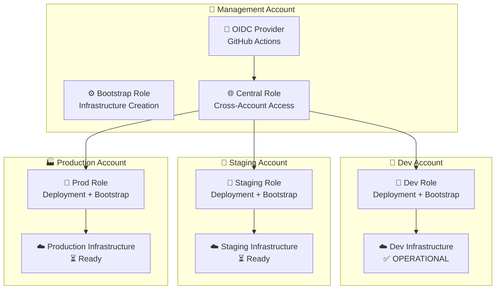
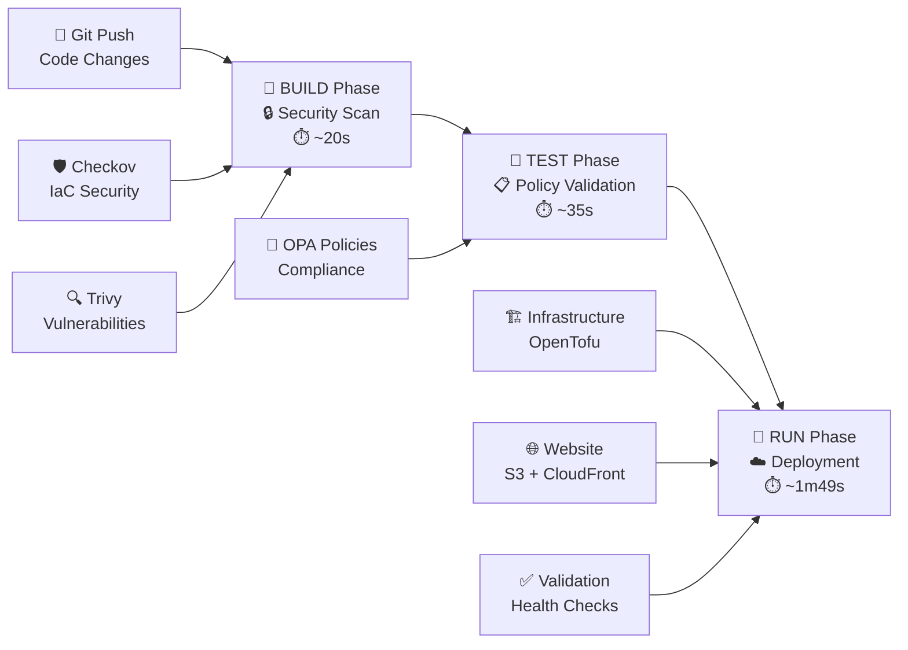
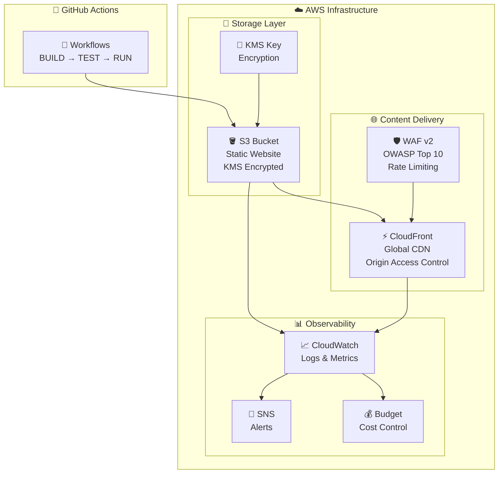

# AWS Static Website Infrastructure

Enterprise-grade AWS static website infrastructure using OpenTofu with multi-account architecture. Implements secure, scalable static website deployment with CloudFront CDN, S3 storage, WAF protection, and comprehensive monitoring.

## 🔄 Pipeline Status

[](https://github.com/Celtikill/static-site/actions/workflows/build.yml)
[](https://github.com/Celtikill/static-site/actions/workflows/test.yml)
[](https://github.com/Celtikill/static-site/actions/workflows/run.yml)

## 🌐 Live Deployments

**Dev Environment** ✅ OPERATIONAL
- URL: http://static-website-dev-a259f4bd.s3-website-us-east-1.amazonaws.com
- Architecture: S3-only (cost optimized)
- Cost Profile: ~$1-5/month
- Last Updated: 2025-09-22 14:08:29 UTC
- Account: <DEV-ACCOUNT-ID>

**Staging Environment** ⏳ Ready for bootstrap
**Production Environment** ⏳ Ready for bootstrap

## 🚀 Quick Start

Get your static website deployed in under 10 minutes:

### Prerequisites
- AWS Account with appropriate permissions
- GitHub repository access
- OpenTofu/Terraform installed locally

### Deploy to Development
```bash
# 1. Clone the repository
git clone https://github.com/Celtikill/static-site.git
cd static-site

# 2. Trigger development deployment
gh workflow run run.yml --field environment=dev --field deploy_infrastructure=true --field deploy_website=true

# 3. Monitor deployment
gh run list --limit 5
```

### Bootstrap Additional Environments
```bash
# Bootstrap staging environment
gh workflow run bootstrap-distributed-backend.yml \
  --field project_name=static-site \
  --field environment=staging \
  --field confirm_bootstrap=BOOTSTRAP-DISTRIBUTED

# Bootstrap production environment
gh workflow run bootstrap-distributed-backend.yml \
  --field project_name=static-site \
  --field environment=prod \
  --field confirm_bootstrap=BOOTSTRAP-DISTRIBUTED
```

## 🏗️ Architecture Overview

### Multi-Account Architecture


### CI/CD Pipeline


### Infrastructure Components


## 🔒 Security Architecture

- **Multi-Account Isolation**: Separate AWS accounts for each environment
- **OIDC Authentication**: No stored AWS credentials in GitHub
- **3-Tier Security Model**: Bootstrap → Central → Environment roles ([detailed architecture](docs/permissions-architecture.md))
- **Encryption**: KMS encryption for all data at rest
- **Policy Validation**: OPA/Rego policies with 100% compliance
- **Security Scanning**: Checkov + Trivy with fail-fast on critical issues
- **WAF Protection**: OWASP Top 10 protection and rate limiting

## 📊 Deployment Status

### Pipeline Health ✅ FULLY OPERATIONAL
- **BUILD**: ✅ Security scanning and artifact creation (~20s)
- **TEST**: ✅ OPA policy validation with enhanced reporting (~35s)
- **RUN**: ✅ Complete deployment workflow (~1m49s)
- **BOOTSTRAP**: ✅ Distributed backend creation working

### Account Status
- **Management (<MGMT-ACCOUNT-ID>)**: OIDC provider ✅, Bootstrap Role ✅
- **Dev (<DEV-ACCOUNT-ID>)**: **FULLY DEPLOYED** ✅
- **Staging (<STAGING-ACCOUNT-ID>)**: Ready for bootstrap ⏳
- **Prod (<PROD-ACCOUNT-ID>)**: Ready for bootstrap ⏳

## 💰 Cost Optimization

### Environment-Specific Profiles
- **Development**: ~$1-5/month (S3-only, cost optimized)
- **Staging**: ~$15-25/month (CloudFront + S3, moderate features)
- **Production**: ~$25-50/month (Full stack, all features enabled)

### Cost Controls
- Conditional CloudFront deployment based on environment
- Environment-specific budget limits and alerts
- Cross-region replication only where needed
- Free tier optimization for development

## 📚 Documentation

- **[Quick Start Guide](docs/quickstart.md)** - Get started in 10 minutes
- **[Architecture Guide](docs/architecture.md)** - Detailed technical architecture
- **[3-Tier Permissions Architecture](docs/permissions-architecture.md)** - IAM roles and security model
- **[Security Policy](SECURITY.md)** - Security practices and vulnerability reporting
- **[Deployment Guide](docs/deployment.md)** - Step-by-step deployment procedures
- **[Troubleshooting](docs/troubleshooting.md)** - Common issues and solutions
- **[Reference Guide](docs/reference.md)** - Command reference and specifications

## 🛠️ Development

### Essential Commands
```bash
# Validate infrastructure changes
tofu validate && tofu fmt -check

# Validate workflow changes
yamllint -d relaxed .github/workflows/*.yml

# Test workflows
gh workflow run build.yml --field force_build=true --field environment=dev
gh workflow run test.yml --field skip_build_check=true --field environment=dev

# View workflow status
gh run list --limit 5
```

### Development Workflow
```
feature/* → BUILD → TEST → RUN (dev)
main push → BUILD → TEST (requires credentials for staging/prod)
workflow_dispatch → Direct deployment testing
```

## 🤝 Contributing

We welcome contributions! Please see our [Contributing Guide](CONTRIBUTING.md) for details on:
- Code of conduct
- Development setup
- Contribution guidelines
- Pull request process

For security vulnerabilities, please read our [Security Policy](SECURITY.md).

## 📋 Roadmap

### Immediate (This Week)
- [ ] Bootstrap staging and production environments
- [ ] Complete multi-account deployment validation

### Short-term (This Month)
- [ ] Enhanced monitoring and alerting
- [ ] Infrastructure unit testing re-integration
- [ ] Advanced cost optimization features

### Long-term (This Quarter)
- [ ] Multi-project platform support
- [ ] Advanced security features
- [ ] Performance optimization

See [TODO.md](TODO.md) for detailed implementation plan and [WISHLIST.md](WISHLIST.md) for future enhancements.

## 📞 Support

- **Issues**: [GitHub Issues](https://github.com/Celtikill/static-site/issues)
- **Security**: See [SECURITY.md](SECURITY.md) for vulnerability reporting
- **Documentation**: [docs/](docs/) directory for detailed guides

## 📄 License

This project is licensed under the MIT License - see the [LICENSE](LICENSE) file for details.

---

**🎯 Current Status**: Infrastructure complete, dev environment operational, ready for multi-account expansion
