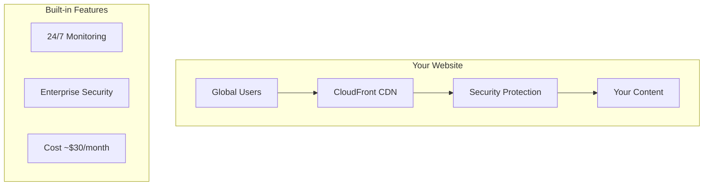

# AWS Well-Architected Static Website

Enterprise-grade serverless static website infrastructure using AWS Well-Architected Framework principles. Production-ready template with comprehensive security, monitoring, and cost optimization.

## 🚀 Get Started in 5 Minutes

**New to this project?** → [**Quick Start Guide**](docs/quick-start.md)

**Ready to deploy?** → [**Deployment Guide**](docs/deployment.md)

**Need to secure your setup?** → [**Security Guide**](docs/security.md)

## 🏗️ What You'll Get

### ✨ Key Features

- **🛡️ Enterprise Security**: WAF protection, security headers, OIDC authentication
- **🌍 Global Performance**: CloudFront CDN with 200+ edge locations  
- **💰 Cost Optimized**: ~$30/month with intelligent cost monitoring
- **📊 Production Monitoring**: Real-time dashboards and alerts
- **🔄 Zero-Downtime CI/CD**: Fully automated GitHub Actions pipeline

## 🗺️ Choose Your Path

### 👋 First Time User
1. [**Quick Start**](docs/quick-start.md) - Get running in 5 minutes
2. [**Architecture Overview**](docs/architecture.md) - Understand what you're building
3. [**Security Basics**](docs/security.md) - Essential security setup

### 🔧 System Administrator  
1. [**Deployment Guide**](docs/deployment.md) - Complete deployment process
2. [**Configuration Reference**](docs/configuration.md) - All variables and settings
3. [**Monitoring Setup**](docs/monitoring.md) - Dashboards and alerting
4. [**Troubleshooting**](docs/troubleshooting.md) - Common issues and solutions

### 🔒 Security Engineer
1. [**Security Guide**](docs/security.md) - Comprehensive security overview
2. [**OIDC Setup**](docs/oidc-authentication.md) - GitHub authentication
3. [**Security Hardening**](docs/oidc-security-hardening.md) - Advanced security
4. [**Compliance**](docs/compliance.md) - ASVS L1/L2 standards

### 👨‍💻 Developer/Contributor
1. [**Development Guide**](docs/development.md) - Local development setup
2. [**Testing Framework**](test/README.md) - Run and write tests
3. [**Contributing**](docs/contributing.md) - Contribution guidelines
4. [**API Reference**](docs/api-reference.md) - Commands and variables

## 📈 Production Ready

This template powers production websites with:

- **99.9%+ Uptime** with global CDN and health monitoring
- **Sub-second Response Times** worldwide
- **Enterprise Security** with WAF and security headers
- **Automated Cost Management** with budget alerts
- **Zero-Downtime Deployments** via CI/CD

## 🤝 Get Help

- **🚀 Quick Issues**: Check [Troubleshooting Guide](docs/troubleshooting.md)
- **💬 Questions**: [GitHub Discussions](https://github.com/celtikill/static-site/discussions) 
- **🐛 Bug Reports**: [GitHub Issues](https://github.com/celtikill/static-site/issues)
- **📧 Security Issues**: security@yourcompany.com

## 📄 License

Licensed under the Apache License, Version 2.0. See [LICENSE](LICENSE) for details.

---

**Ready to build something amazing?** → [**Start Here**](docs/quick-start.md) 🚀