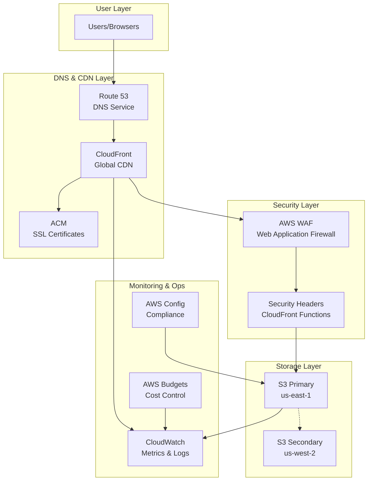

# AWS Well-Architected Static Website

[](https://opensource.org/licenses/MIT)
[](https://opentofu.org/)
[](https://aws.amazon.com/architecture/well-architected/)
[](https://github.com/OWASP/ASVS)

Enterprise-grade serverless static website infrastructure demonstrating AWS Well-Architected Framework principles. This project provides a production-ready template for hosting static websites with comprehensive security, monitoring, and cost optimization.

## 🏗️ Architecture Overview



## ✨ Features

### 🛡️ Security
- **AWS WAF** with OWASP Top 10 protection
- **Defense-in-depth** security architecture
- **End-to-end encryption** (KMS + TLS 1.2+)
- **Security headers** via CloudFront Functions
- **GitHub OIDC** for keyless deployments
- **ASVS Level 1 & 2** compliance

### 🚀 Performance
- **Global CDN** with 200+ edge locations
- **Sub-100ms latency** worldwide
- **HTTP/2 and HTTP/3** support
- **Intelligent caching** and compression
- **Core Web Vitals** optimization
- **Progressive Web App** capabilities

### 💰 Cost Optimization
- **~$30/month** estimated cost
- **S3 Intelligent Tiering** for automatic savings
- **CloudFront regional caching**
- **Automated cost monitoring** and budgets
- **Resource optimization** recommendations

### 📊 Monitoring
- **Real-time dashboards** and metrics
- **Composite alarms** for website health
- **Automated alerting** via SNS
- **Performance tracking** and analytics
- **Cost analysis** and optimization insights

### 🔄 DevOps
- **Infrastructure as Code** with OpenTofu
- **GitHub Actions CI/CD** pipeline
- **Automated security scanning**
- **Zero-downtime deployments**
- **Environment isolation**

## 🚀 Quick Start

### Prerequisites

- AWS CLI configured with appropriate credentials
- OpenTofu 1.6+ installed
- GitHub repository for CI/CD integration
- Email address for monitoring alerts

### 1. Clone and Configure

```bash
git clone https://github.com/your-username/static-site.git
cd static-site

# Copy and customize configuration
cp terraform/terraform.tfvars.example terraform/terraform.tfvars
```

### 2. Update Configuration

Edit `terraform/terraform.tfvars`:

```hcl
project_name      = "my-website"
environment       = "prod"
github_repository = "your-username/your-repo"

# Optional: Custom domain
# domain_aliases = ["www.example.com"]
# acm_certificate_arn = "arn:aws:acm:us-east-1:123456789012:certificate/..."

# Monitoring
alert_email_addresses = ["admin@example.com"]
```

### 3. Initialize Backend

Create S3 backend configuration:

```bash
# Create backend.hcl
cat > terraform/backend.hcl << EOF
bucket         = "your-terraform-state-bucket"
key            = "static-website/terraform.tfstate"
region         = "us-east-1"
dynamodb_table = "terraform-state-locks"
encrypt        = true
EOF
```

### 4. Deploy Infrastructure

```bash
cd terraform

# Initialize with backend configuration
tofu init -backend-config=backend.hcl

# Plan deployment
tofu plan

# Apply infrastructure
tofu apply
```

### 5. Configure GitHub Actions

Add these secrets to your GitHub repository:

```bash
# Get role ARN from Terraform output
AWS_ROLE_ARN=$(tofu output -raw github_actions_role_arn)

# Add to GitHub secrets:
# - AWS_ROLE_ARN: <role-arn>
# - AWS_REGION: us-east-1
```

### 6. Deploy Website

```bash
# Sync website content to S3
aws s3 sync src/ s3://$(tofu output -raw s3_bucket_id) --delete

# Invalidate CloudFront cache
aws cloudfront create-invalidation \
  --distribution-id $(tofu output -raw cloudfront_distribution_id) \
  --paths "/*"
```

## 📁 Project Structure

```
static-site/
├── README.md                          # This file
├── LICENSE                           # MIT License
├── ARCHITECTURE.md                   # Detailed architecture documentation
├── TODO.md                          # Implementation roadmap
├── src/                             # Website source files
│   ├── index.html                   # Main website page
│   ├── 404.html                     # Custom error page
│   ├── robots.txt                   # SEO and crawler instructions
│   ├── css/
│   │   └── styles.css              # Responsive CSS styles
│   ├── js/
│   │   └── main.js                 # JavaScript functionality
│   └── images/                     # Static assets
├── terraform/                      # Infrastructure as Code
│   ├── main.tf                     # Main Terraform configuration
│   ├── variables.tf                # Input variables with validation
│   ├── outputs.tf                  # Output values
│   ├── backend.tf                  # Backend and provider configuration
│   ├── terraform.tfvars.example    # Example configuration
│   └── modules/                    # Reusable Terraform modules
│       ├── s3/                     # S3 storage module
│       ├── cloudfront/             # CloudFront CDN module
│       ├── waf/                    # WAF security module
│       ├── iam/                    # IAM permissions module
│       └── monitoring/             # CloudWatch monitoring module
└── .github/
    └── workflows/                  # GitHub Actions CI/CD (to be added)
```

## 🔧 Configuration

### Environment Variables

```bash
# Required for deployment
export AWS_REGION="us-east-1"
export AWS_ROLE_ARN="arn:aws:iam::123456789012:role/github-actions-role"

# Optional: Backend configuration
export TF_VAR_backend_bucket="your-terraform-state-bucket"
export TF_VAR_backend_key="static-website/terraform.tfstate"
```

### Terraform Variables

Key configuration options in `terraform.tfvars`:

```hcl
# Project settings
project_name      = "my-website"
environment       = "prod"
github_repository = "owner/repo"

# Domain configuration (optional)
domain_aliases      = ["www.example.com", "example.com"]
acm_certificate_arn = "arn:aws:acm:us-east-1:123456789012:certificate/..."
create_route53_zone = true

# Security settings
waf_rate_limit     = 2000
enable_geo_blocking = false
blocked_countries  = []  # ["CN", "RU"] for example

# Performance settings
cloudfront_price_class = "PriceClass_100"  # US only for cost optimization

# Monitoring settings
alert_email_addresses = ["admin@example.com"]
monthly_budget_limit  = "50"

# Feature flags
enable_cross_region_replication = true
enable_deployment_metrics      = true
create_kms_key                = true
```

## 🔐 Security

### Security Features

- **AWS WAF**: OWASP Top 10 protection, rate limiting, IP filtering
- **CloudFront Functions**: Security headers (CSP, HSTS, X-Frame-Options)
- **S3 Security**: Bucket policies, encryption at rest, versioning
- **IAM**: Least-privilege access, GitHub OIDC integration
- **TLS**: Latest TLS versions, automatic certificate management
- **Monitoring**: Security event logging, automated threat detection

### Security Headers

Automatically applied via CloudFront Functions:

```javascript
// Security headers applied to all responses
'strict-transport-security': 'max-age=31536000; includeSubDomains; preload'
'x-content-type-options': 'nosniff'
'x-frame-options': 'DENY'
'x-xss-protection': '1; mode=block'
'referrer-policy': 'strict-origin-when-cross-origin'
'content-security-policy': "default-src 'self'; script-src 'self'..."
'permissions-policy': 'camera=(), microphone=(), geolocation=()'
```

### Compliance

- **ASVS v4.0**: Level 1 and Level 2 requirements met
- **OWASP**: Top 10 protection via AWS WAF
- **AWS Security**: Well-Architected security pillar implementation
- **Data Protection**: Encryption at rest and in transit

## 📊 Monitoring

### CloudWatch Dashboard

Access your monitoring dashboard:

```bash
# Get dashboard URL
tofu output cloudwatch_dashboard_url
```

### Key Metrics

- **Performance**: Response times, cache hit rates, error rates
- **Security**: WAF blocked requests, security events
- **Cost**: Daily spend, budget alerts, resource utilization
- **Availability**: Uptime, health checks, composite alarms

### Alerting

Configured alerts for:

- CloudFront error rates > 5%
- Cache hit rate < 85%
- WAF blocked requests > 100/5min
- Monthly cost > budget threshold
- Website unavailability > 5 minutes

## 💰 Cost Analysis

### Estimated Monthly Costs

| Service | Usage | Cost (USD) | Description |
|---------|--------|------------|-------------|
| **S3 Standard** | 1GB storage, 10K requests | $0.25 | Primary storage |
| **S3 Cross-Region Replication** | 1GB replication | $0.03 | Disaster recovery |
| **CloudFront** | 100GB transfer, 1M requests | $8.50 | Global CDN |
| **Route 53** | 1 hosted zone, 1M queries | $0.90 | DNS service |
| **AWS WAF** | 1 Web ACL, 1M requests | $6.00 | Security protection |
| **CloudWatch** | 10 metrics, 1GB logs | $2.50 | Monitoring |
| **Data Transfer** | 100GB outbound | $9.00 | Internet egress |
| **GitHub Actions** | 2000 minutes | $0.00 | CI/CD (free tier) |

**Total: ~$27-30/month**

### Cost Optimization

- **S3 Intelligent Tiering**: 20-68% savings on infrequent access
- **CloudFront Caching**: 85%+ cache hit ratio reduces origin costs
- **Regional Optimization**: PriceClass_100 for US-only traffic
- **Budget Alerts**: Automated cost monitoring and notifications

## 🧪 Testing

### Unit Tests

```bash
# Run infrastructure tests
bash test/unit/run-tests.sh

# Test individual modules
bash test/unit/test-s3.sh
bash test/unit/test-cloudfront.sh
bash test/unit/test-waf.sh
```

### Integration Tests

```bash
# End-to-end testing
bash test/integration/run-tests.sh

# Performance testing
bash test/performance/lighthouse-test.sh
```

### Security Testing

```bash
# Security scanning
trivy config terraform/
checkov -d terraform/
tfsec terraform/
```

## 🚀 Deployment

### GitHub Actions (Recommended)

1. **Configure Secrets**:
   ```bash
   # GitHub repository secrets
   AWS_ROLE_ARN: "arn:aws:iam::123456789012:role/github-actions-role"
   AWS_REGION: "us-east-1"
   ```

2. **Deploy on Push**:
   ```yaml
   # .github/workflows/deploy.yml
   name: Deploy Website
   on:
     push:
       branches: [main]
   jobs:
     deploy:
       runs-on: ubuntu-latest
       steps:
         - uses: actions/checkout@v4
         - name: Deploy to AWS
           run: |
             aws s3 sync src/ s3://${{ secrets.S3_BUCKET }} --delete
             aws cloudfront create-invalidation --distribution-id ${{ secrets.CLOUDFRONT_ID }} --paths "/*"
   ```

### Manual Deployment

```bash
# Sync content
aws s3 sync src/ s3://your-bucket-name --delete

# Invalidate cache
aws cloudfront create-invalidation \
  --distribution-id YOUR_DISTRIBUTION_ID \
  --paths "/*"
```

## 🔧 Troubleshooting

### Common Issues

1. **Certificate Validation**:
   ```bash
   # ACM certificates must be in us-east-1 for CloudFront
   aws acm list-certificates --region us-east-1
   ```

2. **S3 Access Denied**:
   ```bash
   # Check bucket policy and OAC configuration
   aws s3api get-bucket-policy --bucket your-bucket-name
   ```

3. **CloudFront Caching Issues**:
   ```bash
   # Invalidate cache for immediate updates
   aws cloudfront create-invalidation --distribution-id ID --paths "/*"
   ```

4. **WAF Blocking Legitimate Traffic**:
   ```bash
   # Check WAF logs and adjust rules
   aws logs filter-log-events --log-group-name /aws/wafv2/your-web-acl
   ```

### Debug Commands

```bash
# Check infrastructure status
tofu plan -detailed-exitcode

# Validate configuration
tofu validate

# Check AWS resources
aws s3 ls
aws cloudfront list-distributions
aws wafv2 list-web-acls --scope CLOUDFRONT
```

## 🤝 Contributing

1. Fork the repository
2. Create a feature branch: `git checkout -b feature/amazing-feature`
3. Commit changes: `git commit -m 'Add amazing feature'`
4. Push to branch: `git push origin feature/amazing-feature`
5. Open a Pull Request

### Development Setup

```bash
# Install development dependencies
make dev-setup

# Run tests
make test

# Format code
make format

# Security scan
make security-scan
```

## 📚 Documentation

- [Architecture Guide](ARCHITECTURE.md) - Detailed architectural decisions
- [Security Guide](docs/security.md) - Comprehensive security documentation
- [Deployment Guide](docs/deployment.md) - Advanced deployment scenarios
- [Monitoring Guide](docs/monitoring.md) - Observability and alerting setup
- [Cost Optimization](docs/cost-optimization.md) - Strategies for cost reduction

## 🆘 Support

- **Issues**: [GitHub Issues](https://github.com/your-username/static-site/issues)
- **Discussions**: [GitHub Discussions](https://github.com/your-username/static-site/discussions)
- **Documentation**: [Project Wiki](https://github.com/your-username/static-site/wiki)

## 📄 License

This project is licensed under the MIT License - see the [LICENSE](LICENSE) file for details.

## 🙏 Acknowledgments

- **AWS Well-Architected Framework** for architectural guidance
- **OpenTofu** for open-source infrastructure as code
- **OWASP** for security best practices and ASVS framework
- **CloudFormation/Terraform** community for module inspiration

## 🔗 Related Projects

- [aws-secure-baseline](https://github.com/nozaq/terraform-aws-secure-baseline) - AWS security baseline
- [terraform-aws-cloudfront-s3-cdn](https://github.com/cloudposse/terraform-aws-cloudfront-s3-cdn) - CloudFront S3 CDN module
- [aws-well-architected-labs](https://github.com/awslabs/aws-well-architected-labs) - AWS Well-Architected Labs

---

**Built with ❤️ using AWS Well-Architected principles**

For more information, visit the [AWS Well-Architected Framework](https://aws.amazon.com/architecture/well-architected/) documentation.