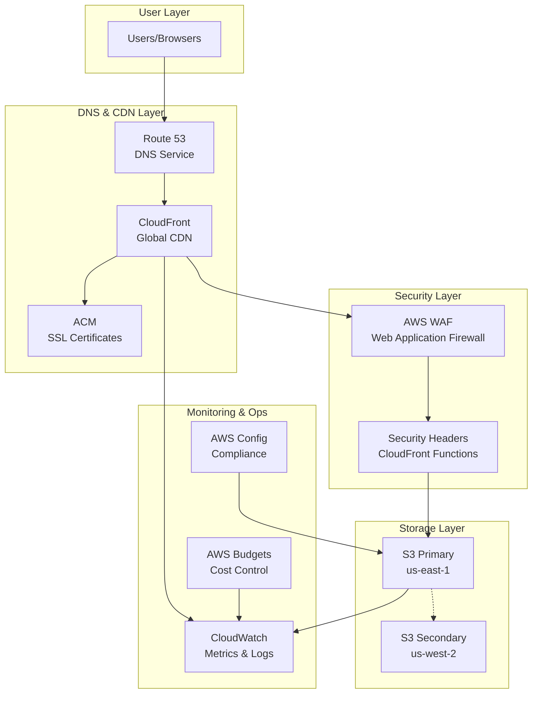
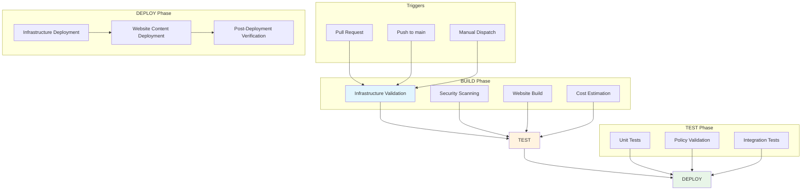
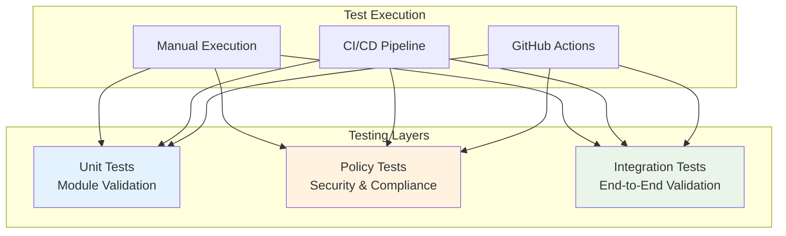

# AWS Well-Architected Static Website

[](https://github.com/celtikill/static-site/actions/workflows/build.yml)
[](https://github.com/celtikill/static-site/actions/workflows/test.yml)
[](https://github.com/celtikill/static-site/actions/workflows/deploy.yml)
[](https://opensource.org/licenses/Apache-2.0)
[](https://github.com/OWASP/ASVS)

Enterprise-grade serverless static website infrastructure demonstrating AWS Well-Architected Framework principles. This project provides a production-ready template for hosting static websites with comprehensive security, monitoring, and cost optimization.

## 🏗️ Architecture Overview



## ✨ Features

### 🛡️ Security
- **AWS WAF** with OWASP Top 10 protection
- **Defense-in-depth** security architecture
- **End-to-end encryption** (KMS + TLS 1.2+)
- **Security headers** via CloudFront Functions
- **GitHub OIDC** for keyless deployments ([Complete Guide](docs/oidc-authentication.md))
- **ASVS Level 1 & 2** compliance

### 🚀 Performance
- **Global CDN** with 200+ edge locations
- **Sub-100ms latency** worldwide
- **HTTP/2 and HTTP/3** support
- **Intelligent caching** and compression
- **Core Web Vitals** optimization
- **Progressive Web App** capabilities

### 💰 Cost Optimization
- **~$30/month** estimated cost
- **S3 Intelligent Tiering** for automatic savings
- **CloudFront regional caching**
- **Automated cost monitoring** and budgets
- **Resource optimization** recommendations

### 📊 Monitoring
- **Real-time dashboards** and metrics
- **Composite alarms** for website health
- **Automated alerting** via SNS
- **Performance tracking** and analytics
- **Cost analysis** and optimization insights

### 🔄 DevOps & CI/CD
- **Enterprise CI/CD Pipeline** with BUILD-TEST-DEPLOY workflows
- **Infrastructure as Code** with OpenTofu 1.6+
- **Automated security scanning** (tfsec, Checkov, Trivy)
- **Policy-as-code validation** with OPA/Conftest
- **Zero-downtime deployments** with CloudFront invalidation
- **Environment protection** with approval gates
- **Comprehensive testing** (unit, integration, policy validation)
- **Cost estimation** and budget monitoring
- **SARIF security reporting** integrated with GitHub Security tab

## 🚀 Quick Start

### Prerequisites

- AWS CLI configured with appropriate credentials
- OpenTofu 1.6+ installed
- GitHub repository for CI/CD integration
- Email address for monitoring alerts

### 1. Clone and Configure

```bash
git clone https://github.com/your-username/static-site.git
cd static-site

# Copy and customize configuration
cp terraform/terraform.tfvars.example terraform/terraform.tfvars
```

### 2. Update Configuration

Edit `terraform/terraform.tfvars`:

```hcl
project_name      = "my-website"
environment       = "prod"
github_repository = "your-username/your-repo"

# Optional: Custom domain
# domain_aliases = ["www.example.com"]
# acm_certificate_arn = "arn:aws:acm:us-east-1:123456789012:certificate/..."

# Monitoring
alert_email_addresses = ["admin@example.com"]
```

### 3. Initialize Backend

Create S3 backend configuration:

```bash
# Create backend.hcl
cat > terraform/backend.hcl << EOF
bucket         = "your-terraform-state-bucket"
key            = "static-website/terraform.tfstate"
region         = "us-east-1"
dynamodb_table = "terraform-state-locks"
encrypt        = true
EOF
```

### 4. Deploy Infrastructure

```bash
cd terraform

# Initialize with backend configuration
tofu init -backend-config=backend.hcl

# Plan deployment
tofu plan

# Apply infrastructure
tofu apply
```

### 5. Configure GitHub Actions

Add these secrets to your GitHub repository:

```bash
# Get role ARN from Terraform output
AWS_ROLE_ARN=$(tofu output -raw github_actions_role_arn)

# Add to GitHub secrets:
# - AWS_ROLE_ARN: <role-arn>
# - AWS_REGION: us-east-1
```

### 6. Deploy Website

```bash
# Sync website content to S3
aws s3 sync src/ s3://$(tofu output -raw s3_bucket_id) --delete

# Invalidate CloudFront cache
aws cloudfront create-invalidation \
  --distribution-id $(tofu output -raw cloudfront_distribution_id) \
  --paths "/*"
```

## 📁 Project Structure

```
static-site/
├── README.md                          # This file
├── LICENSE                           # MIT License
├── ARCHITECTURE.md                   # Detailed architecture documentation
├── TODO.md                          # Implementation roadmap
├── src/                             # Website source files
│   ├── index.html                   # Main website page
│   ├── 404.html                     # Custom error page
│   ├── robots.txt                   # SEO and crawler instructions
│   ├── css/
│   │   └── styles.css              # Responsive CSS styles
│   ├── js/
│   │   └── main.js                 # JavaScript functionality
│   └── images/                     # Static assets
├── terraform/                      # Infrastructure as Code
│   ├── main.tf                     # Main Terraform configuration
│   ├── variables.tf                # Input variables with validation
│   ├── outputs.tf                  # Output values
│   ├── backend.tf                  # Backend and provider configuration
│   ├── terraform.tfvars.example    # Example configuration
│   └── modules/                    # Reusable Terraform modules
│       ├── s3/                     # S3 storage module
│       ├── cloudfront/             # CloudFront CDN module
│       ├── waf/                    # WAF security module
│       ├── iam/                    # IAM permissions module
│       └── monitoring/             # CloudWatch monitoring module
├── test/                           # Testing infrastructure
│   ├── functions/
│   │   └── test-functions.sh       # Bash-based testing framework
│   ├── unit/                       # Unit tests for infrastructure modules
│   │   ├── test-s3.sh             # S3 module tests
│   │   ├── test-cloudfront.sh     # CloudFront module tests
│   │   ├── test-waf.sh            # WAF module tests
│   │   ├── test-iam.sh            # IAM module tests
│   │   └── test-monitoring.sh     # Monitoring module tests
│   └── integration/               # End-to-end integration tests
└── .github/                       # GitHub Actions CI/CD
    ├── workflows/                 # CI/CD pipeline workflows
    │   ├── build.yml              # BUILD - Infrastructure and Website Preparation
    │   ├── test.yml               # TEST - Security and Validation
    │   └── deploy.yml             # DEPLOY - Static Website Deployment
    └── actions/                   # Reusable GitHub Actions
        ├── setup-infrastructure/  # Tool setup and AWS configuration
        └── validate-environment/  # Environment validation
```

## 🔄 Enterprise CI/CD Pipeline

This project implements a sophisticated BUILD-TEST-DEPLOY pipeline using GitHub Actions, adapted from enterprise infrastructure patterns with comprehensive security and validation.

### Pipeline Architecture



### Workflow Details

#### 🏗️ BUILD Workflow (`build.yml`)
**Purpose**: Infrastructure validation and website preparation

**Triggers**:
- Pull requests to `main` branch
- Pushes to `main` branch  
- Manual workflow dispatch

**Jobs**:
- **Infrastructure Validation**: OpenTofu format checking, validation, and planning
- **Security Scanning**: tfsec, Checkov, and Trivy analysis with SARIF reporting
- **Website Build**: Content validation, HTML checking, and build artifact creation
- **Cost Estimation**: Automated cost analysis per environment
- **PR Integration**: Automated pull request comments with results

**Artifacts Produced**:
- Terraform plans for infrastructure changes
- Website build artifacts
- Security scan results (SARIF format)
- Cost analysis reports

#### 🧪 TEST Workflow (`test.yml`)
**Purpose**: Comprehensive testing and validation

**Triggers**:
- Successful completion of BUILD workflow
- Manual workflow dispatch with build ID reference

**Jobs**:
- **Unit Tests**: Matrix testing of all infrastructure modules (S3, CloudFront, WAF, IAM, Monitoring)
- **Policy Validation**: OPA/Conftest security and compliance policy enforcement
- **Integration Tests**: End-to-end deployment with automated cleanup
- **Test Reporting**: Consolidated test results with detailed metrics

**Security Features**:
- Custom security policies for static website infrastructure
- Compliance validation for AWS best practices
- SARIF integration with GitHub Security tab

#### 🚀 DEPLOY Workflow (`deploy.yml`)
**Purpose**: Production deployment with environment protection

**Triggers**:
- Successful completion of TEST workflow  
- Manual workflow dispatch with environment selection

**Jobs**:
- **Infrastructure Deployment**: OpenTofu-based AWS resource provisioning
- **Website Deployment**: S3 sync with CloudFront cache invalidation
- **Post-Deployment Validation**: Infrastructure and content accessibility verification

**Environment Protection**:
- GitHub environments with approval gates for staging/production
- Environment-specific configuration management
- Rollback capabilities and failure handling

### Security & Compliance

#### Security Scanning Integration
```yaml
# Automated security scanning with multiple tools
security-scanning:
  strategy:
    matrix:
      scanner: [tfsec, checkov, trivy]
  steps:
    - name: Run Security Scanner
      # Upload results to GitHub Security tab
      uses: github/codeql-action/upload-sarif
```

#### Policy as Code
```rego
# Example OPA policy for S3 security
package terraform.static_website.security

deny[msg] {
  input.resource_changes[_].type == "aws_s3_bucket"
  bucket := input.resource_changes[_]
  not bucket.change.after.server_side_encryption_configuration
  msg := "S3 buckets must have server-side encryption enabled"
}
```

### Pipeline Configuration

#### Required GitHub Secrets
```bash
# AWS Authentication
AWS_ASSUME_ROLE="arn:aws:iam::123456789012:role/github-actions-role"

# Optional: Monitoring Configuration  
ALERT_EMAIL_ADDRESSES='["admin@example.com"]'
```

#### Required GitHub Variables
```bash
# Infrastructure Configuration
AWS_REGION="us-east-1"
DEFAULT_ENVIRONMENT="dev"
MONTHLY_BUDGET_LIMIT="50"

# Feature Flags
INSTALL_TEKTON_DASHBOARD="false"
CONTROL_PLANE_COUNT="3"
WORKER_COUNT="2"
```

### Usage Examples

#### Deploy to Development Environment
```bash
# Manual deployment via GitHub CLI
gh workflow run deploy.yml \
  --field environment=dev \
  --field deploy_infrastructure=true \
  --field deploy_website=true
```

#### Deploy with Infrastructure Changes
```bash
# Deploy infrastructure and website content
gh workflow run deploy.yml \
  --field environment=staging \
  --field deploy_infrastructure=true \
  --field deploy_website=true
```

#### Deploy Content Only
```bash
# Deploy only website content (no infrastructure changes)
gh workflow run deploy.yml \
  --field environment=prod \
  --field deploy_infrastructure=false \
  --field deploy_website=true
```

### Monitoring & Observability

#### GitHub Actions Dashboard
- Real-time workflow status and logs
- Artifact management and retention
- Security scan results integration
- Cost estimation reports

#### Cost Analysis
```bash
# Automated cost estimation per environment
Environment: dev     -> ~$27.50/month (single-AZ)
Environment: staging -> ~$30.00/month (multi-AZ)  
Environment: prod    -> ~$32.50/month (global CDN)
```

#### Test Metrics
- **Unit Test Coverage**: All infrastructure modules
- **Security Scan Results**: Integrated SARIF reporting
- **Policy Compliance**: Automated OPA/Conftest validation
- **Integration Test Results**: End-to-end deployment verification

## 🔧 Configuration

### Environment Variables

```bash
# Required for deployment
export AWS_REGION="us-east-1"
export AWS_ROLE_ARN="arn:aws:iam::123456789012:role/github-actions-role"

# Optional: Backend configuration
export TF_VAR_backend_bucket="your-terraform-state-bucket"
export TF_VAR_backend_key="static-website/terraform.tfstate"
```

### Terraform Variables

Key configuration options in `terraform.tfvars`:

```hcl
# Project settings
project_name      = "my-website"
environment       = "prod"
github_repository = "owner/repo"

# Domain configuration (optional)
domain_aliases      = ["www.example.com", "example.com"]
acm_certificate_arn = "arn:aws:acm:us-east-1:123456789012:certificate/..."
create_route53_zone = true

# Security settings
waf_rate_limit     = 2000
enable_geo_blocking = false
blocked_countries  = []  # ["CN", "RU"] for example

# Performance settings
cloudfront_price_class = "PriceClass_100"  # US only for cost optimization

# Monitoring settings
alert_email_addresses = ["admin@example.com"]
monthly_budget_limit  = "50"

# Feature flags
enable_cross_region_replication = true
enable_deployment_metrics      = true
create_kms_key                = true
```

## 🔐 Security

### Security Features

- **AWS WAF**: OWASP Top 10 protection, rate limiting, IP filtering
- **CloudFront Functions**: Security headers (CSP, HSTS, X-Frame-Options)
- **S3 Security**: Bucket policies, encryption at rest, versioning
- **IAM**: Least-privilege access, GitHub OIDC integration
- **TLS**: Latest TLS versions, automatic certificate management
- **Monitoring**: Security event logging, automated threat detection

### Security Headers

Automatically applied via CloudFront Functions:

```javascript
// Security headers applied to all responses
'strict-transport-security': 'max-age=31536000; includeSubDomains; preload'
'x-content-type-options': 'nosniff'
'x-frame-options': 'DENY'
'x-xss-protection': '1; mode=block'
'referrer-policy': 'strict-origin-when-cross-origin'
'content-security-policy': "default-src 'self'; script-src 'self'..."
'permissions-policy': 'camera=(), microphone=(), geolocation=()'
```

### Compliance

- **ASVS v4.0**: Level 1 and Level 2 requirements met
- **OWASP**: Top 10 protection via AWS WAF
- **AWS Security**: Well-Architected security pillar implementation
- **Data Protection**: Encryption at rest and in transit

## 📊 Monitoring

### CloudWatch Dashboard

Access your monitoring dashboard:

```bash
# Get dashboard URL
tofu output cloudwatch_dashboard_url
```

### Key Metrics

- **Performance**: Response times, cache hit rates, error rates
- **Security**: WAF blocked requests, security events
- **Cost**: Daily spend, budget alerts, resource utilization
- **Availability**: Uptime, health checks, composite alarms

### Alerting

Configured alerts for:

- CloudFront error rates > 5%
- Cache hit rate < 85%
- WAF blocked requests > 100/5min
- Monthly cost > budget threshold
- Website unavailability > 5 minutes

## 💰 Cost Analysis

### Estimated Monthly Costs

| Service | Usage | Cost (USD) | Description |
|---------|--------|------------|-------------|
| **S3 Standard** | 1GB storage, 10K requests | $0.25 | Primary storage |
| **S3 Cross-Region Replication** | 1GB replication | $0.03 | Disaster recovery |
| **CloudFront** | 100GB transfer, 1M requests | $8.50 | Global CDN |
| **Route 53** | 1 hosted zone, 1M queries | $0.90 | DNS service |
| **AWS WAF** | 1 Web ACL, 1M requests | $6.00 | Security protection |
| **CloudWatch** | 10 metrics, 1GB logs | $2.50 | Monitoring |
| **Data Transfer** | 100GB outbound | $9.00 | Internet egress |
| **GitHub Actions** | 2000 minutes | $0.00 | CI/CD (free tier) |

**Total: ~$27-30/month**

### Cost Optimization

- **S3 Intelligent Tiering**: 20-68% savings on infrequent access
- **CloudFront Caching**: 85%+ cache hit ratio reduces origin costs
- **Regional Optimization**: PriceClass_100 for US-only traffic
- **Budget Alerts**: Automated cost monitoring and notifications

## 🧪 Testing Framework

This project includes a comprehensive testing framework with zero dependencies, using bash-based testing patterns adapted from enterprise infrastructure projects.

### Testing Architecture



### Unit Tests

Test individual infrastructure modules in isolation:

```bash
# Run all unit tests via CI/CD pipeline
gh workflow run test.yml --field environment=dev

# Run individual module tests locally
cd test/unit
./test-s3.sh           # S3 storage module
./test-cloudfront.sh   # CloudFront CDN module  
./test-waf.sh          # WAF security module
./test-iam.sh          # IAM permissions module
./test-monitoring.sh   # CloudWatch monitoring module

# Run comprehensive unit test suite
bash run-tests.sh
```

### Policy Tests

Validate security and compliance policies:

```bash
# Policy validation via OPA/Conftest (automated in CI/CD)
conftest verify --policy policies/static-website-security.rego terraform/plan.json
conftest verify --policy policies/static-website-compliance.rego terraform/plan.json

# Security scanning (automated in CI/CD)  
tfsec terraform/
checkov -d terraform/
trivy config terraform/
```

### Integration Tests

End-to-end testing with real AWS resources:

```bash
# Run integration tests via CI/CD (with automated cleanup)
gh workflow run test.yml --field environment=dev

# Manual integration testing (use with caution - creates real resources)
cd test/integration
export AWS_REGION=us-east-1
export TF_VAR_environment=integration-test-$(date +%s)
./integration-test.sh

# Cleanup after manual testing
cd ../../terraform
tofu destroy -auto-approve
```

### Test Reports

The testing framework generates comprehensive reports:

- **JSON Reports**: Machine-readable test results with metrics
- **Markdown Summaries**: Human-readable test summaries
- **SARIF Security Reports**: Security scan results for GitHub Security tab
- **GitHub Actions Summaries**: Integrated workflow summaries

## 🚀 Deployment

### GitHub Actions CI/CD (Recommended)

The project includes enterprise-grade CI/CD workflows for automated deployment.

#### 1. Initial Setup

Configure your GitHub repository with required secrets and variables:

```bash
# Required GitHub Secrets
gh secret set AWS_ASSUME_ROLE --body "arn:aws:iam::123456789012:role/github-actions-role"
gh secret set ALERT_EMAIL_ADDRESSES --body '["admin@example.com"]'

# Required GitHub Variables  
gh variable set AWS_REGION --body "us-east-1"
gh variable set DEFAULT_ENVIRONMENT --body "dev"
gh variable set MONTHLY_BUDGET_LIMIT --body "50"
```

#### 2. Automated Deployment

Deployments are triggered automatically:

```yaml
# Automatic deployment on main branch
Push to main → BUILD → TEST → DEPLOY (dev environment)

# Pull request validation
Pull Request → BUILD → TEST (validation only)

# Manual deployment to any environment
Manual Dispatch → BUILD → TEST → DEPLOY (selected environment)
```

#### 3. Environment-Specific Deployment

```bash
# Deploy to development (single-AZ, cost-optimized)
gh workflow run deploy.yml \
  --field environment=dev \
  --field deploy_infrastructure=true \
  --field deploy_website=true

# Deploy to staging (multi-AZ, production-like)
gh workflow run deploy.yml \
  --field environment=staging \
  --field deploy_infrastructure=true \
  --field deploy_website=true

# Deploy to production (global CDN, full features)
gh workflow run deploy.yml \
  --field environment=prod \
  --field deploy_infrastructure=true \
  --field deploy_website=true
```

#### 4. Content-Only Deployment

```bash
# Deploy only website content (no infrastructure changes)
gh workflow run deploy.yml \
  --field environment=prod \
  --field deploy_infrastructure=false \
  --field deploy_website=true
```

#### 5. Pipeline Monitoring

```bash
# View workflow runs
gh run list --workflow=build.yml
gh run list --workflow=test.yml  
gh run list --workflow=deploy.yml

# View specific run details
gh run view <run-id> --log

# Download artifacts
gh run download <run-id>
```

### Manual Deployment (Development Only)

For development and testing purposes, you can deploy manually:

```bash
# 1. Deploy infrastructure
cd terraform
tofu init
tofu plan
tofu apply

# 2. Get deployment outputs
S3_BUCKET=$(tofu output -raw s3_bucket_id)
CF_DISTRIBUTION=$(tofu output -raw cloudfront_distribution_id)

# 3. Sync website content
aws s3 sync ../src/ "s3://$S3_BUCKET" --delete

# 4. Invalidate CloudFront cache  
aws cloudfront create-invalidation \
  --distribution-id "$CF_DISTRIBUTION" \
  --paths "/*"

# 5. Get website URL
echo "Website URL: $(tofu output -raw cloudfront_domain_name)"
```

## 🔧 Troubleshooting

### Common Issues

1. **Certificate Validation**:
   ```bash
   # ACM certificates must be in us-east-1 for CloudFront
   aws acm list-certificates --region us-east-1
   ```

2. **S3 Access Denied**:
   ```bash
   # Check bucket policy and OAC configuration
   aws s3api get-bucket-policy --bucket your-bucket-name
   ```

3. **CloudFront Caching Issues**:
   ```bash
   # Invalidate cache for immediate updates
   aws cloudfront create-invalidation --distribution-id ID --paths "/*"
   ```

4. **WAF Blocking Legitimate Traffic**:
   ```bash
   # Check WAF logs and adjust rules
   aws logs filter-log-events --log-group-name /aws/wafv2/your-web-acl
   ```

5. **GitHub Actions AWS Authentication Issues**:
   ```bash
   # Error: "Credentials could not be loaded, please check your action inputs"
   # This indicates missing or incorrect OIDC setup
   
   # Verify GitHub secrets are configured
   gh secret list
   
   # Check if AWS_ASSUME_ROLE secret exists and has correct ARN format
   # Should be: arn:aws:iam::123456789012:role/github-actions-role
   ```

### AWS OIDC Setup for GitHub Actions

If you're getting AWS authentication errors, you need to set up OIDC integration:

#### 1. Create AWS OIDC Identity Provider

```bash
# Using AWS CLI
aws iam create-open-id-connect-provider \
  --url https://token.actions.githubusercontent.com \
  --thumbprint-list 6938fd4d98bab03faadb97b34396831e3780aea1 \
  --client-id-list sts.amazonaws.com

# Get the provider ARN (save this for the next step)
aws iam list-open-id-connect-providers
```

#### 2. Create IAM Role with Trust Policy

Create a file `github-actions-trust-policy.json`:

```json
{
  "Version": "2012-10-17",
  "Statement": [
    {
      "Effect": "Allow",
      "Principal": {
        "Federated": "arn:aws:iam::YOUR-ACCOUNT-ID:oidc-provider/token.actions.githubusercontent.com"
      },
      "Action": "sts:AssumeRoleWithWebIdentity",
      "Condition": {
        "StringEquals": {
          "token.actions.githubusercontent.com:aud": "sts.amazonaws.com"
        },
        "StringLike": {
          "token.actions.githubusercontent.com:sub": "repo:YOUR-GITHUB-USERNAME/static-site:*"
        }
      }
    }
  ]
}
```

Create the IAM role:

```bash
# Create the role
aws iam create-role \
  --role-name github-actions-static-site \
  --assume-role-policy-document file://github-actions-trust-policy.json

# Attach necessary permissions (adjust as needed for your use case)
aws iam attach-role-policy \
  --role-name github-actions-static-site \
  --policy-arn arn:aws:iam::aws:policy/PowerUserAccess

# Get the role ARN (you'll need this for GitHub secrets)
aws iam get-role --role-name github-actions-static-site --query 'Role.Arn' --output text
```

#### 3. Configure GitHub Repository

```bash
# Set the AWS_ASSUME_ROLE secret with your role ARN
gh secret set AWS_ASSUME_ROLE --body "arn:aws:iam::YOUR-ACCOUNT-ID:role/github-actions-static-site"

# Set optional variables for better functionality
gh variable set AWS_REGION --body "us-east-1"
gh variable set DEFAULT_ENVIRONMENT --body "dev"
gh variable set MONTHLY_BUDGET_LIMIT --body "50"

# Optional: Set alert email for monitoring
gh secret set ALERT_EMAIL_ADDRESSES --body '["your-email@example.com"]'
```

#### 4. Validate OIDC Setup

Test your OIDC configuration:

```bash
# Use our validation script
./scripts/validate-oidc.sh --repository your-username/static-site --role-name github-actions-static-site

# Show setup commands for your repository
./scripts/validate-oidc.sh --repository your-username/static-site --setup

# Test GitHub Actions manually
gh workflow run build.yml

# Check workflow logs for authentication success
gh run list --workflow=build.yml
gh run view --log
```

#### 5. Common OIDC Issues and Solutions

**Issue**: `Error: Credentials could not be loaded`
```bash
# Solutions:
# 1. Verify AWS_ASSUME_ROLE secret exists and has correct format
gh secret list | grep AWS_ASSUME_ROLE

# 2. Check IAM role trust policy allows your repository
aws iam get-role --role-name github-actions-static-site --query 'Role.AssumeRolePolicyDocument'

# 3. Ensure OIDC provider exists in your AWS account
aws iam list-open-id-connect-providers
```

**Issue**: `Access denied when assuming role`
```bash
# Solutions:
# 1. Verify role has necessary permissions
aws iam list-attached-role-policies --role-name github-actions-static-site

# 2. Check if role trust policy is too restrictive
# Trust policy should allow your specific repository or use wildcards appropriately
```

**Issue**: `Invalid identity token`
```bash
# Solutions:
# 1. Ensure OIDC provider thumbprint is correct
# Current GitHub thumbprint: 6938fd4d98bab03faadb97b34396831e3780aea1

# 2. Verify audience is set to 'sts.amazonaws.com'
# 3. Check that workflow has 'id-token: write' permission
```

### Debug Commands

```bash
# Check infrastructure status
tofu plan -detailed-exitcode

# Validate configuration
tofu validate

# Check AWS resources
aws s3 ls
aws cloudfront list-distributions
aws wafv2 list-web-acls --scope CLOUDFRONT

# Debug AWS authentication
aws sts get-caller-identity

# Test OIDC token (in GitHub Actions environment)
curl -H "Authorization: bearer $ACTIONS_ID_TOKEN_REQUEST_TOKEN" \
  "$ACTIONS_ID_TOKEN_REQUEST_URL&audience=sts.amazonaws.com"
```

## 🤝 Contributing

1. Fork the repository
2. Create a feature branch: `git checkout -b feature/amazing-feature`
3. Commit changes: `git commit -m 'Add amazing feature'`
4. Push to branch: `git push origin feature/amazing-feature`
5. Open a Pull Request

### Development Setup

```bash
# Install development dependencies
make dev-setup

# Run tests
make test

# Format code
make format

# Security scan
make security-scan
```

## 📚 Documentation

- [Architecture Guide](ARCHITECTURE.md) - Detailed architectural decisions
- [OIDC Authentication](docs/oidc-authentication.md) - Complete OIDC security implementation guide
- [Security Guide](docs/security.md) - Comprehensive security documentation
- [Deployment Guide](docs/deployment.md) - Advanced deployment scenarios
- [Monitoring Guide](docs/monitoring.md) - Observability and alerting setup
- [Cost Optimization](docs/cost-optimization.md) - Strategies for cost reduction

## 🆘 Support

- **Issues**: [GitHub Issues](https://github.com/your-username/static-site/issues)
- **Discussions**: [GitHub Discussions](https://github.com/your-username/static-site/discussions)
- **Documentation**: [Project Wiki](https://github.com/your-username/static-site/wiki)

## 📄 License

This project is licensed under the MIT License - see the [LICENSE](LICENSE) file for details.

## 🙏 Acknowledgments

- **AWS Well-Architected Framework** for architectural guidance
- **OpenTofu** for open-source infrastructure as code
- **OWASP** for security best practices and ASVS framework
- **CloudFormation/Terraform** community for module inspiration

## 🔗 Related Projects

- [aws-secure-baseline](https://github.com/nozaq/terraform-aws-secure-baseline) - AWS security baseline
- [terraform-aws-cloudfront-s3-cdn](https://github.com/cloudposse/terraform-aws-cloudfront-s3-cdn) - CloudFront S3 CDN module
- [aws-well-architected-labs](https://github.com/awslabs/aws-well-architected-labs) - AWS Well-Architected Labs

---

**Built with ❤️ using AWS Well-Architected principles**

For more information, visit the [AWS Well-Architected Framework](https://aws.amazon.com/architecture/well-architected/) documentation.