# AWS Static Website Infrastructure

## 🚀 Status Overview

**Environments:** [](https://dev.yourdomain.com) [](https://staging.yourdomain.com) [](https://yourdomain.com)

### Pipeline Status
[](https://github.com/celtikill/static-site/actions/workflows/build.yml) [](https://github.com/celtikill/static-site/actions/workflows/test.yml) [](https://github.com/celtikill/static-site/actions/workflows/run.yml) [](https://github.com/celtikill/static-site/actions/workflows/release.yml)

### Quality & Security
[](https://github.com/celtikill/static-site/actions/workflows/build.yml) [](https://github.com/celtikill/static-site/actions/workflows/test.yml)

### 🚨 Current Status
[](https://github.com/celtikill/static-site/blob/main/TODO.md) [](https://github.com/celtikill/static-site/blob/main/TODO.md#current-constraints--next-steps)

**Multi-Account Architecture Migration**: Currently implementing organization management infrastructure. GitHub Actions deployment paused due to monthly billing limits - will resume next month.

---

Enterprise-grade infrastructure as code for deploying secure, scalable static websites on AWS using OpenTofu (Terraform-compatible).

## 🚀 Features

- **🚩 Feature Flags**: Cost-optimized deployment with configurable CloudFront/WAF (~$1-5/month S3-only vs ~$20-35/month full stack)
- **🔒 Security First**: OWASP Top 10 protection, WAF, encryption at rest/transit
- **🌍 Global CDN**: CloudFront distribution with edge locations worldwide
- **📊 Monitoring**: Comprehensive CloudWatch dashboards and alerts
- **💰 Cost Optimized**: S3 Intelligent Tiering, budget alerts
- **🔄 Build-Test-Run Pipeline**: Simplified 3-phase deployment with automated quality gates and workflow orchestration
- **🧪 Automated Testing**: Comprehensive usability and validation testing
- **🚨 Emergency Response**: Hotfix and rollback capabilities with code owner approval
- **🛡️ Compliance**: ASVS L1/L2 compliant, security scanning

## 📋 Prerequisites

- AWS Account with appropriate permissions
- OpenTofu 1.6+ or Terraform 1.6+
- AWS CLI v2 configured
- GitHub repository (for CI/CD)

## 🏗️ Architecture

```mermaid
graph LR
    %% Accessibility
    accTitle: AWS Static Website Infrastructure Architecture
    accDescr: Shows the flow from Route 53 DNS through CloudFront CDN to S3 storage, with WAF providing security protection.

    subgraph "Core Architecture"
        R53[🌐 Route 53<br/>DNS Management]
        CF[⚡ CloudFront<br/>Global CDN]
        S3[📦 S3<br/>Static Storage]
        WAF[🛡️ WAF<br/>Security Layer]
    end

    %% Flow
    R53 --> CF
    CF --> S3
    CF --> WAF

    %% Styling
    classDef dnsBox fill:#e8f5e8,stroke:#2e7d32,stroke-width:2px,color:#1b5e20
    classDef cdnBox fill:#fff3cd,stroke:#856404,stroke-width:3px,color:#212529
    classDef storageBox fill:#e3f2fd,stroke:#1565c0,stroke-width:2px,color:#0d47a1
    classDef securityBox fill:#ffebee,stroke:#d32f2f,stroke-width:2px,color:#b71c1c

    class R53 dnsBox
    class CF cdnBox
    class S3 storageBox
    class WAF securityBox
```



## 🔄 Build-Test-Run Pipeline

This project implements a simplified 3-phase deployment strategy with comprehensive workflow orchestration:

### 🔀 Deployment Flow

1. **BUILD Phase** (~5-8 min): Code validation, security scanning (Checkov/Trivy), artifact creation
2. **TEST Phase** (~8-15 min): Quality gates, policy validation (OPA/Rego), compliance checks
3. **RUN Phase** (~10-15 min): Environment-specific deployment operations (unified workflow)

### 🎯 Environment Routing & Workflow Interaction

#### Branch-to-Environment Mapping
| Branch Pattern | Environment | Deployment Type | Approval Required |
|---------------|-------------|-----------------|-------------------|
| `feature/*`, `bugfix/*` | Development | Automatic | No |
| `main` (via PR) | Staging | Manual trigger | No |
| `main` (via Release) | Production | Tag-based | Code owners only |
| `hotfix/*` | Staging → Production | Emergency path | Code owners only |

#### Automatic Deployment Patterns
1. **Feature Development**: `feature/*` → BUILD → TEST → RUN (development)
2. **Staging Deployment**: PR to `main` → BUILD → TEST → manual RUN (staging)
3. **Production Deployment**: RELEASE workflow → BUILD → TEST → RUN (production)
4. **Emergency Operations**: EMERGENCY workflow → expedited pipeline execution

#### Version-Based Release Management
1. **Release Candidates** (`v*.*.*-rc*`) → Staging deployment via RELEASE workflow
2. **Stable Releases** (`v*.*.*`) → Production deployment with approval
3. **Hotfix Releases** (`v*.*.*-hotfix.*`) → Emergency deployment path

### 🔧 Workflow Commands

```bash
# Create release candidate (deploys to staging)
gh workflow run release.yml --field version_type=rc

# Create production release (requires approval)
gh workflow run release.yml --field version_type=patch

# Deploy to specific environment manually
gh workflow run run.yml --field environment=staging --field deploy_infrastructure=true

# Force security build and testing
gh workflow run build.yml --field force_build=true
gh workflow run test.yml --field force_all_jobs=true

# Test full pipeline execution
gh workflow run build.yml --field force_build=true --field environment=dev
```

### 🛡️ Quality Gates

- **Security Scanning**: Checkov and Trivy analysis in BUILD phase (blocks on HIGH/CRITICAL)
- **Policy Validation**: OPA/Rego policy compliance in TEST phase (environment-aware enforcement)
- **Usability Testing**: Two-phase HTTP/SSL/performance validation (pre and post-deployment)
- **Code Owner Approval**: Production deployments restricted to code owners
- **Environment Health**: Staging validates development, production validates staging

### 🚨 Emergency Procedures

```bash
# Emergency hotfix deployment
gh workflow run emergency.yml --field operation=hotfix --field environment=prod --field reason="Critical security fix"

# Emergency rollback
gh workflow run emergency.yml --field operation=rollback --field environment=prod --field reason="Performance regression" --field rollback_method=last_known_good

# Create hotfix release (alternative emergency path)
gh workflow run release.yml --field version_type=hotfix --field deploy_after_tag=true
```

## 📊 Status Overview

The project uses a simplified status monitoring approach:

- **Environment Status**: Simple badges showing current environment states
- **Pipeline Status**: Native GitHub Actions workflow badges for build/test/release
- **Quality Metrics**: Static badges for security, policy, cost, and uptime monitoring
- **Deployment Tracking**: GitHub Deployments API provides detailed deployment history
- **Performance Baselines**: 
  - Initial deployment: ~30-45 minutes (including CloudFront propagation)
  - Subsequent deployments: ~15-20 minutes
  - Hotfix deployments: ~10-15 minutes

## 🚀 Quick Start

### Option 1: Automated Deployment (Recommended)

1. **Set up repository**
   ```bash
   git clone https://github.com/yourusername/static-site.git
   cd static-site
   ```

2. **Configure GitHub secrets** (required for CI/CD)
   ```bash
   # Add these secrets to your GitHub repository:
   # AWS_ASSUME_ROLE_DEV, AWS_ASSUME_ROLE_STAGING, AWS_ASSUME_ROLE
   # See docs/guides/iam-setup.md for details
   ```

3. **Deploy via release workflow**
   ```bash
   # Create release candidate (deploys to staging)
   gh workflow run release.yml --field version_type=rc
   
   # After validation, create production release
   gh workflow run release.yml --field version_type=patch
   ```

### Option 2: Manual Deployment

1. **Clone and configure**
   ```bash
   git clone https://github.com/yourusername/static-site.git
   cd static-site
   ```

2. **Set up backend storage**
   ```bash
   cd terraform/workloads/static-site
   cp terraform/backend.hcl.example terraform/backend.hcl  # If starting fresh
   # Edit terraform/backend.hcl with your S3 bucket details
   ```

3. **Initialize and deploy**
   ```bash
   tofu init -backend-config=terraform/backend.hcl
   cp terraform.tfvars.example terraform.tfvars
   # Edit terraform.tfvars with your values
   tofu plan && tofu apply
   ```

## 📁 Project Structure

- **.github/workflows/** - CI/CD pipelines (BUILD → TEST → RUN)
- **docs/** - Comprehensive documentation
- **src/** - Static website content  
- **terraform/** - Infrastructure as Code organized by purpose:
  - **workloads/static-site/** - Main deployment configuration
  - **modules/storage/** - S3 bucket module
  - **modules/networking/** - CloudFront CDN module
  - **modules/security/** - WAF protection module
  - **modules/observability/** - Monitoring and cost projection modules
  - **foundations/org-management/** - Organization management (multi-account architecture)
- **test/** - Unit tests and usability validation

## ⚙️ Configuration & Security

**Key Variables**: `project_name`, `environment`, `alert_email_addresses`, `github_repository`  
**Security Features**: OIDC authentication, KMS encryption, WAF protection, CloudFront OAC  
**Setup Required**: IAM roles must be created manually before deployment

📖 **Complete Details**: [Configuration Guide](docs/guides/iam-setup.md) | [Security Guide](SECURITY.md) | [Workflow Guide](docs/workflows.md)

## 🧪 Testing

```bash
# Unit tests (all 4 modules)
./test/unit/run-tests.sh

# Usability validation
./test/usability/run-usability-tests.sh [env]
```

Tests cover infrastructure modules plus HTTP/SSL/performance validation.

## 📊 Cost Estimation

Estimated monthly costs (USD):
- S3 Storage: ~$0.25
- CloudFront CDN: ~$8.50
- WAF Protection: ~$6.00
- Monitoring: ~$2.50
- **Total**: ~$27-30/month

*Costs vary by usage and region*

## 📚 Documentation

🚀 **[Quick Start](docs/quickstart.md)** - Deploy in under 10 minutes  
🚩 **[Feature Flags](docs/feature-flags.md)** - Cost optimization with CloudFront/WAF toggles  
📖 **[Reference Guide](docs/reference.md)** - All commands, costs, and technical specs  
🔧 **[Troubleshooting](docs/troubleshooting.md)** - Common issues and solutions  
📂 **[Complete Guides](docs/)** - Architecture, deployment, and security guides

## ⚠️ Important Notes

⚠️ Replace all placeholder values (account IDs, emails, domains) before deployment  
🔐 Review IAM policies and configure OIDC authentication  
📄 Licensed under MIT - see [LICENSE](LICENSE)

Built with [OpenTofu](https://opentofu.org/) | [AWS Well-Architected](https://aws.amazon.com/architecture/well-architected/) | Security by [Checkov](https://www.checkov.io/) & [Trivy](https://trivy.dev/)