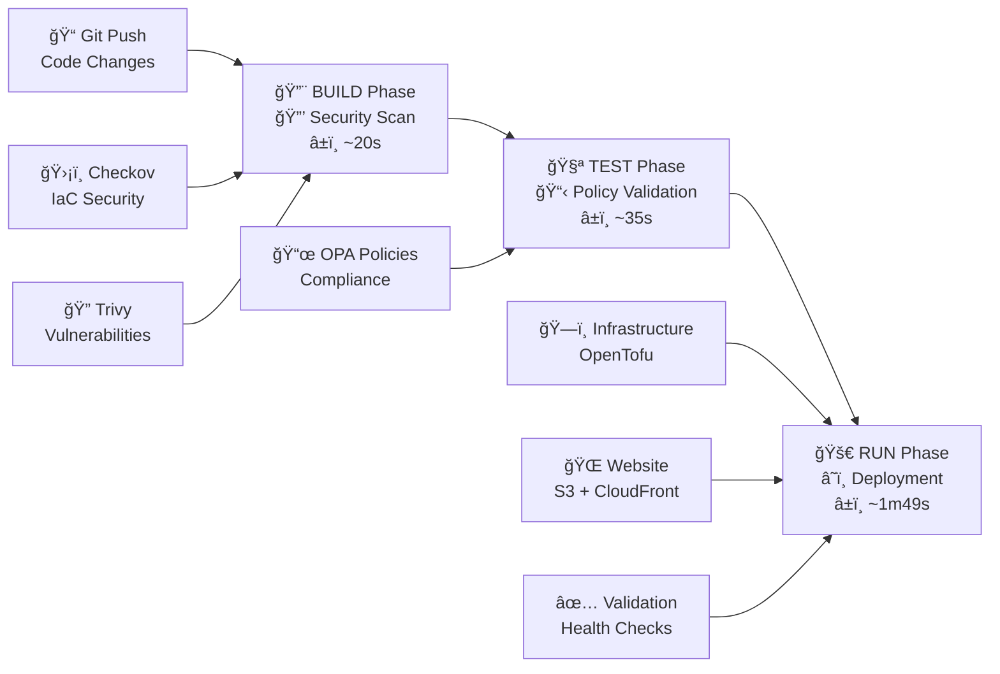

# AWS Static Website Infrastructure

Enterprise-grade AWS static website infrastructure using OpenTofu with multi-account architecture. Implements secure, scalable static website deployment with CloudFront CDN, S3 storage, WAF protection, and comprehensive monitoring.

## 🔄 Pipeline Status

[](https://github.com/<your-org>/static-site/actions/workflows/build.yml)
[](https://github.com/<your-org>/static-site/actions/workflows/test.yml)
[](https://github.com/<your-org>/static-site/actions/workflows/run.yml)
[](https://opensource.org/licenses/MIT)
[](https://opentofu.org)
[](https://aws.amazon.com)

## 🎯 Features

- **🏗️ Multi-Account Architecture**: Secure AWS account isolation per environment
- **🔐 Zero-Trust Security**: OIDC authentication with no stored credentials
- **💰 Cost Optimized**: Environment-specific configurations (Dev: $1-5, Prod: $25-50/month)
- **🚀 CI/CD Pipeline**: Automated BUILD → TEST → RUN workflow (~3 minutes)
- **🛡️ Security Scanning**: Integrated Checkov, Trivy, and OPA policy validation
- **📊 Comprehensive Monitoring**: CloudWatch dashboards, alerts, and budget controls
- **🌍 Global CDN Ready**: CloudFront with WAF protection for production
- **♻️ Infrastructure as Code**: OpenTofu/Terraform with reusable modules

## 📋 Prerequisites

- **AWS Account(s)**: Multi-account setup recommended (dev/staging/prod)
- **GitHub Repository**: For CI/CD pipeline integration
- **Local Tools**:
  - [OpenTofu](https://opentofu.org) >= 1.6.0 or [Terraform](https://terraform.io) >= 1.0
  - [AWS CLI](https://aws.amazon.com/cli/) configured
  - [GitHub CLI](https://cli.github.com/) for workflow management
  - [yamllint](https://yamllint.readthedocs.io/) for YAML validation
  - [Checkov](https://www.checkov.io/) for security scanning (optional)

## 🚀 Quick Start

Get your static website deployed in under 10 minutes:

### 1. Setup Repository
```bash
# Fork the repository on GitHub, then clone your fork
git clone https://github.com/<your-username>/static-site.git
cd static-site
```

### 2. Configure AWS Credentials
```bash
# Configure your AWS profiles for each environment
aws configure --profile dev-deploy
aws configure --profile staging-deploy  # Optional
aws configure --profile prod-deploy     # Optional
```

### 3. Deploy to Development
```bash
# Trigger development deployment
gh workflow run run.yml --field environment=dev --field deploy_infrastructure=true --field deploy_website=true

# Monitor deployment progress
gh run list --limit 5
```

### 4. Bootstrap Additional Environments (Optional)
```bash
# Bootstrap staging environment
gh workflow run bootstrap-distributed-backend.yml \
  --field project_name=static-site \
  --field environment=staging \
  --field confirm_bootstrap=BOOTSTRAP-DISTRIBUTED

# Bootstrap production environment
gh workflow run bootstrap-distributed-backend.yml \
  --field project_name=static-site \
  --field environment=prod \
  --field confirm_bootstrap=BOOTSTRAP-DISTRIBUTED
```

## 🏗️ Architecture Overview

### Multi-Account Architecture

```mermaid
graph TB
    subgraph Management["🏢 Management Account<br/><MGMT-ACCOUNT-ID>"]
        OIDC["🔐 OIDC Provider<br/>GitHub Actions"]
        Bootstrap["⚙️ Bootstrap Role<br/>Infrastructure Creation"]
        Central["🌐 Central Role<br/>Cross-Account Access"]
    end

    subgraph Dev["🧪 Dev Account<br/><DEV-ACCOUNT-ID>"]
        DevRole["🔧 Dev Role<br/>Deployment + Bootstrap"]
        DevInfra["☁️ Dev Infrastructure<br/>✅ OPERATIONAL"]
    end

    subgraph Staging["🚀 Staging Account<br/><STAGING-ACCOUNT-ID>"]
        StagingRole["🔧 Staging Role<br/>Deployment + Bootstrap"]
        StagingInfra["☁️ Staging Infrastructure<br/>⏳ Ready"]
    end

    subgraph Prod["🏭 Production Account<br/><PROD-ACCOUNT-ID>"]
        ProdRole["🔧 Prod Role<br/>Deployment + Bootstrap"]
        ProdInfra["☁️ Production Infrastructure<br/>⏳ Ready"]
    end

    OIDC --> Central
    Central --> DevRole
    Central --> StagingRole
    Central --> ProdRole
    DevRole --> DevInfra
    StagingRole --> StagingInfra
    ProdRole --> ProdInfra
```


### CI/CD Pipeline


### Infrastructure Components

```mermaid
graph TD
    subgraph GitHub["🙠GitHub Actions"]
        GHA["🔄 Workflows<br/>BUILD → TEST → RUN"]
    end

    subgraph AWS["â˜ï¸ AWS Infrastructure"]
        subgraph Storage["💾 Storage Layer"]
            S3["🪣 S3 Bucket<br/>Static Website<br/>KMS Encrypted"]
            KMS["🔠KMS Key<br/>Encryption"]
        end

        subgraph CDN["🌠Content Delivery"]
            CF["âš¡ CloudFront<br/>Global CDN<br/>Origin Access Control"]
            WAF["ğŸ›¡ï¸ WAF v2<br/>OWASP Top 10<br/>Rate Limiting"]
        end

        subgraph Monitoring["📊 Observability"]
            CW["📈 CloudWatch<br/>Logs & Metrics"]
            SNS["📧 SNS<br/>Alerts"]
            Budget["💰 Budget<br/>Cost Control"]
        end
    end

    GHA --> S3
    KMS --> S3
    S3 --> CF
    WAF --> CF
    S3 --> CW
    CF --> CW
    CW --> SNS
    CW --> Budget
```


## 🔒 Security Architecture

- **Multi-Account Isolation**: Separate AWS accounts for each environment
- **OIDC Authentication**: No stored AWS credentials in GitHub
- **3-Tier Security Model**: Bootstrap → Central → Environment roles ([detailed architecture](docs/permissions-architecture.md))
- **Encryption**: KMS encryption for all data at rest
- **Policy Validation**: OPA/Rego policies with 100% compliance
- **Security Scanning**: Checkov + Trivy with fail-fast on critical issues
- **WAF Protection**: OWASP Top 10 protection and rate limiting

## 📊 Deployment Status

### Pipeline Health ✅ FULLY OPERATIONAL
- **BUILD**: ✅ Security scanning and artifact creation (~20s)
- **TEST**: ✅ OPA policy validation with enhanced reporting (~35s)
- **RUN**: ✅ Complete deployment workflow (~1m49s)
- **BOOTSTRAP**: ✅ Distributed backend creation working

### Account Status
- **Management (<MGMT-ACCOUNT-ID>)**: OIDC provider ✅, Bootstrap Role ✅
- **Dev (<DEV-ACCOUNT-ID>)**: **FULLY DEPLOYED** ✅
- **Staging (<STAGING-ACCOUNT-ID>)**: Ready for bootstrap ⏳
- **Prod (<PROD-ACCOUNT-ID>)**: Ready for bootstrap ⏳

## 💰 Cost Optimization

### Environment-Specific Profiles
- **Development**: ~$1-5/month (S3-only, cost optimized)
- **Staging**: ~$15-25/month (CloudFront + S3, moderate features)
- **Production**: ~$25-50/month (Full stack, all features enabled)

### Cost Controls
- Conditional CloudFront deployment based on environment
- Environment-specific budget limits and alerts
- Cross-region replication only where needed
- Free tier optimization for development

## 📚 Documentation

- **[Quick Start Guide](docs/quickstart.md)** - Get started in 10 minutes
- **[Architecture Guide](docs/architecture.md)** - Detailed technical architecture
- **[3-Tier Permissions Architecture](docs/permissions-architecture.md)** - IAM roles and security model
- **[Security Policy](SECURITY.md)** - Security practices and vulnerability reporting
- **[Deployment Guide](docs/deployment.md)** - Step-by-step deployment procedures
- **[Troubleshooting](docs/troubleshooting.md)** - Common issues and solutions
- **[Reference Guide](docs/reference.md)** - Command reference and specifications

## 🛠️ Development

For detailed development instructions, see our [Development Guide](.github/DEVELOPMENT.md).

### Quick Development Commands
```bash
# Validate changes
tofu validate && tofu fmt -check
yamllint -d relaxed .github/workflows/*.yml

# Run security scans
checkov -d terraform/
trivy config terraform/

# Deploy to dev
gh workflow run run.yml --field environment=dev --field deploy_infrastructure=true
```

## 🤝 Contributing

We welcome contributions! Please see our [Contributing Guide](CONTRIBUTING.md) for details on:
- Code of conduct
- Development setup
- Contribution guidelines
- Pull request process

For security vulnerabilities, please read our [Security Policy](SECURITY.md).

## 📋 Project Roadmap

See [ROADMAP.md](ROADMAP.md) for detailed project plans including:
- ✅ Immediate deployment steps
- 📈 Short-term enhancements
- 🚀 Long-term strategic vision

See [ROADMAP.md](ROADMAP.md) for the complete project roadmap and planned enhancements.

## 📞 Support

- **Issues**: [GitHub Issues](https://github.com/<your-org>/static-site/issues)
- **Discussions**: [GitHub Discussions](https://github.com/<your-org>/static-site/discussions)
- **Security**: See [SECURITY.md](SECURITY.md) for vulnerability reporting
- **Documentation**: [docs/](docs/) directory for detailed guides

## 📄 License

This project is licensed under the MIT License - see the [LICENSE](LICENSE) file for details.

---

## 🌟 Why Use This Project?

- **Production Ready**: Battle-tested infrastructure patterns
- **Cost Effective**: Start at $1/month, scale as needed
- **Security First**: Enterprise-grade security controls built-in
- **Fully Automated**: Complete CI/CD pipeline with GitOps workflow
- **Well Documented**: Comprehensive guides and examples
- **Open Source**: MIT licensed, community-driven

---

**Built with** ❤️ **by the open source community**
