# AWS Static Website Infrastructure

[](https://github.com/Celtikill/static-site/actions/workflows/build.yml)
[](https://github.com/Celtikill/static-site/actions/workflows/test.yml)
[](https://github.com/Celtikill/static-site/actions/workflows/run.yml)

Enterprise-grade AWS static website infrastructure using OpenTofu with multi-account architecture, direct OIDC authentication, and comprehensive security controls.

> **Note**: Pipeline status relies on provisioned resources. I regularly destroy resources, so you may see failing status.

## 🎯 Choose Your Path

<table>
<tr>
<td width="33%">

### 🆕 New to AWS?
**Start here if you're deploying for the first time**

**Time**: 30-60 minutes
**Path**: [Complete Deployment Guide](DEPLOYMENT.md)

You'll get:
- Step-by-step instructions
- Prerequisites explained
- Bootstrap walkthrough
- Troubleshooting help

[Get Started →](DEPLOYMENT.md)

</td>
<td width="33%">

### ⚡ Experienced Operator?
**Start here if you know AWS and want to deploy quickly**

**Time**: 5 minutes
**Path**: [Quick Start](QUICK-START.md)

You'll get:
- Single command path
- Minimal explanation
- Fast deployment to dev
- Links to advanced docs

[Quick Start →](QUICK-START.md)

</td>
<td width="33%">

### 🔧 Want to Contribute?
**Start here if you're developing or contributing code**

**Time**: 15 minutes
**Path**: [Contributing Guide](CONTRIBUTING.md)

You'll get:
- Development workflow
- PR guidelines
- Coding standards
- Testing instructions

[Contribute →](CONTRIBUTING.md)

</td>
</tr>
</table>

## 🎯 Key Features

- **🏗️ Multi-Account Architecture** - Secure AWS account isolation per environment
- **🔐 Direct OIDC Authentication** - No stored credentials, single-step authentication
- **💰 Cost Optimized** - Dev: $1-5, Prod: $25-50/month
- **🚀 Automated CI/CD** - BUILD → TEST → RUN pipeline (~3 minutes)
- **🛡️ Security Scanning** - Checkov, Trivy, and OPA policy validation
- **📊 Monitoring** - CloudWatch dashboards, alerts, and budget controls
- **♻️ Infrastructure as Code** - OpenTofu/Terraform with reusable modules

## 📋 Prerequisites

- AWS account(s) with admin access
- GitHub repository access
- OpenTofu/Terraform >= 1.6.0
- AWS CLI configured
- GitHub CLI (`gh`)

## 🚀 Quick Start

Deploy to development in 5 minutes:

```bash
# 1. Clone repository
git clone https://github.com/celtikill/static-site.git && cd static-site

# 2. Bootstrap infrastructure
cd scripts/bootstrap && ./bootstrap-foundation.sh

# 3. Configure GitHub
./configure-github.sh

# 4. Deploy
cd ../.. && gh workflow run run.yml \
  --field environment=dev \
  --field deploy_infrastructure=true \
  --field deploy_website=true

# 5. Monitor
gh run watch
```

For detailed instructions, see [QUICK-START.md](QUICK-START.md) or [DEPLOYMENT.md](DEPLOYMENT.md).

## 🏗️ Architecture

### Multi-Account Architecture (Direct OIDC)

```mermaid
%%{init: {'theme':'default', 'themeVariables': {'fontSize':'16px'}}}%%
graph TB
    accTitle: Multi-Account AWS Architecture with Direct OIDC
    accDescr: Multi-account AWS architecture implementing direct OIDC authentication from GitHub Actions to environment-specific roles

    subgraph GitHub["🐙 GitHub Actions"]
        GH["GitHub Workflows<br/>Direct OIDC"]
    end

    subgraph Management["🏢 Management<br/>MANAGEMENT_ACCOUNT_ID"]
        MgmtOIDC["🔐 OIDC Provider<br/>(Not used for deployments)"]
        MgmtState["📦 Central State Bucket<br/>Foundation Resources Only"]
    end

    subgraph Dev["🧪 Dev Account<br/>DEVELOPMENT_ACCOUNT_ID"]
        DevOIDC["🔐 OIDC Provider"]
        DevRole["🔧 GitHubActions Role<br/>Direct OIDC Trust"]
        DevInfra["☁️ Dev Infrastructure<br/>✅ OPERATIONAL"]
    end

    subgraph Staging["🚀 Staging Account<br/>STAGING_ACCOUNT_ID"]
        StagingOIDC["🔐 OIDC Provider"]
        StagingRole["🔧 GitHubActions Role<br/>Direct OIDC Trust"]
        StagingInfra["☁️ Staging Infrastructure<br/>✅ READY"]
    end

    subgraph Prod["🏭 Production Account<br/>PRODUCTION_ACCOUNT_ID"]
        ProdOIDC["🔐 OIDC Provider"]
        ProdRole["🔧 GitHubActions Role<br/>Direct OIDC Trust"]
        ProdInfra["☁️ Production Infrastructure<br/>✅ READY"]
    end

    GH -->|"Direct OIDC<br/>AssumeRoleWithWebIdentity"| DevRole
    GH -->|"Direct OIDC<br/>AssumeRoleWithWebIdentity"| StagingRole
    GH -->|"Direct OIDC<br/>AssumeRoleWithWebIdentity"| ProdRole
    DevRole --> DevInfra
    StagingRole --> StagingInfra
    ProdRole --> ProdInfra

    linkStyle 0,1,2,3,4,5 stroke:#333333,stroke-width:2px
```



**Key Features**:
- Workflows authenticate directly to environment roles via OIDC
- No centralized role needed (single-step authentication)
- Per-account isolation with dedicated OIDC providers
- Repository-scoped trust policies

For detailed architecture, see [docs/architecture.md](docs/architecture.md).

## 🔒 Security

- **Multi-Account Isolation** - Separate AWS accounts per environment
- **Direct OIDC Authentication** - No stored credentials, `AssumeRoleWithWebIdentity`
- **Encryption** - KMS encryption for all data at rest
- **Policy Validation** - OPA/Rego policies with 100% compliance
- **Security Scanning** - Checkov + Trivy with fail-fast on critical issues
- **WAF Protection** - OWASP Top 10 protection and rate limiting

**Authentication Flow**:
```
GitHub Actions → OIDC Provider → Environment Role (Direct)
```

**Benefits**: Simpler, more secure, easier to audit, per-account isolation.

See [docs/iam-deep-dive.md](docs/iam-deep-dive.md) for complete security architecture.

## 💰 Cost Optimization

| Environment | Monthly Cost | Features |
|-------------|--------------|----------|
| Development | $1-5 | S3-only, cost optimized |
| Staging | $15-25 | CloudFront + S3, moderate features |
| Production | $25-50 | Full stack, all features enabled |

**Cost Controls**: Conditional CloudFront, environment-specific budgets, free tier optimization.

## 📚 Documentation

### Getting Started
- **[Quick Start](QUICK-START.md)** - 5-minute deployment
- **[Deployment Guide](DEPLOYMENT.md)** - Complete instructions
- **[Troubleshooting](docs/troubleshooting.md)** - Common issues

### Operations
- **[Multi-Account Deployment](MULTI-ACCOUNT-DEPLOYMENT.md)** - Staging/production
- **[Release Process](RELEASE-PROCESS.md)** - Production releases
- **[Monitoring](docs/monitoring.md)** - Observability
- **[Disaster Recovery](docs/disaster-recovery.md)** - DR procedures

### Architecture & Design
- **[Architecture Overview](docs/architecture.md)** - Technical design
- **[IAM Deep Dive](docs/iam-deep-dive.md)** - Security model
- **[ADRs](docs/architecture/)** - Architecture Decision Records
- **[Workflows](docs/workflows.md)** - CI/CD pipeline details

**Complete Documentation**: [docs/README.md](docs/README.md)

## 🤝 Contributing

We welcome contributions! See [CONTRIBUTING.md](CONTRIBUTING.md) for:

- Development workflow and branch strategy
- PR guidelines (Conventional Commits required)
- Testing and validation
- Code review process

**Quick Guide**:
1. Fork and clone
2. Create feature branch: `git checkout -b feature/your-feature`
3. Make changes and test
4. Commit: `git commit -m "feat: your feature"` (Conventional Commits format)
5. Create PR with Conventional Commits title
6. Pass CI checks and get approval

**PR Title Format** (required):
```
<type>(<scope>): <description>

Examples:
- feat(s3): add bucket lifecycle policies
- fix(iam): correct role trust policy
- docs: update deployment guide
```

**Security vulnerabilities**: See [SECURITY.md](SECURITY.md)

## 📋 Project Status

### Recently Completed
- ✅ Direct OIDC authentication (AWS 2025 best practice)
- ✅ Multi-account architecture
- ✅ Automated BUILD-TEST-RUN pipeline
- ✅ Comprehensive documentation

### Coming Soon
- 📈 Multi-account deployment to staging/production
- 📈 Pre-commit hook configuration
- 📈 Advanced deployment strategies

See [docs/ROADMAP.md](docs/ROADMAP.md) for complete roadmap.

## 📞 Support

- **Issues**: [GitHub Issues](https://github.com/Celtikill/static-site/issues)
- **Documentation**: [docs/](docs/) directory
- **Security**: [SECURITY.md](SECURITY.md)

## 📄 License

MIT License - see [LICENSE](LICENSE) file.

---

## 🌟 Why This Project?

- ✅ **Production Ready** - Battle-tested infrastructure patterns
- ✅ **Cost Effective** - Start at $1/month, scale as needed
- ✅ **Security First** - Enterprise-grade security controls
- ✅ **Fully Automated** - Complete CI/CD pipeline
- ✅ **Well Documented** - Comprehensive guides
- ✅ **Open Source** - MIT licensed, community-driven

---

> **Security Warning**: This is a demonstration project. CloudFront/WAF and TLS (HTTPS) are feature-flagged and typically disabled for cost. Do not use for sensitive data without enabling full security features. Review and understand all code before production use.

**Built with** ❤️ **, may it be of benefit.**
