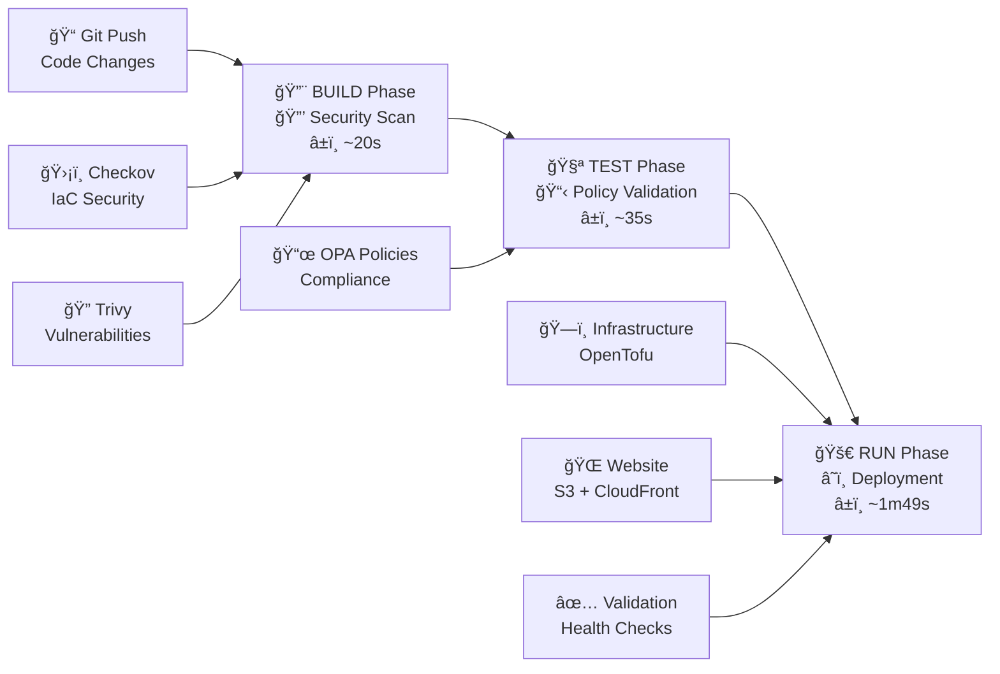

# AWS Static Website Infrastructure

## 🔄 Pipeline Status

[](https://github.com/Celtikill/static-site/actions/workflows/build.yml)
[](https://github.com/Celtikill/static-site/actions/workflows/test.yml)
[](https://github.com/Celtikill/static-site/actions/workflows/run.yml)

> Note that pipeline status (specifically test and run workflows) relies on provisioned resources.  I regularly (and thoroughly) destroy resources, so you may see failing status here.

This is my take on an enterprise-grade AWS static website infrastructure using OpenTofu with multi-account architecture. My goal here is to implement secure, scalable static website deployment to demonstrate a few things I've learned over my years in the industry.

## Lessons Reflected

If you pay any attention to my commit history, you'll see this thing evolved quite a bit over the course of development. I set out to demonstrate [AWS Well-Architected](https://aws.amazon.com/architecture/well-architected/) patterns, but due to cost and customer demand, focused here:

1. **BUILD-TEST-RUN pipeline fidelity.**  In my mind, passing builds in that order yields cleaner, faster delivery.
2. **Multi-account, multi-environment architecture.**  Limit the blast radius of compromise by segregating environments at the highest order (in cloud services, at the account layer).
3. **Cascading access control.**  Enable automation even as you segregate, by carefully assigning tiered roles.
4. **Generally sound security practice** (see notes below)

> :warning: Security Warning :warning:
> Do not use this blindly for anything you care about.  Do not host sensitive data with what I provide, or use this in production, without careful (and very simple) modification.

**It's wise to not run anything you don't personally review and understand.**  Of special note here:

- This is a demonstration pipeline, deploying demonstration infrastructure.
- CloudFront and WAF (key security AWS Well Architected features) are managed with feature flags I generally leave off.
- Since I'm not using CloudFront, TLS encryption (https) is not easily available, and not deployed.
- Yes, I realize this is a security concern.  This is acceptable to me. :cool:

## On the role of our new AI overlords :alien:

I have been for some time opposed to the AI industry.  It is driven by selfish motives, and largely aims to replace a workforce barely holding on to some semblance of quality life, while simultaneously stealing the original works of that same workforce to feed its hunger for power and control.

>And, I cannot deny the power and possibility of (specifically) machine learning.  It needs to be used responsibly, and it should never be the property of anyone in specific.

In efforts to explore this domain,  and help my employer (a nonprofit) do more with less, I used this project as a testing ground for agentic AI.  Much of it is "vibe coded", using a strictly-controlled group of personas tailored to the needs of my project.

> All of it is thoroughly reviewed and tested (as you will see in your own reviews :thinking:)

You will see in my commit history the successes and (many) failures of this system.

For those interested in these lessons, [email me](mailto:celtikill@celtikill.io).  It's beyond the scope of this project to discuss these lessons, my plans for ML/AI, or how it (not the companies trying to sell it) could be of use or harm in your work.

## 🎯 Features

- **🏗️ Multi-Account Architecture**: Secure AWS account isolation per environment
- **🔐 Zero-Trust Security**: OIDC authentication with no stored credentials
- **💰 Cost Optimized**: Environment-specific configurations (Dev: $1-5, Prod: $25-50/month)
- **🚀 CI/CD Pipeline**: Automated BUILD → TEST → RUN workflow (~3 minutes)
- **🛡️ Security Scanning**: Integrated Checkov, Trivy, and OPA policy validation
- **📊 Comprehensive Monitoring**: CloudWatch dashboards, alerts, and budget controls
- **🌍 Global CDN Ready**: CloudFront with WAF protection for production
- **♻️ Infrastructure as Code**: OpenTofu/Terraform with reusable modules

## 📋 Prerequisites

- **AWS Account(s)**: Multi-account setup recommended (dev/staging/prod)
- **GitHub Repository**: For CI/CD pipeline integration
- **Local Tools**:
  - [OpenTofu](https://opentofu.org) >= 1.6.0 or [Terraform](https://terraform.io) >= 1.0
  - [AWS CLI](https://aws.amazon.com/cli/) configured
  - [GitHub CLI](https://cli.github.com/) for workflow management
  - [yamllint](https://yamllint.readthedocs.io/) for YAML validation
  - [Checkov](https://www.checkov.io/) for security scanning (optional)

## 🚀 Quick Start

Choose your deployment path:

| Experience Level | Time | Guide |
|-----------------|------|-------|
| **Experienced Users** | 5 min | [Quick Start Commands](#quick-commands) |
| **Standard Setup** | 30 min | [Full Deployment Guide](DEPLOYMENT.md) |
| **First-Time Users** | 1 hour | [Complete Step-by-Step](DEPLOYMENT.md#standard-setup-30-minutes) |

### Quick Commands

```bash
# Deploy to development
gh workflow run run.yml --field environment=dev \
  --field deploy_infrastructure=true --field deploy_website=true

# Monitor deployment
gh run watch
```

**For detailed instructions**, see the [Deployment Guide](DEPLOYMENT.md).

## 🏗️ Architecture Overview

### Multi-Account Architecture

```mermaid
graph TB
    subgraph Management["🏢 Management Account<br/>MANAGEMENT_ACCOUNT_ID"]
        OIDC["🔐 OIDC Provider<br/>GitHub Actions"]
        Bootstrap["⚙️ Bootstrap Role<br/>Infrastructure Creation"]
        Central["🌐 Central Role<br/>Cross-Account Access"]
    end

    subgraph Dev["🧪 Dev Account<br/>DEVELOPMENT_ACCOUNT_ID"]
        DevRole["🔧 Dev Role<br/>Deployment + Bootstrap"]
        DevInfra["☁️ Dev Infrastructure<br/>✅ OPERATIONAL"]
    end

    subgraph Staging["🚀 Staging Account<br/>STAGING_ACCOUNT_ID"]
        StagingRole["🔧 Staging Role<br/>Deployment + Bootstrap"]
        StagingInfra["☁️ Staging Infrastructure<br/>⏳ Ready"]
    end

    subgraph Prod["🏭 Production Account<br/>PRODUCTION_ACCOUNT_ID"]
        ProdRole["🔧 Prod Role<br/>Deployment + Bootstrap"]
        ProdInfra["☁️ Production Infrastructure<br/>⏳ Ready"]
    end

    OIDC --> Central
    Central --> DevRole
    Central --> StagingRole
    Central --> ProdRole
    DevRole --> DevInfra
    StagingRole --> StagingInfra
    ProdRole --> ProdInfra
```


### CI/CD Pipeline


### Infrastructure Components

```mermaid
graph TD
    subgraph GitHub["🙠GitHub Actions"]
        GHA["🔄 Workflows<br/>BUILD → TEST → RUN"]
    end

    subgraph AWS["â˜ï¸ AWS Infrastructure"]
        subgraph Storage["💾 Storage Layer"]
            S3["🪣 S3 Bucket<br/>Static Website<br/>KMS Encrypted"]
            KMS["🔠KMS Key<br/>Encryption"]
        end

        subgraph CDN["🌠Content Delivery"]
            CF["âš¡ CloudFront<br/>Global CDN<br/>Origin Access Control"]
            WAF["ğŸ›¡ï¸ WAF v2<br/>OWASP Top 10<br/>Rate Limiting"]
        end

        subgraph Monitoring["📊 Observability"]
            CW["📈 CloudWatch<br/>Logs & Metrics"]
            SNS["📧 SNS<br/>Alerts"]
            Budget["💰 Budget<br/>Cost Control"]
        end
    end

    GHA --> S3
    KMS --> S3
    S3 --> CF
    WAF --> CF
    S3 --> CW
    CF --> CW
    CW --> SNS
    CW --> Budget
```


## 🔒 Security Architecture

- **Multi-Account Isolation**: Separate AWS accounts for each environment
- **OIDC Authentication**: No stored AWS credentials in GitHub
- **3-Tier Security Model**: Bootstrap → Central → Environment roles ([detailed architecture](docs/permissions-architecture.md))
- **Encryption**: KMS encryption for all data at rest
- **Policy Validation**: OPA/Rego policies with 100% compliance
- **Security Scanning**: Checkov + Trivy with fail-fast on critical issues
- **WAF Protection**: OWASP Top 10 protection and rate limiting

## 📊 Deployment Status

### Pipeline Health ✅ FULLY OPERATIONAL
- **BUILD**: ✅ Security scanning and artifact creation (~20s)
- **TEST**: ✅ OPA policy validation with enhanced reporting (~35s)
- **RUN**: ✅ Complete deployment workflow (~1m49s)
- **BOOTSTRAP**: ✅ Distributed backend creation working

### Account Status
- **Management (MANAGEMENT_ACCOUNT_ID)**: OIDC provider ✅, Bootstrap Role ✅
- **Dev (DEVELOPMENT_ACCOUNT_ID)**: **FULLY DEPLOYED** ✅
- **Staging (STAGING_ACCOUNT_ID)**: Ready for bootstrap ⏳
- **Prod (PRODUCTION_ACCOUNT_ID)**: Ready for bootstrap ⏳

## 💰 Cost Optimization

### Environment-Specific Profiles
- **Development**: ~$1-5/month (S3-only, cost optimized)
- **Staging**: ~$15-25/month (CloudFront + S3, moderate features)
- **Production**: ~$25-50/month (Full stack, all features enabled)

### Cost Controls
- Conditional CloudFront deployment based on environment
- Environment-specific budget limits and alerts
- Cross-region replication only where needed
- Free tier optimization for development

## 📚 Documentation

### Getting Started
- **[Deployment Guide](DEPLOYMENT.md)** ⭐ - Complete deployment instructions (Quick Start → Advanced)
- **[Architecture Overview](docs/architecture.md)** ⭐⭐ - Technical architecture and design
- **[Security Policy](SECURITY.md)** ⭐ - Security practices and vulnerability reporting

### Reference & Operations
- **[Deployment Reference](docs/deployment-reference.md)** ⭐⭐ - Commands, troubleshooting, operations
- **[Permissions Architecture](docs/permissions-architecture.md)** ⭐⭐⭐ - IAM deep-dive and security model
- **[Troubleshooting Guide](docs/troubleshooting.md)** ⭐ - Common issues and solutions
- **[Command Reference](docs/reference.md)** ⭐ - Quick command lookup

### Additional Resources
- **[Documentation Index](docs/README.md)** - Complete documentation map
- **[Contributing Guide](docs/CONTRIBUTING.md)** - Development guidelines
- **[Project Roadmap](docs/ROADMAP.md)** - Future plans and enhancements

**Difficulty Key**: ⭐ Basic | ⭐⭐ Intermediate | ⭐⭐⭐ Advanced

## 🛠️ Development

For detailed development instructions, see our [Development Guide](.github/DEVELOPMENT.md).

### Quick Development Commands
```bash
# Validate changes
tofu validate && tofu fmt -check
yamllint -d relaxed .github/workflows/*.yml

# Run security scans
checkov -d terraform/
trivy config terraform/

# Deploy to dev
gh workflow run run.yml --field environment=dev --field deploy_infrastructure=true
```

## 🤝 Contributing

We welcome contributions! Please see our [Contributing Guide](CONTRIBUTING.md) for details on:
- Code of conduct
- Development setup
- Contribution guidelines
- Pull request process

For security vulnerabilities, please read our [Security Policy](SECURITY.md).

## 📋 Project Roadmap

See [ROADMAP.md](ROADMAP.md) for detailed project plans including:
- ✅ Immediate deployment steps
- 📈 Short-term enhancements
- 🚀 Long-term strategic vision

## 📞 Support

- **Issues**: [GitHub Issues](https://github.com/Celtikill/static-site/issues)
- **Discussions**: [GitHub Discussions](https://github.com/Celtikill/static-site/discussions)
- **Security**: See [SECURITY.md](SECURITY.md) for vulnerability reporting
- **Documentation**: [docs/](docs/) directory for detailed guides

## 📄 License

This project is licensed under the MIT License - see the [LICENSE](LICENSE) file for details.

---

## 🌟 Why Use This Project?

- **Production Ready**: Battle-tested infrastructure patterns
- **Cost Effective**: Start at $1/month, scale as needed
- **Security First**: Enterprise-grade security controls built-in
- **Fully Automated**: Complete CI/CD pipeline with GitOps workflow
- **Well Documented**: Comprehensive guides and examples
- **Open Source**: MIT licensed, community-driven

---

**Built with** ❤️ **, may it be of benefit. **
