# Security Policy

## Reporting Security Vulnerabilities

We take the security of our AWS static website infrastructure seriously. If you believe you have found a security vulnerability, please report it to us as described below.

### How to Report a Security Vulnerability

**Please do NOT report security vulnerabilities through public GitHub issues.**

Instead, please report them via email to: **security@[your-domain].com**

Include the following information in your report:
- Type of issue (e.g., buffer overflow, SQL injection, cross-site scripting, etc.)
- Full paths of source file(s) related to the manifestation of the issue
- The location of the affected source code (tag/branch/commit or direct URL)
- Any special configuration required to reproduce the issue
- Step-by-step instructions to reproduce the issue
- Proof-of-concept or exploit code (if possible)
- Impact of the issue, including how an attacker might exploit the issue

This information will help us triage your report more quickly.

### Response Timeline

| Timeline | Action |
|----------|--------|
| **Within 48 hours** | Initial response acknowledging receipt |
| **Within 5 business days** | Confirmation of vulnerability and severity assessment |
| **Within 30 days** | Security fix development and testing |
| **Within 90 days** | Public disclosure (if applicable) |

### Supported Versions

We actively maintain security updates for the following versions:

| Version | Supported | Environment |
|---------|-----------|-------------|
| Current main branch | ✅ | All environments |
| Dev deployment | ✅ | Development only |
| Staging deployment | ⏳ | Ready for deployment |
| Production deployment | ⏳ | Ready for deployment |

### Security Architecture

Our infrastructure implements multiple layers of security:

#### Infrastructure Security

```mermaid
graph TD
    A["🔐 GitHub OIDC<br/>No Stored Credentials"] --> B["🌐 Central Role<br/>Cross-Account Access"]
    B --> C["🔧 Environment Roles<br/>Least Privilege"]
    C --> D["☁️ AWS Resources<br/>Protected Infrastructure"]

    E["🏢 Multi-Account Isolation<br/>Blast Radius Containment"] --> D
    F["🔐 KMS Encryption<br/>Data at Rest"] --> D
    G["🛡️ WAF Protection<br/>Application Security"] --> D
    H["📊 CloudWatch Monitoring<br/>Real-time Visibility"] --> D

    classDef authStyle fill:#e8f5e8,stroke:#2e7d32,stroke-width:2px
    classDef securityStyle fill:#ffebee,stroke:#c62828,stroke-width:2px
    classDef resourceStyle fill:#e3f2fd,stroke:#1976d2,stroke-width:2px

    class A,B,C authStyle
    class E,F,G,H securityStyle
    class D resourceStyle
```

#### Security Controls

**Authentication & Authorization**
- ✅ **OIDC Authentication**: No stored AWS credentials in GitHub
- ✅ **3-Tier Role Model**: Bootstrap → Central → Environment roles
- ✅ **Multi-Account Isolation**: Separate AWS accounts per environment
- ✅ **Least Privilege Access**: Environment-specific IAM policies

**Data Protection**
- ✅ **Encryption at Rest**: KMS encryption for all S3 data
- ✅ **Encryption in Transit**: HTTPS/TLS for all communications
- ✅ **Access Control**: Origin Access Control (OAC) prevents direct S3 access
- ✅ **Cross-Region Replication**: Encrypted replication to us-west-2

**Network Security**
- ✅ **WAF Protection**: OWASP Top 10 protection and rate limiting
- ✅ **CloudFront Security**: Security headers and origin protection
- ✅ **VPC Isolation**: Infrastructure deployed in isolated network segments

**Monitoring & Compliance**
- ✅ **CloudWatch Monitoring**: Comprehensive logging and alerting
- ✅ **Security Scanning**: Automated Checkov and Trivy scans
- ✅ **Policy Validation**: OPA/Rego policies with 100% compliance
- ✅ **Budget Controls**: Cost monitoring and automated alerts

### Security Scanning

Our CI/CD pipeline includes automated security scanning:

#### Static Analysis (BUILD Phase)
- **Checkov**: Infrastructure security scanning
- **Trivy**: Vulnerability and misconfiguration detection
- **Enforcement**: Blocks deployment on HIGH/CRITICAL findings

#### Policy Validation (TEST Phase)
- **OPA Policies**: 6 security deny rules + 5 compliance warn rules
- **Enhanced Reporting**: Detailed violation tables and debug output
- **Environment-Specific**: STRICT enforcement for production

#### Scan Results

```mermaid
graph LR
    A["🔍 Security Scan<br/>Checkov + Trivy"] --> B{"❓ Critical/High Issues?<br/>Risk Assessment"}
    B -->|"❌ Yes"| C["🚫 Block Deployment<br/>Security Gate"]
    B -->|"✅ No"| D["🟢 Allow Deployment<br/>Security Approved"]

    C --> E["🔧 Fix Issues<br/>Remediate Risks"]
    E --> A
    D --> F["🚀 Deploy Infrastructure<br/>Secure Release"]

    classDef scanStyle fill:#fff3e0,stroke:#f57c00,stroke-width:2px
    classDef blockStyle fill:#ffebee,stroke:#c62828,stroke-width:2px
    classDef allowStyle fill:#e8f5e8,stroke:#2e7d32,stroke-width:2px
    classDef fixStyle fill:#e3f2fd,stroke:#1976d2,stroke-width:2px

    class A scanStyle
    class B,C blockStyle
    class D,F allowStyle
    class E fixStyle
```

### Vulnerability Disclosure Policy

We follow a **90-day coordinated disclosure policy**:

1. **Report Received**: We acknowledge receipt within 48 hours
2. **Validation**: Confirm and assess severity within 5 business days
3. **Fix Development**: Work on remediation (timeframe varies by severity)
4. **Coordinated Disclosure**: Public disclosure after fix or 90 days maximum
5. **CVE Assignment**: Request CVE through GitHub Security Advisories if applicable

### Security Features by Environment

| Feature | Development | Staging | Production |
|---------|-------------|---------|------------|
| OIDC Authentication | ✅ | ✅ | ✅ |
| KMS Encryption | ✅ | ✅ | ✅ |
| WAF Protection | ⚠️ Limited | ✅ | ✅ |
| CloudFront CDN | 💰 Disabled | ✅ | ✅ |
| Cross-Region Replication | ⚠️ Limited | ✅ | ✅ |
| Enhanced Monitoring | ✅ | ✅ | ✅ |
| Policy Enforcement | INFORMATIONAL | WARNING | STRICT |

### Security Best Practices for Contributors

**Infrastructure Changes**
- Always run `tofu validate` and `tofu fmt -check` before committing
- Test security changes in development environment first
- Follow principle of least privilege for all IAM policies
- Document security implications in pull requests

**Workflow Changes**
- Validate workflows with `yamllint -d relaxed .github/workflows/*.yml`
- Never commit AWS credentials or secrets
- Use GitHub secrets for sensitive configuration
- Test workflow changes with manual triggers first

**Code Security**
- Review all infrastructure code for security implications
- Use data classification appropriate for environment
- Follow secure coding practices for any custom scripts
- Validate all external dependencies and versions

### Incident Response

In case of a security incident:

1. **Immediate**: Isolate affected systems if safe to do so
2. **Report**: Contact security team via email immediately
3. **Document**: Preserve logs and evidence where possible
4. **Coordinate**: Work with security team on response plan
5. **Recovery**: Follow guided remediation steps
6. **Review**: Participate in post-incident review process

### Security Contacts

- **Security Issues**: security@[your-domain].com
- **General Issues**: [GitHub Issues](https://github.com/Celtikill/static-site/issues)
- **Emergency**: For critical security issues requiring immediate attention

### Acknowledgments

We appreciate the security research community and will acknowledge researchers who responsibly disclose vulnerabilities to us. Contributions that improve our security posture may be eligible for recognition in our security acknowledgments.

---

**Last Updated**: 2025-09-22
**Next Review**: 2025-12-22