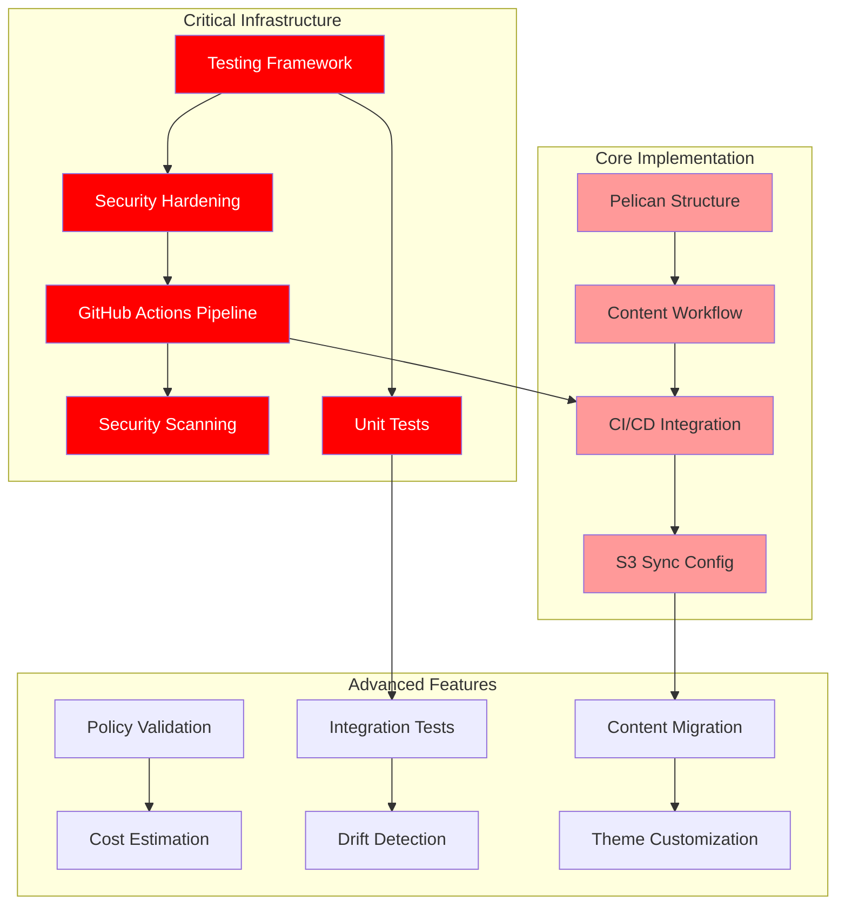

# AWS Static Website with Pelican - Implementation TODO List

## 🎯 Project Status: **Enterprise-Grade Implementation Phase** 
*Enhanced with production patterns from core-infra analysis*

### ⚠️ **CRITICAL DISCOVERY - REPOSITORY RESET STATE**

**Current Repository State Analysis:**
- ✅ **ARCHITECTURE.md**: Complete documentation exists (10KB)
- ✅ **TODO.md**: Comprehensive task list exists (11.9KB) 
- ✅ **LICENSE**: MIT license file exists (11.3KB)
- ❌ **All Terraform Infrastructure**: MISSING - terraform/ directory is empty
- ❌ **Static Website Content**: MISSING - no src/ directory
- ❌ **GitHub Actions Workflows**: MISSING - no .github/ directory
- ❌ **README.md**: MINIMAL - only 75 bytes, basic content

### ✅ Previously Completed (Now Missing)
- [x] **Architecture Design**: Complete AWS Well-Architected infrastructure with OpenTofu *(Documentation only)*
- [x] **Infrastructure Modules**: S3, CloudFront, WAF, IAM, and monitoring modules *(NEEDS RECREATION)*
- [x] **Security Implementation**: OWASP WAF rules, security headers, and access controls *(NEEDS RECREATION)*
- [x] **Cost Analysis**: Updated cost projections including Pelican workflow (~$30.18/month) *(In docs)*
- [x] **Core-Infra Analysis**: Comprehensive review of enterprise patterns and best practices *(In TODO)*

---

## 🚨 **CRITICAL PRIORITY** - Infrastructure Recreation

### Missing Infrastructure Components (Must Recreate)
- [ ] **CRITICAL DISCOVERY: All Terraform infrastructure is missing - repository has been reset to minimal state**
  - Repository contains only documentation files (ARCHITECTURE.md, TODO.md, LICENSE)
  - All OpenTofu modules, configurations, and content directories are missing
  - Immediate action required to recreate infrastructure foundation

- [ ] **Recreate complete OpenTofu infrastructure modules (S3, CloudFront, WAF, IAM, monitoring)**
  - Recreate all module directories and files
  - Restore complete AWS Well-Architected infrastructure
  - Follow enterprise patterns from core-infra analysis

- [ ] **Recreate terraform configuration files (main.tf, variables.tf, outputs.tf, backend.tf)**
  - Root-level OpenTofu configuration
  - Variable definitions with validation
  - Output specifications for deployment
  - Backend configuration with KMS encryption

- [ ] **Recreate src/ directory with static website content (index.html, 404.html)**
  - Professional AWS architecture demo website
  - Security-compliant HTML with performance optimization
  - Custom 404 error page

- [ ] **Recreate .github/workflows directory with GitHub Actions CI/CD pipelines**
  - Complete BUILD-TEST-RUN automation
  - Security scanning and validation
  - Deployment automation workflows

### Testing Framework & Security (Based on Core-Infra Patterns)
- [ ] **Implement bash-based testing framework from core-infra patterns**
  - Adopt `test-functions.sh` library with zero-dependency testing
  - Eliminates 12 security vulnerabilities from Go-based Terratest
  - Structured JSON/Markdown reporting with automated cleanup
  - Test all modules: S3, CloudFront, WAF, IAM, monitoring

- [ ] **Add KMS encryption to backend.tf and enhance security hardening**
  - Implement KMS encryption for OpenTofu state backend
  - Add comprehensive variable validation with detailed error messages
  - Follow core-infra security patterns for production readiness

- [ ] **Create GitHub Actions BUILD-TEST-RUN pipeline with 23-workflow architecture**
  - Implement sophisticated automation framework from core-infra
  - All actions pinned to commit SHAs for supply chain security
  - Manual triggers, artifact inheritance, comprehensive validation
  - Progressive deployment with approval gates

- [ ] **Add security scanning automation (tfsec, Checkov, Trivy) with SARIF reporting**
  - Integrate all three security scanners with GitHub Actions
  - Generate SARIF reports for security findings
  - Automated policy enforcement and compliance checking

- [ ] **Create unit tests for all modules using bash-based test-functions.sh library**
  - S3 module unit tests with bucket validation
  - CloudFront module tests with distribution validation
  - WAF module tests with rule validation
  - IAM module tests with policy validation
  - Monitoring module tests with dashboard validation

---

## 🔥 **HIGH PRIORITY** - Core Implementation

### Pelican Integration
- [ ] **Create Pelican project structure and configuration** 
  - Set up `pelicanconf.py` and `publishconf.py`
  - Configure content directories and URL structure
  - Define output settings for S3 compatibility

- [ ] **Set up Pelican content workflow and templates**
  - Create base theme customized for AWS architecture demo
  - Set up content templates for articles and pages
  - Configure navigation and site structure

- [ ] **Integrate Pelican build process with existing CI/CD pipeline**
  - Modify existing GitHub Actions to include Pelican build steps
  - Ensure compatibility with current OpenTofu infrastructure
  - Add build artifact management

- [ ] **Configure automated S3 sync and CloudFront invalidation for Pelican output**
  - Update deployment scripts for Pelican output directory
  - Optimize S3 sync commands for static assets
  - Configure selective CloudFront cache invalidation

---

## 📋 **MEDIUM PRIORITY** - Advanced Features

### Enhanced Automation & Compliance
- [ ] **Add policy validation using OPA/Conftest following core-infra patterns**
  - Implement policy-as-code validation
  - Add security and compliance policy rules
  - Integrate with GitHub Actions for automated enforcement

- [ ] **Implement cost estimation scripts using AWS pricing API**
  - Create cost analysis scripts following core-infra patterns
  - Add automated cost reporting and budget alerts
  - Implement cost optimization recommendations

- [ ] **Create integration tests with automated cleanup and resource management**
  - End-to-end testing with real AWS resources
  - Automated test environment provisioning and cleanup
  - Comprehensive validation of deployed infrastructure

- [ ] **Add drift detection capabilities with automated GitHub issue creation**
  - Scheduled drift detection following core-infra patterns
  - Automated GitHub issue creation for detected drift
  - Integration with monitoring and alerting systems

### Content & Customization
- [ ] **Migrate existing static content to Pelican Markdown format**
  - Convert current `src/index.html` to Markdown with frontmatter
  - Convert `src/404.html` to Pelican error page template
  - Preserve all existing styling and functionality

- [ ] **Set up Pelican theme customization for architectural demo content**
  - Create custom theme showcasing AWS architectural patterns
  - Implement responsive design with performance focus
  - Add interactive elements for architecture demonstrations

- [ ] **Add Pelican SEO and performance optimization plugins**
  - Install and configure SEO-focused plugins
  - Add sitemap generation and meta tag optimization
  - Implement image optimization and lazy loading

- [ ] **Implement content security scanning in Pelican build pipeline**
  - Add content validation and security scanning
  - Implement automated link checking and asset validation
  - Add content approval workflows for production

- [ ] **Create comprehensive documentation following core-infra standards**
  - Document complete development-to-production workflow
  - Create troubleshooting guide for common issues
  - Define rollback and recovery procedures

- [ ] **Set up local development environment with Pelican auto-reload**
  - Configure local development server with live reload
  - Set up development dependencies and environment
  - Create development configuration for rapid iteration

---

## 📦 **LOW PRIORITY** - Additional Features

### Final Infrastructure Components
- [ ] **Add Route 53 DNS configuration to complete infrastructure**
  - Implement Route 53 hosted zone configuration
  - Add health checks and failover routing
  - Complete domain name integration

- [ ] **Implement terraform-docs automation for module documentation**
  - Auto-generate module documentation
  - Integrate with GitHub Actions for automated updates
  - Follow core-infra documentation standards

- [ ] **Add health check scripts for production deployment validation**
  - Create comprehensive health check scripts
  - Add production deployment validation
  - Implement automated monitoring setup

---

## 📊 Enhanced Task Dependencies

**Priority Legend:**
- 🔴 **Critical**: Infrastructure hardening and security (based on core-infra analysis)
- 🟠 **High**: Core Pelican implementation
- 🟡 **Medium**: Advanced features and automation
- 🔵 **Low**: Final infrastructure components

---

## 🎯 Success Criteria

### Phase 1: Infrastructure Recreation (Critical Priority)
- [ ] Complete OpenTofu infrastructure modules recreated and functional
- [ ] Root Terraform configuration files restored (main.tf, variables.tf, outputs.tf, backend.tf)
- [ ] Static website content (src/) directory recreated with demo content
- [ ] GitHub Actions CI/CD workflows recreated and operational
- [ ] All infrastructure components validated and deployable

### Phase 2: Infrastructure Hardening (High Priority)
- [ ] Bash-based testing framework operational with zero dependencies
- [ ] KMS encryption implemented for all state and storage
- [ ] GitHub Actions BUILD-TEST-RUN pipeline fully functional
- [ ] Security scanning integrated with SARIF reporting
- [ ] All modules have comprehensive unit test coverage

### Phase 3: Core Implementation (High Priority)
- [ ] Pelican successfully generates static site from Markdown content
- [ ] Automated CI/CD pipeline deploys to existing AWS infrastructure
- [ ] All security and performance features from current architecture preserved
- [ ] Content authoring workflow functional with Git-based collaboration

### Phase 4: Advanced Features (Medium Priority)
- [ ] Policy validation and cost estimation implemented
- [ ] Integration tests and drift detection operational
- [ ] All existing content converted to Markdown format
- [ ] Custom theme matches or improves upon current design

### Phase 5: Production Ready (All Priorities)
- [ ] Complete documentation and runbooks available
- [ ] Route 53 DNS configuration completed
- [ ] Performance benchmarks meet or exceed current metrics
- [ ] Enterprise-grade monitoring and alerting operational

---

## 🔧 Technical Requirements

### Development Environment
- Python 3.8+ with pip/pipenv (for Pelican)
- OpenTofu 1.6+ (infrastructure management)
- Bash 4.0+ with jq, bc (for testing framework)
- Git for version control
- AWS CLI configured for deployment

### Production Environment
- Existing AWS infrastructure (S3, CloudFront, WAF, etc.)
- GitHub Actions for CI/CD (23-workflow architecture)
- KMS for encryption and security
- CloudWatch for monitoring
- Route 53 for DNS (optional)

### Performance Targets
- Build time: <5 minutes for full site regeneration
- Test execution: <10 minutes for complete test suite
- Deployment time: <3 minutes from commit to live
- Page load speed: <2 seconds globally
- Cache hit ratio: >85% on CloudFront
- Test success rate: >95% for all automated tests

---

## 🔍 Core-Infra Analysis Key Findings

### Superior Patterns Identified:
1. **Zero-Dependency Testing**: Bash-based framework eliminates 12 Go security vulnerabilities
2. **Enterprise Security**: KMS encryption, comprehensive validation, SARIF reporting
3. **Advanced CI/CD**: 23-workflow architecture with sophisticated orchestration
4. **Production Standards**: Comprehensive documentation, cost analysis, drift detection

### Implementation Impact:
- **Security**: Eliminates known vulnerabilities while maintaining test coverage
- **Reliability**: Production-grade patterns proven in enterprise environments
- **Maintainability**: Superior documentation and automation standards
- **Cost Control**: Advanced cost monitoring and optimization capabilities

---

## 📝 Architecture Decisions

### Technology Choices
- **Testing Framework**: Bash-based (core-infra pattern) vs Go-based Terratest
  - **Decision**: Bash-based for zero dependencies and security
  - **Rationale**: Eliminates 12 security vulnerabilities, simpler deployment

- **Security Approach**: Enhanced validation and KMS encryption
  - **Decision**: Follow core-infra security hardening patterns
  - **Rationale**: Production-grade security for enterprise deployment

- **CI/CD Strategy**: BUILD-TEST-RUN pipeline with 23-workflow architecture
  - **Decision**: Adopt core-infra automation framework
  - **Rationale**: Proven enterprise patterns with comprehensive validation

### Risk Mitigation
- **Build Failures**: Comprehensive testing and automated rollback procedures
- **Security Vulnerabilities**: Enhanced scanning and validation at multiple stages
- **Content Security**: Automated scanning and review processes
- **Performance**: Continuous monitoring and optimization
- **Cost Control**: Automated budgets, usage alerts, and cost analysis

---

## 🚨 **URGENT ACTION REQUIRED**

The repository has been reset to a minimal state with only documentation files remaining. All Terraform infrastructure, static content, and CI/CD workflows need to be recreated immediately. The comprehensive ARCHITECTURE.md provides the blueprint for recreation, and the core-infra analysis provides enterprise-grade patterns to follow.

**Immediate Next Steps:**
1. Recreate complete OpenTofu infrastructure modules
2. Restore Terraform configuration files with KMS encryption
3. Recreate static website content directory
4. Implement GitHub Actions CI/CD workflows
5. Add enterprise-grade testing and security frameworks

---

**Last Updated**: 2025-01-02  
**Critical Update**: Repository reset discovered - all infrastructure missing  
**Next Review**: Daily until infrastructure recreation complete  
**Owner**: Architecture & DevOps Team  
**Enhancement Source**: Core-infra enterprise patterns analysis