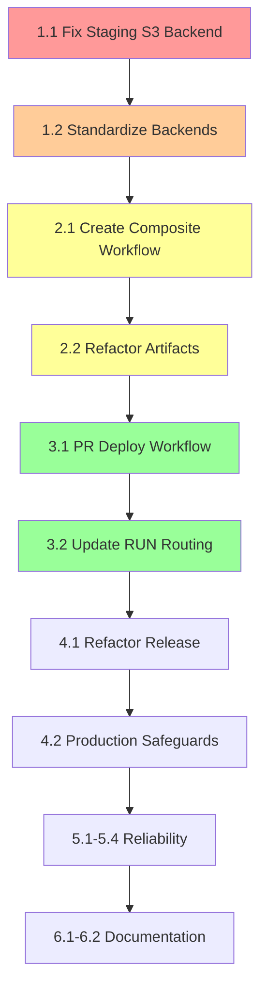

# Static Site Infrastructure - Implementation Roadmap

**Last Updated**: 2025-09-11  
**Status**: 🔧 EXECUTING - Release Workflow Simplification & Reliability Improvements  
**Priority**: Fix staging S3 backend, then implement PR-based deployment flow

## Current State

```
AWS Organization: o-0hh51yjgxw ✅ OPERATIONAL
├── Management Account (223938610551) - OIDC Provider Only ✅
├── Dev Account (822529998967) - DEPLOYED & OPERATIONAL ✅
│   └── URL: http://static-website-dev-c21da271.s3-website-us-east-1.amazonaws.com
├── Staging Account (927588814642) - S3 BACKEND ISSUE ⚠️ [CRITICAL BLOCKER]
│   └── Error: PermanentRedirect on tofu init
└── Prod Account (224071442216) - NOT YET DEPLOYED ⏳
```

## Phase 1: Fix Critical Infrastructure Issues [IMMEDIATE]
**Status**: 🚨 BLOCKING - Must complete before any other work  
**Duration**: 1-2 hours | Risk: Low

### 1.1 Fix Staging S3 Backend PermanentRedirect ⚠️
```bash
# Check current backend configuration
cat terraform/workloads/static-site/backend-staging.hcl

# Add explicit region and endpoint configuration
# backend-staging.hcl should contain:
bucket = "static-site-terraform-state-staging-927588814642"
key    = "workloads/static-site/staging/terraform.tfstate"
region = "us-east-1"  # MUST BE EXPLICIT
encrypt = true

# Test manual terraform init
cd terraform/workloads/static-site
AWS_PROFILE=staging tofu init -reconfigure -backend-config=backend-staging.hcl

# If still failing, check bucket location
aws s3api get-bucket-location --bucket static-site-terraform-state-staging-927588814642
```

### 1.2 Standardize All Backend Configurations
- [ ] Add explicit `region = "us-east-1"` to all backend-*.hcl files
- [ ] Verify all state buckets are in us-east-1
- [ ] Test terraform init for each environment

## Phase 2: Simplify Workflow Dependencies [HIGH PRIORITY]
**Status**: 📋 PLANNED  
**Duration**: 3-4 hours | Risk: Medium

### 2.1 Create Composite Deployment Workflow
**File**: `.github/workflows/deploy-composite.yml`

- [ ] Create reusable workflow for deployments
- [ ] Accept environment, ref, and tag as inputs
- [ ] Consolidate BUILD → TEST → RUN logic
- [ ] Eliminate workflow_run dependencies

### 2.2 Refactor Artifact Passing
- [ ] Replace artifact downloads with workflow outputs
- [ ] Remove complex BUILD_ID tracking
- [ ] Use job outputs instead of artifact files
- [ ] Implement retry logic for S3 operations

## Phase 3: Implement PR-Based Staging Deployment
**Status**: 📋 PLANNED  
**Duration**: 2-3 hours | Risk: Low

### 3.1 Create PR Deployment Workflow
**File**: `.github/workflows/pr-deploy.yml`

```yaml
# Key features to implement:
# - Trigger on PR to main (opened, synchronize, reopened)
# - Generate RC tag: v{date}-rc-pr{number}
# - Deploy to staging automatically
# - Post deployment URL as PR comment
# - Add deployment status checks
```

- [ ] Create PR deployment workflow
- [ ] Use GitHub API for PR context
- [ ] Generate predictable RC tags based on PR number
- [ ] Implement PR comment bot for deployment URLs
- [ ] Add staging health checks

### 3.2 Update RUN Workflow Routing
- [ ] Remove main → staging auto-deploy (handled by PR workflow)
- [ ] Keep feature/* → dev routing
- [ ] Reserve main for production deployments only

## Phase 4: Simplify Production Release
**Status**: 📋 PLANNED  
**Duration**: 2 hours | Risk: Low

### 4.1 Refactor Release Workflow
**File**: `.github/workflows/release.yml`

- [ ] Remove RC version type (handled by PR workflow)
- [ ] Remove staging deployment logic
- [ ] Enforce main branch only
- [ ] Add staging deployment verification
- [ ] Check PR merge status before allowing release
- [ ] Simplify to patch/minor/major only

### 4.2 Add Production Safeguards
- [ ] Require staging deployment exists
- [ ] Verify staging health before production
- [ ] Add manual approval gate
- [ ] Implement automatic rollback on failure

## Phase 5: Reliability Improvements
**Status**: 📋 PLANNED  
**Duration**: 3-4 hours | Risk: Medium

### 5.1 Standardize Concurrency Groups
```yaml
concurrency:
  group: deploy-${{ inputs.environment }}-${{ github.head_ref || github.ref }}
  cancel-in-progress: false  # Never cancel deployments
```

- [ ] Update all workflow concurrency groups
- [ ] Set cancel-in-progress: false for deployments
- [ ] Add deployment mutex locks

### 5.2 Implement Idempotency
- [ ] Generate unique deployment IDs
- [ ] Check for existing deployments before starting
- [ ] Skip redundant deployments
- [ ] Add deployment state tracking

### 5.3 Add Health Checks & Monitoring
- [ ] Implement deployment health checks
- [ ] Add timeout and retry logic
- [ ] Create deployment status dashboard
- [ ] Track DORA metrics

### 5.4 Rollback Capability
- [ ] Implement automatic rollback on health check failure
- [ ] Create manual rollback workflow
- [ ] Test rollback procedures in dev

## Phase 6: Documentation & Cleanup
**Status**: 📋 PLANNED  
**Duration**: 1-2 hours | Risk: Low

### 6.1 Update Documentation
- [ ] Update CLAUDE.md with new deployment flow
- [ ] Update deployment guides
- [ ] Create PR template with checklist
- [ ] Document rollback procedures

### 6.2 Remove Legacy Code
- [ ] Remove workflow_run artifact passing logic
- [ ] Clean up unused workflow inputs
- [ ] Archive old documentation
- [ ] Update README with current state

## Execution Order & Dependencies



## Success Criteria

✅ **Phase 1 Complete When**:
- Staging deployments work without PermanentRedirect error
- All backend configs have explicit regions

✅ **Phase 2 Complete When**:
- Composite workflow created and tested
- No more workflow_run dependencies

✅ **Phase 3 Complete When**:
- PRs automatically deploy to staging
- RC tags created for each PR
- Deployment URLs posted as PR comments

✅ **Phase 4 Complete When**:
- Production releases only from main
- Staging verification enforced
- Release workflow simplified

✅ **Phase 5 Complete When**:
- Deployments are idempotent
- Health checks implemented
- Rollback tested and working

✅ **Phase 6 Complete When**:
- All documentation updated
- Legacy code removed
- Clean, maintainable pipeline

## Risk Mitigation

- **Test all changes in dev environment first**
- **Keep existing workflows as backup until proven**
- **Implement monitoring before major changes**
- **Document rollback procedures at each phase**
- **Use feature flags for gradual rollout**

## Notes

- Critical blocker is staging S3 backend - MUST fix first
- PR-based flow aligns with developer expectations
- Composite workflows reduce complexity significantly
- Health checks prevent bad deployments
- Rollback capability essential for production