# Architecture Guide

Comprehensive technical architecture documentation for the AWS Static Website Infrastructure with multi-account deployment strategy.

## Overview

This system implements enterprise-grade static website hosting using AWS services with a multi-account architecture pattern. The design emphasizes security, scalability, cost optimization, and operational excellence.

## Multi-Account Architecture

### Account Structure

> **💡 For detailed IAM permissions, security model, and migration roadmap**, see [IAM Deep Dive](iam-deep-dive.md).

> **Note on Account IDs**: This diagram uses placeholder IDs (`MANAGEMENT_ACCOUNT_ID`, etc.) for fork-ready customization. The [README.md](../README.md) shows actual account IDs from the reference deployment. Per AWS guidance, account IDs are safe to expose publicly and do not present a security risk.

```mermaid
graph TB
    subgraph Org["🏛️ AWS Organization<br/>o-0hh51yjgxw"]
        subgraph Management["🏢 Management Account<br/>MANAGEMENT_ACCOUNT_ID"]
            OIDC["🔐 OIDC Provider<br/>github.com/Celtikill/static-site"]
            Bootstrap["⚙️ Bootstrap Role<br/>GitHubActions-Bootstrap-Central"]
            Central["🌐 Central Role<br/>GitHubActions-StaticSite-Central"]
        end

        subgraph Dev["🧪 Dev Account<br/>DEVELOPMENT_ACCOUNT_ID"]
            DevRole["🔧 Dev Role<br/>GitHubActions-StaticSite-Dev-Role"]
            DevState["💾 Dev State Backend<br/>static-site-state-dev-DEVELOPMENT_ACCOUNT_ID"]
            DevInfra["☁️ Dev Infrastructure<br/>✅ OPERATIONAL"]
        end

        subgraph Staging["🚀 Staging Account<br/>STAGING_ACCOUNT_ID"]
            StagingRole["🔧 Staging Role<br/>GitHubActions-StaticSite-Staging-Role"]
            StagingState["💾 Staging State Backend<br/>⏳ Ready for Bootstrap"]
            StagingInfra["☁️ Staging Infrastructure<br/>⏳ Ready for Deployment"]
        end

        subgraph Prod["🏭 Production Account<br/>PRODUCTION_ACCOUNT_ID"]
            ProdRole["🔧 Prod Role<br/>GitHubActions-StaticSite-Prod-Role"]
            ProdState["💾 Production State Backend<br/>⏳ Ready for Bootstrap"]
            ProdInfra["☁️ Production Infrastructure<br/>⏳ Ready for Deployment"]
        end
    end

    OIDC --> Central
    Central --> DevRole
    Central --> StagingRole
    Central --> ProdRole

    DevRole --> DevState
    DevRole --> DevInfra
    StagingRole --> StagingState
    StagingRole --> StagingInfra
    ProdRole --> ProdState
    ProdRole --> ProdInfra
```

### Authentication Flow

The system uses a 3-tier security model with OIDC authentication:

1. **Tier 1 (Bootstrap)**: GitHub Actions → OIDC → Bootstrap Role (infrastructure creation)
2. **Tier 2 (Central)**: GitHub Actions → OIDC → Central Role (cross-account orchestration)
3. **Tier 3 (Environment)**: Central Role → Environment Role (application deployment)

**Key Security Features:**
- ✅ No stored credentials (OIDC-based authentication)
- ✅ Least privilege access (role-based separation)
- ✅ Cross-account isolation
- ✅ Audit trail via CloudTrail

**Current Status:**
- ✅ Tier 1 & 2: Fully implemented
- ⚠️ Tier 3: MVP with documented compromises

For comprehensive IAM details, compromises, and migration roadmap, see [IAM Deep Dive](iam-deep-dive.md).

## Infrastructure Components

### Core AWS Services

```mermaid
graph TD
    subgraph Region["🌍 AWS Region: us-east-1"]
        subgraph Storage["💾 Storage Layer"]
            S3Primary["🪣 Primary S3 Bucket<br/>Website Content<br/>AES-256 + KMS"]
            S3Logs["📝 Access Logs Bucket<br/>Audit Trail<br/>AES-256"]
            S3Replica["🔄 Replica Bucket<br/>us-west-2<br/>Cross-Region Replication"]
        end

        subgraph CDN["🌐 Content Delivery Network"]
            CF["⚡ CloudFront Distribution<br/>Global Edge Locations<br/>Origin Access Control"]
            WAF["🛡️ AWS WAF v2<br/>OWASP Top 10 Protection<br/>Rate Limiting"]
            Route53["🌐 Route 53<br/>DNS Management<br/>(Optional)"]
        end

        subgraph Security["🔐 Security Services"]
            KMS["🔑 KMS Customer Key<br/>Envelope Encryption<br/>Automatic Rotation"]
            IAM["👤 IAM Roles & Policies<br/>Least Privilege Access<br/>Service-Linked Roles"]
        end

        subgraph Monitoring["📊 Observability"]
            CW["📈 CloudWatch<br/>Metrics & Logs<br/>Custom Dashboards"]
            SNS["📧 SNS Topics<br/>Budget Alerts<br/>Operational Notifications"]
            Budget["💰 AWS Budgets<br/>Cost Controls<br/>Threshold Alerts"]
        end
    end

    S3Primary --> CF
    CF --> WAF
    S3Primary --> S3Replica
    S3Primary --> S3Logs
    KMS --> S3Primary
    KMS --> S3Replica
    IAM --> S3Primary
    IAM --> CF
    CW --> S3Primary
    CW --> CF
    SNS --> Budget
    Route53 --> CF


```

## CI/CD Pipeline Architecture

### Pipeline Flow

```mermaid
graph TD
    A["📝 Developer Push<br/>Code/Infrastructure Changes"] --> B["🔨 BUILD Phase<br/>⏱️ ~20 seconds"]
    B --> C["🧪 TEST Phase<br/>⏱️ ~35 seconds"]
    C --> D["🚀 RUN Phase<br/>⏱️ ~1m49s"]

    subgraph BuildPhase["🔨 BUILD Phase Details"]
        B1["🛡️ Checkov<br/>Infrastructure Security Scanning"]
        B2["🔍 Trivy<br/>Vulnerability Detection"]
        B3["📦 Artifact Creation<br/>Website + Terraform Archives"]
        B4["💰 Cost Projection<br/>Environment-Specific Estimates"]
    end

    subgraph TestPhase["🧪 TEST Phase Details"]
        C1["📜 OPA Policy Engine<br/>6 Security Deny Rules"]
        C2["📋 Compliance Validation<br/>5 Best Practice Warnings"]
        C3["🔄 Configuration Validation<br/>Terraform Syntax & Logic"]
    end

    subgraph RunPhase["🚀 RUN Phase Details"]
        D1["🏗️ Infrastructure Deployment<br/>OpenTofu Apply"]
        D2["🌐 Website Deployment<br/>S3 Sync + CloudFront Invalidation"]
        D3["✅ Health Validation<br/>HTTP Checks + Monitoring Setup"]
    end

    B --> BuildPhase
    C --> TestPhase
    D --> RunPhase


```

### Security Scanning Integration

```mermaid
graph LR
    subgraph SecurityGates["🔒 Security Quality Gates"]
        Checkov["🛡️ Checkov<br/>Infrastructure as Code<br/>Security Analysis"]
        Trivy["🔍 Trivy<br/>Vulnerability & Misconfiguration<br/>Detection"]
        OPA["📜 Open Policy Agent<br/>Compliance & Governance<br/>Policy Validation"]
    end

    subgraph Decision["⚖️ Security Decision Engine"]
        Critical["🔴 Critical/High Issues?"]
        Block["🚫 Block Deployment<br/>Security Gate Failure"]
        Allow["✅ Allow Deployment<br/>Security Approved"]
    end

    Checkov --> Critical
    Trivy --> Critical
    OPA --> Critical

    Critical -->|"❌ Yes"| Block
    Critical -->|"✅ No"| Allow

    Block --> Fix["🔧 Remediation Required<br/>Developer Action Needed"]
    Allow --> Deploy["🚀 Proceed to Deployment<br/>Secure Release"]


```

## Network Architecture

### Content Delivery Flow

```mermaid
graph LR
    subgraph Users["👥 Global Users"]
        User1["🌍 User (Europe)"]
        User2["🌎 User (Americas)"]
        User3["🌏 User (Asia-Pacific)"]
    end

    subgraph Edge["⚡ CloudFront Edge Locations"]
        Edge1["🏢 EU Edge<br/>London, Frankfurt"]
        Edge2["🏢 US Edge<br/>N. Virginia, Oregon"]
        Edge3["🏢 APAC Edge<br/>Tokyo, Sydney"]
    end

    subgraph Origin["🏠 Origin Infrastructure"]
        S3["🪣 S3 Static Website<br/>us-east-1<br/>Origin Access Control"]
        WAF["🛡️ WAF Protection<br/>Application Firewall<br/>Rate Limiting"]
    end

    User1 --> Edge1
    User2 --> Edge2
    User3 --> Edge3

    Edge1 --> WAF
    Edge2 --> WAF
    Edge3 --> WAF

    WAF --> S3


```

## Security Architecture

### Defense in Depth

```mermaid
graph TD
    subgraph External["🌐 External Threats"]
        Attacks["🚨 Attack Vectors<br/>DDoS, Injection, etc."]
    end

    subgraph Layer1["🛡️ Layer 1: Edge Protection"]
        WAF["🔥 AWS WAF v2<br/>OWASP Top 10<br/>Rate Limiting"]
        CF["⚡ CloudFront<br/>DDoS Protection<br/>Geo-blocking"]
    end

    subgraph Layer2["🔐 Layer 2: Access Control"]
        OAC["🚪 Origin Access Control<br/>Blocks Direct S3 Access"]
        IAM["👤 IAM Policies<br/>Least Privilege<br/>Service Boundaries"]
    end

    subgraph Layer3["💾 Layer 3: Data Protection"]
        KMS["🔑 KMS Encryption<br/>Customer Managed Keys<br/>Envelope Encryption"]
        S3Encrypt["🔒 S3 Server-Side Encryption<br/>AES-256 + KMS<br/>Bucket Policies"]
    end

    subgraph Layer4["📊 Layer 4: Monitoring"]
        CW["📈 CloudWatch Logs<br/>Real-time Monitoring<br/>Anomaly Detection"]
        Alerts["🚨 Security Alerts<br/>SNS Notifications<br/>Automated Response"]
    end

    Attacks --> WAF
    WAF --> CF
    CF --> OAC
    OAC --> IAM
    IAM --> KMS
    KMS --> S3Encrypt
    S3Encrypt --> CW
    CW --> Alerts


```

## Cost Optimization Strategy

### Environment-Specific Configurations

| Component | Development | Staging | Production |
|-----------|-------------|---------|------------|
| **CloudFront** | 💰 Disabled (Cost Optimized) | ✅ Enabled | ✅ Enabled |
| **WAF** | ⚠️ Basic Rules | ✅ Full Protection | ✅ Enhanced Rules |
| **Cross-Region Replication** | ❌ Disabled | ✅ Enabled | ✅ Enabled |
| **Route 53** | ❌ Disabled | ✅ Enabled | ✅ Enabled |
| **Budget Limit** | $50/month | $75/month | $200/month |
| **Estimated Monthly Cost** | $1-5 | $15-25 | $25-50 |

### Cost Control Mechanisms

```mermaid
graph TD
    subgraph Monitoring["💰 Cost Monitoring"]
        Budget["📊 AWS Budgets<br/>Environment-Specific Limits"]
        CostExplorer["📈 Cost Explorer<br/>Usage Analytics"]
        Alerts["🚨 Budget Alerts<br/>80%, 100%, 120% Thresholds"]
    end

    subgraph Optimization["⚡ Cost Optimization"]
        FeatureFlags["🎛️ Feature Flags<br/>Conditional Resource Creation"]
        Lifecycle["🔄 S3 Lifecycle<br/>Intelligent Tiering"]
        FreeTier["🆓 Free Tier Optimization<br/>CloudWatch, Lambda"]
    end

    subgraph Governance["🏛️ Cost Governance"]
        Tagging["🏷️ Resource Tagging<br/>Environment, Project, Owner"]
        Policies["📜 Cost Allocation<br/>Chargeback & Showback"]
        Reviews["📋 Monthly Reviews<br/>Cost Optimization Reports"]
    end

    Budget --> Alerts
    CostExplorer --> Reviews
    FeatureFlags --> Lifecycle
    Tagging --> Policies
    Alerts --> FeatureFlags


```

## Disaster Recovery & Business Continuity

### Backup Strategy

```mermaid
graph LR
    subgraph Primary["🏠 Primary Region: us-east-1"]
        S3Primary["🪣 Primary S3 Bucket<br/>Website Content<br/>Versioning Enabled"]
        StatePrimary["💾 Terraform State<br/>Distributed Backend<br/>State Locking"]
    end

    subgraph Backup["🔄 Backup Region: us-west-2"]
        S3Replica["🪣 Replica S3 Bucket<br/>Cross-Region Replication<br/>Same Encryption"]
        StateBackup["💾 State Backup<br/>Point-in-Time Recovery<br/>Versioning"]
    end

    subgraph Recovery["🚨 Recovery Procedures"]
        RTO["⏱️ Recovery Time Objective<br/>< 1 hour"]
        RPO["💾 Recovery Point Objective<br/>< 15 minutes"]
        Failover["🔄 Failover Process<br/>Automated + Manual"]
    end

    S3Primary --> S3Replica
    StatePrimary --> StateBackup
    S3Replica --> Failover
    StateBackup --> Failover
    Failover --> RTO
    Failover --> RPO


```

## Monitoring & Observability

### Metrics & Dashboards

- **CloudWatch Dashboards**: Environment-specific dashboards with key metrics
- **Custom Metrics**: Website performance, security events, cost tracking
- **Log Aggregation**: Centralized logging with structured data
- **Alerting**: Multi-channel notifications (SNS, email, webhooks)

### Key Performance Indicators

| Metric | Target | Alert Threshold |
|--------|--------|-----------------|
| **Website Availability** | 99.9% | < 99.5% |
| **Page Load Time** | < 2s | > 3s |
| **Security Scan Pass Rate** | 100% | < 100% |
| **Deployment Success Rate** | > 95% | < 90% |
| **Monthly Cost Variance** | ±10% | ±20% |

## Technology Stack

### Infrastructure as Code
- **OpenTofu**: Terraform-compatible infrastructure provisioning
- **Module Architecture**: Reusable, composable infrastructure components
- **State Management**: Distributed backends with state locking
- **Version Control**: Git-based infrastructure versioning

### Security & Compliance
- **Checkov**: Infrastructure security scanning
- **Trivy**: Vulnerability and misconfiguration detection
- **OPA/Rego**: Policy as Code validation
- **AWS Security Hub**: Centralized security findings

### CI/CD Pipeline
- **GitHub Actions**: Workflow orchestration and automation
- **OIDC Authentication**: Secure, keyless authentication to AWS
- **Artifact Management**: Versioned deployment artifacts
- **Progressive Deployment**: Environment-specific rollout strategy

## Scaling Considerations

The architecture is designed to scale both horizontally and vertically:

### Horizontal Scaling
- **Multi-Account**: Additional environments through account vending
- **Multi-Region**: Global deployment with regional failover
- **Multi-Project**: Platform reusability across multiple static sites

### Vertical Scaling
- **Performance**: CloudFront optimization and origin scaling
- **Security**: Enhanced WAF rules and additional security services
- **Monitoring**: Advanced observability and AI/ML-powered insights

## Next Steps

See [TODO.md](../TODO.md) for immediate implementation priorities and [WISHLIST.md](../WISHLIST.md) for future architectural enhancements.