# ADR-002: Branch-Based Deployment Routing Strategy

**Status**: Accepted
**Date**: 2025-10-16
**Deciders**: Codeowner 
**Related**: ADR-001 (IAM Permissions), ADR-003 (Versioning), ADR-004 (Commit Standards)

---

## Context

The static website infrastructure project uses a three-phase CI/CD pipeline (BUILD→TEST→RUN) with three deployment environments (dev, staging, prod). We needed to determine how Git branches map to deployment environments and when deployments should be automatic vs. manual.

### Problem Statement

Several architectural questions needed resolution:

1. **Branch-to-Environment Mapping**: Which Git branches trigger which environment deployments?
2. **Automatic vs Manual**: Which deployments should be automatic vs. require human approval?
3. **Progressive Promotion**: How should code progress from development to production?
4. **Main Branch Strategy**: Should `main` deploy to staging or production automatically?
5. **Release Mechanism**: How should production deployments be triggered?

### Requirements

**Development Environment**:
- Fast feedback loop for developers
- Low-cost operation (S3-only, no CloudFront)
- Safe experimentation without production risk

**Staging Environment**:
- Production-like configuration (CloudFront + S3 + WAF)
- Pre-production validation
- Integration testing target

**Production Environment**:
- Manual approval required (safety gate)
- Full monitoring and security stack
- Controlled release process

## Decision

We will implement a **Progressive Promotion Model** with branch-based automatic routing and GitHub Releases for production.

### Routing Strategy

```mermaid
%%{init: {'theme':'default', 'themeVariables': {'fontSize':'16px'}}}%%
graph TD
    accTitle: Branch-Based Deployment Routing Strategy
    accDescr: Git branch-based deployment routing implementing progressive environment promotion with automated and manual gates. Feature, bugfix, and hotfix branches automatically deploy to the Development environment on push enabling rapid iteration and experimentation without manual intervention. Development serves as the sandbox for all work-in-progress changes with automatic deployments supporting continuous integration workflows. Manual promotion from development merges changes to the main branch after validation and code review. The main branch automatically deploys to the Staging environment on merge providing pre-production validation with production-equivalent infrastructure but without live user traffic. Staging validates changes in realistic conditions before production exposure. Manual promotion from staging creates GitHub Releases requiring explicit approval for production deployment. GitHub Releases trigger manual workflow dispatch deploying to the Production environment only after human authorization implementing change control requirements. This strategy balances automation velocity in lower environments with safety gates in production. Automatic deployments in dev enable rapid feedback while manual approvals for production ensure deliberate, controlled releases. The progressive promotion pattern implements blast radius containment validating changes at each stage before advancing to higher-risk environments.

    A["feature/* branches"] -->|"Automatic"| B["🧪 Dev Environment"]
    C["bugfix/* branches"] -->|"Automatic"| B
    D["hotfix/* branches"] -->|"Automatic"| B
    E["main branch"] -->|"Automatic"| F["🚀 Staging Environment"]
    G["GitHub Release"] -->|"Manual Approval"| H["🏭 Production Environment"]

    B -->|"Manual promotion"| E
    F -->|"Manual promotion"| G

    style B fill:#e1f5fe
    style F fill:#fff9c4
    style H fill:#c8e6c9

    linkStyle 0 stroke:#333333,stroke-width:2px
    linkStyle 1 stroke:#333333,stroke-width:2px
    linkStyle 2 stroke:#333333,stroke-width:2px
    linkStyle 3 stroke:#333333,stroke-width:2px
    linkStyle 4 stroke:#333333,stroke-width:2px
    linkStyle 5 stroke:#333333,stroke-width:2px
    linkStyle 6 stroke:#333333,stroke-width:2px
```



### Branch-to-Environment Mapping

| Branch Pattern | Environment | Trigger | Approval Required |
|---------------|-------------|---------|-------------------|
| `feature/*` | dev | Automatic (on push) | No |
| `bugfix/*` | dev | Automatic (on push) | No |
| `hotfix/*` | dev | Automatic (on push) | No |
| `main` | staging | Automatic (on merge) | No |
| GitHub Release | prod | Manual (workflow_dispatch) | Yes |

### Workflow Implementation

**File**: `.github/workflows/run.yml` (lines 88-106)

```yaml
# Environment routing based on branch
case "$BRANCH" in
  main)
    TARGET_ENV="staging"
    ;;
  feature/*|bugfix/*|hotfix/*)
    TARGET_ENV="dev"
    ;;
  *)
    TARGET_ENV="dev"  # Safe default
    ;;
esac
```

**Production Deployment**:
```yaml
# Requires manual workflow_dispatch
# GitHub Releases trigger via release-prod.yml workflow
if [ "${{ github.event_name }}" != "workflow_dispatch" ]; then
  echo "Production deployments require manual authorization"
  exit 1
fi
```

## Rationale

### Why Main → Staging (Not Main → Production)?

**Decision**: `main` branch automatically deploys to staging environment

**Reasoning**:

1. **Safety Gate**: Production changes require explicit human decision
   - Prevents accidental production deployments
   - Allows final validation in production-like environment
   - Creates deliberate release process

2. **Continuous Integration**: Merging to `main` should be safe and frequent
   - Developers can merge confidently without production risk
   - Staging provides production-parity validation
   - Fast feedback on integration issues

3. **Progressive Promotion**:
   ```
   Developer → feature/* → main → Release → Production
                  ↓          ↓               ↓
                 dev      staging          prod
   ```

4. **Industry Best Practice**: "Main branch is staging" pattern
   - Used by Heroku, Netlify, Vercel for pipeline branches
   - Enables trunk-based development
   - Reduces long-lived branch complexity

### Why GitHub Releases for Production (Not release/* Branches)?

**Decision**: Use GitHub Releases (tags) instead of `release/*` branches

**Reasoning**:

1. **Semantic Versioning**: GitHub Releases enforce version tags
   - Provides immutable version history
   - Enables rollback to specific versions
   - Clear audit trail of what's in production

2. **Release Notes**: GitHub auto-generates release notes from PRs
   - Conventional Commits provide structured changelog
   - Stakeholders see what changed in each release
   - Documentation happens automatically

3. **Manual Approval**: Releases are explicitly created
   - Requires deliberate action (can't happen by accident)
   - Can include approval workflows via GitHub Environments
   - Aligns with change management processes

4. **Artifact Immutability**: Git tags are immutable
   - `release/*` branches can be modified (risky)
   - Tags are permanent snapshots
   - Ensures production consistency

5. **Simplicity**: One fewer branch pattern to manage
   - No `release/1.0`, `release/1.1` branches to maintain
   - No confusion about which release branch is current
   - Clean Git history

### Why Feature/* → Dev (Not Feature/* → Nothing)?

**Decision**: Feature branches automatically deploy to dev

**Reasoning**:

1. **Fast Feedback**: Developers see changes in real AWS environment
   - Catch environment-specific issues early
   - Validate AWS service integration
   - Test infrastructure changes safely

2. **Low Cost**: Dev environment is S3-only (~$1-5/month)
   - Acceptable cost for rapid iteration
   - No CloudFront charges
   - Minimal resource footprint

3. **Parallel Development**: Multiple feature branches can coexist
   - Each feature tested independently in dev
   - Conflicts surface before merging to main
   - Reduced integration surprises

4. **CI/CD Validation**: Proves full pipeline works
   - BUILD → TEST → RUN all exercised
   - IAM permissions validated
   - Terraform configurations tested

### Alternative Approaches Considered

**Option A: Main → Production** (Rejected)
```
feature/* → main → prod
              ↓
            staging (manual)
```
- **Rejected**: Too risky, no safety gate before production
- **Issue**: Accidental merges could break production
- **Issue**: No production-parity pre-validation

**Option B: Release Branches** (Rejected)
```
feature/* → main → release/1.0 → prod
              ↓         ↓
            staging   staging
```
- **Rejected**: Additional branch maintenance overhead
- **Issue**: Release branches can be modified (not immutable)
- **Issue**: Confusion about current vs. old release branches

**Option C: Environment Branches** (Rejected)
```
feature/* → develop → staging → main (prod)
```
- **Rejected**: Git-flow complexity without benefits
- **Issue**: Long-lived branches cause merge conflicts
- **Issue**: "main" should be deployable, not production-only

**Option D: Trunk-Based Development (No Branches)** (Rejected)
```
main → all environments (feature flags control)
```
- **Rejected**: Feature flags add complexity to static site
- **Issue**: Requires runtime toggle infrastructure
- **Issue**: Overkill for small team and simple project

## Consequences

### Positive

1. **Clear Mental Model**: Branch name tells you where it deploys
   - `feature/new-design` → automatically goes to dev
   - Merge to `main` → automatically goes to staging
   - Create GitHub Release → manually deploy to prod

2. **Safety by Default**: Production requires explicit action
   - No accidental production deployments
   - Staging validates production configuration
   - Multiple opportunities to catch issues

3. **Fast Development Cycle**:
   ```
   Write code → Push feature/* → See in dev (2 min)
   Test in dev → Merge to main → See in staging (2 min)
   Validate staging → Create release → Deploy to prod (manual)
   ```

4. **Immutable Production Versions**: Git tags provide clear history
   - Easy rollback: redeploy previous release tag
   - Clear changelog: GitHub release notes
   - Audit compliance: who deployed what when

5. **Flexible Workflow**:
   - Developers can deploy to any environment manually
   - Automatic deployments for rapid iteration
   - Manual override via `workflow_dispatch`

### Negative

1. **Main ≠ Production**: Cognitive shift for some teams
   - Developers used to "main is production" must adapt
   - Requires documentation and team training
   - Could confuse contributors unfamiliar with pattern

2. **Manual Production Step**: Extra step vs. automatic
   - Production deploys require creating GitHub Release
   - Slightly slower than automatic push-to-prod
   - Could be perceived as "extra work"

3. **No Dev Branch Isolation**: All feature branches share dev environment
   - Concurrent feature testing might conflict
   - Last deploy wins (could overwrite teammate's test)
   - Mitigated by: developers can deploy to staging manually

4. **Staging Gets All Main Merges**: Higher staging deployment frequency
   - Every PR merge triggers staging deployment
   - Staging environment has higher AWS costs
   - Could lead to "deploy fatigue" in staging

### Risks and Mitigations

**Risk**: Developers bypass staging and deploy directly to production
- **Mitigation**: Production authorization check in workflow
- **Mitigation**: IAM permissions require manual workflow_dispatch
- **Mitigation**: GitHub Environment protection rules (future)

**Risk**: Feature branches conflict in shared dev environment
- **Mitigation**: Short-lived feature branches (merge quickly)
- **Mitigation**: Developers can manually deploy to staging for isolation
- **Mitigation**: Communication about who's testing in dev

**Risk**: Staging costs increase with frequent deployments
- **Mitigation**: Budget alerts at $75 threshold
- **Mitigation**: Cost-optimized staging configuration
- **Mitigation**: Monitor and adjust if costs exceed expectations

**Risk**: Confusion about what version is in each environment
- **Mitigation**: README.md updated with deployment URLs and timestamps
- **Mitigation**: GitHub Actions summary shows deployed commit SHA
- **Mitigation**: CloudWatch dashboards tagged with version info

### Future Evolution

**Phase 2 Enhancements** (when team grows):

1. **Environment Isolation**: Deploy feature branches to isolated stacks
   ```bash
   feature/new-design → dev-new-design (isolated S3 bucket)
   ```

2. **GitHub Environments**: Add approval workflows
   ```yaml
   environment: production
   required_reviewers: [@lead-developer]
   ```

3. **Deployment Freezes**: Prevent production deploys during maintenance
   ```yaml
   if: github.event.schedule != 'maintenance-window'
   ```

4. **Canary Deployments**: Gradual rollout to production
   ```yaml
   deploy 10% → validate → deploy 50% → validate → deploy 100%
   ```

## References

### Implementation Files
- `.github/workflows/run.yml` (lines 88-106) - Branch routing logic
- `.github/workflows/release-prod.yml` - Production release workflow
- `docs/RELEASE-PROCESS.md` - Release process documentation

### Related ADRs
- **ADR-001**: IAM Permission Strategy - Permissions enabling this routing
- **ADR-003**: Manual Semantic Versioning - How versions are determined
- **ADR-004**: Conventional Commits Enforcement - Clean changelog for releases

### Related Documentation
- **docs/ci-cd.md** - Full pipeline documentation
- **docs/deployment.md** - Deployment procedures
- **CONTRIBUTING.md** - Developer workflow guide

### Research and Best Practices
- [GitHub Flow](https://docs.github.com/en/get-started/using-github/github-flow): Feature branches + main + releases
- [Trunk-Based Development](https://trunkbaseddevelopment.com/): Main as integration point
- [GitLab Flow](https://docs.gitlab.com/ee/topics/gitlab_flow.html): Environment branches (staging, production)
- [Heroku Flow](https://www.heroku.com/flow): Main is staging, releases to production
- [Netlify Deploy Previews](https://docs.netlify.com/site-deploys/deploy-previews/): Branch-based deployment patterns
- [Vercel Git Integration](https://vercel.com/docs/deployments/git): Automatic deployments from branches

### Validation Evidence
- Dev environment: Operational with feature/* branch deployments
- Staging environment: Ready for bootstrap
- Production environment: Configured for manual release workflow

---

**Last Updated**: 2025-11-05
**Review Date**: 2026-04-16 (6 months - evaluate developer feedback)
