# ADR-003: Manual Semantic Versioning with GitHub Releases

**Status**: Accepted
**Date**: 2025-10-16
**Deciders**: Codeowner
**Related**: ADR-002 (Branch-Based Routing), ADR-004 (Conventional Commits)

---

## Context

The static website infrastructure project needs a version management strategy for production deployments. Production releases must be traceable, reversible, and clearly documented with changelog information.

### Problem Statement

Several version management questions needed resolution:

1. **Version Assignment**: How are version numbers determined and assigned?
2. **Deployment Trigger**: What mechanism triggers production deployments?
3. **Release Notes**: How are changelogs generated and maintained?
4. **Rollback Strategy**: How do we revert to previous versions if needed?
5. **Automation vs. Control**: Should versioning be automatic or manual?

### Requirements

**Traceability**:
- Each production deployment must have a unique version identifier
- Changelog must document what changed in each version
- Ability to identify which commit is deployed to production

**Reversibility**:
- Easy rollback to any previous version
- Clear history of all production versions
- Immutable version artifacts

**Simplicity**:
- Small team (2-3 developers) doesn't need complex automation
- Learning curve should be minimal
- Standard tools preferred over custom solutions

**Compliance**:
- Version history for audit purposes
- Change tracking for security reviews
- Documentation of who deployed what when

## Decision

We will implement **Manual Semantic Versioning using GitHub Releases** without automated semantic-release tooling.

### Version Management Approach

**Semantic Versioning Format**: `MAJOR.MINOR.PATCH` (e.g., `v1.2.3`)

**Version Determination**: Manual decision by developer creating release
- **MAJOR**: Breaking changes (incompatible infrastructure changes)
- **MINOR**: New features (backward-compatible additions)
- **PATCH**: Bug fixes (backward-compatible fixes)

**Release Creation**: Manual process via GitHub UI or CLI
```bash
# Create release and tag
gh release create v1.2.0 \
  --title "Release v1.2.0" \
  --generate-notes \
  --latest
```

**Production Deployment**: Triggered by GitHub Release creation
- Release creation triggers `release-prod.yml` workflow
- Workflow deploys tagged commit to production
- Manual approval required (workflow_dispatch)

### Release Process Flow

```mermaid
%%{init: {'theme':'default', 'themeVariables': {'fontSize':'16px'}}}%%
graph TD
    accTitle: Manual Semantic Versioning Release Process
    accDescr: Comprehensive release workflow implementing manual semantic versioning with GitHub Releases for production deployment control. Development completion triggers automated test execution validating security scans, policy compliance, and functional requirements. Successful tests enable merge to the main branch initiating automatic deployment to the Staging environment for pre-production validation. Manual validation in staging verifies changes in production-equivalent infrastructure testing functionality, performance, and operational readiness. The readiness decision gate determines production promotion with failures triggering the fix cycle returning to development for remediation. Production-ready changes initiate GitHub Release creation with manual version number assignment following semantic versioning conventions (MAJOR.MINOR.PATCH). Release notes generation documents changes, breaking changes, and upgrade instructions providing transparency for stakeholders. Publishing the release triggers the production deployment workflow requiring explicit manual approval implementing change control requirements. Approved deployments execute to the Production environment with comprehensive verification validating deployment success, health checks, and operational metrics. This process implements deliberate release control balancing automation for efficiency with manual gates for safety. The semantic versioning provides clear communication of change significance while GitHub Releases create audit trails and deployment artifacts. The multi-stage validation from tests through staging to production verification ensures quality and stability before end-user exposure.

    A["Development Complete"] --> B["All Tests Pass"]
    B --> C["Merge to main"]
    C --> D["Auto-deploy to Staging"]
    D --> E["Manual Validation in Staging"]
    E --> F{"Ready for Production?"}
    F -->|"Yes"| G["Create GitHub Release"]
    F -->|"No"| H["Fix Issues"]
    H --> A
    G --> I["Assign Version Number"]
    I --> J["Generate Release Notes"]
    J --> K["Publish Release"]
    K --> L["Trigger Production Workflow"]
    L --> M["Manual Approval"]
    M --> N["Deploy to Production"]
    N --> O["Verify Deployment"]

    style G fill:#fff9c4
    style K fill:#c8e6c9
    style N fill:#4caf50

    linkStyle 0 stroke:#333333,stroke-width:2px
    linkStyle 1 stroke:#333333,stroke-width:2px
    linkStyle 2 stroke:#333333,stroke-width:2px
    linkStyle 3 stroke:#333333,stroke-width:2px
    linkStyle 4 stroke:#333333,stroke-width:2px
    linkStyle 5 stroke:#333333,stroke-width:2px
    linkStyle 6 stroke:#333333,stroke-width:2px
    linkStyle 7 stroke:#333333,stroke-width:2px
    linkStyle 8 stroke:#333333,stroke-width:2px
    linkStyle 9 stroke:#333333,stroke-width:2px
    linkStyle 10 stroke:#333333,stroke-width:2px
    linkStyle 11 stroke:#333333,stroke-width:2px
    linkStyle 12 stroke:#333333,stroke-width:2px
    linkStyle 13 stroke:#333333,stroke-width:2px
    linkStyle 14 stroke:#333333,stroke-width:2px
```



### Workflow Implementation

**File**: `.github/workflows/release-prod.yml` (new workflow)

```yaml
name: RELEASE - Production Deployment

on:
  release:
    types: [published]
  workflow_dispatch:
    inputs:
      version:
        description: 'Release version (e.g., v1.2.0)'
        required: true

jobs:
  production-deployment:
    runs-on: ubuntu-latest
    environment: production  # Requires manual approval
    steps:
      - name: Checkout Release
        uses: actions/checkout@v4
        with:
          ref: ${{ github.event.release.tag_name || inputs.version }}

      - name: Deploy to Production
        uses: ./.github/workflows/run.yml
        with:
          environment: prod
          deploy_infrastructure: true
          deploy_website: true
```

## Rationale

### Why Manual Versioning (Not Automated semantic-release)?

**Decision**: Developers manually determine version numbers

**Reasoning**:

1. **Team Size**: 2-3 developers can coordinate versions easily
   - Small team doesn't benefit from automation overhead
   - Direct communication about version bumps
   - No version number conflicts to resolve

2. **Simplicity**: No additional tooling or configuration
   - No `semantic-release` npm package to maintain
   - No `.releaserc` configuration files
   - No CI/CD pipeline complexity for version calculation

3. **Flexibility**: Developers make informed version decisions
   - Infrastructure changes might be MAJOR despite small code change
   - Semantic-release rules can't assess infrastructure impact
   - Human judgment for breaking vs. non-breaking changes

4. **Learning Curve**: Standard SemVer is widely understood
   - No need to learn semantic-release syntax
   - No custom commit message conventions beyond Conventional Commits
   - Easier for new contributors to understand

5. **Control**: Explicit version assignment vs. automatic
   - Prevents accidental MAJOR version bumps
   - Allows strategic version numbering (e.g., v2.0.0 for major milestone)
   - No surprises from automated version calculation

### Why GitHub Releases (Not Manual Tags Only)?

**Decision**: Use GitHub Releases feature, not just Git tags

**Reasoning**:

1. **Automated Changelog**: GitHub auto-generates release notes
   - Uses Conventional Commit PR titles (via ADR-004)
   - Automatically lists all PRs since last release
   - No manual changelog maintenance

2. **Rich Documentation**: Releases support markdown descriptions
   - Can add deployment notes, breaking changes, migration guides
   - Attach deployment artifacts (not needed currently, but available)
   - Link to related issues and PRs

3. **Visibility**: Releases appear prominently in GitHub UI
   - Latest release badge on repository homepage
   - Email notifications to watchers
   - Clear "what's in production" indicator

4. **Deployment Trigger**: Clean workflow integration
   - `on: release: types: [published]` event trigger
   - Ties deployment directly to version creation
   - Audit trail: who created release = who triggered production deploy

5. **API Integration**: Programmatic access to releases
   ```bash
   # List all releases
   gh release list

   # Download specific release artifacts
   gh release download v1.2.0

   # View release notes
   gh release view v1.2.0
   ```

### Why SemVer (Not CalVer or Other Schemes)?

**Decision**: Use Semantic Versioning (MAJOR.MINOR.PATCH)

**Reasoning**:

1. **Industry Standard**: Most widely recognized versioning scheme
   - Terraform modules use SemVer
   - npm packages use SemVer
   - Contributors familiar with format

2. **Meaningful Versions**: Version numbers communicate change impact
   - `v1.0.0` → `v1.1.0`: New feature, backward-compatible
   - `v1.1.0` → `v1.1.1`: Bug fix, safe to upgrade
   - `v1.1.1` → `v2.0.0`: Breaking change, review required

3. **Dependency Management**: Future module reuse benefits
   - If infrastructure becomes Terraform module, SemVer required
   - Enables version pinning: `source = "github.com/org/repo?ref=v1.2.0"`
   - Compatibility guarantees for consumers

4. **Rollback Clarity**: Version numbers indicate rollback risk
   - Rolling back PATCH: Low risk (just a bug fix)
   - Rolling back MINOR: Medium risk (removing new feature)
   - Rolling back MAJOR: High risk (infrastructure compatibility)

**Alternative Considered - Calendar Versioning (CalVer)**:
```
Format: YYYY.MM.DD (e.g., 2025.10.16)
```
- **Rejected**: Doesn't communicate change impact
- **Issue**: Can't distinguish bug fix from breaking change
- **Issue**: Multiple releases per day need disambiguator
- **Use case**: Better for time-sensitive releases (not applicable here)

### Alternative Approaches Considered

**Option A: Automated semantic-release** (Rejected)
```yaml
# .releaserc
{
  "plugins": [
    "@semantic-release/commit-analyzer",
    "@semantic-release/release-notes-generator",
    "@semantic-release/github"
  ]
}
```
**Rejected Reasons**:
- Overhead: Additional npm dependencies and configuration
- Complexity: Requires understanding semantic-release lifecycle
- Overkill: Team size doesn't justify automation
- Rigidity: Automatic version bumps based on commit messages can surprise
- Maintenance: Another dependency to update and debug

**Option B: Git Tags Only (No GitHub Releases)** (Rejected)
```bash
git tag v1.2.0
git push origin v1.2.0
```
**Rejected Reasons**:
- No automatic changelog generation
- No release notes or documentation
- Less visible in GitHub UI
- No deployment artifacts support
- Harder for non-technical stakeholders to track releases

**Option C: Branch-Based Versioning** (Rejected)
```
main → automatic v1.x
release/2.0 → automatic v2.x
```
**Rejected Reasons**:
- Additional branch maintenance
- Conflicts with branch-based routing (ADR-002)
- Doesn't solve changelog problem
- More complex Git history

**Option D: Version in Code** (Rejected)
```javascript
// version.js
export const VERSION = "1.2.0";
```
**Rejected Reasons**:
- Manual file updates required
- Merge conflicts on version bumps
- Doesn't integrate with deployment workflow
- Git tags already serve this purpose

## Consequences

### Positive

1. **Simple Process**: Developers understand immediately
   ```bash
   # 1. Validate in staging
   # 2. Create GitHub Release with version number
   # 3. GitHub auto-generates changelog
   # 4. Release triggers production deployment
   ```

2. **Automated Changelog**: Zero-effort release notes
   - Conventional Commits provide structured PR titles (ADR-004)
   - GitHub Release auto-generation lists all PRs
   - Markdown formatting for readability

3. **Clear Production State**: Always know what's deployed
   - Latest Release = Production version
   - Release page shows deployment date and deployer
   - Easy communication with stakeholders

4. **Easy Rollback**: Redeploy any previous release
   ```bash
   # Rollback to v1.1.0
   gh workflow run release-prod.yml --field version=v1.1.0
   ```

5. **Flexible Versioning**: Human judgment for version bumps
   - Can skip versions (v1.0 → v2.0 for major milestone)
   - Can use pre-release versions (v1.0.0-rc.1)
   - Can align versions with business milestones

6. **Low Maintenance**: No additional tooling to maintain
   - GitHub Releases is native GitHub feature
   - No npm dependencies for semantic-release
   - No version calculation logic to debug

### Negative

1. **Manual Step Required**: Developer must create release
   - Not automatic on merge to main
   - Could forget to create release (production out of date)
   - Extra step compared to automatic versioning

2. **Version Number Coordination**: Developers must agree on version
   - Risk of duplicate versions (mitigated by Git tag uniqueness)
   - Requires understanding SemVer rules
   - Could lead to inconsistent version bumps

3. **No Version Validation**: Humans can make mistakes
   - Might use MINOR when should be MAJOR
   - Could skip version numbers accidentally
   - No automated enforcement of SemVer rules

4. **Changelog Quality Depends on PR Titles**: Poor PR titles = poor changelog
   - Requires discipline for Conventional Commits (ADR-004)
   - Developers might write unhelpful PR titles
   - Auto-generated notes might need manual editing

### Risks and Mitigations

**Risk**: Developers forget to create releases for production deployments
- **Mitigation**: CONTRIBUTING.md documents release process
- **Mitigation**: Production requires manual workflow trigger (forces thinking)
- **Mitigation**: README shows last deployed version (makes gaps visible)

**Risk**: Inconsistent version bumping (MAJOR vs MINOR confusion)
- **Mitigation**: SemVer guidelines in RELEASE-PROCESS.md
- **Mitigation**: PR template includes version impact checklist
- **Mitigation**: Team review of version number in release PR

**Risk**: Multiple developers create releases simultaneously
- **Mitigation**: Git tag uniqueness prevents duplicate versions
- **Mitigation**: Small team coordination (announce in chat before release)
- **Mitigation**: GitHub UI shows if tag already exists

**Risk**: Release notes quality varies based on PR titles
- **Mitigation**: Conventional Commits enforcement (ADR-004)
- **Mitigation**: PR validation workflow requires proper titles
- **Mitigation**: Squash-merge strategy ensures clean history

### Future Evolution

**When to Consider Automated Versioning**:

1. **Team Growth**: 10+ developers making frequent releases
2. **High Release Frequency**: Multiple production deploys per day
3. **Strict Compliance**: Regulatory requirement for automated versioning
4. **Dependency Consumers**: Other projects depend on versioned artifacts

**Migration Path to semantic-release**:
```yaml
# .releaserc (future)
{
  "branches": ["main"],
  "plugins": [
    "@semantic-release/commit-analyzer",
    "@semantic-release/release-notes-generator",
    "@semantic-release/github",
    "@semantic-release/git"
  ]
}
```

**Pre-release Versions** (when needed for beta testing):
```bash
# Beta releases
gh release create v2.0.0-beta.1 --prerelease

# Release candidates
gh release create v2.0.0-rc.1 --prerelease

# Stable release
gh release create v2.0.0 --latest
```

## References

### Implementation Files
- `.github/workflows/release-prod.yml` - Production release workflow
- `docs/RELEASE-PROCESS.md` - Step-by-step release instructions
- `CONTRIBUTING.md` - Developer workflow including versioning

### Related ADRs
- **ADR-002**: Branch-Based Deployment Routing - Why releases trigger production
- **ADR-004**: Conventional Commits Enforcement - How release notes are generated

### Documentation
- **Semantic Versioning Spec**: https://semver.org/
- **GitHub Releases Guide**: https://docs.github.com/en/repositories/releasing-projects-on-github
- **Conventional Changelog**: https://www.conventionalcommits.org/

### Research and Best Practices
- [npm versioning strategy](https://docs.npmjs.com/about-semantic-versioning): Manual SemVer for small teams
- [Terraform Registry](https://www.terraform.io/registry/modules/publish#requirements): SemVer required for module publishing
- [GitHub's own versioning](https://github.blog/changelog/2021-10-05-improved-release-notes-automation/): Manual releases with auto-generated notes
- [HashiCorp projects](https://github.com/hashicorp/terraform/blob/main/CHANGELOG.md): Manual versioning with CHANGELOG.md

### Tools Evaluated (Not Adopted)
- [`semantic-release`](https://github.com/semantic-release/semantic-release): Automatic version bumping based on commits
- [`standard-version`](https://github.com/conventional-changelog/standard-version): Generates CHANGELOG.md and bumps versions
- [`release-please`](https://github.com/googleapis/release-please): Google's automated release tooling
- [`changesets`](https://github.com/changesets/changesets): Monorepo-focused versioning (overkill for single project)

---

**Last Updated**: 2025-10-16
**Review Date**: 2026-04-16 (6 months - evaluate if release frequency justifies automation)
