# ADR-005: Deployment Documentation Architecture

**Status**: Accepted
**Date**: 2025-10-16
**Deciders**: Infrastructure Team
**Related**: ADR-001, ADR-002, ADR-003, ADR-004

---

## Context

The static website infrastructure project accumulated multiple overlapping documentation files during rapid development. Three documents covered deployment information with significant overlap, causing confusion about which document to consult for specific tasks.

### Problem Statement

**Existing Documentation State**:
- `PIPELINE-TEST-PLAN.md` (490 lines): Detailed testing plan and IAM permission evolution
- `docs/deployment.md` (488 lines): Advanced deployment strategies and patterns
- `docs/ci-cd.md` (642 lines): Complete CI/CD pipeline documentation

**Issues Identified**:

1. **Overlap**: All three documents covered deployment workflows
2. **Discovery**: Unclear which document to read first
3. **Maintenance**: Updates required in multiple places
4. **Audience**: Different documents for different skill levels mixed together
5. **Historical Context**: Important decision context buried in test plans

### Requirements

**Clear Information Architecture**:
- Logical progression for new users (quick start → deep dive)
- Separation of concerns (how-to vs. why vs. reference)
- Minimize duplication while preserving important context

**Discoverable Documentation**:
- Clear naming that indicates document purpose
- README.md links to appropriate starting points
- Breadcrumbs and cross-references between documents

**Maintainable Structure**:
- Single source of truth for each topic
- Historical decisions preserved in architecture records
- Easy to update without breaking references

**Multiple Audiences**:
- Quick start for new developers (time to first deploy: <10 min)
- Reference for experienced users (command lookup)
- Deep dive for architectural understanding
- Historical context for decision rationale

## Decision

We will implement a **Layered Documentation Architecture** organized by user journey and purpose, with historical documentation archived for reference.

### Documentation Structure

```
Repository Root
├── README.md (Quick links, current status)
├── CONTRIBUTING.md (Development workflow, PR guidelines)
│
├── docs/
│   ├── QUICK-START.md ⭐ NEW (5-minute deployment guide)
│   ├── RELEASE-PROCESS.md ⭐ NEW (Production release workflow)
│   │
│   ├── deployment.md (Advanced strategies)
│   ├── ci-cd.md (Pipeline deep dive)
│   │
│   ├── architecture/
│   │   ├── ADR-001-iam-permission-strategy.md ⭐ NEW
│   │   ├── ADR-002-branch-based-deployment-routing.md ⭐ NEW
│   │   ├── ADR-003-manual-semantic-versioning.md ⭐ NEW
│   │   ├── ADR-004-conventional-commits-enforcement.md ⭐ NEW
│   │   └── ADR-005-deployment-documentation-architecture.md ⭐ NEW
│   │
│   └── archive/
│       └── 2025-10-16-pipeline-test-plan.md ⭐ ARCHIVED
```

### Document Purposes

**Quick Start Documents** (Time to value: <10 minutes):

1. **`README.md`**
   - Current deployment status (dev/staging/prod)
   - Quick links to documentation
   - Environment URLs and health status
   - "How do I...?" common task links

2. **`docs/QUICK-START.md`** (NEW)
   - Prerequisites (AWS accounts, GitHub CLI)
   - Bootstrap new environment (single command)
   - Deploy website (3 commands)
   - Verify deployment (1 command)
   - Troubleshooting quick links

3. **`CONTRIBUTING.md`** (NEW)
   - Developer workflow (branch → PR → merge)
   - Conventional Commits format
   - PR title requirements
   - Release process overview

4. **`docs/RELEASE-PROCESS.md`** (NEW)
   - Production release checklist
   - Version number guidelines (SemVer)
   - GitHub Release creation
   - Post-deployment validation

**Deep Dive Documents** (Reference and understanding):

5. **`docs/deployment.md`**
   - Advanced deployment strategies
   - Environment-specific configuration
   - Cost optimization patterns
   - Rollback procedures
   - Security considerations

6. **`docs/ci-cd.md`**
   - BUILD → TEST → RUN pipeline architecture
   - Workflow routing logic
   - Security gates and validation
   - Performance metrics
   - Troubleshooting failures

**Architectural Context** (Why decisions were made):

7. **`docs/architecture/ADR-*.md`** (NEW)
   - ADR-001: IAM Permission Strategy
   - ADR-002: Branch-Based Deployment Routing
   - ADR-003: Manual Semantic Versioning
   - ADR-004: Conventional Commits Enforcement
   - ADR-005: Documentation Architecture (this document)

**Historical Archive** (Preserved for context):

8. **`docs/archive/2025-10-16-pipeline-test-plan.md`** (ARCHIVED)
   - Original PIPELINE-TEST-PLAN.md
   - IAM permission evolution and testing
   - Phase 1 implementation evidence
   - Historical context for ADR-001

### Information Flow

```mermaid
graph TD
    A["👋 New User Arrives"] --> B["📖 README.md<br/>Status & Quick Links"]
    B --> C["⚡ QUICK-START.md<br/>Deploy in 5 minutes"]
    C --> D{"Need More?"}

    D -->|"Deploy to Prod"| E["📦 RELEASE-PROCESS.md<br/>Version & Release"]
    D -->|"Contribute Code"| F["🤝 CONTRIBUTING.md<br/>PR Workflow"]
    D -->|"Advanced Patterns"| G["🚀 deployment.md<br/>Strategies"]
    D -->|"Pipeline Details"| H["⚙️ ci-cd.md<br/>Architecture"]
    D -->|"Why Decision?"| I["📋 ADR-*.md<br/>Rationale"]

    E --> J["✅ Deployed Successfully"]
    F --> J
    G --> J
    H --> J
    I --> J

    style B fill:#e1f5fe
    style C fill:#c8e6c9
    style I fill:#fff9c4
```



## Rationale

### Why Archive PIPELINE-TEST-PLAN.md (Not Delete)?

**Decision**: Move to `docs/archive/` with date prefix, not delete

**Reasoning**:

1. **Historical Context**: Documents evolution of IAM permissions
   - Shows problem analysis that led to ADR-001
   - Evidence of testing and validation
   - Explains "middle-way" approach decision rationale

2. **Audit Trail**: Proves decisions were researched
   - Links to best practices research
   - Timeline of implementation (45 minutes)
   - Evidence of successful deployment (Run ID: 18567763990)

3. **Future Reference**: Useful when evaluating alternatives
   - "Why didn't we use two-role architecture?" → See archived plan Phase 2
   - "What permission errors occurred?" → See archived error logs
   - "How long did implementation take?" → See archived timeline

4. **Git History Alone Insufficient**: Plan contains analysis, not just code
   - Git shows file changes, not decision reasoning
   - Plan includes research findings and comparisons
   - Provides context beyond commit messages

5. **Low Cost**: Archive directory organizes historical docs
   - Date prefix shows when archived
   - Doesn't clutter main docs/ directory
   - Easy to find if needed (search for "pipeline test")

**Alternative Rejected - Delete Entirely**:
- Loses valuable context
- Forces re-research for future decisions
- Git history doesn't capture analysis quality
- Team onboarding harder (no decision journey)

### Why Create QUICK-START.md (Not Enhance Existing Docs)?

**Decision**: New dedicated quick-start guide

**Reasoning**:

1. **Different Audience**: New users vs. experienced operators
   - New user: "How do I deploy?" (needs 5-minute guide)
   - Experienced user: "How do I configure feature X?" (needs deployment.md)
   - Mixing audiences causes confusion

2. **Time to Value**: Fast path to first deployment
   - Quick-start: ~5 minutes to working deployment
   - Full deployment.md: ~30 minutes to read and understand
   - Most users just need quick-start

3. **Separate Concerns**: How-to vs. why vs. reference
   - Quick-start: Step-by-step commands (imperative)
   - deployment.md: Strategies and patterns (conceptual)
   - ADRs: Why decisions were made (rationale)

4. **Discoverability**: Clear naming signals purpose
   - "QUICK-START" immediately tells user what to expect
   - "deployment.md" implies comprehensive coverage
   - User picks appropriate document for their goal

5. **Maintenance**: Easier to update targeted documents
   - Quick-start rarely changes (basic workflow stable)
   - deployment.md changes with new patterns
   - No need to update both when adding advanced feature

**Alternative Rejected - Add Quick Start Section to deployment.md**:
- Quick-start gets buried in long document
- Advanced content intimidates new users
- Harder to maintain single source of truth
- Document becomes unfocused (trying to serve all audiences)

### Why Extract ADRs (Not Keep in PIPELINE-TEST-PLAN.md)?

**Decision**: Extract architectural decisions into separate ADR documents

**Reasoning**:

1. **Reusability**: Decisions apply beyond single test plan
   - IAM permission strategy (ADR-001) informs all deployments
   - Branch routing (ADR-002) affects developer workflow
   - Versioning (ADR-003) used for every release
   - Commit format (ADR-004) enforced on all PRs

2. **Discoverability**: ADRs are indexed and searchable
   - Architecture directory shows all decisions in one place
   - Can link to specific ADR from multiple documents
   - New team members can read decision history

3. **Linking**: Cross-reference between related decisions
   - ADR-002 references ADR-001 (routing depends on permissions)
   - ADR-003 references ADR-004 (versioning needs commits)
   - Creates web of architectural knowledge

4. **Future Decisions**: Template for new architecture choices
   - Established ADR format
   - Precedent for documenting rationale
   - Shows level of detail expected

5. **Separation of Concerns**: Test plan ≠ architecture decision
   - Test plan is temporal (specific to Phase 1)
   - ADRs are timeless (decisions remain valid)
   - Different document lifecycles

**ADR Format Benefits**:
- **Status**: Accepted/Rejected/Deprecated
- **Date**: When decision made
- **Context**: What problem solved
- **Decision**: What was chosen
- **Rationale**: Why this choice
- **Consequences**: Trade-offs accepted
- **References**: Related files and docs

### Why Create CONTRIBUTING.md and RELEASE-PROCESS.md?

**Decision**: Dedicated documents for contributor and release workflows

**Reasoning**:

1. **Standard Location**: CONTRIBUTING.md is GitHub convention
   - Appears in PR creation UI
   - Expected by open source contributors
   - Linked from repository insights

2. **Workflow Focus**: Different workflows, different docs
   - CONTRIBUTING.md: Daily developer workflow
   - RELEASE-PROCESS.md: Infrequent production releases
   - Separation prevents conflation

3. **Audience Specificity**:
   - CONTRIBUTING.md: All developers (frequent)
   - RELEASE-PROCESS.md: Release managers only (rare)
   - Different access patterns

4. **Versioning Guidance**: SemVer rules need dedicated space
   - Too detailed for CONTRIBUTING.md
   - Too important to bury in deployment.md
   - RELEASE-PROCESS.md provides focused guidance

**Alternative Rejected - Single DEVELOPMENT.md**:
- Mixes frequent (contributing) with rare (releasing)
- Harder to find specific workflow
- Document becomes catch-all

### Document Organization Principles

**Principle 1: Progressive Disclosure**
- Start simple (quick-start), reveal complexity as needed (advanced)
- Links guide users to next level of detail
- No need to read everything to accomplish task

**Principle 2: Single Source of Truth**
- Each topic has one authoritative document
- Other documents link to authority (not duplicate)
- Updates happen in one place

**Principle 3: Audience-Driven Structure**
- New user path: README → QUICK-START → Success
- Developer path: CONTRIBUTING → PR → Merge
- Release manager path: RELEASE-PROCESS → Deploy
- Architect path: ADRs → Understanding

**Principle 4: Meaningful Names**
- QUICK-START (implies fast)
- RELEASE-PROCESS (implies steps)
- deployment.md (implies comprehensive)
- ADR-NNN (implies decision record)

## Consequences

### Positive

1. **Clear User Journeys**: Readers know where to start
   - New user: README → QUICK-START
   - Contributor: CONTRIBUTING → PR workflow
   - Release manager: RELEASE-PROCESS
   - Architect: ADRs → Decision context

2. **Reduced Duplication**: Single source of truth per topic
   - IAM permissions: ADR-001
   - Branch routing: ADR-002
   - Quick deployment: QUICK-START.md
   - Advanced patterns: deployment.md

3. **Maintainability**: Updates in one place
   - Change IAM strategy? Update ADR-001
   - New deployment pattern? Update deployment.md
   - Workflow change? Update CONTRIBUTING.md

4. **Discoverability**: Meaningful names aid navigation
   - QUICK-START vs. deployment.md signals complexity
   - ADR-001 vs. ci-cd.md signals decision vs. process
   - archive/ clearly indicates historical docs

5. **Onboarding Speed**: New developers productive faster
   - Quick-start: Deploy in 5 minutes
   - Contributing: PR in 10 minutes
   - Full context available when needed (ADRs)

6. **Historical Preservation**: Context not lost
   - Archived pipeline test plan shows decision evolution
   - ADRs document why decisions made
   - Git history preserves what changed

### Negative

1. **More Files**: 9 new documentation files
   - Could feel overwhelming initially
   - Directory structure more complex
   - More files to search through

2. **Navigation Required**: Must follow links
   - Can't read single document for full picture
   - Requires jumping between files
   - Could lose context when navigating

3. **Maintenance Coordination**: Cross-references must stay updated
   - Links between documents can break
   - Renaming requires updating multiple files
   - Need to remember to update related docs

4. **Redundancy Risk**: Temptation to duplicate content
   - Easier to copy-paste than link
   - Snippets repeated in multiple places
   - Gradual drift if not disciplined

### Risks and Mitigations

**Risk**: Users don't discover appropriate documentation
- **Mitigation**: README.md has clear "How do I...?" links
- **Mitigation**: Each doc cross-references related docs
- **Mitigation**: Breadcrumbs at top of each document

**Risk**: Documentation becomes stale
- **Mitigation**: Each ADR has review date
- **Mitigation**: CI/CD checks for broken links (future)
- **Mitigation**: PR template includes "Update docs?" checklist

**Risk**: Historical archive becomes bloated
- **Mitigation**: Archive only significant historical docs
- **Mitigation**: Date prefix enables cleanup of old archives
- **Mitigation**: Annual review of archive relevance

**Risk**: ADRs proliferate excessively
- **Mitigation**: Only create ADR for significant architectural decision
- **Mitigation**: Combine related decisions in single ADR
- **Mitigation**: Update existing ADR vs. create new when appropriate

### Future Evolution

**Documentation Site** (when documentation grows further):
```
Use tools like:
- MkDocs (Python-based static site generator)
- Docusaurus (React-based documentation framework)
- Just the Docs (Jekyll theme for GitHub Pages)
```

**Automated Link Checking** (prevent broken references):
```yaml
# .github/workflows/docs-validation.yml
- name: Check Markdown Links
  uses: gaurav-nelson/github-action-markdown-link-check@v1
```

**Diagrams as Code** (current mermaid approach scales):
```
Continue using Mermaid for:
- Architecture diagrams (already in ADRs)
- User journey flows (already in this ADR)
- Deployment workflows (already in docs)
```

**Versioned Documentation** (if multiple versions need support):
```
docs/
├── v1.x/
│   └── deployment.md (for v1.x releases)
├── v2.x/
│   └── deployment.md (for v2.x releases)
└── latest → v2.x/
```

## References

### Files Created
- `docs/QUICK-START.md` - 5-minute deployment guide
- `docs/RELEASE-PROCESS.md` - Production release workflow
- `CONTRIBUTING.md` - Developer contribution guidelines
- `docs/architecture/ADR-001-iam-permission-strategy.md`
- `docs/architecture/ADR-002-branch-based-deployment-routing.md`
- `docs/architecture/ADR-003-manual-semantic-versioning.md`
- `docs/architecture/ADR-004-conventional-commits-enforcement.md`
- `docs/architecture/ADR-005-deployment-documentation-architecture.md`

### Files Archived
- `PIPELINE-TEST-PLAN.md` → `docs/archive/2025-10-16-pipeline-test-plan.md`

### Existing Files (Enhanced with Cross-References)
- `README.md` - Enhanced with quick links
- `docs/deployment.md` - Advanced strategies (linked from quick-start)
- `docs/ci-cd.md` - Pipeline architecture (linked from ADRs)

### Documentation Best Practices
- **Diátaxis Framework**: Tutorial, how-to, reference, explanation
- **Write the Docs**: Documentation structure and maintenance
- **Documentation as Code**: Version control, CI/CD, reviews
- **ADR Pattern**: Nygard's Architecture Decision Records

### Examples of Good Documentation Architecture
- **Kubernetes**: Concepts, Tasks, Tutorials, Reference
- **Next.js**: Getting Started, Guides, API Reference, Architecture
- **Terraform**: Intro, Guides, Language, Registry
- **AWS Well-Architected**: Pillars, Best Practices, Whitepapers

---

**Last Updated**: 2025-10-16
**Review Date**: 2026-01-16 (3 months - evaluate documentation effectiveness)
