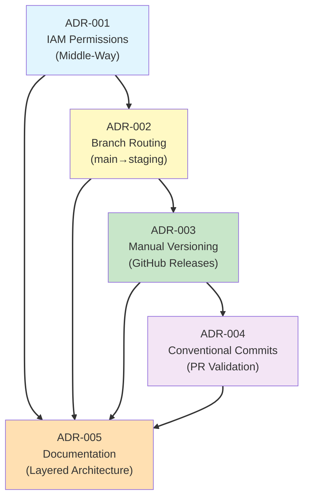

# Architecture Decision Records (ADRs)

This directory contains Architecture Decision Records documenting significant architectural choices made for the static website infrastructure project.

## What are ADRs?

Architecture Decision Records capture important architectural decisions along with their context, rationale, and consequences. They provide:

- **Context**: What problem were we solving?
- **Decision**: What did we choose?
- **Rationale**: Why this choice over alternatives?
- **Consequences**: What trade-offs did we accept?
- **References**: Related files and documentation

## Active ADRs

| ADR | Title | Date | Status |
|-----|-------|------|--------|
| [ADR-001](ADR-001-iam-permission-strategy.md) | IAM Permission Strategy - Middle-Way Approach | 2025-10-16 | Accepted |
| [ADR-002](ADR-002-branch-based-deployment-routing.md) | Branch-Based Deployment Routing Strategy | 2025-10-16 | Accepted |
| [ADR-003](ADR-003-manual-semantic-versioning.md) | Manual Semantic Versioning with GitHub Releases | 2025-10-16 | Accepted |
| [ADR-004](ADR-004-conventional-commits-enforcement.md) | Conventional Commits Enforcement via PR Validation | 2025-10-16 | Accepted |
| [ADR-005](ADR-005-deployment-documentation-architecture.md) | Deployment Documentation Architecture | 2025-10-16 | Accepted |

## ADR Relationships



## Summary by Topic

### CI/CD Pipeline Architecture

**ADR-001: IAM Permission Strategy**
- Uses action-category wildcards (Get*, Put*, List*) instead of granular permissions
- Single role per environment (not separate validation/deployment roles)
- Resource-scoped restrictions limit blast radius
- Balances security with operational efficiency

**ADR-002: Branch-Based Deployment Routing**
- Feature branches → automatic deploy to dev
- Main branch → automatic deploy to staging
- GitHub Releases → manual deploy to production
- Progressive promotion model: dev → staging → prod

### Version Management

**ADR-003: Manual Semantic Versioning**
- Developers manually assign version numbers (MAJOR.MINOR.PATCH)
- GitHub Releases trigger production deployments
- Auto-generated release notes from Conventional Commits
- No automated semantic-release tooling (appropriate for small team)

**ADR-004: Conventional Commits Enforcement**
- PR titles must follow Conventional Commits format
- Validated via GitHub Actions (amannn/action-semantic-pull-request)
- Squash-merge strategy ensures clean Git history
- Enables automated changelog generation

### Documentation Architecture

**ADR-005: Deployment Documentation Architecture**
- Layered documentation: Quick-start → Advanced → Architectural
- Historical documents archived (not deleted)
- ADRs extracted for reusability
- Clear user journeys for different audiences

## Quick Reference

### Need to Understand...

**Why main branch deploys to staging (not production)?**
→ See [ADR-002: Branch-Based Deployment Routing](ADR-002-branch-based-deployment-routing.md)

**Why we use action-category wildcards (Get*, Put*) for IAM?**
→ See [ADR-001: IAM Permission Strategy](ADR-001-iam-permission-strategy.md)

**Why manual versioning instead of semantic-release?**
→ See [ADR-003: Manual Semantic Versioning](ADR-003-manual-semantic-versioning.md)

**Why enforce commit format on PR titles (not individual commits)?**
→ See [ADR-004: Conventional Commits Enforcement](ADR-004-conventional-commits-enforcement.md)

**How documentation is organized?**
→ See [ADR-005: Documentation Architecture](ADR-005-deployment-documentation-architecture.md)

## ADR Lifecycle

### Status Values

- **Proposed**: Decision under consideration
- **Accepted**: Decision approved and implemented
- **Deprecated**: Decision superseded by newer ADR
- **Rejected**: Decision considered but not adopted

### When to Create an ADR

Create an ADR when making decisions about:

- **Architecture Patterns**: How systems are structured
- **Technology Choices**: Why specific tools/services selected
- **Process Changes**: Development workflow modifications
- **Security Policies**: IAM, encryption, access controls
- **Deployment Strategies**: How code reaches environments
- **Data Management**: Storage, backups, retention
- **Monitoring Approaches**: Observability and alerting

### ADR Template

```markdown
# ADR-NNN: [Decision Title]

**Status**: Proposed | Accepted | Deprecated | Rejected
**Date**: YYYY-MM-DD
**Deciders**: [Team/Role]
**Related**: [Other ADRs]

## Context
[What problem are we solving?]

## Decision
[What did we decide?]

## Rationale
[Why this decision?]
[What alternatives were considered?]

## Consequences
[What are the trade-offs?]
[What are the risks?]

## References
[Related files, documentation, research]
```

## Historical Context

The initial set of ADRs (001-005) were created on 2025-10-16 to document architectural decisions made during the infrastructure project's development. Key context:

- **ADR-001**: Emerged from PIPELINE-TEST-PLAN.md IAM permission challenges
- **ADR-002**: Codifies branch routing strategy from workflow configuration
- **ADR-003**: Documents version management approach for production releases
- **ADR-004**: Formalizes commit standards for automated changelogs
- **ADR-005**: Consolidates overlapping deployment documentation

These ADRs represent the foundational architectural decisions for the project's CI/CD pipeline, security model, and development workflow.

## Contributing

When proposing a new architectural decision:

1. Copy the ADR template above
2. Number sequentially (next available ADR-NNN)
3. Fill in all sections with thorough analysis
4. Include alternatives considered and why rejected
5. Link to related ADRs and documentation
6. Submit as PR for review

## Related Documentation

- **[Complete Deployment Guide](../../DEPLOYMENT.md)** - Step-by-step deployment instructions
- **[CI/CD Pipeline Guide](../ci-cd.md)** - Pipeline architecture and workflows
- **[Advanced Deployment](../deployment.md)** - Deployment strategies and patterns
- **[IAM Deep Dive](../iam-deep-dive.md)** - Detailed IAM permission architecture
- **[Contributing Guide](../../CONTRIBUTING.md)** - Development workflow

---

**Last Updated**: 2025-10-16
**Total ADRs**: 5 (All Accepted)
