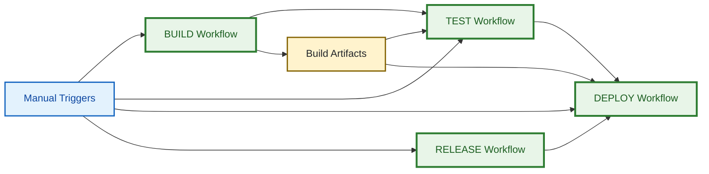

# CI/CD Pipeline Architecture

> **🎯 Target Audience**: DevOps engineers, platform teams, release managers  
> **📊 Complexity**: ⭐⭐⭐⭐ Advanced  
> **📋 Prerequisites**: GitHub Actions experience, CI/CD concepts, workflow orchestration  
> **⏱️ Reading Time**: 20-25 minutes

## Overview

This document details the comprehensive CI/CD pipeline architecture implemented using GitHub Actions. The design emphasizes security, quality assurance, and operational excellence through automated BUILD-TEST-RELEASE-DEPLOY workflows with comprehensive validation and approval gates.

## Pipeline Architecture Overview

```mermaid
graph TB
    %% Accessibility
    accTitle: Enterprise CI/CD Pipeline Architecture
    accDescr: Shows comprehensive CI/CD pipeline with three main phases: BUILD (infrastructure preparation with validation, security, content, and analysis), TEST (unit testing, policy validation, integration), and DEPLOY (infrastructure deployment, content deployment, environment protection). Includes monitoring and reporting throughout. Triggered by pull requests, pushes, or manual dispatch.
    
    subgraph "Triggers & Events"
        PR[Pull Request]
        PUSH[Push to main]
        MANUAL[Manual Dispatch]
    end
    
    subgraph "BUILD Phase - Infrastructure Preparation"
        subgraph "Validation"
            FMT[OpenTofu Format]
            VALIDATE[Infrastructure Validation]
            PLAN[Terraform Planning]
        end
        subgraph "Security"
            CHECKOV[Checkov Analysis]
            TRIVY[Trivy Config Scan]
            THRESHOLD[Threshold Validation]
        end
        subgraph "Content"
            HTML[HTML Validation]
            CONTENT[Content Security]
            BUILD[Website Build]
        end
        subgraph "Analysis"
            COST[Cost Estimation]
            DOCS[Documentation Updates]
        end
    end
    
    subgraph "TEST Phase - Comprehensive Validation"
        subgraph "Unit Testing"
            UT_S3[S3 Module Tests]
            UT_CF[CloudFront Tests]
            UT_WAF[WAF Tests]
            UT_IAM[IAM Tests]
            UT_MON[Monitoring Tests]
        end
        subgraph "Policy Validation"
            OPA[OPA/Conftest Policies]
            SECURITY_POL[Security Policies]
            COMPLIANCE[Compliance Checks]
        end
        subgraph "Integration"
            DEPLOY_TEST[Test Deployment]
            E2E[End-to-End Tests]
            CLEANUP[Automated Cleanup]
        end
    end
    
    subgraph "DEPLOY Phase - Production Deployment"
        subgraph "Infrastructure"
            INFRA_DEPLOY[Infrastructure Deployment]
            POST_VALID[Post-Deploy Validation]
        end
        subgraph "Content Deployment"
            S3_SYNC[S3 Content Sync]
            CF_INVALIDATE[CloudFront Invalidation]
            VERIFY[Website Verification]
        end
        subgraph "Environment Protection"
            DEV_ENV[Development]
            STAGING_ENV[Staging - Approval Gate]
            PROD_ENV[Production - Approval Gate]
        end
    end
    
    subgraph "Monitoring & Reporting"
        ARTIFACTS[Build Artifacts]
        SUMMARY[Workflow Summaries]
        NOTIFICATIONS[PR Comments/Notifications]
        REPORTS[Security Reports]
    end
    
    PR --> BUILD
    PUSH --> BUILD
    MANUAL --> BUILD
    
    BUILD --> TEST
    TEST --> DEPLOY
    
    FMT --> VALIDATE
    VALIDATE --> PLAN
    
    CHECKOV --> THRESHOLD
    TRIVY --> THRESHOLD
    
    HTML --> CONTENT
    CONTENT --> BUILD
    
    UT_S3 --> E2E
    UT_CF --> E2E
    UT_WAF --> E2E
    UT_IAM --> E2E
    UT_MON --> E2E
    
    OPA --> COMPLIANCE
    SECURITY_POL --> COMPLIANCE
    
    DEPLOY_TEST --> E2E
    E2E --> CLEANUP
    
    INFRA_DEPLOY --> POST_VALID
    POST_VALID --> S3_SYNC
    S3_SYNC --> CF_INVALIDATE
    CF_INVALIDATE --> VERIFY
    
    DEV_ENV --> STAGING_ENV
    STAGING_ENV --> PROD_ENV
    
    BUILD --> ARTIFACTS
    TEST --> SUMMARY
    DEPLOY --> NOTIFICATIONS
    
    %% High-Contrast Styling for Accessibility
    classDef buildBox fill:#fff3cd,stroke:#856404,stroke-width:4px,color:#212529
    classDef testBox fill:#f8f9fa,stroke:#495057,stroke-width:3px,color:#212529
    classDef deployBox fill:#e8f5e8,stroke:#2e7d32,stroke-width:3px,color:#1b5e20
    classDef triggerBox fill:#e3f2fd,stroke:#1565c0,stroke-width:2px,color:#0d47a1
    classDef monitorBox fill:#d4edda,stroke:#155724,stroke-width:2px,color:#155724
    
    class BUILD,FMT,VALIDATE,PLAN,CHECKOV,TRIVY,THRESHOLD,HTML,CONTENT,COST,DOCS buildBox
    class TEST,UT_S3,UT_CF,UT_WAF,UT_IAM,UT_MON,OPA,SECURITY_POL,COMPLIANCE,DEPLOY_TEST,E2E,CLEANUP testBox
    class DEPLOY,INFRA_DEPLOY,POST_VALID,S3_SYNC,CF_INVALIDATE,VERIFY,DEV_ENV,STAGING_ENV,PROD_ENV deployBox
    class PR,PUSH,MANUAL triggerBox
    class ARTIFACTS,SUMMARY,NOTIFICATIONS,REPORTS monitorBox
```



## Workflow Implementation Details

### 1. BUILD Workflow (`build.yml`)

**Purpose**: Infrastructure preparation, validation, and artifact creation  
**Triggers**: Pull requests, pushes to main, manual dispatch  

**Key Features**:
- **Infrastructure Validation**: OpenTofu formatting, validation, and planning
- **Security Scanning**: Parallel Checkov and Trivy analysis with threshold enforcement
- **Content Preparation**: HTML validation, security checks, and build optimization
- **Change Detection**: Intelligent detection of infrastructure, content, and configuration changes
- **Artifact Management**: Build artifacts for downstream workflows

**Architecture Components**:

#### Change Detection Logic
```yaml
# Detects changes to trigger appropriate downstream actions
detect-changes:
  paths-filter:
    infrastructure: ['terraform/**']
    content: ['src/**']  
    workflows: ['.github/workflows/**']
    documentation: ['docs/**']
```

#### Security Scanning Pipeline
```yaml
# Parallel security analysis with threshold validation
security-analysis:
  strategy:
    matrix:
      scanner: [checkov, trivy]
  threshold-validation:
    checkov-threshold: 0.95  # 95% pass rate required
    trivy-critical: 0        # Zero critical vulnerabilities
```

#### Cost Analysis Integration
```yaml
# Automated cost estimation per environment
cost-estimation:
  environments: [dev, staging, prod]
  monthly-analysis: true
  annual-projections: true
```

### 2. TEST Workflow (`test.yml`)

**Purpose**: Comprehensive validation including unit tests, policy validation, and integration testing  
**Trigger**: Successful BUILD workflow completion  

**Key Features**:
- **Unit Testing**: Parallel execution of 269 individual test assertions
- **Policy Validation**: OPA/Conftest security and compliance rule enforcement
- **Integration Testing**: End-to-end deployment validation with real AWS resources
- **Matrix Strategy**: Parallel test execution for optimal performance

**Architecture Components**:

#### Unit Testing Matrix
```yaml
# Parallel module testing for performance
unit-testing:
  strategy:
    matrix:
      module: [s3, cloudfront, waf, iam, monitoring]
  test-coverage:
    s3: 49 tests
    cloudfront: 55 tests  
    waf: 50 tests
    iam: 58 tests
    monitoring: 57 tests
```

#### Policy Validation Framework
```yaml
# OPA/Conftest governance validation
policy-validation:
  security-policies: DENY on violations
  compliance-policies: WARN on deviations
  policy-sources:
    - embedded-workflow-policies
    - external-policy-repository (roadmap)
```

#### Integration Testing Pipeline
```yaml
# End-to-end validation with cleanup
integration-testing:
  deployment-validation: true
  resource-verification: true
  automated-cleanup: true
  failure-handling: comprehensive
```

### 3. RELEASE Workflow (`release.yml`)

**Purpose**: Version management, GitHub release creation, and deployment orchestration  
**Triggers**: Git tag creation (semantic versioning)  

**Key Features**:
- **Version Detection**: Automatic semantic version analysis
- **Release Notes**: Automated generation from commit history
- **GitHub Releases**: Automated release creation with artifacts
- **Environment Routing**: Tag-based deployment to appropriate environments

**Architecture Components**:

#### Version Analysis Logic
```yaml
# Semantic version detection and routing
version-detection:
  patterns:
    release-candidate: 'v*.*.*-rc*'    # → staging deployment
    stable-release: 'v*.*.*'          # → production deployment  
    hotfix-release: 'v*.*.*-hotfix.*' # → staging → production
```

#### Release Orchestration
```yaml
# Automated release management
release-process:
  build-trigger: automatic
  test-validation: required
  github-release: automated
  deployment-routing: version-based
```

### 4. DEPLOY Workflow (`deploy.yml`)

**Purpose**: Unified deployment workflow for all environments with approval gates  
**Triggers**: RELEASE workflow, manual dispatch  

**Key Features**:
- **Environment-Specific Configuration**: Dedicated configurations per environment
- **Approval Gates**: Manual approval requirements for staging and production
- **Infrastructure Deployment**: OpenTofu-based infrastructure management
- **Content Deployment**: S3 sync with CloudFront cache invalidation
- **Health Validation**: Post-deployment verification and monitoring

**Architecture Components**:

#### Environment Resolution
```yaml
# Dynamic environment determination
environment-resolution:
  priority:
    1: manual-input           # github.event.inputs.environment
    2: repository-variable    # vars.DEFAULT_ENVIRONMENT
    3: fallback-default      # "dev"
```

#### Approval Gate Configuration
```yaml
# Environment-specific approval requirements
approval-gates:
  development: none
  staging: 1-reviewer-required
  production: 2-reviewers-required + deployment-window
```

#### Deployment Pipeline
```yaml
# Infrastructure and content deployment
deployment-process:
  infrastructure-deployment: opentofu-apply
  post-deployment-validation: health-checks
  content-deployment: s3-sync
  cache-invalidation: cloudfront-invalidation
  verification: end-to-end-testing
```

## Security Architecture

### Supply Chain Security

**Implementation Features**:
- **Action Pinning**: All GitHub Actions pinned to specific commit SHAs
- **Input Validation**: Comprehensive sanitization of all user inputs
- **Secret Management**: GitHub Secrets with environment-specific access
- **OIDC Authentication**: Temporary AWS credentials via OIDC federation

**Security Controls**:
```yaml
# Pinned actions for supply chain security
actions:
  - uses: actions/checkout@f43a0e5ff2bd294095638e18286ca9a3d1956744  # v3.6.0
  - uses: hashicorp/setup-terraform@633666f66e0061ca3b725c73b2ec20cd13a8fdd1  # v2.0.3
  
# Input validation and sanitization
input-validation:
  required-fields: validation
  content-sanitization: enabled
  injection-prevention: comprehensive
```

### Multi-Scanner Security Analysis

**Security Scanning Pipeline**:
- **Checkov**: Infrastructure as Code security scanning
- **Trivy**: Configuration and vulnerability scanning  
- **OPA/Conftest**: Policy-as-code governance validation
- **Threshold Enforcement**: Configurable security thresholds

**Scanning Configuration**:
```yaml
# Multi-scanner security validation
security-scanners:
  checkov:
    threshold: 0.95      # 95% pass rate required
    severity: all        # Scan all severity levels
  trivy:
    critical: 0          # Zero critical vulnerabilities
    high: 5              # Maximum 5 high-severity issues
  opa-conftest:
    security-policies: deny-on-violation
    compliance-policies: warn-on-deviation
```

### Secrets and Credential Management

**OIDC Implementation**:
```yaml
# GitHub OIDC configuration for AWS access
oidc-configuration:
  provider: github-actions
  aws-integration: role-assumption
  temporary-credentials: 1-hour-expiry
  environment-separation: dedicated-roles
```

**Secret Management Strategy**:
- **No Long-Lived Credentials**: OIDC-based temporary credentials only
- **Environment Isolation**: Separate AWS roles per environment
- **Audit Trail**: Comprehensive logging via CloudTrail
- **Least Privilege**: Minimal required permissions per role

## Quality Assurance Framework

### Testing Strategy

**Multi-Layer Testing Approach**:
1. **Unit Testing**: Individual module validation (269 tests)
2. **Integration Testing**: Cross-module compatibility validation
3. **End-to-End Testing**: Complete deployment validation
4. **Policy Testing**: Security and compliance rule validation
5. **Performance Testing**: Build and deployment performance validation

**Quality Gates**:
```yaml
# Quality assurance checkpoints
quality-gates:
  unit-test-threshold: 100%     # All tests must pass
  security-scan-threshold: 95%  # 95% security compliance
  coverage-requirement: 100%    # Full infrastructure coverage
  performance-benchmark: defined-slas
```

### Comprehensive Reporting

**Report Generation**:
- **JSON Reports**: Machine-readable test results and metrics
- **Human-Readable**: Formatted output for manual review
- **PR Comments**: Automated feedback on pull requests
- **Workflow Summaries**: Comprehensive execution summaries
- **Security Reports**: Detailed security analysis results

**Reporting Architecture**:
```yaml
# Multi-format reporting system
reporting-outputs:
  json-reports: ci-cd-integration
  human-readable: manual-review
  pr-comments: automated-feedback
  artifacts: workflow-artifacts
  notifications: stakeholder-alerts
```

## Performance Optimization

### Parallel Execution Strategy

**Optimization Techniques**:
- **Matrix Strategies**: Parallel test execution across modules
- **Artifact Caching**: Build artifact reuse across workflows
- **Change Detection**: Skip unnecessary steps based on change analysis
- **Resource Optimization**: Efficient GitHub Actions runner utilization

**Performance Metrics**:
```yaml
# Pipeline performance targets
performance-targets:
  build-time: < 10 minutes      # Complete BUILD workflow
  test-time: < 15 minutes       # Complete TEST workflow  
  deploy-time: < 10 minutes     # Infrastructure deployment
  total-pipeline: < 35 minutes  # End-to-end execution
```

### Resource Management

**Efficient Resource Utilization**:
- **Runner Selection**: Appropriate runner sizes for each job
- **Concurrent Limitations**: Controlled concurrency to prevent resource conflicts
- **Cleanup Procedures**: Automated cleanup of temporary resources
- **State Management**: Efficient Terraform state handling

## Environment Management

### Multi-Environment Strategy

**Environment Configurations**:
```yaml
# Environment-specific pipeline behavior
environments:
  development:
    approval-required: false
    auto-deploy: true
    resource-limits: cost-optimized
    monitoring: basic
  
  staging:
    approval-required: 1-reviewer
    auto-deploy: false
    resource-limits: production-like
    monitoring: enhanced
  
  production:
    approval-required: 2-reviewers
    auto-deploy: false
    resource-limits: full-capacity
    monitoring: comprehensive
```

### Deployment Strategies

**Environment-Specific Deployment**:
- **Development**: Continuous deployment with immediate feedback
- **Staging**: Manual deployment with validation requirements
- **Production**: Controlled deployment with approval gates and deployment windows

**Deployment Configuration**:
```yaml
# Environment deployment strategies
deployment-strategies:
  development:
    strategy: continuous
    validation: basic
    rollback: automatic
  
  staging:
    strategy: manual-triggered
    validation: comprehensive
    rollback: controlled
  
  production:
    strategy: approval-gated
    validation: extensive
    rollback: emergency-procedures
```

## Workflow Orchestration

### Inter-Workflow Communication

**Workflow Dependencies**:


### Artifact Management

**Artifact Flow Strategy**:
- **Build Artifacts**: Infrastructure plans, security reports, cost analysis
- **Test Artifacts**: Test results, coverage reports, validation summaries
- **Deployment Artifacts**: Deployment logs, configuration snapshots
- **Cross-Workflow Sharing**: Efficient artifact inheritance between workflows

**Artifact Configuration**:
```yaml
# Comprehensive artifact management
artifact-management:
  build-artifacts:
    - terraform-plans
    - security-reports
    - cost-analysis
    - dependency-graphs
  
  test-artifacts:
    - test-results-json
    - coverage-reports
    - policy-validation
    - integration-logs
  
  deployment-artifacts:
    - deployment-logs
    - infrastructure-state
    - verification-results
    - monitoring-setup
```

## Monitoring and Observability

### Pipeline Monitoring

**Monitoring Strategy**:
- **Execution Metrics**: Workflow duration, success rates, failure patterns
- **Performance Tracking**: Resource utilization, bottleneck identification
- **Security Monitoring**: Security scan results, policy violations
- **Cost Tracking**: GitHub Actions usage, AWS resource costs

**Monitoring Implementation**:
```yaml
# Comprehensive pipeline monitoring
monitoring-metrics:
  execution-tracking:
    - workflow-duration
    - step-performance
    - success-failure-rates
    - resource-utilization
  
  security-monitoring:
    - scan-results-trending
    - policy-violation-tracking
    - security-threshold-compliance
    - threat-detection
  
  operational-metrics:
    - deployment-frequency
    - lead-time-for-changes
    - mean-time-to-recovery
    - change-failure-rate
```

### Alerting and Notifications

**Notification Strategy**:
- **Real-Time Alerts**: Critical failures and security issues
- **Summary Reports**: Daily/weekly pipeline performance summaries
- **Stakeholder Updates**: Release notifications and deployment status
- **Integration Channels**: Slack, email, and webhook integrations

## Compliance and Governance

### Policy-as-Code Implementation

**Governance Framework**:
- **Security Policies**: DENY rules for critical security violations
- **Compliance Policies**: WARN rules for best practice deviations  
- **Operational Policies**: Standards for resource configuration and tagging
- **Cost Governance**: Budget limits and spending controls

**Policy Implementation**:
```yaml
# Policy-as-code governance
policy-framework:
  security-policies:
    enforcement: deny-on-violation
    scope: all-infrastructure
    validation: pre-deployment
  
  compliance-policies:
    enforcement: warn-on-deviation
    scope: configuration-standards
    validation: continuous
  
  cost-policies:
    enforcement: budget-limits
    scope: resource-spending
    validation: real-time
```

### Audit and Compliance

**Audit Trail Implementation**:
- **Workflow Execution**: Complete execution logs and artifacts
- **Security Scanning**: Detailed security analysis results
- **Policy Validation**: Policy compliance reports and violations
- **Change Tracking**: Infrastructure change audit trail

## Troubleshooting and Debugging

### Common Issues and Solutions

**Workflow Failures**:
```yaml
# Common troubleshooting scenarios
troubleshooting-guide:
  build-failures:
    - terraform-validation-errors
    - security-scan-threshold-violations
    - dependency-resolution-issues
  
  test-failures:
    - unit-test-assertion-failures
    - policy-validation-violations
    - integration-test-timeouts
  
  deployment-failures:
    - aws-authentication-issues
    - resource-conflict-errors
    - approval-gate-timeouts
```

**Debug Mode Operations**:
```yaml
# Enhanced debugging capabilities
debug-configuration:
  verbose-logging: enabled
  step-by-step-execution: available
  artifact-preservation: extended
  manual-intervention: supported
```

## Best Practices and Guidelines

### Pipeline Development

**Development Guidelines**:
1. **Incremental Changes**: Small, testable changes to pipeline configuration
2. **Feature Flags**: Use feature flags for experimental pipeline features
3. **Rollback Procedures**: Maintain rollback capabilities for pipeline changes
4. **Documentation**: Keep pipeline documentation updated with changes

### Security Best Practices

**Security Guidelines**:
1. **Least Privilege**: Minimal required permissions for all operations
2. **Secret Rotation**: Regular rotation of secrets and credentials
3. **Audit Logging**: Comprehensive logging of all security-related events
4. **Vulnerability Management**: Immediate response to security vulnerabilities

### Operational Excellence

**Operational Guidelines**:
1. **Monitoring**: Comprehensive monitoring of all pipeline components
2. **Alerting**: Proactive alerting for failures and performance issues
3. **Documentation**: Maintain operational runbooks and procedures
4. **Continuous Improvement**: Regular review and optimization of pipeline performance

## Conclusion

This CI/CD pipeline architecture provides a comprehensive, secure, and scalable foundation for automated infrastructure deployment and management. The design emphasizes security, quality, and operational excellence while maintaining flexibility for future enhancements.

**Key Strengths**:
- **Comprehensive Security**: Multi-scanner analysis with policy governance
- **Quality Assurance**: 269 automated tests with comprehensive validation
- **Operational Excellence**: Automated workflows with approval gates
- **Performance Optimization**: Parallel execution and intelligent change detection
- **Compliance**: Built-in governance and audit capabilities

**Implementation Highlights**:
- GitHub Actions-based automation with enterprise security features
- OIDC-based AWS authentication eliminating long-lived credentials
- Multi-environment support with environment-specific configurations
- Comprehensive testing and validation at every stage
- Automated release management with semantic versioning

---

*This documentation reflects the current CI/CD implementation and is maintained alongside pipeline changes.*