# CI/CD Pipeline Architecture

> **🎯 Target Audience**: DevOps engineers, platform teams, release managers  
> **📊 Complexity**: ⭐⭐⭐⭐ Advanced  
> **📋 Prerequisites**: GitHub Actions experience, CI/CD concepts, workflow orchestration  
> **⏱️ Reading Time**: 20-25 minutes

## Overview

This document details the comprehensive CI/CD pipeline architecture implemented using GitHub Actions. The design emphasizes security, quality assurance, and operational excellence through automated BUILD-TEST-DEPLOY workflows with multi-environment deployment strategy, comprehensive usability testing, emergency hotfix capabilities, and code owner-based access control.

The architecture is presented through progressive disclosure:
- **High-Level Flow**: Overall pipeline progression and environment management
- **Phase Details**: Detailed breakdown of BUILD, TEST, and DEPLOY workflows
- **Implementation Details**: Technical specifications and configuration examples

## Pipeline Architecture Overview

### High-Level Pipeline Flow


### BUILD Phase Details


### TEST Phase Details


### DEPLOY Phase Details

```mermaid
graph TB
    %% Accessibility
    accTitle: Enhanced DEPLOY Phase Workflow Details
    accDescr: Updated DEPLOY phase showing unified deployment handling all environments with enhanced badge tracking, branch protection compatibility, and development auto-deploy integration
    
    START[DEPLOY Triggered]
    
    subgraph "Environment Resolution"
        ENV_CHECK[Determine Target Environment]
        FEATURE_CHECK[Feature Branch Auto-Deploy Check]
        TEST_VERIFY[Verify TEST Success]
    end
    
    subgraph "Infrastructure Deployment"
        INFRA_DEPLOY[Terraform Apply]
        POST_VALIDATE[Post-Deploy Validation]
    end
    
    subgraph "Content Deployment"
        S3_SYNC[S3 Content Sync]
        CF_INVALIDATE[CloudFront Cache Invalidation]
        VERIFY[Website Health Check]
    end
    
    subgraph "Enhanced Status Tracking"
        GITHUB_DEPLOY[GitHub Deployments API]
        BADGE_UPDATE[Dynamic Badge Generation]
        BRANCH_PROTECT[Branch Protection Compatible]
    end
    
    subgraph "Environment Routing"
        DEV_ROUTE[Development<br/>✨ Now in DEPLOY]
        STAGING_ROUTE[Staging<br/>PR Validation]
        PROD_ROUTE[Production<br/>Manual Approval]
    end
    
    NOTIFICATIONS_OUT[Enhanced Notifications]
    
    START --> ENV_CHECK
    ENV_CHECK --> FEATURE_CHECK
    FEATURE_CHECK --> TEST_VERIFY
    
    TEST_VERIFY --> INFRA_DEPLOY
    INFRA_DEPLOY --> POST_VALIDATE
    POST_VALIDATE --> S3_SYNC
    S3_SYNC --> CF_INVALIDATE
    CF_INVALIDATE --> VERIFY
    
    VERIFY --> GITHUB_DEPLOY
    GITHUB_DEPLOY --> BADGE_UPDATE
    BADGE_UPDATE --> BRANCH_PROTECT
    
    ENV_CHECK --> DEV_ROUTE
    ENV_CHECK --> STAGING_ROUTE
    ENV_CHECK --> PROD_ROUTE
    
    BRANCH_PROTECT --> NOTIFICATIONS_OUT
    
    %% Styling
    classDef deployBox fill:#e8f5e8,stroke:#2e7d32,stroke-width:3px,color:#1b5e20
    classDef infraBox fill:#f8f9fa,stroke:#495057,stroke-width:2px,color:#212529
    classDef contentBox fill:#fff3cd,stroke:#856404,stroke-width:2px,color:#212529
    classDef envBox fill:#e3f2fd,stroke:#1565c0,stroke-width:2px,color:#0d47a1
    classDef outputBox fill:#d4edda,stroke:#155724,stroke-width:2px,color:#155724
    
    class START deployBox
    class INFRA_DEPLOY,POST_VALIDATE infraBox
    class S3_SYNC,CF_INVALIDATE,VERIFY contentBox
    class DEV_GATE,STAGING_GATE,PROD_GATE envBox
    class NOTIFICATIONS_OUT outputBox
```



## Workflow Implementation Details

### 1. BUILD Workflow (`build.yml`)

The BUILD phase (detailed in the diagram above) handles infrastructure preparation, validation, and artifact creation across four parallel tracks: infrastructure validation, security analysis, content preparation, and analysis & documentation.

**Purpose**: Infrastructure preparation, validation, and artifact creation  
**Triggers**: Pull requests, pushes to main, manual dispatch  

**Key Features**:
- **Infrastructure Validation**: OpenTofu formatting, validation, and planning (shown in Infrastructure Validation subgraph)
- **Security Scanning**: Parallel Checkov and Trivy analysis with threshold enforcement (Security Analysis subgraph)
- **Content Preparation**: HTML validation, security checks, and build optimization (Content Preparation subgraph)
- **Change Detection**: Intelligent detection of infrastructure, content, and configuration changes
- **Artifact Management**: All tracks converge to produce build artifacts for downstream workflows

**Architecture Components**:

#### Change Detection Logic
```yaml
# Detects changes to trigger appropriate downstream actions
detect-changes:
  paths-filter:
    infrastructure: ['terraform/**']
    content: ['src/**']  
    workflows: ['.github/workflows/**']
    documentation: ['docs/**']
```

#### Security Scanning Pipeline
```yaml
# Parallel security analysis with threshold validation
security-analysis:
  strategy:
    matrix:
      scanner: [checkov, trivy]
  threshold-validation:
    checkov-threshold: 0.95  # 95% pass rate required
    trivy-critical: 0        # Zero critical vulnerabilities
```

#### Cost Analysis Integration
```yaml
# Automated cost estimation per environment
cost-estimation:
  environments: [dev, staging, prod]
  monthly-analysis: true
  annual-projections: true
```

### 2. TEST Workflow (`test.yml`)

The TEST phase (detailed in the diagram above) executes comprehensive validation through three main tracks: unit testing with 269 assertions, policy validation, and integration testing with cleanup.

**Purpose**: Comprehensive validation including unit tests, policy validation, and integration testing  
**Trigger**: Successful BUILD workflow completion  

**Key Features**:
- **Unit Testing**: Parallel execution of 269 individual test assertions across all 5 infrastructure modules (Unit Testing subgraph)
- **Policy Validation**: OPA/Conftest security and compliance rule enforcement (Policy Validation subgraph)
- **Matrix Strategy**: Parallel test execution for optimal performance with consolidated reporting

**Architecture Components**:

#### Unit Testing Matrix
```yaml
# Parallel module testing for performance
unit-testing:
  strategy:
    matrix:
      module: [s3, cloudfront, waf, iam, monitoring]
  test-coverage:
    s3: 49 tests
    cloudfront: 55 tests  
    waf: 50 tests
    iam: 58 tests
    monitoring: 57 tests
```

#### Policy Validation Framework
```yaml
# OPA/Conftest governance validation
policy-validation:
  security-policies: DENY on violations
  compliance-policies: WARN on deviations
  policy-sources:
    - embedded-workflow-policies
    - external-policy-repository (roadmap)
```


### 3. RELEASE Workflow (`release.yml`)

**Purpose**: Version management, GitHub release creation, and deployment orchestration  
**Triggers**: Git tag creation (semantic versioning)  

**Key Features**:
- **Version Detection**: Automatic semantic version analysis
- **Release Notes**: Automated generation from commit history
- **GitHub Releases**: Automated release creation with artifacts
- **Environment Routing**: Tag-based deployment to appropriate environments

### 4. HOTFIX Workflow (`hotfix.yml`)

**Purpose**: Emergency deployment pipeline with code owner approval  
**Triggers**: Manual dispatch for critical issues  

**Key Features**:
- **Code Owner Authorization**: Mandatory approval from repository code owners
- **Staging Validation**: Optional staging deployment with validation
- **Production Emergency Deploy**: Direct production deployment for critical issues
- **Comprehensive Logging**: Full audit trail for emergency deployments

### 5. ROLLBACK Workflow (`rollback.yml`)

**Purpose**: Automated rollback capabilities for emergency recovery  
**Triggers**: Manual dispatch for deployment issues  

**Key Features**:
- **Multiple Rollback Methods**: Last known good, specific commit, component-specific
- **Code Owner Authorization**: Required for staging and production rollbacks
- **Post-Rollback Validation**: Automated verification of rollback success
- **Emergency Recovery**: Fast recovery procedures with comprehensive logging

**Architecture Components**:

#### Version Analysis Logic
```yaml
# Semantic version detection and routing
version-detection:
  patterns:
    release-candidate: 'v*.*.*-rc*'    # → staging deployment
    stable-release: 'v*.*.*'          # → production deployment  
    hotfix-release: 'v*.*.*-hotfix.*' # → staging → production
```

#### Release Orchestration
```yaml
# Automated release management
release-process:
  build-trigger: automatic
  test-validation: required
  github-release: automated
  deployment-routing: version-based
```

### 4. DEPLOY Workflow (`deploy.yml`)

The DEPLOY phase (detailed in the diagram above) executes deployments through sequential infrastructure and content deployment, followed by environment progression with approval gates.

**Purpose**: Unified deployment workflow for all environments with approval gates  
**Triggers**: RELEASE workflow, manual dispatch  

**Key Features**:
- **Infrastructure Deployment**: Sequential Terraform apply and post-deploy validation (Infrastructure Deployment subgraph)
- **Content Deployment**: S3 sync, CloudFront cache invalidation, and health checks (Content Deployment subgraph)
- **Environment Progression**: Automated dev deployment with manual approval gates for staging and production (Environment Progression subgraph)
- **Health Validation**: Comprehensive post-deployment verification and monitoring with notifications

**Architecture Components**:

#### Environment Resolution
```yaml
# Dynamic environment determination
environment-resolution:
  priority:
    1: manual-input           # github.event.inputs.environment
    2: repository-variable    # vars.DEFAULT_ENVIRONMENT
    3: fallback-default      # "dev"
```

#### Approval Gate Configuration
```yaml
# Environment-specific approval requirements
approval-gates:
  development: none
  staging: 1-reviewer-required
  production: 2-reviewers-required + deployment-window
```

#### Deployment Pipeline
```yaml
# Infrastructure and content deployment
deployment-process:
  infrastructure-deployment: opentofu-apply
  post-deployment-validation: health-checks
  content-deployment: s3-sync
  cache-invalidation: cloudfront-invalidation
  verification: end-to-end-testing
```

## Security Architecture

### Supply Chain Security

**Implementation Features**:
- **Action Pinning**: All GitHub Actions pinned to specific commit SHAs
- **Input Validation**: Comprehensive sanitization of all user inputs
- **Secret Management**: GitHub Secrets with environment-specific access
- **OIDC Authentication**: Temporary AWS credentials via OIDC federation

**Security Controls**:
```yaml
# Pinned actions for supply chain security
actions:
  - uses: actions/checkout@f43a0e5ff2bd294095638e18286ca9a3d1956744  # v3.6.0
  - uses: hashicorp/setup-terraform@633666f66e0061ca3b725c73b2ec20cd13a8fdd1  # v2.0.3
  
# Input validation and sanitization
input-validation:
  required-fields: validation
  content-sanitization: enabled
  injection-prevention: comprehensive
```

### Multi-Scanner Security Analysis

**Security Scanning Pipeline**:
- **Checkov**: Infrastructure as Code security scanning
- **Trivy**: Configuration and vulnerability scanning  
- **OPA/Conftest**: Policy-as-code governance validation
- **Threshold Enforcement**: Configurable security thresholds

**Scanning Configuration**:
```yaml
# Multi-scanner security validation
security-scanners:
  checkov:
    threshold: 0.95      # 95% pass rate required
    severity: all        # Scan all severity levels
  trivy:
    critical: 0          # Zero critical vulnerabilities
    high: 5              # Maximum 5 high-severity issues
  opa-conftest:
    security-policies: deny-on-violation
    compliance-policies: warn-on-deviation
```

### Secrets and Credential Management

**OIDC Implementation**:
```yaml
# GitHub OIDC configuration for AWS access
oidc-configuration:
  provider: github-actions
  aws-integration: role-assumption
  temporary-credentials: 1-hour-expiry
  environment-separation: dedicated-roles
```

**Secret Management Strategy**:
- **No Long-Lived Credentials**: OIDC-based temporary credentials only
- **Environment Isolation**: Separate AWS roles per environment
- **Audit Trail**: Comprehensive logging via CloudTrail
- **Least Privilege**: Minimal required permissions per role

## Quality Assurance Framework

### Testing Strategy

**Multi-Layer Testing Approach**:
1. **Unit Testing**: Individual module validation (269 tests)
2. **Policy Testing**: Security and compliance rule validation  
3. **Performance Testing**: Build and deployment performance validation

**Quality Gates**:
```yaml
# Quality assurance checkpoints
quality-gates:
  unit-test-threshold: 100%     # All tests must pass
  security-scan-threshold: 95%  # 95% security compliance
  coverage-requirement: 100%    # Full infrastructure coverage
  performance-benchmark: defined-slas
```

### Comprehensive Reporting

**Report Generation**:
- **JSON Reports**: Machine-readable test results and metrics
- **Human-Readable**: Formatted output for manual review
- **PR Comments**: Automated feedback on pull requests
- **Workflow Summaries**: Comprehensive execution summaries
- **Security Reports**: Detailed security analysis results

**Reporting Architecture**:
```yaml
# Multi-format reporting system
reporting-outputs:
  json-reports: ci-cd-integration
  human-readable: manual-review
  pr-comments: automated-feedback
  artifacts: workflow-artifacts
  notifications: stakeholder-alerts
```

## Performance Optimization

### Parallel Execution Strategy

**Optimization Techniques**:
- **Matrix Strategies**: Parallel test execution across modules
- **Artifact Caching**: Build artifact reuse across workflows
- **Change Detection**: Skip unnecessary steps based on change analysis
- **Resource Optimization**: Efficient GitHub Actions runner utilization

**Performance Metrics**:
```yaml
# Pipeline performance targets
performance-targets:
  build-time: < 10 minutes      # Complete BUILD workflow
  test-time: < 15 minutes       # Complete TEST workflow  
  deploy-time: < 10 minutes     # Infrastructure deployment
  total-pipeline: < 35 minutes  # End-to-end execution
```

### Resource Management

**Efficient Resource Utilization**:
- **Runner Selection**: Appropriate runner sizes for each job
- **Concurrent Limitations**: Controlled concurrency to prevent resource conflicts
- **Cleanup Procedures**: Automated cleanup of temporary resources
- **State Management**: Efficient Terraform state handling

## Environment Management

### Multi-Environment Strategy

**4-Environment Deployment Pipeline**:

```yaml
# Corrected multi-environment deployment strategy
environments:
  development:
    trigger: feature-branch-push-after-test-success
    workflow: DEPLOY
    prerequisite: TEST-workflow-success
    approval-required: false
    auto-deploy: true
    resource-limits: cost-optimized
    monitoring: basic
    badge-tracking: enhanced-status-system
    
  staging:
    trigger: pull-request-to-main
    workflow: DEPLOY
    prerequisite: development-health-check
    auto-deploy: true
    resource-limits: production-like
    monitoring: enhanced
    usability-testing: comprehensive-validation
    badge-tracking: enhanced-status-system
    
  production:
    trigger: manual-workflow-dispatch
    workflow: DEPLOY
    prerequisite: staging-validation-passed
    approval-required: code-owner-authorization
    auto-deploy: false
    resource-limits: full-capacity
    monitoring: comprehensive
    validation-testing: production-suite
    badge-tracking: enhanced-status-system
    
  hotfix:
    trigger: manual-emergency-dispatch
    workflow: DEPLOY
    approval-required: code-owner-authorization
    auto-deploy: conditional
    staging-bypass: optional-with-justification
    resource-limits: full-capacity
    monitoring: comprehensive
    audit-trail: mandatory
    badge-tracking: enhanced-status-system
```

**Critical Architecture Fix Applied**:
- **Development auto-deploy moved from TEST to DEPLOY workflow** - ensuring proper separation of concerns
- **All deployments now handled by DEPLOY workflow** - unified deployment logic
- **Enhanced status tracking across all environments** - accurate badge reporting
- **Branch protection integration** - badge updates work seamlessly with protected main branch

**Environment Health Dependencies**:
- **Development → Staging**: Staging deployments require healthy development environment
- **Staging → Production**: Production deployments require validated staging environment
- **Cross-Environment Validation**: GitHub Deployments API tracks environment health with enhanced accuracy
- **Usability Testing Integration**: Real HTTP/SSL/performance validation at each stage

### Deployment Strategies

**Corrected Environment-Specific Deployment**:
- **Development**: Feature branch push → BUILD + TEST → DEPLOY (auto-deploy after successful validation)
- **Staging**: Manual deployment with validation requirements
- **Production**: Controlled deployment with approval gates and deployment windows

**Deployment Configuration**:
```yaml
# Environment deployment strategies
deployment-strategies:
  development:
    strategy: continuous
    validation: basic
    rollback: automatic
  
  staging:
    strategy: manual-triggered
    validation: comprehensive
    rollback: controlled
  
  production:
    strategy: approval-gated
    validation: extensive
    rollback: emergency-procedures
```

## Workflow Orchestration

### Inter-Workflow Communication

**Workflow Dependencies**:

```mermaid
graph LR
    %% Accessibility
    accTitle: Enhanced Workflow Orchestration and Dependencies
    accDescr: Updated workflow flow showing corrected architecture where DEPLOY handles all environments, enhanced badge tracking, and branch protection integration. All deployment logic unified in DEPLOY workflow.
    
    subgraph "Trigger Sources"
        FEATURE[Feature Branch Push]
        PR[Pull Request]
        MAIN[Main Branch Push]
        MANUAL[Manual Triggers]
    end
    
    BUILD[BUILD Workflow<br/>Infrastructure Prep]
    TEST[TEST Workflow<br/>✨ Pure Validation]
    DEPLOY[DEPLOY Workflow<br/>✨ Unified Deployment]
    RELEASE[RELEASE Workflow]
    
    subgraph "Enhanced Features"
        BADGES[Dynamic Badge System]
        PROTECTION[Branch Protection Compatible]
        GITHUB_API[GitHub Deployments API]
    end
    
    FEATURE --> BUILD
    FEATURE --> TEST
    PR --> BUILD
    PR --> TEST
    MAIN --> BUILD
    MAIN --> TEST
    MAIN --> RELEASE
    
    BUILD --> TEST
    TEST --> DEPLOY
    RELEASE --> DEPLOY
    
    MANUAL --> BUILD
    MANUAL --> TEST
    MANUAL --> DEPLOY
    MANUAL --> RELEASE
    
    DEPLOY --> BADGES
    DEPLOY --> PROTECTION
    DEPLOY --> GITHUB_API
    
    BUILD --> ARTIFACTS[Build Artifacts]
    ARTIFACTS --> TEST
    ARTIFACTS --> DEPLOY
    
    %% High-Contrast Styling for Accessibility
    classDef workflowBox fill:#e8f5e8,stroke:#2e7d32,stroke-width:3px,color:#1b5e20
    classDef triggerBox fill:#e3f2fd,stroke:#1565c0,stroke-width:2px,color:#0d47a1
    classDef artifactBox fill:#fff3cd,stroke:#856404,stroke-width:2px,color:#212529
    
    class BUILD,TEST,DEPLOY,RELEASE workflowBox
    class MANUAL triggerBox
    class ARTIFACTS artifactBox
```


### Artifact Management

**Artifact Flow Strategy**:
- **Build Artifacts**: Infrastructure plans, security reports, cost analysis
- **Test Artifacts**: Test results, coverage reports, validation summaries
- **Deployment Artifacts**: Deployment logs, configuration snapshots
- **Cross-Workflow Sharing**: Efficient artifact inheritance between workflows

**Artifact Configuration**:
```yaml
# Comprehensive artifact management
artifact-management:
  build-artifacts:
    - terraform-plans
    - security-reports
    - cost-analysis
    - dependency-graphs
  
  test-artifacts:
    - test-results-json
    - coverage-reports
    - policy-validation
    - integration-logs
  
  deployment-artifacts:
    - deployment-logs
    - infrastructure-state
    - verification-results
    - monitoring-setup
```

## Monitoring and Observability

### Pipeline Monitoring

**Monitoring Strategy**:
- **Execution Metrics**: Workflow duration, success rates, failure patterns
- **Performance Tracking**: Resource utilization, bottleneck identification
- **Security Monitoring**: Security scan results, policy violations
- **Cost Tracking**: GitHub Actions usage, AWS resource costs

**Monitoring Implementation**:
```yaml
# Comprehensive pipeline monitoring
monitoring-metrics:
  execution-tracking:
    - workflow-duration
    - step-performance
    - success-failure-rates
    - resource-utilization
  
  security-monitoring:
    - scan-results-trending
    - policy-violation-tracking
    - security-threshold-compliance
    - threat-detection
  
  operational-metrics:
    - deployment-frequency
    - lead-time-for-changes
    - mean-time-to-recovery
    - change-failure-rate
```

### Alerting and Notifications

**Notification Strategy**:
- **Real-Time Alerts**: Critical failures and security issues
- **Summary Reports**: Daily/weekly pipeline performance summaries
- **Stakeholder Updates**: Release notifications and deployment status
- **Integration Channels**: Slack, email, and webhook integrations

## Access Control and Authorization

### Code Owner-Based Access Control

**Design Decision**: Due to GitHub's requirement for paid plans to use Environment Protection Rules with required reviewers, this implementation uses workflow-based code owner validation that provides equivalent security while maintaining compatibility with free GitHub plans.

**Implementation Strategy**:
```yaml
# Code owner authorization check
production-authorization:
  validation-source: .github/CODEOWNERS
  enforcement-level: blocking
  scope: production-deployments
  emergency-procedures: hotfix-rollback
```

**Authorization Flow**:
1. **CODEOWNERS File**: Defines authorized users for production deployments
2. **Workflow Validation**: Automatic verification of user authorization
3. **Blocking Enforcement**: Unauthorized users cannot proceed with deployments
4. **Emergency Access**: Code owners can approve hotfix and rollback operations

### Multi-Environment Access Model

**Environment-Specific Authorization**:
```yaml
# Environment access requirements
access-control:
  development:
    authorization: none-required
    deployment: automatic
    
  staging:
    authorization: development-health-required
    deployment: pull-request-triggered
    
  production:
    authorization: code-owner-required
    deployment: manual-workflow-dispatch
    prerequisites: staging-validation-passed
```

### Emergency Procedures Authorization

**Hotfix Deployment Authorization**:
- **Code Owner Verification**: Mandatory for all hotfix deployments
- **Staging Bypass**: Optional but requires explicit justification
- **Audit Trail**: Complete logging of all emergency deployments
- **Risk Assessment**: Built-in warnings for high-risk operations

**Rollback Authorization**:
- **Development**: Any authorized user
- **Staging/Production**: Code owner approval required
- **Emergency Context**: Fast-track approval for critical issues
- **Post-Rollback Validation**: Automatic verification of rollback success

## Compliance and Governance

### Policy-as-Code Implementation

**Governance Framework**:
- **Security Policies**: DENY rules for critical security violations
- **Compliance Policies**: WARN rules for best practice deviations  
- **Operational Policies**: Standards for resource configuration and tagging
- **Cost Governance**: Budget limits and spending controls

**Policy Implementation**:
```yaml
# Policy-as-code governance
policy-framework:
  security-policies:
    enforcement: deny-on-violation
    scope: all-infrastructure
    validation: pre-deployment
  
  compliance-policies:
    enforcement: warn-on-deviation
    scope: configuration-standards
    validation: continuous
  
  cost-policies:
    enforcement: budget-limits
    scope: resource-spending
    validation: real-time
```

### Audit and Compliance

**Audit Trail Implementation**:
- **Workflow Execution**: Complete execution logs and artifacts
- **Security Scanning**: Detailed security analysis results
- **Policy Validation**: Policy compliance reports and violations
- **Change Tracking**: Infrastructure change audit trail

## Troubleshooting and Debugging

### Common Issues and Solutions

**Workflow Failures**:
```yaml
# Common troubleshooting scenarios
troubleshooting-guide:
  build-failures:
    - terraform-validation-errors
    - security-scan-threshold-violations
    - dependency-resolution-issues
  
  test-failures:
    - unit-test-assertion-failures
    - policy-validation-violations
    - integration-test-timeouts
  
  deployment-failures:
    - aws-authentication-issues
    - resource-conflict-errors
    - approval-gate-timeouts
```

**Debug Mode Operations**:
```yaml
# Enhanced debugging capabilities
debug-configuration:
  verbose-logging: enabled
  step-by-step-execution: available
  artifact-preservation: extended
  manual-intervention: supported
```

## Best Practices and Guidelines

### Pipeline Development

**Development Guidelines**:
1. **Incremental Changes**: Small, testable changes to pipeline configuration
2. **Feature Flags**: Use feature flags for experimental pipeline features
3. **Rollback Procedures**: Maintain rollback capabilities for pipeline changes
4. **Documentation**: Keep pipeline documentation updated with changes

### Security Best Practices

**Security Guidelines**:
1. **Least Privilege**: Minimal required permissions for all operations
2. **Secret Rotation**: Regular rotation of secrets and credentials
3. **Audit Logging**: Comprehensive logging of all security-related events
4. **Vulnerability Management**: Immediate response to security vulnerabilities

### Operational Excellence

**Operational Guidelines**:
1. **Monitoring**: Comprehensive monitoring of all pipeline components
2. **Alerting**: Proactive alerting for failures and performance issues
3. **Documentation**: Maintain operational runbooks and procedures
4. **Continuous Improvement**: Regular review and optimization of pipeline performance

## Conclusion

This CI/CD pipeline architecture provides a comprehensive, secure, and scalable foundation for automated infrastructure deployment and management. The design emphasizes security, quality, and operational excellence while maintaining flexibility for future enhancements.

**Key Strengths**:
- **Comprehensive Security**: Multi-scanner analysis with policy governance
- **Quality Assurance**: 269 automated tests with comprehensive validation
- **Operational Excellence**: Automated workflows with approval gates
- **Performance Optimization**: Parallel execution and intelligent change detection
- **Compliance**: Built-in governance and audit capabilities

**Implementation Highlights**:
- GitHub Actions-based automation with enterprise security features
- OIDC-based AWS authentication eliminating long-lived credentials
- Multi-environment support with environment-specific configurations
- Comprehensive testing and validation at every stage
- Automated release management with semantic versioning
- **Enhanced deployment status tracking** with accurate badge reporting
- **GitHub Deployments API integration** for deployment history

## Deployment Status Tracking

### Status Badge System

The CI/CD pipeline includes an enhanced status reporting system that accurately reflects deployment reality rather than just workflow completion:

#### Badge Infrastructure
- **Location**: `.github/badges/`
- **Dynamic Updates**: Automatic badge generation based on actual deployment outcomes
- **Real-time Status**: Environment-specific deployment status with timestamps

#### Badge Status Values
| Status | Color | Message | Meaning |
|--------|-------|---------|---------|
| Deployed | `brightgreen` | `deployed YYYY-MM-DD` | Successful deployment occurred |
| Skipped | `yellow` | `no changes detected` | Deployment skipped (valid condition) |
| Failed | `red` | `deployment failed` | Actual deployment failure |
| Unknown | `lightgrey` | `not deployed` | Initial/unknown state |

#### Integration Points
- **README Dashboard**: Comprehensive status overview for stakeholders
- **GitHub Deployments API**: Native deployment tracking and history
- **Workflow Summaries**: Clear deployment vs validation distinction

### Deployment Reality Analysis

The pipeline distinguishes between workflow success and actual deployment occurrence:

```yaml
# Enhanced deployment status logic in deploy.yml
deployment-analysis:
  priority:
    1. Check for failures (any failure = deployment failed)
    2. Check for successes (at least one success = deployment occurred)
    3. Check for skips (both skipped = no changes detected)
    4. Default to conditions not met
```

#### Key Benefits
- **Accurate Communication**: Stakeholders see real deployment status
- **Reduced Confusion**: Clear distinction between "deployed" vs "validated"
- **Better Debugging**: Direct links to workflow runs and deployment history
- **Professional Presentation**: Organized status displays for different audiences

### Status Integration Architecture


---

*This documentation reflects the current CI/CD implementation including enhanced deployment status tracking and is maintained alongside pipeline changes.*