# CI/CD Pipeline Architecture

> **🎯 Audience**: DevOps engineers, platform teams, architects  
> **📊 Complexity**: Advanced  
> **⏱️ Reading Time**: 25 minutes  
> **📝 Note**: Mermaid diagrams optimized for GitHub rendering compatibility

## Overview

Enterprise-grade CI/CD pipeline implementing BUILD → TEST → RUN strategy with comprehensive workflow orchestration, security scanning, policy validation, and multi-environment deployment.

## High-Level Pipeline Architecture

```mermaid
graph TB
    %% Accessibility
    accTitle: Complete CI/CD Pipeline Architecture
    accDescr: Shows the complete CI/CD pipeline from triggers through BUILD, TEST, and RUN phases with specialized workflows for release management and emergency operations.

    %% Triggers
    subgraph "Triggers"
        T1[Feature Branch Push]
        T2[PR to Main]
        T3[Release Tag]
        T4[Manual Dispatch]
        T5[Emergency Event]
    end

    %% Core Pipeline
    subgraph "Core Pipeline"
        B[🏗️ BUILD<br/>Security Scanning<br/>Artifact Creation]
        T[🧪 TEST<br/>Policy Validation<br/>Unit Testing]
        R[🚀 RUN<br/>Environment Deployment<br/>Post-Validation]
    end

    %% Specialized Workflows
    subgraph "Specialized Workflows"
        REL[📦 RELEASE<br/>Version Management<br/>Orchestration]
        EMG[🚨 EMERGENCY<br/>Hotfix/Rollback<br/>Expedited Path]
        MON[📊 MONITOR<br/>Health Checks<br/>Performance]
    end

    %% Environment Targets
    subgraph "Environments"
        DEV[🔧 Development<br/>Auto-deploy<br/>Feature Testing]
        STG[🎭 Staging<br/>Manual Approval<br/>Integration Testing]
        PRD[🏭 Production<br/>Code Owner Approval<br/>Full Validation]
    end

    %% Flow Connections
    T1 --> B
    T2 --> B
    T3 --> REL
    T4 --> B
    T4 --> REL
    T4 --> R
    T5 --> EMG

    B --> T
    T --> R

    REL --> B
    EMG --> B

    R --> DEV
    R --> STG
    R --> PRD

    %% Styling
    classDef triggerBox fill:#e8f5e9,stroke:#2e7d32,stroke-width:2px,color:#1b5e20
    classDef pipelineBox fill:#fff3cd,stroke:#856404,stroke-width:4px,color:#212529
    classDef specialBox fill:#f3e5f5,stroke:#7b1fa2,stroke-width:3px,color:#4a148c
    classDef envBox fill:#e3f2fd,stroke:#1565c0,stroke-width:2px,color:#0d47a1

    class T1,T2,T3,T4,T5 triggerBox
    class B,T,R pipelineBox
    class REL,EMG,MON specialBox
    class DEV,STG,PRD envBox
```

## BUILD Workflow Architecture

### Multi-Job Structure

```mermaid
graph LR
    %% Accessibility
    accTitle: BUILD Workflow Job Architecture
    accDescr: Shows the BUILD workflow's multi-job structure with parallel security scanning, infrastructure validation, and artifact creation, all feeding into a final processing and artifact stage.

    %% Setup Phase
    subgraph "Setup Phase"
        INFO[📋 Build Info<br/>Environment Detection<br/>Change Analysis]
    end

    %% Parallel Validation Phase
    subgraph "Parallel Validation Phase"
        INFRA[🏗️ Infrastructure<br/>Terraform Validate<br/>Plan Generation]
        CHECK[🔒 Security-Checkov<br/>IaC Scanning<br/>Critical/High Block]
        TRIVY[🛡️ Security-Trivy<br/>Vulnerability Scan<br/>CVE Analysis]
        WEB[🌐 Website<br/>Content Validation<br/>Static Analysis]
    end

    %% Processing Phase
    subgraph "Processing Phase"
        SEC[🔍 Security Analysis<br/>Results Processing<br/>Threshold Enforcement]
        ART[📦 Artifact Creation<br/>Archive Generation<br/>Upload to GitHub]
    end

    %% Dependencies
    INFO --> INFRA
    INFO --> CHECK
    INFO --> TRIVY
    INFO --> WEB

    INFRA --> SEC
    CHECK --> SEC
    TRIVY --> SEC
    WEB --> SEC

    SEC --> ART

    %% Styling
    classDef setupBox fill:#f8f9fa,stroke:#495057,stroke-width:2px,color:#212529
    classDef parallelBox fill:#e8f5e8,stroke:#2e7d32,stroke-width:2px,color:#1b5e20
    classDef processBox fill:#fff3cd,stroke:#856404,stroke-width:3px,color:#212529

    class INFO setupBox
    class INFRA,CHECK,TRIVY,WEB parallelBox
    class SEC,ART processBox
```

### Security Scanning Integration


## TEST Workflow Architecture

### Multi-Job Structure

```mermaid
graph LR
    %% Accessibility
    accTitle: TEST Workflow Job Architecture
    accDescr: Shows the TEST workflow's multi-job structure with test info, parallel validation tests, and comprehensive summary reporting.

    %% Setup
    subgraph "Setup Phase"
        TINFO[📋 Test Info<br/>Build Validation<br/>Test Configuration]
    end

    %% Core Testing
    subgraph "Validation Phase"
        VAL[🔍 Validation Tests<br/>Policy Compliance<br/>Infrastructure Tests<br/>Environment Health]
    end

    %% Summary
    subgraph "Summary Phase"
        SUM[📊 Test Summary<br/>Results Consolidation<br/>Artifact Creation<br/>RUN Trigger]
    end

    %% Dependencies
    TINFO --> VAL
    VAL --> SUM

    %% Styling
    classDef setupBox fill:#f8f9fa,stroke:#495057,stroke-width:2px,color:#212529
    classDef testBox fill:#fff3cd,stroke:#856404,stroke-width:3px,color:#212529
    classDef summaryBox fill:#e3f2fd,stroke:#1565c0,stroke-width:2px,color:#0d47a1

    class TINFO setupBox
    class VAL testBox
    class SUM summaryBox
```

### Policy Validation Architecture

```mermaid
graph TD
    %% Accessibility
    accTitle: TEST Phase Policy Validation Architecture
    accDescr: Shows environment-aware policy validation using OPA/Rego with different enforcement levels for development, staging, and production environments.

    %% Input
    subgraph "Policy Targets"
        PLAN[Terraform Plan<br/>Infrastructure Changes]
        CONFIG[Configuration Files<br/>Environment Settings]
        STATE[Current State<br/>Existing Resources]
    end

    %% Policy Engine
    subgraph "Policy Engine"
        OPA[Open Policy Agent<br/>Rego Policy Rules]
        
        subgraph "Policy Categories"
            SEC_POL[Security Policies<br/>Encryption Requirements<br/>Access Controls]
            COMP_POL[Compliance Policies<br/>Tagging Standards<br/>Naming Conventions]
            COST_POL[Cost Policies<br/>Resource Limits<br/>Budget Controls]
        end
    end

    %% Environment-Aware Enforcement
    subgraph "Environment Enforcement"
        ENV{Environment<br/>Detection}
        
        DEV_ENF[Development<br/>🔍 INFORMATIONAL<br/>Log violations]
        STG_ENF[Staging<br/>⚠️ WARNING<br/>Allow with warnings]
        PRD_ENF[Production<br/>🚫 BLOCKING<br/>Fail on violations]
    end

    %% Results
    subgraph "Results"
        PASS_POL[✅ Policies Pass<br/>RUN Phase Enabled]
        WARN_POL[⚠️ Warnings Present<br/>Manual Review<br/>Deployment Allowed]
        FAIL_POL[❌ Violations Detected<br/>Deployment Blocked<br/>Remediation Required]
    end

    %% Flow
    PLAN --> OPA
    CONFIG --> OPA
    STATE --> OPA

    OPA --> SEC_POL
    OPA --> COMP_POL
    OPA --> COST_POL

    SEC_POL --> ENV
    COMP_POL --> ENV
    COST_POL --> ENV

    ENV -->|Development| DEV_ENF
    ENV -->|Staging| STG_ENF
    ENV -->|Production| PRD_ENF

    DEV_ENF --> PASS_POL
    STG_ENF --> WARN_POL
    PRD_ENF --> FAIL_POL

    %% Styling
    classDef inputBox fill:#e8f5e8,stroke:#2e7d32,stroke-width:2px,color:#1b5e20
    classDef policyBox fill:#fff3cd,stroke:#856404,stroke-width:2px,color:#212529
    classDef enforcementBox fill:#f3e5f5,stroke:#7b1fa2,stroke-width:2px,color:#4a148c
    classDef passBox fill:#d4edda,stroke:#28a745,stroke-width:3px,color:#155724
    classDef warnBox fill:#fff3cd,stroke:#ffc107,stroke-width:3px,color:#856404
    classDef failBox fill:#f8d7da,stroke:#dc3545,stroke-width:3px,color:#721c24

    class PLAN,CONFIG,STATE inputBox
    class OPA,SEC_POL,COMP_POL,COST_POL policyBox
    class ENV,DEV_ENF,STG_ENF,PRD_ENF enforcementBox
    class PASS_POL passBox
    class WARN_POL warnBox
    class FAIL_POL failBox
```

## RUN Workflow Architecture

### Unified Deployment Structure

```mermaid
graph LR
    %% Accessibility
    accTitle: RUN Workflow Unified Deployment Architecture
    accDescr: Shows the RUN workflow's unified structure handling all environments through a single workflow with environment-specific configuration and approval gates.

    %% Setup Phase
    subgraph "Setup Phase"
        RINFO[📋 Deploy Info<br/>Environment Detection<br/>Authorization Check]
        AUTH[🔐 Authorization<br/>Code Owner Validation<br/>Approval Gates]
        SETUP[⚙️ Setup<br/>AWS Authentication<br/>Tool Installation]
    end

    %% Deployment Phase
    subgraph "Deployment Phase"
        INFRA_DEP[🏗️ Infrastructure<br/>Terraform Apply<br/>Resource Provisioning]
        WEB_DEP[🌐 Website<br/>S3 Sync<br/>CloudFront Invalidation]
    end

    %% Validation Phase
    subgraph "Validation Phase"
        VAL_POST[✅ Post-Deployment<br/>Health Checks<br/>Performance Tests]
        GH_DEP[📝 GitHub Deployment<br/>Status Updates<br/>Environment Tracking]
        SUM_RUN[📊 Summary<br/>Results Reporting<br/>Artifact Cleanup]
    end

    %% Dependencies
    RINFO --> AUTH
    AUTH --> SETUP
    SETUP --> INFRA_DEP
    SETUP --> WEB_DEP
    
    INFRA_DEP --> VAL_POST
    WEB_DEP --> VAL_POST
    
    VAL_POST --> GH_DEP
    GH_DEP --> SUM_RUN

    %% Styling
    classDef setupBox fill:#f8f9fa,stroke:#495057,stroke-width:2px,color:#212529
    classDef deployBox fill:#fff3cd,stroke:#856404,stroke-width:3px,color:#212529
    classDef validationBox fill:#e3f2fd,stroke:#1565c0,stroke-width:2px,color:#0d47a1

    class RINFO,AUTH,SETUP setupBox
    class INFRA_DEP,WEB_DEP deployBox
    class VAL_POST,GH_DEP,SUM_RUN validationBox
```

### Environment-Specific Configuration

```mermaid
graph TD
    %% Accessibility
    accTitle: Environment-Specific Configuration Matrix
    accDescr: Shows how the unified RUN workflow adapts to different environments with varying configurations for development, staging, and production deployments.

    %% Environment Detection
    subgraph "Environment Input"
        ENV_INPUT[Environment Parameter<br/>dev / staging / prod]
    end

    %% Configuration Matrix
    subgraph "Configuration Matrix"
        DEV_CONFIG[Development Config<br/>🔧 CloudFront: PriceClass_100<br/>🔧 WAF Rate: 1000/5min<br/>🔧 Monitoring: Basic<br/>🔧 Budget: $10/month<br/>🔧 Approval: None]
        
        STG_CONFIG[Staging Config<br/>🎭 CloudFront: PriceClass_200<br/>🎭 WAF Rate: 2000/5min<br/>🎭 Monitoring: Enhanced<br/>🎭 Budget: $25/month<br/>🎭 Approval: Manual]
        
        PRD_CONFIG[Production Config<br/>🏭 CloudFront: PriceClass_All<br/>🏭 WAF Rate: 5000/5min<br/>🏭 Monitoring: Full<br/>🏭 Budget: $50/month<br/>🏭 Approval: Code Owner]
    end

    %% Apply Configuration
    subgraph "Configuration Application"
        TF_VARS[Terraform Variables<br/>Environment-Specific<br/>Resource Configuration]
        APPROVAL[Approval Gates<br/>Environment Protection<br/>Code Owner Check]
        VALIDATION[Validation Level<br/>Test Requirements<br/>Success Criteria]
    end

    %% Flow
    ENV_INPUT --> DEV_CONFIG
    ENV_INPUT --> STG_CONFIG
    ENV_INPUT --> PRD_CONFIG

    DEV_CONFIG --> TF_VARS
    STG_CONFIG --> TF_VARS
    PRD_CONFIG --> TF_VARS

    DEV_CONFIG --> APPROVAL
    STG_CONFIG --> APPROVAL
    PRD_CONFIG --> APPROVAL

    DEV_CONFIG --> VALIDATION
    STG_CONFIG --> VALIDATION
    PRD_CONFIG --> VALIDATION

    %% Styling
    classDef inputBox fill:#f8f9fa,stroke:#495057,stroke-width:2px,color:#212529
    classDef devBox fill:#e8f5e8,stroke:#2e7d32,stroke-width:2px,color:#1b5e20
    classDef stagingBox fill:#fff3cd,stroke:#856404,stroke-width:2px,color:#212529
    classDef prodBox fill:#f8d7da,stroke:#dc3545,stroke-width:2px,color:#721c24
    classDef applyBox fill:#e3f2fd,stroke:#1565c0,stroke-width:2px,color:#0d47a1

    class ENV_INPUT inputBox
    class DEV_CONFIG devBox
    class STG_CONFIG stagingBox
    class PRD_CONFIG prodBox
    class TF_VARS,APPROVAL,VALIDATION applyBox
```

## RELEASE Workflow Architecture

### Version Management and Orchestration

```mermaid
graph TD
    %% Accessibility
    accTitle: RELEASE Workflow Architecture
    accDescr: Shows the RELEASE workflow's version management system, GitHub release creation, and pipeline orchestration based on semantic versioning patterns.

    %% Input Phase
    subgraph "Release Input"
        TAG[Version Tag Push<br/>v*.*.* patterns]
        MANUAL[Manual Dispatch<br/>version_type selection<br/>custom_version option]
    end

    %% Version Processing
    subgraph "Version Management"
        VER_DET[🔢 Version Detection<br/>Tag Analysis<br/>Semantic Versioning]
        
        VER_CALC[📊 Version Calculation<br/>Auto-increment Logic<br/>RC/Hotfix Handling]
        
        ENV_TARGET[🎯 Environment Targeting<br/>RC → Staging<br/>Stable → Production<br/>Hotfix → Emergency]
    end

    %% Release Creation
    subgraph "Release Creation"
        NOTES[📝 Release Notes<br/>Commit History<br/>Change Analysis]
        
        GH_REL[📦 GitHub Release<br/>Release Creation<br/>Asset Upload]
        
        TAG_CREATE[🏷️ Tag Creation<br/>Annotated Tags<br/>Metadata Addition]
    end

    %% Pipeline Orchestration
    subgraph "Pipeline Orchestration"
        TRIGGER[🚀 Pipeline Trigger<br/>BUILD Workflow<br/>Environment Context]
        
        MONITOR[📊 Pipeline Monitor<br/>Status Tracking<br/>Deployment Success]
    end

    %% Flow
    TAG --> VER_DET
    MANUAL --> VER_DET
    
    VER_DET --> VER_CALC
    VER_CALC --> ENV_TARGET
    
    ENV_TARGET --> NOTES
    ENV_TARGET --> TAG_CREATE
    
    NOTES --> GH_REL
    TAG_CREATE --> GH_REL
    
    GH_REL --> TRIGGER
    TRIGGER --> MONITOR

    %% Styling
    classDef inputBox fill:#f8f9fa,stroke:#495057,stroke-width:2px,color:#212529
    classDef versionBox fill:#e8f5e8,stroke:#2e7d32,stroke-width:2px,color:#1b5e20
    classDef releaseBox fill:#fff3cd,stroke:#856404,stroke-width:2px,color:#212529
    classDef orchestrationBox fill:#e3f2fd,stroke:#1565c0,stroke-width:2px,color:#0d47a1

    class TAG,MANUAL inputBox
    class VER_DET,VER_CALC,ENV_TARGET versionBox
    class NOTES,GH_REL,TAG_CREATE releaseBox
    class TRIGGER,MONITOR orchestrationBox
```

### Semantic Versioning Strategy


## Cost Management Features

### Cost Projection (BUILD Workflow)

The BUILD workflow includes automated cost projection analysis:

- **📊 Cost Projection Job**: Calculates estimated monthly/annual AWS costs
- **Budget Analysis**: Compares projections against budget limits
- **Cost Artifacts**: Generates `cost-projection.json` and `cost-projection-report.md`
- **Budget Status**: Provides visual indicators (🟢 Under Budget, 🟡 Warning, 🔴 Over Budget)
- **Artifact Sharing**: Cost data passed to TEST and RUN workflows

### Cost Verification (RUN Workflow)

The RUN workflow performs post-deployment cost verification:

- **💰 Cost Verification Job**: Validates actual costs against projections
- **Variance Analysis**: Calculates cost variance percentage
- **AWS Cost Explorer**: Retrieves actual deployment costs
- **Monitoring Setup**: Establishes cost tracking for ongoing monitoring
- **Environment-Specific**: Different validation thresholds per environment

## Pipeline Test Workflow

### Pipeline Health Validation

The BUILD workflow with `force_build=true` provides comprehensive validation of the entire pipeline:

- **Security Scanning**: Validates with Checkov and Trivy security tools
- **Infrastructure Validation**: Checks all Terraform/OpenTofu configurations
- **Artifact Creation**: Ensures build artifacts are properly generated
- **Execution Time**: ~5-8 minutes for full validation

## EMERGENCY Workflow Architecture

### Emergency Response System

```mermaid
graph TD
    %% Accessibility
    accTitle: EMERGENCY Workflow Architecture
    accDescr: Shows the emergency response system handling both hotfix deployments and rollback operations with expedited approval processes and automated recovery mechanisms.

    %% Emergency Types
    subgraph "Emergency Operations"
        HOTFIX_OP[🔥 Hotfix Operation<br/>Critical Bug Fix<br/>Security Vulnerability<br/>Performance Issue]
        
        ROLLBACK_OP[⏪ Rollback Operation<br/>Failed Deployment<br/>Service Degradation<br/>Data Integrity Issue]
    end

    %% Hotfix Path
    subgraph "Hotfix Path"
        HOTFIX_AUTH[🔐 Emergency Auth<br/>Code Owner Check<br/>Incident Justification]
        
        HOTFIX_BUILD[⚡ Expedited BUILD<br/>Fast Security Scan<br/>Critical Issues Only]
        
        HOTFIX_DEPLOY[🚀 Direct Deploy<br/>Skip Standard Gates<br/>Production Priority]
    end

    %% Rollback Path
    subgraph "Rollback Path"
        ROLLBACK_AUTH[🔐 Rollback Auth<br/>Operations Team<br/>Incident Response]
        
        ROLLBACK_DETECT[🔍 State Detection<br/>Last Known Good<br/>Previous Version<br/>Backup State]
        
        ROLLBACK_EXEC[⏪ Execute Rollback<br/>Infrastructure Revert<br/>Content Restore<br/>DNS Update]
    end

    %% Monitoring
    subgraph "Emergency Monitoring"
        INCIDENT[🚨 Incident Tracking<br/>Status Updates<br/>Communication Plan]
        
        RECOVERY[💚 Recovery Validation<br/>Service Health<br/>Performance Check<br/>User Impact]
    end

    %% Flow
    HOTFIX_OP --> HOTFIX_AUTH
    ROLLBACK_OP --> ROLLBACK_AUTH
    
    HOTFIX_AUTH --> HOTFIX_BUILD
    HOTFIX_BUILD --> HOTFIX_DEPLOY
    
    ROLLBACK_AUTH --> ROLLBACK_DETECT
    ROLLBACK_DETECT --> ROLLBACK_EXEC
    
    HOTFIX_DEPLOY --> INCIDENT
    ROLLBACK_EXEC --> INCIDENT
    
    INCIDENT --> RECOVERY

    %% Styling
    classDef emergencyBox fill:#ffebee,stroke:#d32f2f,stroke-width:3px,color:#b71c1c
    classDef hotfixBox fill:#fff3e0,stroke:#f57c00,stroke-width:2px,color:#e65100
    classDef rollbackBox fill:#e8f5e8,stroke:#2e7d32,stroke-width:2px,color:#1b5e20
    classDef monitorBox fill:#e3f2fd,stroke:#1565c0,stroke-width:2px,color:#0d47a1

    class HOTFIX_OP,ROLLBACK_OP emergencyBox
    class HOTFIX_AUTH,HOTFIX_BUILD,HOTFIX_DEPLOY hotfixBox
    class ROLLBACK_AUTH,ROLLBACK_DETECT,ROLLBACK_EXEC rollbackBox
    class INCIDENT,RECOVERY monitorBox
```

## Complete Pipeline Flow

### End-to-End Deployment Journey

```mermaid
graph TB
    %% Accessibility
    accTitle: Complete End-to-End Pipeline Flow
    accDescr: Shows the complete deployment journey from developer commit through all pipeline phases, including parallel processing, artifact flow, and environment-specific deployment paths.

    %% Developer Actions
    subgraph "Developer Journey"
        DEV_COMMIT[👨‍💻 Developer Commit<br/>Feature Branch Push]
        PR_CREATE[🔄 Pull Request<br/>Code Review Process]
        RELEASE_TAG[🏷️ Release Tag<br/>Production Deployment]
    end

    %% Pipeline Execution
    subgraph "Pipeline Execution"
        direction TB
        
        %% BUILD Phase Details
        subgraph "🏗️ BUILD Phase"
            B_SETUP[📋 Setup & Info]
            B_PARALLEL[⚡ Parallel Jobs<br/>Security + Infrastructure + Website]
            B_PROCESS[🔍 Results Processing]
            B_ARTIFACTS[📦 Artifact Creation]
        end
        
        %% TEST Phase Details  
        subgraph "🧪 TEST Phase"
            T_SETUP[📋 Test Configuration]
            T_VALIDATE[✅ Policy Validation<br/>Unit Tests<br/>Compliance Checks]
            T_SUMMARY[📊 Test Summary]
        end
        
        %% RUN Phase Details
        subgraph "🚀 RUN Phase"
            R_AUTH[🔐 Authorization<br/>Environment Setup]
            R_DEPLOY[🌐 Deployment<br/>Infrastructure + Website]
            R_VALIDATE[✅ Post-Deploy Validation]
        end
    end

    %% Environment Outcomes
    subgraph "Environment Results"
        DEV_SUCCESS[🔧 Development<br/>✅ Auto-deployed<br/>🔍 Feature Testing]
        STG_SUCCESS[🎭 Staging<br/>✅ Manual Approved<br/>🧪 Integration Testing]
        PRD_SUCCESS[🏭 Production<br/>✅ Code Owner Approved<br/>📊 Full Monitoring]
    end

    %% Artifact Flow
    subgraph "Artifact Management"
        SEC_REPORTS[🔒 Security Reports<br/>Checkov + Trivy Results]
        INFRA_PLANS[🏗️ Infrastructure Plans<br/>Terraform Artifacts]
        WEB_ARCHIVES[🌐 Website Archives<br/>Static Content]
        TEST_RESULTS[📊 Test Results<br/>JSON Summaries]
    end

    %% Flow Connections
    DEV_COMMIT --> B_SETUP
    PR_CREATE --> B_SETUP
    RELEASE_TAG --> B_SETUP

    B_SETUP --> B_PARALLEL
    B_PARALLEL --> B_PROCESS
    B_PROCESS --> B_ARTIFACTS

    B_ARTIFACTS --> T_SETUP
    T_SETUP --> T_VALIDATE
    T_VALIDATE --> T_SUMMARY

    T_SUMMARY --> R_AUTH
    R_AUTH --> R_DEPLOY
    R_DEPLOY --> R_VALIDATE

    R_VALIDATE --> DEV_SUCCESS
    R_VALIDATE --> STG_SUCCESS
    R_VALIDATE --> PRD_SUCCESS

    %% Artifact Connections
    B_PROCESS --> SEC_REPORTS
    B_ARTIFACTS --> INFRA_PLANS
    B_ARTIFACTS --> WEB_ARCHIVES
    T_SUMMARY --> TEST_RESULTS

    %% Styling
    classDef devBox fill:#f8f9fa,stroke:#495057,stroke-width:2px,color:#212529
    classDef buildBox fill:#fff3cd,stroke:#856404,stroke-width:3px,color:#212529
    classDef testBox fill:#e8f5e8,stroke:#2e7d32,stroke-width:3px,color:#1b5e20
    classDef runBox fill:#e3f2fd,stroke:#1565c0,stroke-width:3px,color:#0d47a1
    classDef envBox fill:#f3e5f5,stroke:#7b1fa2,stroke-width:2px,color:#4a148c
    classDef artifactBox fill:#ffebee,stroke:#d32f2f,stroke-width:2px,color:#b71c1c

    class DEV_COMMIT,PR_CREATE,RELEASE_TAG devBox
    class B_SETUP,B_PARALLEL,B_PROCESS,B_ARTIFACTS buildBox
    class T_SETUP,T_VALIDATE,T_SUMMARY testBox
    class R_AUTH,R_DEPLOY,R_VALIDATE runBox
    class DEV_SUCCESS,STG_SUCCESS,PRD_SUCCESS envBox
    class SEC_REPORTS,INFRA_PLANS,WEB_ARCHIVES,TEST_RESULTS artifactBox
```

## Workflow Orchestration Patterns

### Trigger-Based Execution

```mermaid
graph LR
    %% Accessibility
    accTitle: Workflow Orchestration and Trigger Patterns
    accDescr: Shows different trigger patterns and how they route through the pipeline system, including automatic triggers, manual dispatches, and specialized workflow routing.

    %% Trigger Categories
    subgraph "Trigger Types"
        AUTO[🤖 Automatic Triggers<br/>Git Events<br/>Webhook-driven]
        MANUAL[👤 Manual Triggers<br/>Workflow Dispatch<br/>User-initiated]
        EVENT[📅 Scheduled Triggers<br/>Monitoring Events<br/>External APIs]
    end

    %% Routing Logic
    subgraph "Routing Logic"
        BRANCH{Branch Pattern<br/>Analysis}
        ENV{Environment<br/>Detection}
        APPROVAL{Approval<br/>Requirements}
    end

    %% Execution Paths
    subgraph "Execution Paths"
        FAST[⚡ Fast Path<br/>Development<br/>Auto-deploy]
        STANDARD[📋 Standard Path<br/>Staging<br/>Manual approval]
        SECURE[🔒 Secure Path<br/>Production<br/>Code owner required]
        EMERGENCY[🚨 Emergency Path<br/>Critical fixes<br/>Expedited process]
    end

    %% Flow
    AUTO --> BRANCH
    MANUAL --> ENV
    EVENT --> APPROVAL

    BRANCH --> FAST
    BRANCH --> STANDARD
    ENV --> STANDARD
    ENV --> SECURE
    APPROVAL --> EMERGENCY

    %% Styling
    classDef triggerBox fill:#f8f9fa,stroke:#495057,stroke-width:2px,color:#212529
    classDef routingBox fill:#fff3cd,stroke:#856404,stroke-width:2px,color:#212529
    classDef pathBox fill:#e3f2fd,stroke:#1565c0,stroke-width:2px,color:#0d47a1

    class AUTO,MANUAL,EVENT triggerBox
    class BRANCH,ENV,APPROVAL routingBox
    class FAST,STANDARD,SECURE,EMERGENCY pathBox
```

## Performance and Optimization

### Pipeline Performance Targets

| Phase | Target Duration | Parallel Jobs | Optimization Strategy |
|-------|----------------|---------------|----------------------|
| **BUILD** | < 10 minutes | 7 jobs | Parallel security scanning, cached dependencies |
| **TEST** | < 15 minutes | 6 jobs | Focused validation, efficient policy checks |
| **RUN** | < 25 minutes | 8 jobs | Parallel deployment, optimized Terraform |
| **Overall** | < 50 minutes | N/A | End-to-end pipeline optimization |

### Artifact Retention Policies

| Artifact Type | Retention Period | Purpose |
|--------------|------------------|---------|
| Build artifacts | 7 days | Short-term validation and deployment |
| Security scan results | 7 days | Compliance and audit trail |
| Unit test results | 7 days | Debugging and analysis |
| Pre-deployment test results | 7 days | Environment validation |
| Post-deployment test results | 14 days | Production verification |

### Resource Optimization

```mermaid
graph TD
    %% Accessibility
    accTitle: Pipeline Resource Optimization Strategy
    accDescr: Shows optimization strategies across compute resources, caching mechanisms, and parallel execution patterns to minimize pipeline execution time.

    %% Resource Categories
    subgraph "Resource Types"
        COMPUTE[💻 Compute Resources<br/>GitHub Actions Runners<br/>CPU/Memory Usage]
        STORAGE[💾 Storage Resources<br/>Artifacts<br/>Cache Storage]
        NETWORK[🌐 Network Resources<br/>Downloads<br/>Registry Access]
    end

    %% Optimization Strategies
    subgraph "Optimization Strategies"
        PARALLEL[⚡ Parallel Execution<br/>Independent Job Design<br/>Dependency Optimization]
        CACHING[📦 Strategic Caching<br/>Tool Installation<br/>Dependency Management]
        RESOURCE[🎯 Resource Tuning<br/>Runner Selection<br/>Job Distribution]
    end

    %% Performance Outcomes
    subgraph "Performance Outcomes"
        SPEED[🚀 Faster Execution<br/>Reduced Wait Times<br/>Quick Feedback]
        COST[💰 Cost Efficiency<br/>Optimized Runner Usage<br/>Reduced Compute Hours]
        RELIABILITY[🔒 Higher Reliability<br/>Reduced Failures<br/>Better Resource Allocation]
    end

    %% Flow
    COMPUTE --> PARALLEL
    STORAGE --> CACHING
    NETWORK --> RESOURCE

    PARALLEL --> SPEED
    CACHING --> COST
    RESOURCE --> RELIABILITY

    %% Styling
    classDef resourceBox fill:#fff3cd,stroke:#856404,stroke-width:2px,color:#212529
    classDef strategyBox fill:#e8f5e8,stroke:#2e7d32,stroke-width:2px,color:#1b5e20
    classDef outcomeBox fill:#e3f2fd,stroke:#1565c0,stroke-width:2px,color:#0d47a1

    class COMPUTE,STORAGE,NETWORK resourceBox
    class PARALLEL,CACHING,RESOURCE strategyBox
    class SPEED,COST,RELIABILITY outcomeBox
```

## Security Integration

### Multi-Layer Security Architecture

```mermaid
graph TD
    %% Accessibility
    accTitle: Multi-Layer Security Integration in CI/CD Pipeline
    accDescr: Shows comprehensive security integration across all pipeline phases, from static analysis through runtime protection and monitoring.

    %% Security Layers
    subgraph "Security Layers"
        STATIC[🔍 Static Analysis<br/>BUILD Phase<br/>Code/Config Scanning]
        POLICY[📋 Policy Validation<br/>TEST Phase<br/>Compliance Checking]
        RUNTIME[🛡️ Runtime Protection<br/>RUN Phase<br/>Deployment Security]
        MONITOR[📊 Continuous Monitoring<br/>POST-Deploy<br/>Threat Detection]
    end

    %% Security Tools
    subgraph "Security Tools"
        CHECKOV[Checkov<br/>IaC Security<br/>CIS/NIST Compliance]
        TRIVY[Trivy<br/>Vulnerability Scanning<br/>CVE Database]
        OPA[Open Policy Agent<br/>Policy-as-Code<br/>Rego Rules]
        WAF[AWS WAF<br/>Runtime Protection<br/>OWASP Top 10]
        CLOUDWATCH[CloudWatch<br/>Security Monitoring<br/>Anomaly Detection]
    end

    %% Security Enforcement
    subgraph "Security Enforcement"
        BLOCK[🚫 Build Blocking<br/>Critical/High Issues<br/>Zero Tolerance]
        WARN[⚠️ Warning System<br/>Medium Issues<br/>Staged Enforcement]
        ALLOW[✅ Approved Deployment<br/>Clean Security Scan<br/>Policy Compliant]
    end

    %% Flow
    STATIC --> CHECKOV
    STATIC --> TRIVY
    POLICY --> OPA
    RUNTIME --> WAF
    MONITOR --> CLOUDWATCH

    CHECKOV --> BLOCK
    TRIVY --> BLOCK
    OPA --> WARN
    WAF --> ALLOW
    CLOUDWATCH --> ALLOW

    %% Styling
    classDef layerBox fill:#fff3cd,stroke:#856404,stroke-width:2px,color:#212529
    classDef toolBox fill:#e8f5e8,stroke:#2e7d32,stroke-width:2px,color:#1b5e20
    classDef blockBox fill:#f8d7da,stroke:#dc3545,stroke-width:3px,color:#721c24
    classDef warnBox fill:#fff3cd,stroke:#ffc107,stroke-width:3px,color:#856404
    classDef allowBox fill:#d4edda,stroke:#28a745,stroke-width:3px,color:#155724

    class STATIC,POLICY,RUNTIME,MONITOR layerBox
    class CHECKOV,TRIVY,OPA,WAF,CLOUDWATCH toolBox
    class BLOCK blockBox
    class WARN warnBox
    class ALLOW allowBox
```

## Monitoring and Observability

### Pipeline Monitoring Architecture

```mermaid
graph TB
    %% Accessibility
    accTitle: Pipeline Monitoring and Observability Architecture
    accDescr: Shows comprehensive monitoring across pipeline execution, infrastructure health, application performance, and business metrics with automated alerting.

    %% Monitoring Categories
    subgraph "Monitoring Categories"
        PIPELINE[⚙️ Pipeline Monitoring<br/>Workflow Success/Failure<br/>Build Duration<br/>Queue Times]
        INFRA[🏗️ Infrastructure Monitoring<br/>AWS Resource Health<br/>Cost Tracking<br/>Performance Metrics]
        APP[🌐 Application Monitoring<br/>Website Performance<br/>CDN Cache Rates<br/>User Experience]
        SECURITY[🔒 Security Monitoring<br/>Vulnerability Trends<br/>Policy Violations<br/>Threat Detection]
    end

    %% Data Collection
    subgraph "Data Collection"
        GH_METRICS[GitHub Actions<br/>Workflow Metrics<br/>Job Statistics<br/>Artifact Sizes]
        AWS_METRICS[AWS CloudWatch<br/>Service Metrics<br/>Custom Metrics<br/>Log Aggregation]
        EXTERNAL[External Monitoring<br/>Uptime Checks<br/>Performance Tests<br/>Security Scans]
    end

    %% Analysis and Alerting
    subgraph "Analysis & Alerting"
        DASHBOARDS[📊 Dashboards<br/>Real-time Views<br/>Historical Trends<br/>KPI Tracking]
        ALERTS[🚨 Alerting<br/>Threshold-based<br/>Anomaly Detection<br/>Escalation Rules]
        REPORTS[📄 Reporting<br/>Daily Summaries<br/>Monthly Reviews<br/>Compliance Reports]
    end

    %% Flow
    PIPELINE --> GH_METRICS
    INFRA --> AWS_METRICS
    APP --> AWS_METRICS
    SECURITY --> EXTERNAL

    GH_METRICS --> DASHBOARDS
    AWS_METRICS --> DASHBOARDS
    EXTERNAL --> DASHBOARDS

    DASHBOARDS --> ALERTS
    DASHBOARDS --> REPORTS

    %% Styling
    classDef monitorBox fill:#fff3cd,stroke:#856404,stroke-width:2px,color:#212529
    classDef dataBox fill:#e8f5e8,stroke:#2e7d32,stroke-width:2px,color:#1b5e20
    classDef analysisBox fill:#e3f2fd,stroke:#1565c0,stroke-width:2px,color:#0d47a1

    class PIPELINE,INFRA,APP,SECURITY monitorBox
    class GH_METRICS,AWS_METRICS,EXTERNAL dataBox
    class DASHBOARDS,ALERTS,REPORTS analysisBox
```

## Implementation Guidelines

### Workflow Development Standards

1. **Multi-Job Architecture**: Always maintain multi-job structure for GitHub Actions UI clarity
2. **Emoji Usage**: Use emojis in job names for visual identification (📋, 🏗️, 🔒, 🛡️, 🌐, 📦)
3. **Proper Dependencies**: Implement job dependencies with `needs` relationships
4. **Parallel Execution**: Enable parallel execution where jobs can run independently
5. **Conditional Logic**: Use conditional execution based on inputs and change detection

### Quality Assurance Process

1. **Pre-Change Validation**: Run `yamllint -d relaxed .github/workflows/*.yml`
2. **Post-Change Testing**: Test all workflows with force flags after major changes
3. **Monitoring**: Verify job parallelization and artifact passing between jobs

### Required Testing Commands

```bash
# Test BUILD workflow
gh workflow run build.yml --field force_build=true --field environment=dev

# Test TEST workflow  
gh workflow run test.yml --field skip_build_check=true --field environment=dev

# Test RUN workflow
gh workflow run run.yml --field environment=dev --field skip_test_check=true --field deploy_infrastructure=true --field deploy_website=true
```

## Related Documentation

### Core Architecture
- [Infrastructure Architecture](infrastructure.md) - AWS service architecture
- [Terraform Implementation](terraform.md) - Infrastructure as Code
- [Unit Testing Architecture](unit-testing.md) - Testing framework

### Operational Guides
- [Workflow Guide](../workflows.md) - Detailed workflow usage
- [Deployment Guide](../guides/deployment-guide.md) - Deployment procedures
- [Security Guide](../guides/security-guide.md) - Security best practices

### Reference Materials
- [Monitoring Reference](../reference/monitoring.md) - Observability details
- [Troubleshooting](../guides/troubleshooting.md) - Common issues and solutions
- [Version Management](../guides/version-management.md) - Release strategies

---

**💡 Pro Tip**: This CI/CD architecture prioritizes security, performance, and reliability through comprehensive automation, multi-layer validation, and environment-specific configuration management. The visual diagrams in this document provide architectural understanding for implementation, troubleshooting, and optimization efforts.