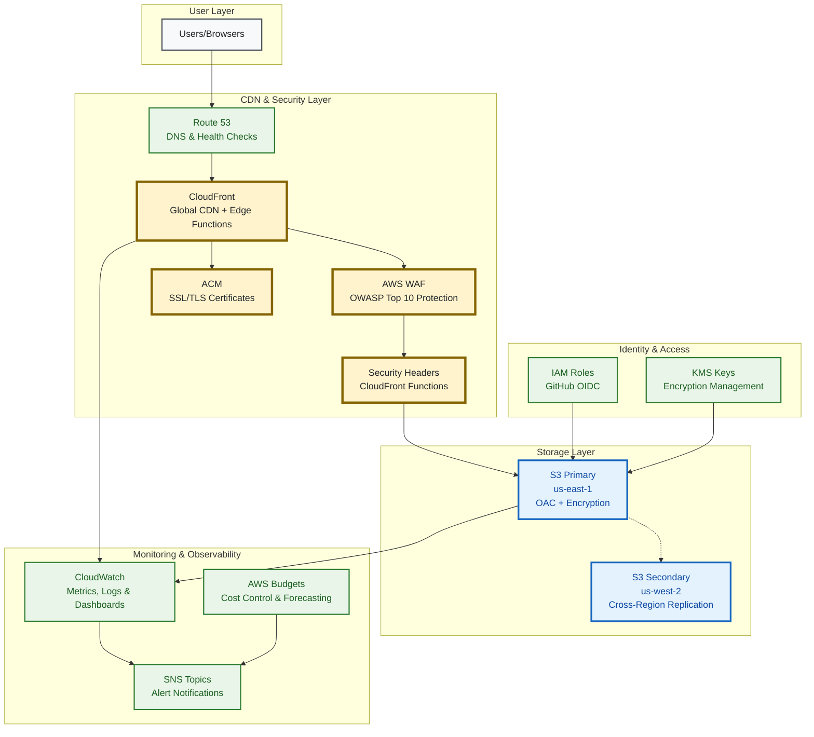
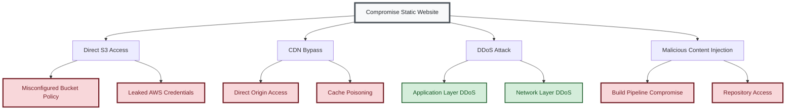
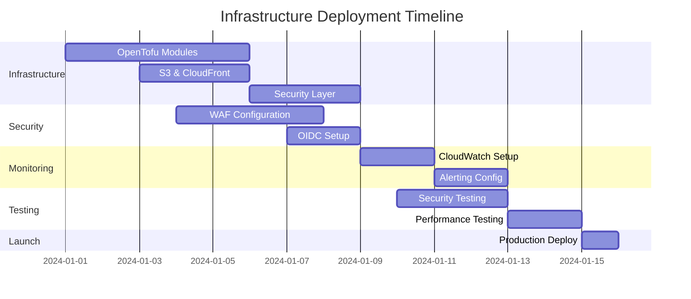

# Infrastructure Architecture

> **🎯 Target Audience**: Cloud architects, platform engineers, security teams  
> **📊 Complexity**: ⭐⭐⭐⭐ Advanced  
> **📋 Prerequisites**: AWS services knowledge, networking fundamentals, security concepts  
> **⏱️ Reading Time**: 20-25 minutes

## Overview

This document details the comprehensive AWS infrastructure architecture for the serverless static website platform. The design implements AWS Well-Architected Framework principles with a focus on security, reliability, performance, and cost optimization.

## High-Level Architecture



## AWS Services Architecture

### Content Delivery Network (CloudFront)

**Service**: Amazon CloudFront  
**Configuration**: Global CDN with 200+ edge locations  

**Key Features**:
- **Global Distribution**: PriceClass_All for worldwide coverage (configurable per environment)
- **HTTP/2 and HTTP/3 Support**: Modern protocol support for performance
- **Origin Access Control (OAC)**: Secure S3 access without public buckets
- **Security Headers**: CloudFront Functions inject security headers automatically
- **Intelligent Caching**: 1-day default TTL, 1-year maximum TTL for optimal performance

**Configuration Details**:
```hcl
# Environment-specific price classes
# Development: PriceClass_100 (US/Europe)
# Staging: PriceClass_200 (US/Europe/Asia)  
# Production: PriceClass_All (Global)
```

### Web Application Firewall (WAF)

**Service**: AWS WAF v2  
**Configuration**: Web ACL with managed rule groups  

**Protection Layers**:
- **OWASP Top 10**: `AWSManagedRulesCommonRuleSet`
- **Known Bad Inputs**: `AWSManagedRulesKnownBadInputsRuleSet`
- **SQL Injection**: `AWSManagedRulesSQLiRuleSet`
- **Rate Limiting**: Configurable per-IP limits (default: 2000 requests/5min)
- **Geographic Filtering**: Optional country-based restrictions

**Current Implementation**:
```hcl
# Rate limiting configuration (environment-specific)
# Development: 1000 requests/5min
# Staging: 2000 requests/5min
# Production: 5000 requests/5min
```

### Storage Layer (S3)

**Primary Storage**: S3 Standard in us-east-1  
**Secondary Storage**: S3 with Cross-Region Replication to us-west-2  

**Security Features**:
- **Public Access Blocking**: All public access blocked by default
- **Origin Access Control**: CloudFront-only access via OAC
- **Server-Side Encryption**: KMS encryption with customer-managed keys
- **Versioning**: Enabled with lifecycle policies for cost optimization

**Performance Optimizations**:
- **Intelligent Tiering**: Automatic cost optimization for infrequently accessed content
- **Transfer Acceleration**: Available for upload scenarios
- **Lifecycle Policies**: Automated cleanup of incomplete multipart uploads

### DNS and Certificates (Route 53 & ACM)

**Service**: Amazon Route 53 (optional) + AWS Certificate Manager  
**Configuration**: DNS management with health checks  

**Features**:
- **SSL/TLS Certificates**: Free ACM certificates with automatic renewal
- **Health Checks**: Route 53 health monitoring with failover routing
- **Global DNS**: Route 53 global anycast DNS for low latency

### Monitoring and Observability

**Services**: CloudWatch, SNS, AWS Budgets  
**Configuration**: Comprehensive monitoring with real-time alerting  

**Monitoring Stack**:
- **CloudWatch Metrics**: Real-time performance and security metrics
- **CloudWatch Logs**: Centralized logging with retention policies
- **CloudWatch Dashboards**: Real-time visualization of key metrics
- **SNS Topics**: Encrypted notification channels for alerts
- **AWS Budgets**: Cost monitoring with forecast and actual spending alerts

### Identity and Access Management

**Service**: AWS IAM with OIDC Provider  
**Configuration**: GitHub Actions integration via OIDC  

**Security Model**:
- **OIDC Authentication**: Secure, temporary credentials for GitHub Actions
- **Least Privilege**: Minimal required permissions for each operation
- **Role-Based Access**: Separate roles for different environments
- **Audit Trail**: All actions logged via CloudTrail

## Security Architecture

### Defense-in-Depth Model

```mermaid
graph TB
    %% Accessibility
    accTitle: Defense-in-Depth Security Layers
    accDescr: Shows five security layers in sequence: Network Security (WAF and CloudFront), Application Security (Headers and CSP), Data Security (Encryption and Access Control), Infrastructure Security (IAM and OIDC), and Monitoring Security (Logging and Alerts). Each layer builds upon the previous one for comprehensive protection.
    
    subgraph "Security Layers"
        L1[Network Security<br/>WAF + CloudFront]
        L2[Application Security<br/>Headers + CSP]
        L3[Data Security<br/>Encryption + Access Control]
        L4[Infrastructure Security<br/>IAM + OIDC]
        L5[Monitoring Security<br/>Logging + Alerts]
    end
    
    L1 --> L2 --> L3 --> L4 --> L5
    
    %% High-Contrast Styling for Accessibility
    classDef networkBox fill:#e3f2fd,stroke:#1565c0,stroke-width:3px,color:#0d47a1
    classDef appBox fill:#f8f9fa,stroke:#495057,stroke-width:3px,color:#212529
    classDef dataBox fill:#d4edda,stroke:#155724,stroke-width:3px,color:#155724
    classDef infraBox fill:#fff3cd,stroke:#856404,stroke-width:3px,color:#212529
    classDef monitorBox fill:#e8f5e8,stroke:#2e7d32,stroke-width:3px,color:#1b5e20
    
    class L1 networkBox
    class L2 appBox
    class L3 dataBox
    class L4 infraBox
    class L5 monitorBox
```



### Threat Modeling and Risk Assessment

**Attack Tree Analysis**:



**Risk Mitigation Status**:
- 🔴 **High Risk (Mitigated)**: OAC prevents direct S3 access, OIDC eliminates credential storage, secure CI/CD with MFA
- 🟢 **Low Risk (Protected)**: WAF and CloudFront provide comprehensive DDoS protection

### Security Controls Implementation

#### 1. Network Security
- **WAF Protection**: OWASP Top 10 coverage with custom rules
- **DDoS Protection**: CloudFront and WAF built-in DDoS mitigation
- **Geographic Filtering**: Configurable country-based access controls
- **Rate Limiting**: Per-IP request throttling to prevent abuse

#### 2. Application Security  
- **Security Headers**: Comprehensive header injection via CloudFront Functions
- **Content Security Policy (CSP)**: Strict CSP headers to prevent XSS
- **HTTPS Enforcement**: Automatic HTTP to HTTPS redirection
- **TLS Configuration**: TLS 1.2+ requirement with strong cipher suites

#### 3. Data Security
- **Encryption at Rest**: KMS encryption for S3 buckets with customer-managed keys
- **Encryption in Transit**: TLS 1.2+ for all data transmission
- **Access Control**: Origin Access Control (OAC) for secure S3 access
- **Data Backup**: Cross-region replication for disaster recovery

#### 4. Infrastructure Security
- **OIDC Authentication**: Secure GitHub Actions integration without stored credentials
- **Least Privilege IAM**: Minimal required permissions with environment separation
- **Audit Logging**: Comprehensive CloudTrail logging for all API calls
- **Resource Isolation**: Environment-specific resource separation

## Performance Architecture

### Global Performance Optimization

**CloudFront Edge Locations**: 200+ worldwide locations  
**Target Metrics**:
- **Global Latency**: < 100ms (95th percentile)
- **Cache Hit Ratio**: > 85%
- **Time to First Byte (TTFB)**: < 200ms

**Optimization Strategies**:
- **Intelligent Caching**: Optimized TTL policies for different content types
- **Compression**: Automatic Gzip compression for text-based content
- **HTTP/2 Support**: Modern protocol support for multiplexing
- **Edge Computing**: CloudFront Functions for header injection

### Reliability and Availability

**Design Targets**:
- **Availability**: 99.9% uptime SLA
- **RTO (Recovery Time Objective)**: < 5 minutes
- **RPO (Recovery Point Objective)**: < 1 minute

**Reliability Features**:
- **Multi-Region Architecture**: Primary (us-east-1) and secondary (us-west-2) regions
- **Cross-Region Replication**: Automatic S3 replication for disaster recovery
- **Health Checks**: Route 53 health monitoring with automatic failover
- **S3 Durability**: 99.999999999% (11 9's) data durability

## Cost Architecture

### Monthly Cost Analysis (USD)

| Service | Usage Assumption | Development | Staging | Production | Rationale |
|---------|------------------|-------------|---------|------------|-----------|
| **S3 Standard** | 1GB storage, 10K requests | $0.25 | $0.25 | $0.25 | Primary storage |
| **S3 CRR** | 1GB replication | $0.00 | $0.03 | $0.03 | DR replication |
| **CloudFront** | 100GB transfer, 1M requests | $4.25 | $6.38 | $8.50 | Price class varies |
| **Route 53** | 1 hosted zone, 1M queries | $0.00 | $0.90 | $0.90 | Optional DNS |
| **AWS WAF** | 1 Web ACL, 1M requests | $6.00 | $6.00 | $6.00 | Security protection |
| **ACM** | 1 SSL certificate | $0.00 | $0.00 | $0.00 | Free certificates |
| **CloudWatch** | 10 metrics, 1GB logs | $1.50 | $2.00 | $2.50 | Monitoring depth |
| **Data Transfer** | 100GB outbound | $4.50 | $6.75 | $9.00 | Price class impact |
| **KMS** | 1 key, 1000 requests | $0.00 | $1.00 | $1.00 | Encryption keys |

**Environment Totals**:
- **Development**: ~$16.50/month (cost-optimized)
- **Staging**: ~$23.31/month (production-like)
- **Production**: ~$28.18/month (full features)

### Cost Optimization Strategies

**Implemented Optimizations**:
1. **Environment-Specific Pricing**: Different CloudFront price classes per environment
2. **Intelligent Tiering**: S3 automatic cost optimization (20-68% savings)
3. **Lifecycle Policies**: Automated cleanup of old versions and incomplete uploads
4. **Resource Right-Sizing**: Environment-appropriate configurations

**Annual Projections**:
- **Total Annual Cost**: $815-$850 (all three environments)
- **Break-Even Point**: Cost-effective for >1,000 monthly visitors
- **Scaling**: Linear cost scaling with traffic growth

## Compliance and Standards

### AWS Well-Architected Framework

#### 1. Operational Excellence ✅
- **Infrastructure as Code**: 100% infrastructure defined in Terraform
- **Automated Operations**: Comprehensive CI/CD pipeline with quality gates
- **Monitoring**: Real-time dashboards and alerting
- **Documentation**: Comprehensive architecture and operational documentation

#### 2. Security ✅
- **Defense-in-Depth**: Multi-layer security architecture
- **Identity Management**: OIDC-based authentication with least privilege
- **Data Protection**: End-to-end encryption and access controls
- **Incident Response**: Automated monitoring and alerting capabilities

#### 3. Reliability ✅
- **Multi-Region**: Cross-region replication and failover capabilities
- **Fault Tolerance**: No single points of failure in architecture
- **Backup and Recovery**: Automated backup with defined RTO/RPO
- **Monitoring**: Comprehensive health monitoring and alerting

#### 4. Performance Efficiency ✅
- **Global CDN**: Optimized content delivery worldwide
- **Caching Strategy**: Intelligent caching with high hit ratios
- **Resource Optimization**: Right-sized resources for each environment
- **Performance Monitoring**: Real-time performance metrics and alerting

#### 5. Cost Optimization ✅
- **Pay-as-Consume**: Serverless architecture with no idle costs
- **Resource Optimization**: Environment-specific configurations
- **Cost Monitoring**: Automated budget tracking and alerts
- **Efficiency**: High cache hit ratios reduce origin costs

#### 6. Sustainability ✅
- **Serverless**: No idle compute resources
- **Global CDN**: Reduced data transfer distances
- **Efficient Caching**: Minimized origin requests
- **AWS Green Energy**: Leveraging AWS renewable energy initiatives

### Security Compliance

**ASVS v4.0 Compliance Status**:

**Level 1 (L1) - ✅ Compliant**:
- Authentication and session management (GitHub OIDC)
- Access control (IAM policies, S3 bucket policies)
- Input validation (WAF rules and validation)
- Cryptography (TLS 1.2+, KMS encryption)

**Level 2 (L2) - ✅ Compliant**:
- Security logging and monitoring (CloudWatch, CloudTrail)
- Data protection (encryption at rest and in transit)
- Communications security (HSTS, CSP headers)
- Secure configuration (automated security scanning)

**Level 3 (L3) - 🔄 Roadmap**:
- Advanced threat protection (GuardDuty integration planned)
- Security automation (automated incident response planned)

## Disaster Recovery and Business Continuity

### Recovery Strategy

**Architecture**: Active-Passive multi-region setup  
**Primary Region**: us-east-1 (N. Virginia)  
**Secondary Region**: us-west-2 (Oregon)  

**Recovery Capabilities**:
- **S3 Cross-Region Replication**: Automatic data replication
- **CloudFront Global**: Automatic failover at edge locations
- **Route 53 Health Checks**: DNS-based failover routing
- **Infrastructure as Code**: Rapid environment recreation

**Recovery Metrics**:
- **RTO (Recovery Time Objective)**: < 5 minutes (DNS propagation)
- **RPO (Recovery Point Objective)**: < 1 minute (S3 CRR)
- **Data Durability**: 99.999999999% (11 9's)

### Backup and Versioning

**S3 Versioning**:
- **Development**: 7-day retention
- **Staging**: 30-day retention  
- **Production**: 90-day retention

**Cross-Region Replication**:
- **Automatic Replication**: Real-time replication to secondary region
- **Encryption**: Replicated data maintains encryption
- **Monitoring**: CloudWatch metrics for replication status

## Implementation Timeline



## Monitoring and Alerting Strategy

### Key Performance Indicators (KPIs)

**Availability Metrics**:
- **Uptime Target**: 99.9%
- **Error Rate**: < 1% for 4xx/5xx responses
- **Health Check**: Route 53 monitoring every 30 seconds

**Performance Metrics**:
- **Global Latency**: < 100ms (95th percentile)
- **Cache Hit Ratio**: > 85%
- **Origin Response Time**: < 200ms

**Security Metrics**:
- **WAF Blocked Requests**: Monitor for attack patterns
- **Failed Authentication**: Monitor OIDC authentication failures
- **Unusual Traffic Patterns**: Geographic and volume anomalies

**Cost Metrics**:
- **Monthly Budget**: Environment-specific thresholds
- **Cost per Request**: Track efficiency metrics
- **Data Transfer**: Monitor outbound transfer costs

### Alert Thresholds

| Severity | Metric | Threshold | Action |
|----------|---------|-----------|--------|
| **Critical** | Service Unavailable | > 5 minutes | Immediate response |
| **Warning** | High Latency | > 200ms for 10 minutes | Investigation required |
| **Info** | Cost Overrun | > 80% of monthly budget | Cost review |
| **Critical** | High Error Rate | > 5% for 5 minutes | Immediate investigation |
| **Warning** | Low Cache Hit | < 70% for 30 minutes | Cache optimization needed |

### Dashboard Configuration

**Real-Time Dashboards**:
- **Infrastructure Overview**: All services health and performance
- **Security Dashboard**: WAF metrics, blocked requests, security events
- **Cost Dashboard**: Current spend, budget tracking, cost per service
- **Performance Dashboard**: Latency, cache metrics, error rates

## Conclusion

This infrastructure architecture provides a robust, secure, and scalable foundation for hosting static websites with enterprise-grade requirements. The design leverages AWS managed services to minimize operational overhead while providing comprehensive security, monitoring, and cost optimization.

**Key Strengths**:
- **Comprehensive Security**: Defense-in-depth with ASVS Level 2 compliance
- **Global Performance**: Sub-100ms latency worldwide with 85%+ cache hit ratio
- **Cost Efficiency**: ~$28/month for production-grade infrastructure
- **Operational Excellence**: Fully automated with comprehensive monitoring
- **High Availability**: 99.9% uptime with multi-region disaster recovery

**Implementation Notes**:
- All infrastructure is defined as code using Terraform/OpenTofu
- Security scanning and compliance validation are automated
- Multi-environment support with environment-specific optimizations
- Comprehensive testing framework with 269+ individual assertions

---

*This architecture documentation reflects the current implementation and is maintained alongside infrastructure changes.*