# Infrastructure Architecture

## Overview

Enterprise-grade static website infrastructure built on AWS with multi-account architecture, designed for security, scalability, and operational excellence.

## System Architecture

### High-Level Architecture

```mermaid
graph TB
    subgraph "User Traffic"
        USERS[👥 Global Users]
    end
    
    subgraph "AWS Global"
        R53[🌐 Route 53<br/>DNS Management]
        CF[⚡ CloudFront<br/>Global CDN]
    end
    
    subgraph "AWS US-East-1"
        WAF[🛡️ WAF<br/>Security Layer]
        S3[📦 S3 Bucket<br/>Static Content]
        
        subgraph "Monitoring"
            CW[📊 CloudWatch<br/>Metrics & Logs]
            SNS[📧 SNS<br/>Alerts]
            BUDGET[💰 AWS Budgets<br/>Cost Control]
        end
    end
    
    subgraph "CI/CD Pipeline"
        GHA[⚙️ GitHub Actions<br/>BUILD → TEST → RUN]
        OIDC[🔐 OIDC Provider<br/>Secure Auth]
    end
    
    USERS --> R53
    R53 --> CF
    CF --> WAF
    WAF --> CF
    CF --> S3
    
    CF --> CW
    S3 --> CW
    WAF --> CW
    CW --> SNS
    CW --> BUDGET
    
    GHA --> OIDC
    OIDC --> S3
    OIDC --> CF
    OIDC --> WAF
    OIDC --> CW
```

## Multi-Account Architecture

### Current State: Single Account (Transitioning)

### Target State: Multi-Account (SRA Aligned)

## AWS Services

### Core Infrastructure Services

| Service | Purpose | Tier | Monthly Cost |
|---------|---------|------|-------------|
| **S3** | Static content storage | Essential | ~$0.25 |
| **CloudFront** | Global CDN | Essential | ~$8.50 |
| **WAF** | Web Application Firewall | Essential | ~$6.00 |
| **CloudWatch** | Monitoring & Alerting | Essential | ~$2.50 |
| **Route 53** | DNS Management | Optional | ~$0.50 |
| **Budgets** | Cost Management | Essential | Free |

### Security Services

| Service | Purpose | Deployment | Cost |
|---------|---------|------------|------|
| **IAM** | Identity & Access Management | Built-in | Free |
| **KMS** | Encryption Key Management | Multi-account | ~$1/key |
| **OIDC Provider** | GitHub Actions Authentication | Per account | Free |
| **WAF** | Application Protection | CloudFront | ~$6/month |

### Monitoring & Observability

| Service | Purpose | Scope | Cost |
|---------|---------|--------|------|
| **CloudWatch Metrics** | Performance monitoring | All services | Included |
| **CloudWatch Alarms** | Threshold alerting | Critical metrics | ~$0.10/alarm |
| **CloudWatch Logs** | Centralized logging | Application logs | ~$0.50/GB |
| **SNS** | Notification delivery | Alert routing | ~$0.50/1M |
| **AWS Budgets** | Cost monitoring | Account-level | Free (first 2) |

## Infrastructure Patterns

### Static Website Pattern

**Components:**
- S3 bucket with static website hosting
- CloudFront distribution for global delivery
- WAF for application security
- CloudWatch for monitoring

**Data Flow:**
1. User requests → Route 53 → CloudFront
2. CloudFront checks WAF rules → Allow/Block
3. CloudFront serves from cache OR fetches from S3
4. All interactions logged to CloudWatch

**Security Layers:**
1. **WAF**: OWASP Top 10 protection, rate limiting
2. **CloudFront OAC**: Restricts direct S3 access
3. **S3 Bucket Policy**: CloudFront-only access
4. **HTTPS Only**: TLS 1.2+ enforcement

### Monitoring Pattern

**Metrics Collection:**
- CloudFront: Traffic, cache hit ratio, error rates
- S3: Storage size, request counts
- WAF: Blocked/allowed requests
- Costs: Service-specific spending

**Alerting Hierarchy:**
- **Critical**: Website down, security breach
- **Warning**: Performance degradation, cost spikes  
- **Info**: Usage trends, capacity planning

### Cost Optimization Pattern

**S3 Storage Optimization:**
- Intelligent Tiering for automatic cost optimization
- Lifecycle policies for version cleanup
- Cross-region replication only for production

**CloudFront Optimization:**
- Price class selection by environment
- Cache policy optimization
- Compression enabled

## Security Model

### Defense in Depth

### Access Control Matrix

| Principal | S3 Access | CloudFront Access | WAF Access | Monitoring Access |
|-----------|-----------|------------------|------------|-------------------|
| **Anonymous Users** | ❌ Blocked | ✅ Via WAF | ❌ No direct access | ❌ No access |
| **CloudFront OAC** | ✅ GetObject only | N/A | N/A | ❌ No access |
| **GitHub Actions** | ✅ Deployment | ✅ Configuration | ✅ Configuration | ✅ Metrics |
| **Admin Users** | ✅ Full access | ✅ Full access | ✅ Full access | ✅ Full access |

### Encryption Strategy

| Data Type | Encryption Method | Key Management |
|-----------|------------------|----------------|
| **S3 Data at Rest** | AES-256 SSE-S3 | AWS Managed |
| **S3 Data at Rest (Sensitive)** | SSE-KMS | Customer Managed |
| **CloudFront Data in Transit** | TLS 1.2+ | AWS Managed |
| **CloudWatch Logs** | SSE-KMS (optional) | Customer Managed |
| **SNS Messages** | SSE-KMS (optional) | Customer Managed |

## Performance Characteristics

### CloudFront Performance

| Metric | Target | Monitoring |
|--------|--------|------------|
| **Cache Hit Ratio** | >85% | CloudWatch Alarm |
| **Origin Latency** | <500ms | CloudWatch Metrics |
| **Error Rate** | <2% | CloudWatch Alarm |
| **Global Availability** | 99.9% | Composite Alarm |

### S3 Performance

| Metric | Target | Monitoring |
|--------|--------|------------|
| **Request Latency** | <100ms | CloudWatch Metrics |
| **Availability** | 99.99% | Service SLA |
| **Durability** | 99.999999999% | Service SLA |

### WAF Performance

| Metric | Target | Monitoring |
|--------|--------|------------|
| **Rule Evaluation** | <10ms | Built-in monitoring |
| **Blocked Requests** | <5% of traffic | CloudWatch Alarm |
| **False Positives** | <0.1% | Manual review |

## Scalability Considerations

### Automatic Scaling

**CloudFront:**
- Automatically scales to handle traffic spikes
- Global edge location distribution
- No configuration required

**S3:**
- Virtually unlimited storage capacity
- Automatic request scaling
- No pre-provisioning needed

**WAF:**
- Scales with CloudFront traffic
- Web ACL capacity limits (1,500 WCU)
- Monitor capacity usage

### Manual Scaling Triggers

| Threshold | Action Required |
|-----------|----------------|
| **Cache Hit Ratio <80%** | Review cache policies |
| **WAF Capacity >80%** | Optimize rules or add ACL |
| **Monthly Cost >Budget** | Review resource usage |
| **Error Rate >5%** | Investigate root cause |

## Disaster Recovery

### Recovery Targets

| Component | RTO | RPO | Strategy |
|-----------|-----|-----|----------|
| **Website Content** | <15 min | <1 hour | S3 Cross-Region Replication |
| **CloudFront Config** | <30 min | <4 hours | Infrastructure as Code |
| **WAF Rules** | <15 min | <4 hours | Infrastructure as Code |
| **Monitoring** | <30 min | <1 day | Infrastructure as Code |

### Backup Strategy

**S3 Content:**
- Cross-region replication to us-west-2
- Versioning enabled with lifecycle policies
- Daily backup verification

**Infrastructure Configuration:**
- All infrastructure defined in OpenTofu
- Configuration stored in Git with versioning
- Automated deployment pipeline

**Monitoring Configuration:**
- Dashboards and alarms as code
- Notification lists externalized to variables
- Regular testing of alert mechanisms

## Cost Optimization

### Monthly Cost Breakdown (Production)

### Cost Control Measures

**Budgets & Alerts:**
- Monthly budget with 80% and 100% alerts
- Service-specific cost tracking
- Anomaly detection enabled

**Resource Optimization:**
- S3 Intelligent Tiering enabled
- CloudFront price class optimization by environment
- Regular cost review and optimization

**Development Cost Control:**
- Lower price class for non-production
- Reduced monitoring retention
- Shared development resources

## Compliance Framework

### Security Standards

| Standard | Compliance Level | Implementation |
|----------|-----------------|----------------|
| **OWASP Top 10** | Full | AWS WAF Core Rule Set |
| **AWS Well-Architected** | Full | Architecture review |
| **SOC 2 Type II** | Partial | Monitoring & logging |
| **ISO 27001** | Baseline | Security controls |

### Audit Trail

**CloudTrail Integration:**
- All API calls logged
- Cross-account audit trail
- Long-term retention in Log Archive account

**Change Management:**
- All changes via Infrastructure as Code
- Git-based change tracking
- Automated deployment history

### Data Classification

| Data Type | Classification | Protection Level |
|-----------|---------------|------------------|
| **Website Content** | Public | Standard encryption |
| **Configuration** | Internal | Enhanced encryption |
| **Logs & Metrics** | Internal | Standard retention |
| **Cost Data** | Confidential | Restricted access |

## Operational Procedures

### Deployment Process

1. **BUILD Phase**: Code validation, security scanning
2. **TEST Phase**: Infrastructure testing, policy validation  
3. **RUN Phase**: Environment-specific deployment

### Monitoring & Alerting

**24/7 Monitoring:**
- Composite health alarm for overall status
- Critical alerts to primary on-call
- Escalation after 15 minutes without response

**Regular Reviews:**
- Weekly: Cost and performance review
- Monthly: Security posture assessment
- Quarterly: Architecture optimization review

### Incident Response

**Severity Levels:**
- **P1 (Critical)**: Website completely down
- **P2 (High)**: Significant performance degradation
- **P3 (Medium)**: Minor issues, feature degradation
- **P4 (Low)**: Cosmetic issues, enhancement requests

**Response Procedures:**
- Automated runbooks for common issues
- Escalation paths clearly defined
- Post-incident review process

## Future Architecture Evolution

### Planned Enhancements

**Phase 1 (Q1 2026):** Multi-Account Migration
- Security OU account deployment
- Workload OU account deployment
- CI/CD pipeline multi-account integration

**Phase 2 (Q2 2026):** Enhanced Security
- Service Control Policies deployment
- Centralized logging architecture
- Advanced threat detection

**Phase 3 (Q3-Q4 2026):** Enterprise Features
- Identity federation (if team grows)
- Disaster recovery automation
- Advanced compliance frameworks

### Scalability Planning

**Traffic Growth:**
- CloudFront handles automatic scaling
- Monitor cache hit ratios and optimize
- Consider multiple distributions for very high traffic

**Team Growth:**
- Implement AWS IAM Identity Center
- Create permission boundaries
- Add additional monitoring and alerting

**Multi-Application:**
- Implement application-specific accounts
- Shared service patterns
- Cross-application monitoring

## Technical Specifications

### Infrastructure as Code

**OpenTofu Modules:**
- `modules/storage/s3-bucket/` - S3 bucket with security
- `modules/networking/cloudfront/` - CDN with OAC
- `modules/security/waf/` - Web application firewall
- `modules/observability/monitoring/` - Monitoring & alerting
- `modules/observability/cost-projection/` - Cost management

**Deployment Structure:**
- `terraform/workloads/static-site/` - Main deployment configuration
- `terraform/foundations/org-management/` - Multi-account management
- Environment-specific backend configurations

### Integration Points

**GitHub Actions Integration:**
- OIDC provider for secure authentication
- Environment-specific deployment workflows
- Automated security scanning and validation

**AWS Service Integration:**
- CloudWatch for centralized monitoring
- SNS for notification routing
- AWS Budgets for cost management
- KMS for encryption key management

---

*This architecture documentation is maintained as part of the Infrastructure as Code repository and is updated with each significant architectural change.*