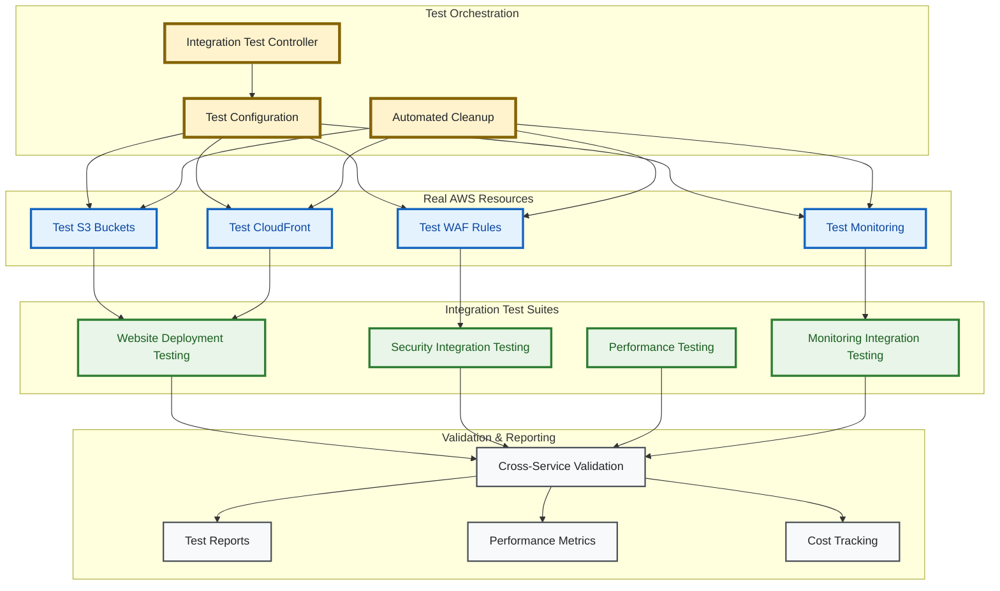
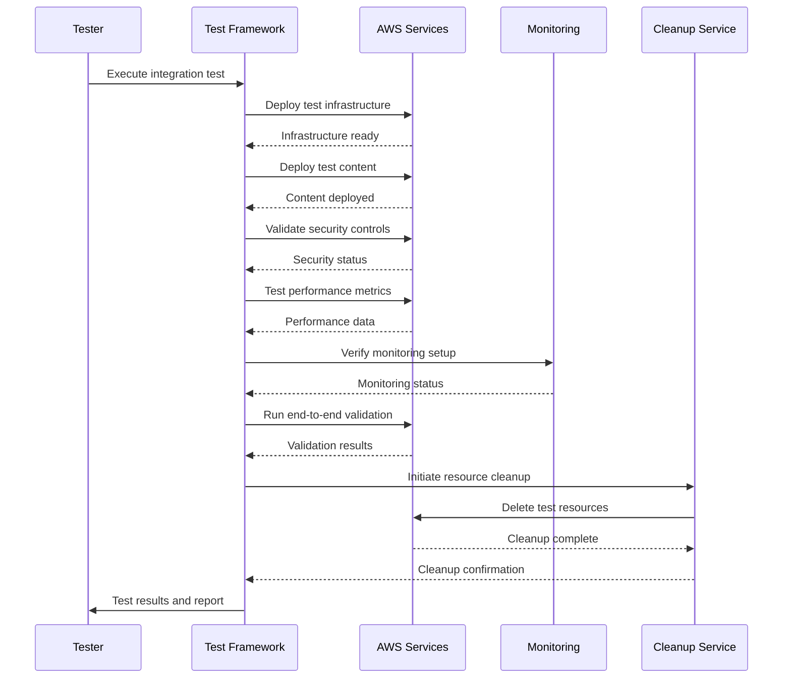

# Integration Testing Architecture

> **🎯 Target Audience**: Test engineers, QA teams, DevOps engineers, CI/CD engineers  
> **📊 Complexity**: ⭐⭐⭐⭐ Advanced  
> **📋 Prerequisites**: AWS experience, testing concepts, infrastructure knowledge  
> **⏱️ Reading Time**: 15-20 minutes

## Overview

This document details the comprehensive integration testing architecture for validating cross-service functionality and end-to-end workflows using real AWS resources. The framework ensures complete system validation through automated deployment, testing, and cleanup procedures while maintaining cost efficiency and security compliance.

## Integration Testing Strategy

### Design Philosophy

**Real Resource Testing**: Deploy actual AWS infrastructure for authentic validation  
**Cost Conscious**: Automated cleanup procedures to minimize testing expenses  
**Security First**: Temporary resources with restricted access and automated destruction  
**End-to-End Coverage**: Complete workflow validation from deployment to monitoring  
**CI/CD Integration**: Seamless integration with automated pipelines  

### Integration Test Architecture



## Integration Test Suites

### 1. Website Deployment Testing

**Purpose**: Complete deployment workflow validation with real AWS resources  
**Scope**: End-to-end website functionality from S3 to global CDN delivery  

**Test Scenarios**:
```bash
# Complete website deployment workflow
test_website_deployment() {
    # Infrastructure deployment
    deploy_test_infrastructure
    validate_s3_bucket_creation
    verify_cloudfront_distribution
    confirm_route53_configuration
    
    # Content deployment  
    upload_test_content
    validate_content_propagation
    verify_global_cdn_access
    test_cache_behavior
    
    # Functional validation
    test_website_accessibility
    validate_ssl_certificate
    verify_security_headers
    confirm_error_page_handling
}
```

**Validation Points**:
- S3 bucket configuration and content upload
- CloudFront distribution setup and propagation
- SSL certificate validation and HTTPS enforcement
- Custom error page functionality
- Global access and CDN edge performance

### 2. Security Integration Testing

**Purpose**: Cross-service security control validation and threat protection  
**Scope**: WAF rules, access controls, encryption, and security headers  

**Test Scenarios**:
```bash
# Security integration validation
test_security_integration() {
    # WAF protection testing
    deploy_waf_configuration
    test_sql_injection_protection
    validate_xss_prevention
    verify_rate_limiting
    test_geographic_blocking
    
    # Access control validation
    verify_origin_access_control
    test_s3_bucket_security
    validate_iam_permissions
    confirm_encryption_at_rest
    
    # Security header testing
    validate_hsts_headers
    verify_content_security_policy
    test_frame_options
    confirm_referrer_policy
}
```

**Security Test Categories**:
- **WAF Rule Validation**: OWASP Top 10 protection testing
- **Access Control Testing**: OAC, bucket policies, IAM validation
- **Encryption Verification**: At-rest and in-transit encryption
- **Header Security**: Security header presence and configuration
- **Penetration Testing**: Automated security scanning and validation

### 3. Performance Testing

**Purpose**: CDN performance, caching efficiency, and global latency validation  
**Scope**: CloudFront performance, cache behavior, and optimization validation  

**Test Scenarios**:
```bash
# Performance integration testing
test_performance_integration() {
    # CDN performance validation
    deploy_cdn_infrastructure
    measure_global_latency
    test_cache_hit_ratios
    validate_compression_efficiency
    verify_http2_support
    
    # Optimization testing
    test_image_optimization
    validate_gzip_compression
    verify_cache_policies
    measure_ttfb_performance
    
    # Load testing
    simulate_traffic_bursts
    test_auto_scaling_behavior  
    validate_cost_optimization
    measure_bandwidth_efficiency
}
```

**Performance Metrics**:
- **Global Latency**: Response times from multiple geographic regions
- **Cache Performance**: Hit ratios, miss rates, invalidation efficiency
- **Compression Ratios**: Gzip and Brotli compression effectiveness
- **Bandwidth Utilization**: Data transfer optimization and cost efficiency
- **Scalability**: Performance under various load conditions

### 4. Monitoring Integration Testing

**Purpose**: Real-time monitoring, alerting, and dashboard functionality validation  
**Scope**: CloudWatch integration, SNS notifications, and operational visibility  

**Test Scenarios**:
```bash
# Monitoring integration validation
test_monitoring_integration() {
    # Dashboard validation
    deploy_monitoring_infrastructure
    validate_cloudwatch_dashboards
    verify_metric_collection
    test_custom_metrics
    
    # Alert testing
    configure_test_alarms
    trigger_threshold_conditions
    validate_sns_notifications
    verify_alert_escalation
    
    # Log integration
    validate_log_aggregation
    test_log_analysis
    verify_retention_policies
    confirm_metric_filters
}
```

**Monitoring Test Areas**:
- **Dashboard Functionality**: Metric visualization and real-time updates
- **Alert Systems**: Threshold monitoring and notification delivery
- **Log Management**: Collection, retention, and analysis capabilities
- **Budget Monitoring**: Cost tracking and threshold alerting
- **Health Checks**: Service availability and performance monitoring

## Test Execution Flow

### End-to-End Test Workflow



### Test Environment Management

**Resource Lifecycle**:
1. **Pre-Test Setup**: Environment validation and prerequisite checks
2. **Infrastructure Deployment**: Real AWS resource provisioning
3. **Configuration Validation**: Resource setup verification
4. **Test Execution**: Automated test suite execution
5. **Result Collection**: Metrics, logs, and validation data gathering
6. **Cleanup Execution**: Complete resource destruction
7. **Cost Reporting**: Test execution cost analysis

**Environment Isolation**:
- Unique resource naming with test prefixes
- Isolated VPCs and security groups (where applicable)
- Temporary IAM roles with minimal permissions
- Automated resource tagging for identification
- Time-based cleanup policies for safety

## Real AWS Resource Testing

### Test Infrastructure Deployment

**Infrastructure Components**:
```hcl
# Test infrastructure deployment
resource "aws_s3_bucket" "integration_test" {
  bucket = "integration-test-${random_id.test_suffix.hex}"
  
  tags = {
    Environment = "integration-test"
    TestRun     = var.test_run_id
    AutoCleanup = "true"
    CreatedBy   = "integration-testing"
  }
}

resource "aws_cloudfront_distribution" "integration_test" {
  # Minimal cost configuration for testing
  price_class = "PriceClass_100"  # US/Europe only
  
  # Test-specific configuration
  comment = "Integration test - ${var.test_run_id}"
  
  tags = {
    Environment = "integration-test"
    TestRun     = var.test_run_id
    AutoCleanup = "true"
  }
}
```

**Cost Management Strategy**:
- **Minimal Configurations**: Use lowest cost resource configurations
- **Regional Restrictions**: Limit to specific regions to reduce costs
- **Time Limits**: Automatic cleanup after maximum test duration
- **Resource Monitoring**: Real-time cost tracking during execution
- **Cleanup Validation**: Confirmation of complete resource destruction

### Validation Procedures

**Cross-Service Communication Testing**:
```bash
# Cross-service integration validation
validate_service_integration() {
    # S3 to CloudFront integration
    upload_test_file_to_s3
    verify_cloudfront_cache_behavior
    validate_origin_access_control
    
    # WAF to CloudFront integration  
    configure_waf_rules
    associate_waf_with_distribution
    test_request_filtering
    
    # Monitoring integration
    validate_cloudwatch_metrics
    test_alarm_thresholds
    verify_sns_notifications
}
```

**Performance Metrics Collection**:
- **Response Time Measurement**: Global latency testing
- **Throughput Analysis**: Bandwidth and transfer rate validation
- **Cache Efficiency**: Hit ratios and cache performance
- **Resource Utilization**: CPU, memory, and network usage
- **Cost Per Request**: Economic efficiency analysis

## Cost Management and Optimization

### Integration Test Cost Analysis

**Estimated Costs Per Test Run**:
| Resource Type | Configuration | Estimated Cost | Duration |
|---------------|---------------|----------------|----------|
| **S3 Storage** | Standard tier, minimal data | $0.01-0.05 | Per test run |
| **CloudFront** | PriceClass_100, limited requests | $0.05-0.15 | Per test run |
| **WAF** | Basic rules, minimal requests | $0.10-0.25 | Per test run |
| **CloudWatch** | Standard metrics, short retention | $0.02-0.08 | Per test run |
| **Data Transfer** | Minimal test traffic | $0.01-0.05 | Per test run |
| **Total Estimated Cost** | **Complete test suite** | **$0.19-0.58** | **Per test run** |

### Cost Optimization Strategies

**Resource Configuration Optimization**:
- Use minimal resource configurations for testing
- Implement regional restrictions to reduce data transfer costs
- Configure short retention periods for logs and metrics
- Utilize spot pricing where applicable
- Implement resource tagging for cost allocation

**Automated Cost Controls**:
```bash
# Cost monitoring and cleanup
monitor_test_costs() {
    # Real-time cost tracking
    track_resource_costs
    validate_cost_thresholds
    
    # Automatic cleanup triggers
    if [ "$COST_EXCEEDED" == "true" ]; then
        trigger_emergency_cleanup
        send_cost_alert_notification
    fi
}
```

## CI/CD Pipeline Integration

### GitHub Actions Integration

**Integration Test Workflow**:
```yaml
integration-testing:
  runs-on: ubuntu-latest
  environment: integration-testing
  permissions:
    id-token: write
    contents: read
  
  steps:
    - name: Configure AWS Credentials
      uses: aws-actions/configure-aws-credentials@v4
      with:
        role-to-assume: ${{ vars.INTEGRATION_TEST_ROLE }}
        aws-region: us-east-1
    
    - name: Run Integration Tests
      run: |
        cd test/integration
        ./run-integration-tests.sh --suite all --cleanup auto
        
    - name: Verify Resource Cleanup
      run: |
        ./scripts/verify-cleanup.sh --test-run-id ${{ github.run_id }}
        
    - name: Upload Test Results
      uses: actions/upload-artifact@v4
      with:
        name: integration-test-results
        path: test/integration/results/
```

### Test Result Reporting

**Comprehensive Test Reports**:
```json
{
  "integration_test_run": {
    "test_run_id": "github-123456789",
    "timestamp": "2024-01-15T10:30:00Z",
    "duration_seconds": 420,
    "total_cost_usd": 0.34,
    "cleanup_verified": true
  },
  "test_suites": {
    "website_deployment": {
      "status": "passed",
      "duration": 180,
      "cost_usd": 0.15,
      "validations_passed": 12
    },
    "security_integration": {
      "status": "passed", 
      "duration": 145,
      "cost_usd": 0.09,
      "security_tests_passed": 8
    }
  }
}
```

## Quality Assurance and Best Practices

### Integration Test Quality Standards

**Test Development Guidelines**:
1. **Resource Isolation**: Each test uses isolated, uniquely named resources
2. **Cleanup Verification**: Automated validation of complete resource cleanup
3. **Cost Monitoring**: Real-time cost tracking with threshold alerts
4. **Error Handling**: Comprehensive error handling with automatic cleanup
5. **Documentation**: Clear test purpose and validation criteria

**Reliability Measures**:
- **Retry Logic**: Automatic retry for transient failures
- **Timeout Management**: Reasonable timeouts with cleanup procedures
- **Error Recovery**: Automatic cleanup on test failures
- **State Validation**: Verification of expected resource states
- **Idempotency**: Tests can be safely re-run without side effects

### Continuous Improvement

**Performance Optimization**:
- Regular analysis of test execution times
- Identification of cost optimization opportunities
- Performance regression detection
- Resource utilization optimization

**Coverage Enhancement**:
- Regular review of test coverage gaps
- Addition of new integration scenarios
- Validation of emerging AWS features
- Security test evolution with threat landscape

---

*For unit testing architecture and module-specific validation, see [Unit Testing Architecture](unit-testing.md).*