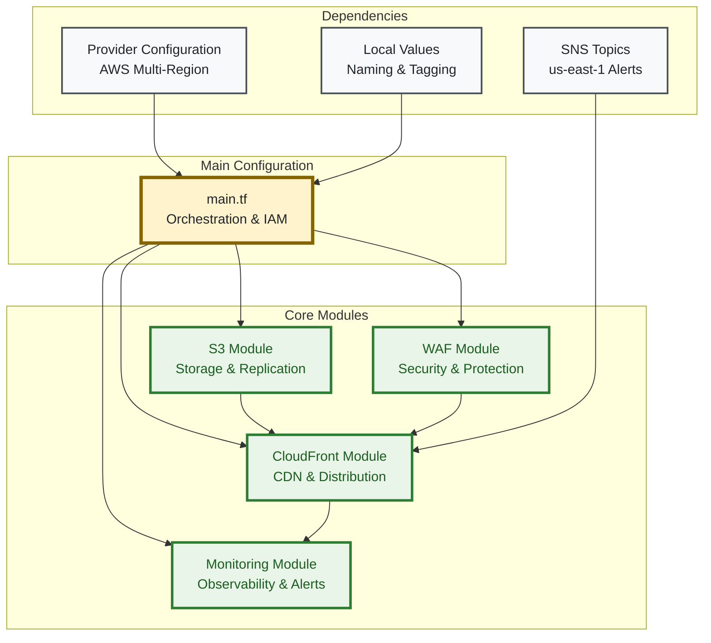

# Terraform Implementation Architecture

> **🎯 Target Audience**: Infrastructure engineers, DevOps engineers, Terraform developers  
> **📊 Complexity**: ⭐⭐⭐⭐ Advanced  
> **📋 Prerequisites**: Terraform/OpenTofu experience, AWS provider knowledge, module development  
> **⏱️ Reading Time**: 20-25 minutes

## Overview

This document details the Terraform/OpenTofu implementation architecture for the AWS static website infrastructure. The design emphasizes modularity, reusability, and comprehensive testing while maintaining strict security and compliance standards.

## Implementation Stack

**Infrastructure as Code**: OpenTofu (open-source Terraform alternative)  
**Version Requirements**: Terraform/OpenTofu >= 1.6.0  
**AWS Provider**: ~> 5.0  
**State Management**: S3 backend with DynamoDB locking  

## Module Architecture

### Core Design Principles

1. **Modularity**: Clear separation of concerns with independent, reusable modules
2. **Composability**: Modules can be combined and configured for different environments
3. **Testability**: Each module is thoroughly tested with comprehensive assertions
4. **Documentation**: Self-documenting code with extensive comments and README files

### Module Dependency Graph



## Module Implementation Details

### 1. S3 Module (`modules/s3/`)

**Purpose**: Primary storage with security, replication, and lifecycle management  
**Independence**: No dependencies on other modules  

**Core Features**:
- **Origin Access Control (OAC)**: Secure CloudFront access without public buckets
- **Server-Side Encryption**: KMS encryption with customer-managed keys
- **Cross-Region Replication**: Optional replication to secondary region
- **Intelligent Tiering**: Automatic cost optimization for infrequently accessed content
- **Lifecycle Policies**: Automated cleanup of incomplete multipart uploads

**Key Resources**:
```hcl
# Primary resources
aws_s3_bucket                         # Main storage bucket
aws_s3_bucket_server_side_encryption  # KMS encryption
aws_s3_bucket_public_access_block     # Security hardening
aws_s3_bucket_versioning              # Version control
aws_s3_bucket_intelligent_tiering     # Cost optimization
aws_s3_bucket_replication_configuration # Cross-region backup (optional)

# Security resources  
aws_s3_bucket_policy                  # Access control policies
aws_cloudfront_origin_access_control  # OAC for secure access
```

**Module Interface**:
```hcl
# Key inputs
variable "bucket_name"                 # Unique bucket identifier
variable "enable_cross_region_replication" # Disaster recovery toggle
variable "replica_region"              # Secondary region for CRR
variable "kms_key_arn"                # Encryption key ARN

# Key outputs
output "bucket_id"                     # Bucket name for CloudFront origin
output "bucket_domain_name"            # Regional domain name
output "origin_access_control_id"      # OAC ID for CloudFront
```

### 2. WAF Module (`modules/waf/`)

**Purpose**: Web application firewall with OWASP Top 10 protection  
**Independence**: No dependencies on other modules  

**Core Features**:
- **AWS Managed Rule Groups**: OWASP Top 10, Known Bad Inputs, SQL Injection protection
- **Rate Limiting**: Configurable per-IP request limits
- **Geographic Filtering**: Optional country-based access controls
- **Custom Rules**: IP allow/block lists and custom security rules
- **Logging**: CloudWatch Logs integration with metric filters

**Key Resources**:
```hcl
# Core WAF resources
aws_wafv2_web_acl                     # Main Web ACL configuration
aws_wafv2_ip_set                      # IP allow/block lists (optional)

# Managed rule groups
AWSManagedRulesCommonRuleSet          # OWASP Top 10 protection
AWSManagedRulesKnownBadInputsRuleSet  # Known malicious patterns
AWSManagedRulesSQLiRuleSet            # SQL injection protection

# Rate limiting
aws_wafv2_rate_based_rule            # Per-IP rate limiting
```

**Module Interface**:
```hcl
# Key inputs
variable "waf_rate_limit"              # Requests per 5-minute window
variable "waf_allowed_countries"       # Geographic filtering (optional)
variable "environment"                 # Environment-specific configurations

# Key outputs
output "web_acl_id"                   # Web ACL ID for CloudFront association
output "web_acl_arn"                  # Web ACL ARN for references
```

### 3. CloudFront Module (`modules/cloudfront/`)

**Purpose**: Global CDN with security headers and caching optimization  
**Dependencies**: S3 module (origin), WAF module (security)  

**Core Features**:
- **Global Distribution**: Configurable price classes per environment
- **Origin Access Control**: Secure S3 integration via OAC
- **Security Headers**: CloudFront Functions for automatic header injection
- **Caching Optimization**: Intelligent TTL policies for performance
- **SSL/TLS**: ACM certificate integration with HTTPS enforcement

**Key Resources**:
```hcl
# Distribution resources
aws_cloudfront_distribution           # Main CDN distribution
aws_cloudfront_function              # Security headers injection
aws_cloudfront_origin_access_control # Secure S3 access

# SSL/TLS resources
aws_acm_certificate                  # SSL certificate (us-east-1)
aws_acm_certificate_validation       # Certificate validation
aws_route53_record                   # DNS validation (optional)

# Monitoring resources
aws_cloudwatch_metric_alarm          # 4xx/5xx error monitoring
```

**Module Interface**:
```hcl
# Key inputs (from other modules)
variable "s3_bucket_domain_name"      # From S3 module output
variable "origin_access_control_id"   # From S3 module output  
variable "web_acl_id"                # From WAF module output

# Key outputs
output "cloudfront_distribution_id"   # Distribution ID for cache invalidation
output "cloudfront_distribution_url"  # Website URL
output "cloudfront_hosted_zone_id"    # Route 53 integration
```

### 4. Monitoring Module (`modules/monitoring/`)

**Purpose**: Comprehensive observability with dashboards, alerts, and cost monitoring  
**Dependencies**: CloudFront module (metrics source)  

**Core Features**:
- **CloudWatch Dashboards**: Real-time performance and security visualization
- **CloudWatch Alarms**: Proactive monitoring with SNS notifications
- **AWS Budgets**: Cost monitoring with forecast alerts
- **Composite Alarms**: Aggregated health monitoring across services
- **Custom Metrics**: Business and operational KPIs

**Key Resources**:
```hcl
# Dashboard resources
aws_cloudwatch_dashboard             # Real-time metrics visualization
aws_cloudwatch_log_group            # Centralized logging

# Alerting resources
aws_cloudwatch_metric_alarm          # Individual service alarms
aws_cloudwatch_composite_alarm       # Aggregated health checks
aws_sns_topic_subscription          # Alert notification channels

# Cost monitoring
aws_budgets_budget                   # Monthly spending limits
aws_budgets_budget_action           # Automated cost controls
```

**Module Interface**:
```hcl
# Key inputs (from other modules)
variable "cloudfront_distribution_id" # From CloudFront module
variable "sns_topic_arn"             # Alert destination
variable "monthly_budget_limit"       # Cost threshold

# Key outputs
output "dashboard_url"               # CloudWatch dashboard URL
output "alarm_arns"                  # Alarm ARNs for automation
```

## Main Configuration Architecture

### Provider Configuration

**Multi-Region Setup**: The main configuration includes three AWS provider configurations:

```hcl
# Primary provider (configurable region)
provider "aws" {
  region = var.aws_region  # Default: us-east-1
}

# CloudFront provider (must be us-east-1)
provider "aws" {
  alias  = "cloudfront" 
  region = "us-east-1"    # Required for ACM certificates
}

# Replica provider (cross-region replication)
provider "aws" {
  alias  = "replica"
  region = var.replica_region  # Default: us-west-2
}
```

### IAM Configuration

**Implementation Note**: IAM resources are managed directly in `main.tf` rather than as a separate module for security and simplicity.

**GitHub OIDC Integration**:
```hcl
# GitHub OIDC Provider
aws_iam_openid_connect_provider

# Environment-specific IAM roles
aws_iam_role (development)
aws_iam_role (staging) 
aws_iam_role (production)

# Role trust policies and permissions
aws_iam_role_policy_attachment
```

**IAM Features**:
- **OIDC Authentication**: Secure GitHub Actions integration without stored credentials
- **Environment Separation**: Dedicated roles for each environment
- **Least Privilege**: Minimal required permissions per environment
- **Audit Trail**: All actions logged via CloudTrail

### Resource Naming and Tagging

**Consistent Naming Strategy**:
```hcl
locals {
  # Global naming with randomization
  bucket_name       = "${var.project_name}-${var.environment}-${random_id.suffix.hex}"
  distribution_name = "${var.project_name}-${var.environment}"
  
  # Standardized tagging
  common_tags = {
    Project     = var.project_name
    Environment = var.environment
    ManagedBy   = "opentofu"
    Repository  = var.github_repository
    Region      = data.aws_region.current.name
    AccountId   = data.aws_caller_identity.current.account_id
  }
}
```

## State Management Architecture

### Backend Configuration

**S3 Backend with DynamoDB Locking**:
```hcl
terraform {
  backend "s3" {
    # Configuration loaded from backend.hcl files
    # Separate configurations per environment
  }
}
```

**Environment-Specific Backends**:
- `backend-dev.hcl`: Development environment state
- `backend-staging.hcl`: Staging environment state  
- `backend-prod.hcl`: Production environment state

**State Security**:
- **Encryption**: Server-side encryption for state files
- **Versioning**: S3 versioning enabled for state history
- **Locking**: DynamoDB table prevents concurrent modifications
- **Access Control**: IAM policies restrict state access

### Environment Configuration

**Variable File Structure**:
```
terraform/environments/
├── dev.tfvars          # Development configuration
├── staging.tfvars      # Staging configuration
└── prod.tfvars         # Production configuration
```

**Environment-Specific Settings**:
```hcl
# Example: Development environment (dev.tfvars)
environment                      = "dev"
cloudfront_price_class          = "PriceClass_100"    # Cost optimization
waf_rate_limit                   = 1000               # Lower traffic limits
enable_cross_region_replication = false              # Cost savings
monthly_budget_limit            = "10"               # Budget control

# Example: Production environment (prod.tfvars)  
environment                      = "prod"
cloudfront_price_class          = "PriceClass_All"   # Global performance
waf_rate_limit                   = 5000              # Higher traffic capacity
enable_cross_region_replication = true              # Disaster recovery
monthly_budget_limit            = "50"              # Production budget
```


## Security and Compliance

### Infrastructure Security

**Resource-Level Security**:
- **S3 Buckets**: Public access blocked, OAC-only access, KMS encryption
- **CloudFront**: HTTPS enforcement, security headers, WAF integration
- **WAF**: OWASP Top 10 protection, rate limiting, geographic filtering
- **IAM**: Least privilege, OIDC authentication, environment separation

**Code Security**:
- **Static Analysis**: Checkov and Trivy security scanning
- **Policy Validation**: OPA/Conftest governance rules
- **Secret Management**: No hardcoded credentials, GitHub Secrets integration
- **Supply Chain**: Pinned provider versions, signed commits

### Compliance Framework

**ASVS v4.0 Compliance**:
- **Level 1**: Basic security requirements ✅
- **Level 2**: Standard security requirements ✅  
- **Level 3**: Advanced security requirements (roadmap)

**AWS Security Best Practices**:
- Well-Architected Framework compliance
- AWS Config rules validation
- CloudTrail audit logging
- AWS Security Hub integration

## Performance Optimization

### Terraform Execution Performance

**Optimization Strategies**:
- **Parallel Module Execution**: Independent modules run concurrently
- **Resource Targeting**: Selective resource updates when possible
- **State Optimization**: Minimal state file size with focused outputs
- **Provider Caching**: Reused provider configurations

**Build Performance Metrics**:
- **Plan Time**: < 30 seconds for full infrastructure
- **Apply Time**: < 5 minutes for complete deployment
- **Test Execution**: < 3 minutes for all 269 tests
- **Validation**: < 15 seconds for syntax and security checks

### Resource Provisioning Optimization

**Efficient Resource Creation**:
- **Dependency Optimization**: Minimal blocking dependencies
- **Parallel Provisioning**: AWS provider parallelism optimization
- **Resource Chunking**: Batch resource creation for efficiency
- **State Refresh**: Optimized state refresh operations

## Maintenance and Operations

### Module Updates and Versioning

**Update Process**:
1. **Development**: Test changes in development environment
2. **Validation**: Run comprehensive test suite
3. **Staging**: Deploy to staging for integration testing
4. **Production**: Controlled production deployment with approval

**Version Management**:
- **Provider Pinning**: Major version constraints (~> 5.0)
- **Module Versioning**: Semantic versioning for internal modules
- **Compatibility Testing**: Automated compatibility validation
- **Rollback Procedures**: Defined rollback and recovery processes

### Operational Procedures

**Daily Operations**:
- **State Backup**: Automated state backup and versioning
- **Drift Detection**: Automated configuration drift detection
- **Security Scanning**: Continuous security validation
- **Cost Monitoring**: Daily cost and budget tracking

**Maintenance Tasks**:
- **Provider Updates**: Monthly provider version reviews
- **Security Updates**: Immediate security patch deployment
- **Performance Review**: Quarterly performance optimization
- **Documentation Updates**: Continuous documentation maintenance

## Migration and Compatibility

### OpenTofu Migration

**Migration Status**: ✅ Complete  
**Compatibility**: 100% Terraform HCL compatibility  
**Benefits**: Open-source governance, community-driven development  

**Migration Features**:
- **Drop-in Replacement**: Direct Terraform → OpenTofu migration
- **State Compatibility**: Existing state files work without modification
- **Provider Ecosystem**: Full AWS provider compatibility
- **Tooling Integration**: Compatible with existing Terraform tooling

### AWS Provider Evolution

**Current Version**: ~> 5.0  
**Update Strategy**: Conservative major version updates  
**Testing**: Comprehensive compatibility testing before updates  

## Troubleshooting and Debugging

### Common Issues and Solutions

**State Lock Issues**:
```bash
# Force unlock state (use carefully)
tofu force-unlock LOCK_ID

# Check lock status
aws dynamodb get-item --table-name terraform-state-lock \
  --key '{"LockID":{"S":"path/to/state"}}'
```

**Module Dependency Issues**:
```bash
# Debug module relationships
tofu graph | dot -Tpng > dependency-graph.png

# Validate module interfaces
tofu validate
```

**Provider Configuration Issues**:
```bash
# Debug provider configuration
tofu providers
tofu providers schema -json
```

### Debug Mode Operations

**Enhanced Debugging**:
```bash
# Enable detailed logging
export TF_LOG=DEBUG
export TF_LOG_PATH=terraform.log

# Trace execution
tofu apply -parallelism=1  # Sequential for easier debugging
```

## Best Practices and Guidelines

### Module Development

1. **Single Responsibility**: Each module handles one AWS service category
2. **Clear Interfaces**: Well-defined inputs and outputs with documentation
3. **Comprehensive Testing**: Test coverage for all functionality
4. **Security First**: Security scanning and compliance validation
5. **Documentation**: README files and inline code documentation

### Code Organization

1. **Consistent Structure**: Standardized file organization across modules
2. **Meaningful Names**: Descriptive resource and variable names
3. **Logical Grouping**: Related resources grouped together
4. **Comment Strategy**: Explanatory comments for complex logic

### Security Practices

1. **No Hardcoded Values**: All sensitive values via variables or data sources
2. **Least Privilege**: Minimal required permissions for each resource
3. **Encryption Everywhere**: Encryption at rest and in transit
4. **Audit Trail**: Comprehensive logging and monitoring

## Conclusion

This Terraform implementation provides a robust, scalable, and maintainable infrastructure foundation. The modular architecture enables easy customization and extension while maintaining security and compliance standards.

**Key Strengths**:
- **Modular Design**: Clear separation of concerns with reusable components
- **Comprehensive Testing**: 269 individual assertions ensure reliability
- **Security Focus**: Built-in security scanning and compliance validation
- **Environment Flexibility**: Easy multi-environment deployment and management
- **Operational Excellence**: Automated testing, monitoring, and maintenance procedures

**Implementation Highlights**:
- OpenTofu compatibility with Terraform ecosystem
- Zero-dependency testing framework for reliability
- Multi-region provider configuration for resilience
- Comprehensive IAM integration with OIDC authentication
- Cost-optimized configurations per environment

---

*This documentation reflects the current Terraform implementation and is maintained alongside infrastructure changes.*