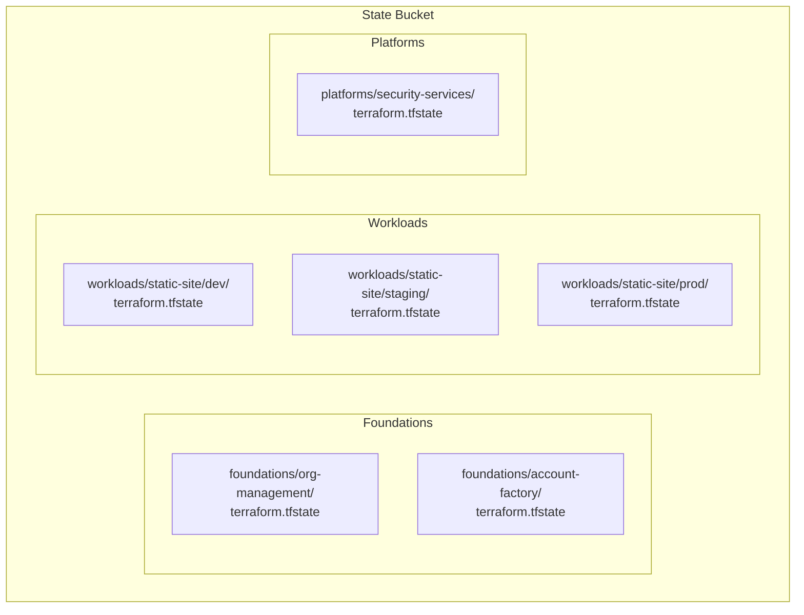

# Terraform Architecture

## Overview

Infrastructure as Code using OpenTofu with modular design, multi-account support, and security-first patterns.

## Architecture Principles

**Modular Design**: Composable, single-responsibility modules with clear interfaces and semantic versioning

**Multi-Account**: Account isolation, centralized governance, secure cross-account access, shared services

**Security-First**: Least privilege, defense in depth, encryption everywhere, complete audit trails

## Directory Structure

```
terraform/
├── foundations/          # AWS Organizations, Account Factory
├── platforms/            # Shared platform services
├── workloads/static-site/ # Main application deployment
└── modules/              # Reusable components
    ├── storage/s3-bucket/
    ├── networking/cloudfront/
    ├── security/waf/
    └── observability/monitoring/
```
│       ├── main.tf              # Main deployment configuration
│       ├── variables.tf         # Environment parameters
│       ├── outputs.tf           # Deployment outputs
│       ├── terraform.tfvars     # Default variable values
│       ├── backend-dev.hcl      # Development backend
│       ├── backend-staging.hcl  # Staging backend
│       ├── backend-prod.hcl     # Production backend
│       └── environments/        # Environment-specific configs
│           ├── dev.tfvars       # Development overrides
│           ├── staging.tfvars   # Staging overrides
│           └── prod.tfvars      # Production overrides
│
└── modules/                      # Reusable infrastructure modules
    ├── storage/
    │   └── s3-bucket/           # S3 bucket with security
    ├── networking/
    │   └── cloudfront/          # CloudFront CDN
    ├── security/
    │   └── waf/                 # Web Application Firewall
    └── observability/
        ├── monitoring/          # CloudWatch monitoring
        └── cost-projection/     # Cost management
```

## Module Architecture

**Standard Structure**: README.md, main.tf, variables.tf, outputs.tf, versions.tf, examples/

**Variable Design**: Required (no default) with validation, optional (sensible defaults), complex objects with proper typing

**Output Patterns**: Resource IDs/ARNs, computed values, sensitive data (properly marked)

## State Management

### Backend Configuration

#### S3 Backend with State Locking

```hcl
terraform {
  backend "s3" {
    # Configuration provided via backend config files
    # terraform init -backend-config=backend-dev.hcl
    
    # Required settings (in backend-*.hcl files):
    # bucket         = "terraform-state-bucket-name"
    # key            = "workloads/static-site/dev/terraform.tfstate"
    # region         = "us-east-1"
    # encrypt        = true
    # kms_key_id     = "alias/terraform-state-key"
    
    # Optional security settings
    skip_region_validation      = false
    skip_credentials_validation = false
    skip_metadata_api_check     = false
  }
}
```

#### Environment-Specific Backend Files

**backend-dev.hcl:**
```hcl
bucket     = "static-site-terraform-state-us-east-1"
key        = "workloads/static-site/dev/terraform.tfstate"
region     = "us-east-1"
encrypt    = true
```

**backend-staging.hcl:**
```hcl
bucket     = "static-site-terraform-state-us-east-1"
key        = "workloads/static-site/staging/terraform.tfstate"
region     = "us-east-1"
encrypt    = true
```

**backend-prod.hcl:**
```hcl
bucket     = "static-site-terraform-state-us-east-1"
key        = "workloads/static-site/prod/terraform.tfstate"
region     = "us-east-1"
encrypt    = true
```

### State Organization Strategy



## Provider Configuration

### AWS Provider Patterns

#### Single Account Configuration
```hcl
terraform {
  required_providers {
    aws = {
      source  = "hashicorp/aws"
      version = "~> 5.0"
    }
  }
}

provider "aws" {
  region = var.aws_region
  
  default_tags {
    tags = var.common_tags
  }
}
```

#### Multi-Account Configuration
```hcl
# Default provider for current account
provider "aws" {
  region = var.aws_region
  
  default_tags {
    tags = var.common_tags
  }
}

# Management account provider
provider "aws" {
  alias  = "management"
  region = var.aws_region
  
  assume_role {
    role_arn = var.management_role_arn
  }
  
  default_tags {
    tags = var.common_tags
  }
}

# Security account provider
provider "aws" {
  alias  = "security"
  region = var.aws_region
  
  assume_role {
    role_arn = var.security_role_arn
  }
  
  default_tags {
    tags = var.common_tags
  }
}
```

#### CloudFront-Specific Provider
```hcl
# CloudFront resources must be in us-east-1
provider "aws" {
  alias  = "cloudfront"
  region = "us-east-1"
  
  default_tags {
    tags = var.common_tags
  }
}
```

### Provider Version Constraints

```hcl
terraform {
  required_version = ">= 1.6"
  
  required_providers {
    aws = {
      source                = "hashicorp/aws"
      version               = "~> 5.0"
      configuration_aliases = [aws.cloudfront, aws.management]
    }
    
    random = {
      source  = "hashicorp/random"
      version = "~> 3.4"
    }
    
    null = {
      source  = "hashicorp/null"
      version = "~> 3.2"
    }
  }
}
```

## Module Development Patterns

### Resource Naming Convention

```hcl
locals {
  # Standardized naming pattern
  name_prefix = "${var.project_name}-${var.environment}"
  
  # Resource-specific naming
  s3_bucket_name      = "${local.name_prefix}-static-website-${random_id.suffix.hex}"
  cloudfront_name     = "${local.name_prefix}-distribution"
  waf_name           = "${local.name_prefix}-web-acl"
  
  # Common tags applied to all resources
  common_tags = merge(var.common_tags, {
    Project     = var.project_name
    Environment = var.environment
    ManagedBy   = "opentofu"
    Module      = basename(abspath(path.module))
  })
}
```

### Resource Dependencies

```hcl
# Explicit dependencies for resource ordering
resource "aws_s3_bucket" "website" {
  bucket = local.s3_bucket_name
  
  tags = local.common_tags
}

resource "aws_cloudfront_distribution" "website" {
  # Implicit dependency on S3 bucket
  origin {
    domain_name = aws_s3_bucket.website.bucket_domain_name
    origin_id   = "S3-${aws_s3_bucket.website.id}"
    
    origin_access_control_id = aws_cloudfront_origin_access_control.website.id
  }
  
  # Explicit dependency on WAF
  web_acl_id = var.web_acl_id
  depends_on = [var.waf_web_acl_dependency]
  
  tags = local.common_tags
}
```

### Data Source Patterns

```hcl
# Current AWS account and region
data "aws_caller_identity" "current" {}
data "aws_region" "current" {}

# Existing resources (secure approach)
data "aws_iam_role" "github_actions" {
  name = var.github_actions_role_name
}

data "aws_iam_openid_connect_provider" "github" {
  arn = var.oidc_provider_arn
}

# KMS key for encryption
data "aws_kms_key" "default" {
  key_id = var.kms_key_arn != null ? var.kms_key_arn : "alias/aws/s3"
}
```

## Environment Configuration

### Variable Precedence

1. **terraform.tfvars** (default values)
2. **environments/*.tfvars** (environment-specific)
3. **Environment variables** (TF_VAR_*)
4. **Command line** (-var)

### Environment-Specific Files

**environments/dev.tfvars:**
```hcl
# Development environment configuration
environment = "dev"

# Cost-optimized settings
cloudfront_price_class = "PriceClass_100"
cache_hit_rate_threshold = 70.0
monthly_budget_limit = 25.00

# Development-specific settings
enable_detailed_monitoring = false
log_retention_days = 7

# Relaxed security for testing
waf_rate_limit = 10000
core_rule_set_overrides = [
  "SizeRestrictions_BODY",
  "GenericRFI_BODY"
]
```

**environments/prod.tfvars:**
```hcl
# Production environment configuration
environment = "prod"

# Performance-optimized settings
cloudfront_price_class = "PriceClass_All"
cache_hit_rate_threshold = 90.0
monthly_budget_limit = 500.00

# Production security settings
enable_detailed_monitoring = true
log_retention_days = 365

# Strict security settings
waf_rate_limit = 1000
core_rule_set_overrides = []

# Enhanced monitoring
enable_sampling = true
blocked_requests_threshold = 100
```

## Security Patterns

### IAM Role-Based Access

```hcl
# GitHub Actions role for deployment
data "aws_iam_role" "github_actions" {
  name = var.github_actions_role_name
}

# Service-specific IAM policies
resource "aws_iam_role_policy_attachment" "github_s3_access" {
  role       = data.aws_iam_role.github_actions.name
  policy_arn = aws_iam_policy.s3_deployment.arn
}

resource "aws_iam_policy" "s3_deployment" {
  name        = "${var.project_name}-s3-deployment"
  description = "S3 deployment permissions for ${var.project_name}"
  
  policy = jsonencode({
    Version = "2012-10-17"
    Statement = [
      {
        Effect = "Allow"
        Action = [
          "s3:GetObject",
          "s3:PutObject",
          "s3:DeleteObject",
          "s3:ListBucket"
        ]
        Resource = [
          aws_s3_bucket.website.arn,
          "${aws_s3_bucket.website.arn}/*"
        ]
      }
    ]
  })
}
```

### Encryption Configuration

```hcl
# S3 bucket encryption
resource "aws_s3_bucket_server_side_encryption_configuration" "website" {
  bucket = aws_s3_bucket.website.id
  
  rule {
    apply_server_side_encryption_by_default {
      sse_algorithm     = var.kms_key_arn != null ? "aws:kms" : "AES256"
      kms_master_key_id = var.kms_key_arn
    }
    
    bucket_key_enabled = true
  }
}

# CloudWatch log encryption
resource "aws_cloudwatch_log_group" "main" {
  name              = "/aws/${var.project_name}"
  retention_in_days = var.log_retention_days
  kms_key_id        = var.kms_key_arn
  
  tags = local.common_tags
}
```

## Testing Architecture

### Unit Testing Framework

```bash
# Test structure
test/
├── unit/                       # Module unit tests
│   ├── test-s3.sh             # S3 module tests
│   ├── test-cloudfront.sh     # CloudFront module tests
│   ├── test-waf.sh            # WAF module tests
│   ├── test-monitoring.sh     # Monitoring module tests
│   └── test-static-analysis.sh # Terraform syntax tests
├── integration/               # End-to-end tests
│   ├── test-deployment.sh     # Full deployment test
│   └── test-multi-env.sh      # Multi-environment test
└── functions/                 # Shared test functions
    └── test-functions.sh      # Common test utilities
```

### Static Analysis Tests

```bash
#!/bin/bash
# Static analysis testing without AWS dependencies

# Test Terraform syntax validation
test_terraform_syntax_validation() {
    local modules=(
        "terraform/modules/storage/s3-bucket"
        "terraform/modules/networking/cloudfront" 
        "terraform/modules/security/waf"
        "terraform/modules/observability/monitoring"
        "terraform/workloads/static-site"
    )
    
    for module_dir in "${modules[@]}"; do
        if [[ -d "$module_dir" ]]; then
            cd "$module_dir"
            
            if tofu fmt -check=true -diff=true . >/dev/null 2>&1; then
                if tofu validate >/dev/null 2>&1; then
                    echo "✅ $module_dir: Valid Terraform syntax"
                else
                    echo "❌ $module_dir: Validation failed"
                    exit 1
                fi
            else
                echo "❌ $module_dir: Formatting issues"
                exit 1
            fi
            
            cd - >/dev/null
        fi
    done
}
```

### Module Testing Pattern

```bash
# S3 module unit tests
test_s3_required_resources() {
    assert_contains "$(cat main.tf)" "resource \"aws_s3_bucket\"" 
    assert_contains "$(cat main.tf)" "aws_s3_bucket_versioning"
    assert_contains "$(cat main.tf)" "aws_s3_bucket_encryption"
}

test_s3_security_configuration() {
    assert_contains "$(cat main.tf)" "block_public_acls = true"
    assert_contains "$(cat main.tf)" "block_public_policy = true"
    assert_contains "$(cat main.tf)" "ignore_public_acls = true"
    assert_contains "$(cat main.tf)" "restrict_public_buckets = true"
}
```

## CI/CD Integration

### GitHub Actions Workflow Integration

```yaml
# Terraform deployment workflow
- name: Setup OpenTofu
  run: |
    curl -L -o /tmp/tofu.zip https://github.com/opentofu/opentofu/releases/download/v${{ env.OPENTOFU_VERSION }}/tofu_${{ env.OPENTOFU_VERSION }}_linux_amd64.zip
    unzip -q /tmp/tofu.zip -d /tmp
    sudo mv /tmp/tofu /usr/local/bin/

- name: Initialize Terraform
  working-directory: terraform/workloads/static-site
  run: |
    tofu init -backend-config=backend-${{ inputs.environment }}.hcl

- name: Validate Configuration
  working-directory: terraform/workloads/static-site
  run: |
    tofu validate
    tofu fmt -check=true

- name: Plan Deployment
  working-directory: terraform/workloads/static-site
  run: |
    tofu plan -var-file="environments/${{ inputs.environment }}.tfvars" -out=tfplan

- name: Apply Changes
  if: inputs.deploy_infrastructure == 'true'
  working-directory: terraform/workloads/static-site
  run: |
    tofu apply -auto-approve tfplan
```

### Environment-Specific Deployment

```yaml
# Environment routing logic
- name: Determine Environment
  id: env
  run: |
    case "${{ github.ref_name }}" in
      feature/*|bugfix/*|hotfix/*) echo "environment=dev" >> $GITHUB_OUTPUT ;;
      main) echo "environment=staging" >> $GITHUB_OUTPUT ;;
      v*.*.*) echo "environment=prod" >> $GITHUB_OUTPUT ;;
      *) echo "environment=dev" >> $GITHUB_OUTPUT ;;
    esac

- name: Deploy Infrastructure
  uses: ./.github/workflows/deploy-terraform
  with:
    environment: ${{ steps.env.outputs.environment }}
    working-directory: terraform/workloads/static-site
    backend-config: backend-${{ steps.env.outputs.environment }}.hcl
    var-file: environments/${{ steps.env.outputs.environment }}.tfvars
```

## Best Practices

### Code Organization

1. **Module Isolation**: Each module should be independently testable
2. **Clear Dependencies**: Use explicit `depends_on` when implicit dependencies aren't sufficient
3. **Consistent Naming**: Follow naming conventions across all resources
4. **Documentation**: Every module must have comprehensive README
5. **Version Pinning**: Use version constraints for all providers

### Security Practices

1. **Least Privilege**: IAM policies with minimal required permissions
2. **Encryption**: Enable encryption for all data at rest and in transit
3. **Secrets Management**: Never store secrets in Terraform code
4. **State Security**: Encrypt Terraform state and restrict access
5. **Audit Trail**: Enable CloudTrail for all API calls

### Performance Optimization

1. **Parallel Execution**: Design modules for maximum parallelism
2. **Resource Lifecycle**: Use lifecycle rules to prevent accidental deletion
3. **State Refresh**: Minimize state file size and refresh time
4. **Provider Caching**: Use provider caching for faster operations
5. **Module Versioning**: Use versioned modules to enable rollbacks

### Cost Management

1. **Environment Tagging**: Consistent tagging for cost allocation
2. **Resource Sizing**: Right-size resources for each environment
3. **Cleanup Automation**: Automated cleanup of unused resources
4. **Cost Monitoring**: Built-in cost alerts and budgets
5. **Optimization Reviews**: Regular cost optimization reviews

## Troubleshooting Guide

### Common Issues

**State Locking Errors:**
```bash
# Manually release state lock (use with caution)
tofu force-unlock <lock-id>

# Check lock status
aws dynamodb get-item \
  --table-name terraform-state-locks \
  --key '{"LockID":{"S":"bucket/key"}}'
```

**Provider Configuration Issues:**
```bash
# Validate provider configuration
tofu providers

# Check AWS credentials
aws sts get-caller-identity

# Test OIDC authentication
aws sts assume-role-with-web-identity \
  --role-arn $AWS_ROLE_ARN \
  --role-session-name test-session \
  --web-identity-token $ACTIONS_ID_TOKEN_REQUEST_TOKEN
```

**Module Dependency Issues:**
```bash
# View dependency graph
tofu graph | dot -Tsvg > graph.svg

# Debug specific resource
tofu show aws_s3_bucket.website

# Refresh state
tofu refresh
```

### Debugging Commands

```bash
# Enable debug logging
export TF_LOG=DEBUG
export TF_LOG_PATH=terraform.log

# Validate configuration
tofu validate

# Check formatting
tofu fmt -check=true -diff=true

# Plan with detailed output
tofu plan -detailed-exitcode

# Show current state
tofu state list
tofu state show <resource>

# Import existing resource
tofu import aws_s3_bucket.website bucket-name
```

## Migration Strategies

### Module Upgrades

```hcl
# Version pinning for stable upgrades
module "s3_bucket" {
  source  = "./modules/storage/s3-bucket"
  version = "~> 2.1.0"  # Allow patch updates only
  
  # Module configuration
  bucket_name = var.bucket_name
}
```

### State Migration

```bash
# Move resource between states
tofu state mv aws_s3_bucket.old aws_s3_bucket.new

# Remove resource from state
tofu state rm aws_s3_bucket.unused

# Import existing resource
tofu import aws_s3_bucket.website bucket-name
```

### Multi-Account Migration

1. **Phase 1**: Deploy organization management
2. **Phase 2**: Create target accounts
3. **Phase 3**: Deploy infrastructure to new accounts
4. **Phase 4**: Migrate data and DNS
5. **Phase 5**: Decommission old infrastructure

---

*This Terraform architecture documentation is maintained as part of the Infrastructure as Code repository and is updated with each significant architectural change.*