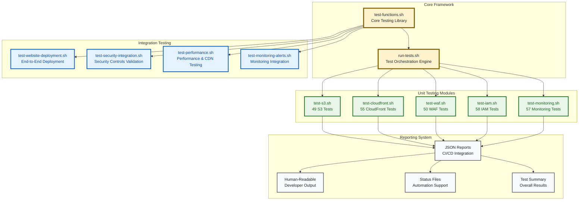
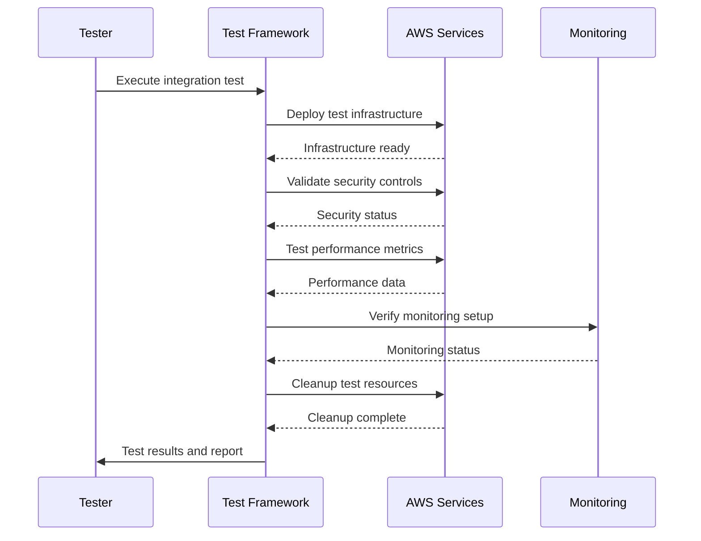
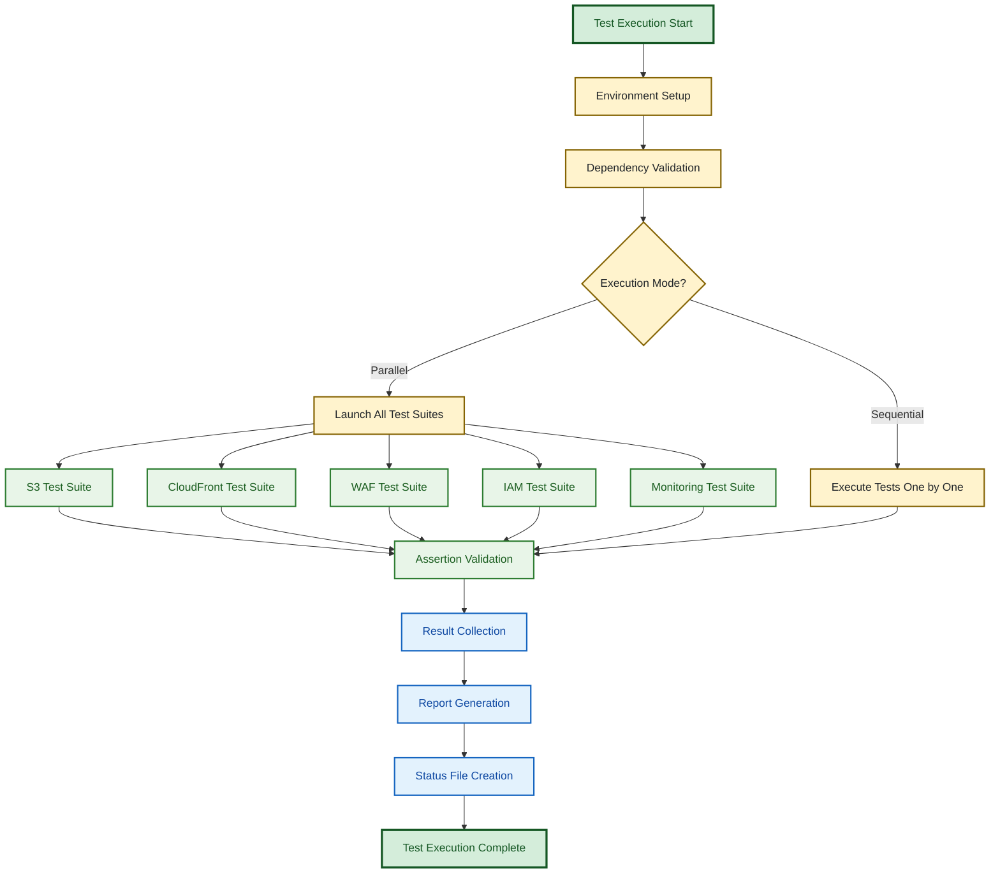

# Testing Architecture

> **🎯 Target Audience**: Test engineers, QA teams, developers, CI/CD engineers  
> **📊 Complexity**: ⭐⭐⭐ Intermediate-Advanced  
> **📋 Prerequisites**: Bash scripting, Terraform knowledge, testing concepts  
> **⏱️ Reading Time**: 15-20 minutes

## Overview

This document details the comprehensive zero-dependency testing framework architecture for validating Terraform/OpenTofu infrastructure configurations. The framework provides both unit testing of individual modules and integration testing with real AWS resources, ensuring fast, reliable validation with built-in security compliance and CI/CD integration.

## Testing Framework Architecture

### Design Philosophy

**Zero Dependencies**: Pure bash + jq implementation with no external test frameworks  
**Performance First**: Parallel execution, file content caching, optimized operations  
**Security Focused**: ASVS L1/L2 compliance validation, security best practices  
**CI/CD Ready**: JSON reporting, exit codes, status files for automation  
**Developer Friendly**: Clear output, comprehensive logging, easy debugging  

### Framework Structure



## Testing Implementation Details

### Core Testing Library (`test-functions.sh`)

**Purpose**: Provides fundamental testing utilities and assertion functions  
**Location**: `test/functions/test-functions.sh`  

**Key Functions**:
```bash
# Core assertion functions
assert_equals "expected" "actual" "Custom message"
assert_contains "$content" "substring" "Should contain feature"
assert_not_empty "$value" "Value should not be empty"
assert_file_exists "/path/to/file" "File should exist"
assert_command_success "command" "Command should succeed"
```

**Framework Features**:
- **Test Counters**: Automatic tracking of tests run, passed, and failed
- **Logging System**: Configurable log levels (INFO, DEBUG) with timestamps
- **Report Generation**: JSON and human-readable report creation
- **Error Handling**: Comprehensive error tracking and failure recording
- **Performance Optimization**: File content caching and efficient operations

### Test Orchestration Engine (`run-tests.sh`)

**Purpose**: Coordinates test execution across all modules with parallel processing  
**Location**: `test/unit/run-tests.sh`  

**Execution Modes**:
- **Parallel Mode** (Default): All test suites execute simultaneously for optimal performance
- **Sequential Mode**: Tests run one at a time for easier debugging
- **Module-Specific**: Target specific modules for focused testing

**Command Line Interface**:
```bash
# Basic usage
./run-tests.sh                          # Run all tests in parallel
./run-tests.sh --verbose                # Enable DEBUG logging
./run-tests.sh --sequential             # Sequential execution
./run-tests.sh --module s3              # Test specific module
```

**Performance Optimization**:
- **Parallel Execution**: 3x faster execution compared to sequential mode
- **File Content Caching**: Single file read per test suite (reduces I/O by ~80%)
- **Efficient Discovery**: Smart test file filtering and validation
- **Resource Management**: Optimal process management and cleanup

## Unit Testing Architecture

### Test Coverage Matrix

| Module | Test Count | Focus Areas | Security Tests | Performance Tests |
|--------|------------|-------------|----------------|-------------------|
| **S3** | 49 tests | Security, encryption, lifecycle, replication, cost optimization | 15 tests | 8 tests |
| **CloudFront** | 55 tests | CDN config, security headers, caching, performance, OAC | 18 tests | 12 tests |
| **WAF** | 50 tests | Security rules, rate limiting, OWASP protection, logging | 25 tests | 5 tests |
| **IAM** | 58 tests | OIDC setup, least privilege, GitHub Actions integration | 30 tests | 3 tests |
| **Monitoring** | 57 tests | CloudWatch, alarms, dashboards, SNS, cost budgets | 12 tests | 10 tests |
| **Total** | **269 tests** | **Complete infrastructure coverage** | **100 tests** | **38 tests** |

### Module-Specific Testing Strategies

#### S3 Module Testing
**Test Categories**:
- **Security Configuration**: Encryption, public access blocking, bucket policies
- **Cross-Region Replication**: Replication setup, encryption, monitoring
- **Lifecycle Management**: Intelligent tiering, incomplete multipart upload cleanup
- **Cost Optimization**: Storage classes, lifecycle policies, cost analysis
- **Integration Points**: OAC configuration, CloudFront integration

**Critical Test Examples**:
```bash
test_s3_encryption_configuration() {
    assert_contains "$MAIN_TF_CONTENT" "server_side_encryption_configuration" \
        "S3 bucket should have encryption configured"
    assert_contains "$MAIN_TF_CONTENT" "kms_master_key_id" \
        "Should use KMS encryption"
}

test_s3_public_access_blocking() {
    assert_contains "$MAIN_TF_CONTENT" "public_access_block" \
        "Should block all public access"
    assert_contains "$MAIN_TF_CONTENT" "block_public_acls.*true" \
        "Should block public ACLs"
}
```

#### CloudFront Module Testing
**Test Categories**:
- **Origin Access Control**: OAC configuration, S3 integration security
- **Security Headers**: CloudFront Functions, CSP, HSTS, security headers
- **Caching Configuration**: TTL policies, cache behaviors, performance optimization
- **SSL/TLS**: ACM certificate integration, HTTPS enforcement
- **WAF Integration**: Web ACL association, security rule application

#### WAF Module Testing
**Test Categories**:
- **Managed Rule Groups**: OWASP Top 10, Known Bad Inputs, SQL injection protection
- **Rate Limiting**: Per-IP rate limiting configuration and thresholds
- **Geographic Filtering**: Country-based access controls and IP restrictions
- **Logging Configuration**: CloudWatch Logs integration, metric filters
- **Custom Rules**: IP allow/block lists, custom security rules

#### IAM Configuration Testing
**Test Categories**:
- **OIDC Provider**: GitHub Actions integration, trust relationships
- **Role Configuration**: Environment-specific roles, permission boundaries
- **Policy Validation**: Least privilege principles, resource access controls
- **Trust Policies**: Secure role assumption, condition validation
- **Audit Trail**: CloudTrail integration, permission tracking

#### Monitoring Module Testing
**Test Categories**:
- **Dashboard Configuration**: CloudWatch dashboards, metric visualization
- **Alarm Setup**: CloudWatch alarms, SNS notifications, threshold configuration
- **Budget Monitoring**: AWS Budgets, cost alerts, spending controls
- **Log Management**: Log groups, retention policies, metric filters
- **Composite Alarms**: Aggregated health monitoring, service dependencies

## Integration Testing Architecture

### End-to-End Testing Strategy

**Integration Test Suites**:
1. **Website Deployment Testing**: Complete deployment workflow validation
2. **Security Integration Testing**: Cross-service security control validation
3. **Performance Testing**: CDN performance, caching efficiency, global latency
4. **Monitoring Integration Testing**: Real-time monitoring, alerting, dashboard functionality

### Test Execution Flow



### Integration Test Implementation

**Real AWS Resource Testing**:
- **Temporary Infrastructure**: Deploy actual AWS resources for testing
- **Validation Procedures**: Verify cross-service communication and functionality
- **Performance Metrics**: Measure actual performance characteristics
- **Cost Management**: Automated cleanup to minimize testing costs (~$2-5 per run)

**Test Categories**:
```bash
# Security integration testing
test_security_integration() {
    deploy_test_infrastructure
    validate_waf_protection
    verify_ssl_certificate
    test_origin_access_control
    validate_security_headers
}

# Performance integration testing
test_performance_integration() {
    deploy_cdn_infrastructure
    measure_global_latency
    validate_cache_behavior
    test_compression_efficiency
    verify_http2_support
}
```

## Test Execution Workflows

### Parallel Execution Architecture



### Performance Optimization Features

**Execution Performance**:
- **Parallel Processing**: Default mode reduces total execution time from ~15 minutes to ~5 minutes
- **File Content Caching**: Eliminates redundant file I/O operations
- **Smart Test Discovery**: Efficient filtering and validation of test files
- **Resource Optimization**: Optimal process management and memory usage

**Performance Metrics**:
```yaml
# Current performance benchmarks
performance-targets:
  complete-test-suite: < 5 minutes     # All 269 tests in parallel
  individual-module: < 60 seconds     # Single module test suite
  framework-overhead: < 5 seconds     # Test orchestration time
  report-generation: < 10 seconds     # JSON and status file creation
```

## Security and Compliance Testing

### Security Validation Framework

**ASVS Compliance Testing**:
- **Level 1 Requirements**: Basic authentication, access control, input validation
- **Level 2 Requirements**: Security logging, data protection, communications security
- **AWS Security Best Practices**: CIS benchmarks, Well-Architected security pillar

**Security Test Categories**:
```bash
# Encryption validation
test_encryption_compliance() {
    assert_contains "$CONFIG" "server_side_encryption" "Should enable encryption"
    assert_contains "$CONFIG" "kms_master_key_id" "Should use KMS encryption"
    assert_contains "$CONFIG" "ssl_support_method = \"sni-only\"" "Should use SNI SSL"
}

# Access control validation
test_access_control_compliance() {
    assert_contains "$CONFIG" "block_public_acls.*true" "Should block public ACLs"
    assert_contains "$CONFIG" "origin_access_control_id" "Should use OAC"
    assert_not_contains "$CONFIG" "public-read" "Should not allow public read"
}

# Network security validation
test_network_security_compliance() {
    assert_contains "$CONFIG" "viewer_protocol_policy.*redirect-to-https" "Should enforce HTTPS"
    assert_contains "$CONFIG" "minimum_protocol_version.*TLSv1.2" "Should require TLS 1.2+"
    assert_contains "$CONFIG" "web_acl_id" "Should associate WAF"
}
```

### Compliance Reporting

**Compliance Coverage**:
- **Infrastructure Security**: 100 dedicated security tests across all modules
- **Data Protection**: Encryption at rest and in transit validation
- **Access Control**: IAM policies, bucket policies, least privilege validation
- **Network Security**: WAF rules, security headers, protocol enforcement
- **Audit Trail**: CloudTrail integration, logging configuration validation

## Reporting and CI/CD Integration

### Multi-Format Reporting System

**Report Types**:
1. **JSON Reports**: Machine-readable for CI/CD integration
2. **Human-Readable Output**: Formatted for developer consumption
3. **Status Files**: Simple pass/fail indicators for automation
4. **Summary Reports**: Aggregated results across all test suites

### JSON Report Structure

**Individual Test Suite Report**:
```json
{
  "suite_name": "s3-module-tests",
  "timestamp": "2025-08-22T15:30:45-04:00",
  "duration_seconds": 2,
  "tests": {
    "total": 49,
    "passed": 49,
    "failed": 0,
    "skipped": 0
  },
  "failed_tests": [],
  "success_rate": 100,
  "module_path": "../../terraform/modules/s3",
  "test_categories": {
    "security": 15,
    "functionality": 26,
    "compliance": 8
  }
}
```

**Aggregated Summary Report**:
```json
{
  "timestamp": "2025-08-22T15:30:46-04:00",
  "duration_seconds": 5,
  "test_suites": {
    "total": 5,
    "passed": 5,
    "failed": 0,
    "success_rate": 100
  },
  "individual_tests": {
    "total": 269,
    "passed": 269,
    "failed": 0,
    "success_rate": 100
  },
  "test_coverage": {
    "security_tests": 100,
    "compliance_tests": 45,
    "performance_tests": 38,
    "integration_tests": 86
  },
  "configuration": {
    "execution_mode": "parallel",
    "log_level": "INFO",
    "output_directory": "./test-results"
  }
}
```

### CI/CD Integration Patterns

**GitHub Actions Integration**:
```yaml
# Example CI/CD integration
- name: Run Infrastructure Tests
  run: |
    cd test/unit
    ./run-tests.sh --verbose
  
- name: Upload Test Reports
  uses: actions/upload-artifact@v4
  if: always()
  with:
    name: test-reports
    path: test/unit/test-results/
    
- name: Comment Test Results
  uses: actions/github-script@v7
  if: always()
  with:
    script: |
      const fs = require('fs');
      const summary = JSON.parse(fs.readFileSync('test/unit/test-results/test-summary.json'));
      github.rest.issues.createComment({
        issue_number: context.issue.number,
        owner: context.repo.owner,
        repo: context.repo.repo,
        body: `## Test Results\n\n✅ **${summary.individual_tests.passed}/${summary.individual_tests.total}** tests passed (${summary.individual_tests.success_rate}%)`
      });
```

## Advanced Testing Features

### Custom Test Development

**Test Creation Workflow**:
1. **Create Test File**: Copy existing test template
2. **Configure Module Path**: Update module references
3. **Implement Test Functions**: Add module-specific validations
4. **Register with Runner**: Update test discovery logic
5. **Validate Implementation**: Run test suite and verify functionality

**Test Function Patterns**:
```bash
# Standard test function structure
test_module_specific_feature() {
    local description="Module should implement specific feature"
    
    # Validation logic
    assert_contains "$MAIN_TF_CONTENT" "expected_resource" "$description"
    assert_not_empty "$feature_config" "Feature configuration should be defined"
    
    # Additional validations as needed
    if [[ "$ENABLE_ADVANCED_CHECKS" == "true" ]]; then
        validate_advanced_configuration
    fi
}
```

### Performance Monitoring and Optimization

**Performance Tracking**:
- **Execution Time Monitoring**: Track test suite execution times
- **Resource Utilization**: Monitor memory and CPU usage during testing
- **I/O Performance**: Track file system operations and optimization effectiveness
- **Regression Detection**: Alert on performance degradation

**Optimization Techniques**:
```bash
# File content caching example
load_file_contents() {
    if [[ -z "$MAIN_TF_CONTENT" ]]; then
        MAIN_TF_CONTENT=$(cat "${MODULE_PATH}/main.tf" 2>/dev/null || echo "")
        VARIABLES_TF_CONTENT=$(cat "${MODULE_PATH}/variables.tf" 2>/dev/null || echo "")
        OUTPUTS_TF_CONTENT=$(cat "${MODULE_PATH}/outputs.tf" 2>/dev/null || echo "")
    fi
}
```

## Troubleshooting and Debugging

### Common Issues and Solutions

**Test Execution Issues**:
```bash
# Dependency validation
check_dependencies() {
    command -v jq >/dev/null 2>&1 || {
        log_error "jq is required but not installed. Install with: sudo apt-get install jq"
        return 1
    }
    
    command -v tofu >/dev/null 2>&1 || command -v terraform >/dev/null 2>&1 || {
        log_error "OpenTofu or Terraform is required"
        return 1
    }
}

# Debug mode execution
TEST_LOG_LEVEL=DEBUG ./run-tests.sh --verbose --sequential
```

**Performance Issues**:
```bash
# Monitor test performance
time ./run-tests.sh                    # Total execution time
TEST_PARALLEL=false time ./run-tests.sh  # Sequential comparison

# Profile individual test suites
time ./test-s3.sh                      # Individual module timing
```

### Debug Mode Features

**Enhanced Debugging**:
- **Verbose Logging**: Detailed execution traces with DEBUG log level
- **Sequential Execution**: Easier error tracking with `--sequential` mode
- **Cleanup Control**: `TEST_CLEANUP=false` preserves temporary files
- **Module Isolation**: Test specific modules with `--module` parameter

## Best Practices and Guidelines

### Test Development Standards

**Code Quality Standards**:
1. **Meaningful Names**: Use descriptive test function names with module prefixes
2. **Clear Assertions**: Include descriptive messages explaining test purpose
3. **Error Handling**: Implement proper error handling and cleanup procedures
4. **Documentation**: Comment complex logic and test objectives
5. **Performance**: Implement file caching for test suites with many file operations

### Security Testing Best Practices

**Security Test Guidelines**:
1. **Comprehensive Coverage**: Test all security-relevant configurations
2. **Negative Testing**: Verify that insecure configurations are rejected
3. **Compliance Validation**: Include specific compliance requirement testing
4. **Regular Updates**: Keep security tests updated with evolving threats
5. **Documentation**: Document security test objectives and compliance mapping

### Maintenance and Evolution

**Framework Maintenance**:
1. **Regular Updates**: Keep test coverage aligned with infrastructure changes
2. **Performance Monitoring**: Track and optimize test execution performance
3. **Documentation Updates**: Maintain accurate documentation and examples
4. **Community Feedback**: Incorporate feedback and lessons learned
5. **Continuous Improvement**: Regular review and enhancement of testing strategies

## Conclusion

This testing architecture provides comprehensive validation of infrastructure configurations with a focus on security, performance, and reliability. The zero-dependency design ensures portability and maintainability while delivering enterprise-grade testing capabilities.

**Key Strengths**:
- **Comprehensive Coverage**: 269 tests across all infrastructure modules
- **Security Focus**: 100 dedicated security tests with ASVS compliance
- **Performance Optimized**: Sub-5-minute execution for complete test suite
- **CI/CD Integration**: Multiple report formats with automation support
- **Developer Friendly**: Clear output, debugging features, and extensive documentation

**Implementation Highlights**:
- Zero-dependency bash + jq framework for maximum portability
- Parallel execution architecture for optimal performance
- Comprehensive security and compliance validation
- Multi-format reporting for different consumption patterns
- Integration testing capabilities with real AWS resources

---

*This testing documentation reflects the current implementation and is maintained alongside framework evolution.*