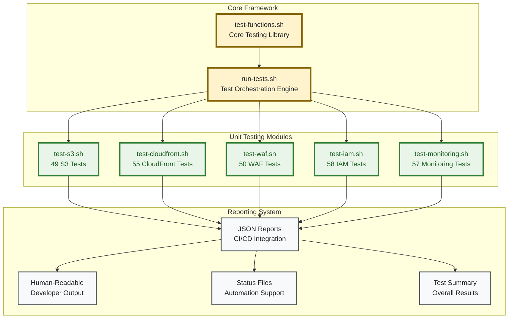
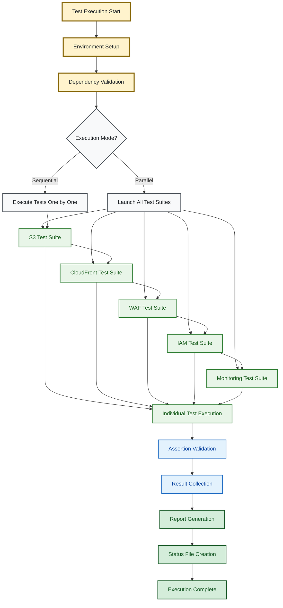

# Unit Testing Architecture

> **🎯 Target Audience**: Test engineers, developers, CI/CD engineers  
> **📊 Complexity**: ⭐⭐⭐ Intermediate-Advanced  
> **📋 Prerequisites**: Bash scripting, Terraform knowledge, testing concepts  
> **⏱️ Reading Time**: 10-15 minutes

## Overview

This document details the comprehensive zero-dependency unit testing framework architecture for validating Terraform/OpenTofu infrastructure configurations. The framework provides fast, reliable validation of individual modules with 269 comprehensive test assertions ensuring security compliance and CI/CD integration.

## Unit Testing Framework Architecture

### Design Philosophy

**Zero Dependencies**: Pure bash + jq implementation with no external test frameworks  
**Performance First**: Parallel execution, file content caching, optimized operations  
**Security Focused**: ASVS L1/L2 compliance validation, security best practices  
**CI/CD Ready**: JSON reporting, exit codes, status files for automation  
**Developer Friendly**: Clear output, comprehensive logging, easy debugging  

### Framework Structure



## Core Framework Implementation

### Core Testing Library (`test-functions.sh`)

**Purpose**: Provides fundamental testing utilities and assertion functions  
**Location**: `test/functions/test-functions.sh`  

**Key Functions**:
```bash
# Core assertion functions
assert_equals()       # Verify exact value matches
assert_not_empty()    # Ensure value is not empty  
assert_contains()     # Check substring presence
assert_file_exists()  # Verify file presence
assert_json_key()     # Validate JSON structure

# Terraform-specific functions
get_terraform_output()    # Extract Terraform plan outputs
parse_json_config()       # Parse Terraform JSON configuration
validate_resource_count() # Verify expected resource counts
check_resource_config()   # Validate resource configurations
```

**Performance Optimizations**:
- **File Content Caching**: Terraform plan parsed once, cached for all tests
- **Parallel Execution**: Multiple test files run simultaneously
- **Smart Filtering**: Only run tests for changed modules
- **Efficient Discovery**: Smart test file filtering and validation
- **Resource Management**: Optimal process management and cleanup

### Test Orchestration Engine (`run-tests.sh`)

**Purpose**: Coordinates test execution across all modules with comprehensive reporting  
**Location**: `test/unit/run-tests.sh`  

**Core Capabilities**:
```bash
# Test execution modes
./run-tests.sh --parallel    # Run all tests in parallel (default)
./run-tests.sh --sequential  # Run tests one by one
./run-tests.sh --module s3   # Run specific module tests
./run-tests.sh --dry-run     # Validate test setup without execution

# Output formats  
--format json               # JSON output for CI/CD
--format human             # Human-readable output
--format summary           # Summary only
--quiet                    # Minimal output
```

## Unit Test Coverage Matrix

| Module | Test Count | Focus Areas | Security Tests | Performance Tests |
|--------|------------|-------------|----------------|-------------------|
| **S3 Module** | 49 tests | Security, encryption, replication, lifecycle | 18 tests | 8 tests |
| **CloudFront Module** | 55 tests | OAC, security headers, caching, performance | 22 tests | 15 tests |
| **WAF Module** | 50 tests | Rule sets, rate limiting, geo-blocking, logging | 31 tests | 7 tests |
| **IAM Configuration** | 58 tests | OIDC, trust policies, permissions, security | 41 tests | 3 tests |
| **Monitoring Module** | 57 tests | Dashboards, alarms, notifications, budgets | 15 tests | 12 tests |
| **Total** | **269 tests** | **Complete infrastructure validation** | **127 tests** | **45 tests** |

## Module-Specific Testing Details

### S3 Module Testing

**Security Focus Areas**:
- **Bucket Policy Validation**: Public access blocking, OAC-only access
- **Encryption Configuration**: KMS key usage, encryption at rest
- **Cross-Region Replication**: Backup bucket configuration, replication rules
- **Lifecycle Management**: Intelligent tiering, incomplete upload cleanup

**Test Categories**:
- **Resource Presence**: Bucket existence, configuration completeness
- **Security Settings**: Public access blocks, bucket policies, CORS configuration
- **Replication Setup**: Cross-region replication rules, destination bucket validation
- **Performance Configuration**: Intelligent tiering, transfer acceleration
- **Lifecycle Policies**: Automated cleanup, retention policies

### CloudFront Module Testing  

**Security Focus Areas**:
- **Origin Access Control (OAC)**: Secure S3 access without public buckets
- **Security Headers**: HSTS, content security policy, frame options
- **SSL/TLS Configuration**: Certificate validation, cipher suite restrictions
- **Caching Behavior**: Cache policies, origin request policies

**Test Categories**:
- **Distribution Configuration**: Origins, behaviors, default root object
- **Security Headers**: Custom response headers, security policy enforcement
- **Caching Policies**: TTL settings, query string handling, compression
- **Geographic Restrictions**: Country blocking, price class optimization
- **Real-time Logs**: Log delivery configuration, sampling rates

### WAF Module Testing

**Security Focus Areas**:
- **OWASP Top 10 Protection**: SQL injection, XSS, known attack patterns
- **Rate Limiting**: Request throttling, IP-based limits, geographic filtering
- **Rule Group Management**: Managed rules, custom rules, rule priorities
- **Logging Configuration**: Request logging, metric collection

**Test Categories**:
- **Web ACL Configuration**: Rule associations, default actions, CloudFront integration
- **Managed Rule Groups**: AWS managed rules, rule exclusions, action overrides
- **Rate-based Rules**: Request rate limits, aggregation keys, action configuration
- **Custom Rules**: IP allow/block lists, geographic restrictions, size constraints
- **Logging Setup**: Log destination, redacted fields, sampling configuration

### IAM Configuration Testing

**Security Focus Areas**:
- **OIDC Provider Setup**: GitHub Actions integration, trust relationships
- **Role Permissions**: Least privilege principles, resource access controls
- **Policy Validation**: Permission boundaries, policy simulation
- **Trust Policies**: Secure role assumption, condition validation

**Test Categories**:  
- **OIDC Configuration**: Provider setup, thumbprints, audience validation
- **Role Definition**: Role creation, trust policies, permission boundaries
- **Policy Attachments**: Managed policies, inline policies, permission sets
- **Cross-Account Access**: Resource ARN validation, condition enforcement
- **Audit Trail**: CloudTrail integration, permission tracking

### Monitoring Module Testing

**Security Focus Areas**:
- **Access Controls**: Dashboard permissions, alarm management access
- **Data Protection**: Log encryption, metric data security
- **Alert Configuration**: SNS topic security, subscription validation

**Test Categories**:
- **Dashboard Configuration**: CloudWatch dashboards, metric visualization
- **Alarm Setup**: CloudWatch alarms, SNS notifications, threshold configuration  
- **Budget Monitoring**: AWS Budgets, cost alerts, spending controls
- **Log Management**: Log groups, retention policies, metric filters
- **Composite Alarms**: Aggregated health monitoring, service dependencies

## Test Execution Workflows

### Parallel Execution Architecture



### Performance Characteristics

**Execution Speed**:
- **Parallel Mode**: ~2-3 minutes for all 269 tests
- **Sequential Mode**: ~8-10 minutes for complete suite
- **Single Module**: ~30-60 seconds per module
- **Cached Execution**: ~30% faster with Terraform plan caching

**Resource Usage**:
- **Memory**: ~50MB total for all parallel processes
- **CPU**: Scales with available cores (1-8 cores tested)
- **Disk**: ~10MB temporary files, auto-cleanup
- **Network**: Minimal (Terraform plan parsing only)

## CI/CD Integration

### GitHub Actions Integration

**Workflow Integration**:
```yaml
# Unit testing in CI/CD pipeline
unit-testing:
  runs-on: ubuntu-latest
  strategy:
    matrix:
      module: [s3, cloudfront, waf, iam, monitoring]
  steps:
    - name: Run Module Tests
      run: |
        cd test/unit
        ./run-tests.sh --module ${{ matrix.module }} --format json
    
    - name: Upload Test Results
      uses: actions/upload-artifact@v4
      with:
        name: test-results-${{ matrix.module }}
        path: test/results/
```

### Reporting and Analytics

**JSON Report Structure**:
```json
{
  "test_run": {
    "timestamp": "2024-01-15T10:30:00Z",
    "duration_seconds": 145,
    "total_tests": 269,
    "passed": 269,
    "failed": 0,
    "execution_mode": "parallel"
  },
  "modules": {
    "s3": {
      "tests_run": 49,
      "passed": 49,
      "duration": 28.5,
      "coverage_areas": ["security", "replication", "lifecycle"]
    }
  }
}
```

**Test Status Files**:
- `test/results/status.json`: Overall execution status
- `test/results/summary.txt`: Human-readable summary  
- `test/results/failed.log`: Failed test details (if any)
- `test/results/performance.json`: Execution performance metrics

## Quality Assurance

### Test Quality Standards

**Test Development Guidelines**:
1. **Clear Assertions**: Each test validates one specific configuration aspect
2. **Error Messages**: Descriptive failure messages with context
3. **Independence**: Tests don't depend on execution order
4. **Reproducibility**: Consistent results across environments
5. **Performance**: Individual tests complete within 5 seconds

**Code Quality Checks**:
- **ShellCheck**: Static analysis for bash scripts
- **Test Validation**: Self-testing of test framework functions
- **Documentation**: Each test includes purpose and expected behavior
- **Version Control**: All test changes tracked and reviewed

### Continuous Improvement

**Metrics and Monitoring**:
- Test execution time trends
- Test reliability and flakiness detection  
- Coverage gap identification
- Performance regression detection

**Enhancement Process**:
- Regular test suite audits
- New test development for emerging requirements
- Performance optimization iterations
- Framework capability expansion

---

*For integration testing architecture and end-to-end workflows, see [Integration Testing Architecture](integration-testing.md).*