# Unit Testing Architecture

## Overview

Zero-dependency testing framework architecture designed to validate infrastructure code quality, security compliance, and deployment readiness without requiring AWS resources or complex test harnesses.

## Testing Philosophy

### Zero-Dependency Principle
- **No AWS Resources Required**: Tests validate code structure, syntax, and compliance without provisioning actual infrastructure
- **Fast Feedback Loop**: Complete test suite runs in under 5 minutes locally and in CI/CD
- **Deterministic Results**: Tests produce consistent results regardless of AWS account state or external dependencies
- **Cost-Effective**: No AWS charges for running comprehensive test suite

### Defense-in-Depth Testing Strategy

```mermaid
graph TB
    subgraph "Static Analysis Layer"
        SYNTAX[🔧 Syntax Validation]
        FORMAT[📝 Code Formatting]
        LINT[🧹 Linting Rules]
    end
    
    subgraph "Security Testing Layer"
        CHECKOV[🛡️ Checkov Scanning]
        TRIVY[🔍 Trivy Analysis]
        SECRETS[🔐 Secret Detection]
    end
    
    subgraph "Policy Testing Layer"
        OPA[📋 OPA Policies]
        COMPLIANCE[✅ Compliance Checks]
        STANDARDS[📊 Standards Validation]
    end
    
    subgraph "Integration Testing Layer"
        MODULE[🧩 Module Testing]
        DEPENDENCY[🔗 Dependency Validation]
        CONFIG[⚙️ Configuration Testing]
    end
    
    SYNTAX --> CHECKOV
    FORMAT --> TRIVY
    LINT --> SECRETS
    
    CHECKOV --> OPA
    TRIVY --> COMPLIANCE
    SECRETS --> STANDARDS
    
    OPA --> MODULE
    COMPLIANCE --> DEPENDENCY
    STANDARDS --> CONFIG
```



## Test Architecture

### Testing Phases

#### Phase 1: Syntax and Format Validation
**Purpose**: Ensure code quality and consistency
**Tools**: OpenTofu CLI, terraform fmt
**Duration**: ~30 seconds
**Coverage**: 100% of .tf files

```bash
# Syntax validation
find terraform/ -name "*.tf" -exec tofu validate {} \;

# Format checking
tofu fmt -check -recursive terraform/

# Variable validation
tofu validate terraform/workloads/static-site/
```

**Validation Rules**:
- All `.tf` files must pass OpenTofu syntax validation
- Code formatting must be consistent with `tofu fmt` standards
- Variable types and constraints must be properly defined
- Resource references must be valid

#### Phase 2: Static Security Analysis
**Purpose**: Identify security vulnerabilities and misconfigurations
**Tools**: Checkov, Trivy, custom security policies
**Duration**: ~2-3 minutes
**Coverage**: Infrastructure code, container images, dependencies

```bash
# Checkov security scanning
checkov -d terraform/ --framework terraform \
  --check CKV_AWS_144,CKV_AWS_145,CKV_AWS_18 \
  --quiet --compact

# Trivy vulnerability scanning
trivy fs terraform/ --format json \
  --severity HIGH,CRITICAL

# Custom security validation
./scripts/validate-security-compliance.sh
```

**Security Test Categories**:
- **Encryption**: S3 encryption, CloudFront HTTPS, KMS usage
- **Access Control**: IAM policies, bucket policies, OAC configuration
- **Network Security**: WAF rules, security groups, public access prevention
- **Monitoring**: CloudWatch alarms, logging configuration
- **Compliance**: OWASP Top 10, CIS benchmarks, AWS best practices

#### Phase 3: Policy Validation
**Purpose**: Ensure infrastructure meets organizational policies
**Tools**: Open Policy Agent (OPA), Rego policies
**Duration**: ~1 minute
**Coverage**: All terraform resources

```bash
# OPA policy validation
opa test policies/ --verbose

# Custom policy checks
conftest test --policy policies/ terraform/workloads/static-site/
```

**Policy Categories**:
- **Resource Tagging**: Required tags, naming conventions
- **Cost Control**: Resource limits, instance types
- **Security Baseline**: Mandatory security controls
- **Compliance**: Regulatory requirements, standards adherence

#### Phase 4: Module Integration Testing
**Purpose**: Validate module interactions and configuration
**Tools**: Custom test scripts, terraform plan analysis
**Duration**: ~1-2 minutes
**Coverage**: Module interfaces, dependencies, outputs

```bash
# Module interface validation
./scripts/test-module-interfaces.sh

# Dependency graph validation
terraform graph terraform/workloads/static-site/ | dot -Tpng > dependency-graph.png

# Output validation
./scripts/validate-module-outputs.sh
```

## Test Framework Components

### Directory Structure

```
tests/
├── unit/                          # Unit tests for individual modules
│   ├── storage/
│   │   └── s3-bucket/
│   │       ├── test_basic.tf
│   │       ├── test_encryption.tf
│   │       └── test_policies.tf
│   ├── networking/
│   │   └── cloudfront/
│   │       ├── test_distribution.tf
│   │       ├── test_oac.tf
│   │       └── test_security.tf
│   ├── security/
│   │   └── waf/
│   │       ├── test_rules.tf
│   │       ├── test_associations.tf
│   │       └── test_monitoring.tf
│   └── observability/
│       └── monitoring/
│           ├── test_dashboards.tf
│           ├── test_alarms.tf
│           └── test_budgets.tf
├── integration/                   # Integration tests
│   ├── static-site-integration.tf
│   └── cross-module-dependencies.tf
├── policies/                      # OPA/Rego policies
│   ├── security/
│   │   ├── encryption.rego
│   │   ├── access-control.rego
│   │   └── network-security.rego
│   ├── compliance/
│   │   ├── tagging.rego
│   │   ├── naming.rego
│   │   └── resource-limits.rego
│   └── cost-optimization/
│       ├── instance-types.rego
│       └── storage-classes.rego
├── fixtures/                      # Test data and configurations
│   ├── valid-configs/
│   ├── invalid-configs/
│   └── edge-cases/
├── scripts/                       # Test execution scripts
│   ├── run-unit-tests.sh
│   ├── run-integration-tests.sh
│   ├── run-security-tests.sh
│   └── generate-test-report.sh
└── reports/                       # Test output and reports
    ├── junit-results.xml
    ├── coverage-report.html
    └── security-scan-results.json
```

### Test Execution Scripts

#### Master Test Runner
```bash
#!/bin/bash
# tests/scripts/run-all-tests.sh

set -euo pipefail

TEST_DIR="$(cd "$(dirname "${BASH_SOURCE[0]}")/.." && pwd)"
REPORT_DIR="$TEST_DIR/reports"
EXIT_CODE=0

mkdir -p "$REPORT_DIR"

echo "🧪 Running Zero-Dependency Infrastructure Tests"
echo "=============================================="

# Phase 1: Syntax and Format
echo "📝 Phase 1: Syntax and Format Validation"
if ! ./scripts/run-syntax-tests.sh; then
    echo "❌ Syntax tests failed"
    EXIT_CODE=1
else
    echo "✅ Syntax tests passed"
fi

# Phase 2: Security Analysis
echo "🛡️ Phase 2: Security Analysis"
if ! ./scripts/run-security-tests.sh; then
    echo "❌ Security tests failed"
    EXIT_CODE=1
else
    echo "✅ Security tests passed"
fi

# Phase 3: Policy Validation
echo "📋 Phase 3: Policy Validation"
if ! ./scripts/run-policy-tests.sh; then
    echo "❌ Policy tests failed"
    EXIT_CODE=1
else
    echo "✅ Policy tests passed"
fi

# Phase 4: Module Integration
echo "🧩 Phase 4: Module Integration Testing"
if ! ./scripts/run-integration-tests.sh; then
    echo "❌ Integration tests failed"
    EXIT_CODE=1
else
    echo "✅ Integration tests passed"
fi

# Generate comprehensive report
echo "📊 Generating Test Report"
./scripts/generate-test-report.sh

echo "=============================================="
if [ $EXIT_CODE -eq 0 ]; then
    echo "🎉 All tests passed successfully!"
else
    echo "💥 Some tests failed. Check reports for details."
fi

exit $EXIT_CODE
```

### Policy-as-Code Testing

#### Security Policy Example
```rego
# policies/security/encryption.rego
package terraform.security.encryption

# S3 buckets must have encryption enabled
deny[msg] {
    resource := input.resource_changes[_]
    resource.type == "aws_s3_bucket"
    
    # Check for server_side_encryption_configuration
    not resource.change.after.server_side_encryption_configuration
    
    msg := sprintf("S3 bucket %s must have server-side encryption enabled", [resource.address])
}

# CloudFront distributions must use HTTPS
deny[msg] {
    resource := input.resource_changes[_]
    resource.type == "aws_cloudfront_distribution"
    
    viewer_protocol_policy := resource.change.after.default_cache_behavior[0].viewer_protocol_policy
    viewer_protocol_policy != "redirect-to-https"
    viewer_protocol_policy != "https-only"
    
    msg := sprintf("CloudFront distribution %s must enforce HTTPS", [resource.address])
}

# KMS keys must have rotation enabled
deny[msg] {
    resource := input.resource_changes[_]
    resource.type == "aws_kms_key"
    
    resource.change.after.enable_key_rotation == false
    
    msg := sprintf("KMS key %s must have rotation enabled", [resource.address])
}
```

#### Compliance Policy Example
```rego
# policies/compliance/tagging.rego
package terraform.compliance.tagging

import future.keywords.if
import future.keywords.in

# Required tags for all resources
required_tags := [
    "Project",
    "Environment", 
    "ManagedBy",
    "CostCenter"
]

# Resources that must have tags
taggable_resources := [
    "aws_s3_bucket",
    "aws_cloudfront_distribution",
    "aws_wafv2_web_acl",
    "aws_cloudwatch_dashboard",
    "aws_kms_key"
]

# Check for required tags
deny[msg] if {
    resource := input.resource_changes[_]
    resource.type in taggable_resources
    
    # Check if resource has tags
    tags := object.get(resource.change.after, "tags", {})
    
    # Find missing required tags
    missing_tags := [tag | tag := required_tags[_]; not tags[tag]]
    count(missing_tags) > 0
    
    msg := sprintf("Resource %s is missing required tags: %s", [
        resource.address, 
        missing_tags
    ])
}
```

### Module Unit Testing

#### S3 Module Test Example
```terraform
# tests/unit/storage/s3-bucket/test_encryption.tf

# Test S3 bucket encryption configuration
terraform {
  required_providers {
    aws = {
      source  = "hashicorp/aws"
      version = "~> 5.0"
    }
  }
}

# Test data for bucket configuration
locals {
  test_configs = [
    {
      name        = "test-encrypted-bucket"
      environment = "test"
      enable_versioning = true
      enable_encryption = true
      kms_key_arn = "arn:aws:kms:us-east-1:123456789012:key/test-key"
    },
    {
      name        = "test-invalid-bucket"
      environment = "test"
      enable_versioning = false
      enable_encryption = false
      kms_key_arn = null
    }
  ]
}

# Test module instantiation
module "s3_bucket_test" {
  for_each = { for config in local.test_configs : config.name => config }
  
  source = "../../../../terraform/modules/storage/s3-bucket"
  
  project_name      = "test-project"
  environment       = each.value.environment
  enable_versioning = each.value.enable_versioning
  kms_key_arn       = each.value.kms_key_arn
  
  common_tags = {
    Project     = "test-project"
    Environment = each.value.environment
    ManagedBy   = "terraform"
    TestRun     = "unit-test"
  }
}

# Test assertions (would be validated by test framework)
output "test_assertions" {
  value = {
    # Verify encryption is enabled for encrypted bucket
    encrypted_bucket_has_encryption = contains(
      keys(module.s3_bucket_test["test-encrypted-bucket"]), 
      "bucket_encryption"
    )
    
    # Verify KMS key is used when provided
    encrypted_bucket_uses_kms = module.s3_bucket_test["test-encrypted-bucket"].kms_key_id != null
    
    # Verify versioning configuration
    versioning_enabled = module.s3_bucket_test["test-encrypted-bucket"].versioning_enabled
  }
}
```

## CI/CD Integration

### GitHub Actions Test Workflow
```yaml
# .github/workflows/test.yml (excerpt)
name: "🧪 TEST - Quality Gates & Validation"

on:
  workflow_call:
    inputs:
      environment:
        description: 'Target environment'
        required: true
        type: string
      skip_build_check:
        description: 'Skip BUILD workflow completion check'
        required: false
        type: boolean
        default: false

jobs:
  infrastructure-tests:
    name: "🏗️ Infrastructure Unit Tests"
    runs-on: ubuntu-latest
    timeout-minutes: 8
    
    steps:
      - name: Checkout
        uses: actions/checkout@v4
        
      - name: Setup OpenTofu
        uses: opentofu/setup-opentofu@v1
        with:
          tofu_version: 1.6.0
          
      - name: Run Syntax Tests
        run: |
          echo "🔧 Running syntax validation..."
          find terraform/ -name "*.tf" -type f -exec dirname {} \; | sort -u | while read dir; do
            echo "Validating $dir..."
            (cd "$dir" && tofu init -backend=false && tofu validate)
          done
          
      - name: Run Format Tests  
        run: |
          echo "📝 Checking code formatting..."
          if ! tofu fmt -check -recursive terraform/; then
            echo "❌ Code formatting issues found. Run 'tofu fmt -recursive terraform/' to fix."
            exit 1
          fi
          
      - name: Run Unit Tests
        run: |
          echo "🧪 Running unit tests..."
          ./tests/scripts/run-unit-tests.sh
          
      - name: Upload Test Results
        uses: actions/upload-artifact@v4
        if: always()
        with:
          name: unit-test-results
          path: tests/reports/
```

### Test Results and Reporting

#### JUnit XML Output
```xml
<?xml version="1.0" encoding="UTF-8"?>
<testsuites name="Infrastructure Tests" tests="42" failures="0" errors="0" time="180.5">
  <testsuite name="Syntax Tests" tests="8" failures="0" errors="0" time="12.3">
    <testcase name="terraform_validate_s3_module" time="1.2"/>
    <testcase name="terraform_validate_cloudfront_module" time="1.8"/>
    <testcase name="terraform_validate_waf_module" time="2.1"/>
    <testcase name="terraform_validate_monitoring_module" time="1.4"/>
    <testcase name="terraform_fmt_check_all" time="2.8"/>
    <testcase name="terraform_validate_main_config" time="2.1"/>
    <testcase name="terraform_validate_variables" time="0.6"/>
    <testcase name="terraform_validate_outputs" time="0.3"/>
  </testsuite>
  
  <testsuite name="Security Tests" tests="15" failures="0" errors="0" time="142.7">
    <testcase name="checkov_s3_encryption" time="8.2"/>
    <testcase name="checkov_cloudfront_https" time="6.4"/>
    <testcase name="checkov_waf_rules" time="4.8"/>
    <testcase name="trivy_vulnerability_scan" time="45.3"/>
    <testcase name="secrets_detection" time="12.1"/>
    <!-- Additional security test cases -->
  </testsuite>
  
  <testsuite name="Policy Tests" tests="12" failures="0" errors="0" time="18.6">
    <testcase name="opa_tagging_policy" time="1.2"/>
    <testcase name="opa_encryption_policy" time="1.8"/>
    <testcase name="opa_access_control_policy" time="2.1"/>
    <!-- Additional policy test cases -->
  </testsuite>
  
  <testsuite name="Integration Tests" tests="7" failures="0" errors="0" time="6.9">
    <testcase name="module_interface_validation" time="1.2"/>
    <testcase name="dependency_graph_validation" time="1.8"/>
    <testcase name="output_validation" time="1.1"/>
    <!-- Additional integration test cases -->
  </testsuite>
</testsuites>
```

## Performance Characteristics

### Test Execution Times
| Test Phase | Local Execution | CI/CD Execution | Parallel Jobs |
|------------|----------------|-----------------|---------------|
| **Syntax Validation** | ~30 seconds | ~45 seconds | 1 |
| **Security Scanning** | ~2-3 minutes | ~3-4 minutes | 2 |
| **Policy Validation** | ~1 minute | ~1.5 minutes | 1 |
| **Integration Testing** | ~1-2 minutes | ~2-3 minutes | 1 |
| **Total Runtime** | ~4-6 minutes | ~6-9 minutes | 4 parallel |

### Resource Usage
- **CPU**: Low impact, primarily I/O bound operations
- **Memory**: <500MB peak usage during security scanning
- **Disk**: <100MB temporary files for test execution
- **Network**: Minimal (only for tool downloads and setup)

## Test Coverage Metrics

### Code Coverage Targets
| Category | Target Coverage | Current Coverage | Gap Analysis |
|----------|----------------|------------------|--------------|
| **Terraform Files** | 100% | 100% | ✅ Complete |
| **Security Rules** | 95% | 92% | 🟡 3 rules need tests |
| **Policy Validation** | 90% | 88% | 🟡 2 policies need tests |
| **Module Integration** | 85% | 91% | ✅ Above target |
| **Error Scenarios** | 70% | 65% | 🟡 Need more negative tests |

### Quality Gates
- **Syntax**: 100% pass rate required
- **Security**: Zero HIGH/CRITICAL vulnerabilities
- **Policies**: 100% compliance required for production
- **Integration**: All module interfaces validated
- **Performance**: Test suite completes within 10 minutes

## Troubleshooting and Debugging

### Common Test Failures

#### Syntax Errors
```bash
# Debug terraform syntax issues
tofu validate terraform/workloads/static-site/
tofu fmt -check terraform/

# Common fixes
tofu fmt -recursive terraform/
```

#### Security Scan Failures
```bash
# Debug Checkov failures
checkov -d terraform/ --framework terraform --check CKV_AWS_144 -v

# Debug Trivy failures  
trivy fs terraform/ --format table --severity HIGH,CRITICAL

# Common fixes
# - Add missing encryption configuration
# - Update security group rules
# - Add required tags
```

#### Policy Validation Failures
```bash
# Debug OPA policy failures
opa test policies/ -v
conftest test --policy policies/ terraform/workloads/static-site/ -v

# Common fixes
# - Add missing required tags
# - Update resource naming conventions
# - Fix security configuration
```

#### Integration Test Failures
```bash
# Debug module interface issues
terraform graph terraform/workloads/static-site/ > debug-graph.dot
dot -Tpng debug-graph.dot > debug-graph.png

# Debug output validation
terraform output -json > debug-outputs.json

# Common fixes
# - Fix module variable references
# - Update module source paths
# - Correct output configurations
```

### Test Environment Setup

#### Local Development
```bash
# Install required tools
brew install opentofu checkov trivy opa conftest

# Verify tool versions
tofu version
checkov --version
trivy --version
opa version

# Run tests locally
cd tests/
./scripts/run-all-tests.sh
```

#### CI/CD Environment
```yaml
# Tool installation in GitHub Actions
- name: Setup Tools
  run: |
    # OpenTofu
    curl -LO https://releases.opentofu.org/tofu/1.6.0/tofu_1.6.0_linux_amd64.zip
    
    # Checkov
    pip install checkov
    
    # Trivy
    curl -sfL https://raw.githubusercontent.com/aquasecurity/trivy/main/contrib/install.sh | sh -s -- -b /usr/local/bin
    
    # OPA
    curl -L -o opa https://github.com/open-policy-agent/opa/releases/latest/download/opa_linux_amd64
```

## Advanced Testing Patterns

### Parameterized Testing
```terraform
# tests/fixtures/test-scenarios.tf
locals {
  test_scenarios = {
    "minimal-config" = {
      enable_versioning = false
      enable_encryption = false
      enable_logging    = false
      expected_cost     = "low"
    }
    
    "standard-config" = {
      enable_versioning = true
      enable_encryption = true
      enable_logging    = true
      expected_cost     = "medium"
    }
    
    "enterprise-config" = {
      enable_versioning = true
      enable_encryption = true
      enable_logging    = true
      cross_region_replication = true
      expected_cost     = "high"
    }
  }
}
```

### Property-Based Testing
```rego
# policies/tests/property_based_tests.rego
package terraform.tests.properties

# Property: All S3 buckets should have consistent naming
test_s3_naming_consistency {
    resources := input.resource_changes[_]
    s3_buckets := [r | r := resources[_]; r.type == "aws_s3_bucket"]
    
    # All bucket names should follow pattern: project-environment-purpose-random
    all_names_valid := [bucket |
        bucket := s3_buckets[_]
        regex.match(`^[a-z0-9-]+-[a-z0-9-]+-[a-z0-9-]+-[a-z0-9]+$`, bucket.change.after.bucket)
    ]
    
    count(all_names_valid) == count(s3_buckets)
}

# Property: Security configurations should be consistent across environments  
test_security_consistency {
    environments := ["dev", "staging", "prod"]
    
    security_configs := [config |
        env := environments[_]
        config := get_security_config(env)
        config.encryption_enabled == true
        config.public_access_blocked == true
    ]
    
    count(security_configs) == count(environments)
}
```

### Contract Testing
```terraform
# tests/contracts/module_contracts.tf

# Contract: S3 module must expose required outputs
module "s3_contract_test" {
  source = "../../../terraform/modules/storage/s3-bucket"
  
  project_name = "contract-test"
  environment  = "test"
  
  common_tags = {
    Project     = "contract-test"
    Environment = "test"
    ManagedBy   = "terraform"
  }
}

# Required outputs contract
output "s3_module_contract_validation" {
  value = {
    # These outputs MUST exist
    bucket_name = module.s3_contract_test.bucket_name
    bucket_arn  = module.s3_contract_test.bucket_arn
    bucket_domain_name = module.s3_contract_test.bucket_domain_name
    
    # These outputs SHOULD exist
    kms_key_id = try(module.s3_contract_test.kms_key_id, null)
    
    # Contract validation
    contract_satisfied = alltrue([
      module.s3_contract_test.bucket_name != null,
      module.s3_contract_test.bucket_arn != null,
      module.s3_contract_test.bucket_domain_name != null
    ])
  }
}
```

## Best Practices and Guidelines

### Test Development Standards

1. **Test Naming**: Use descriptive names that explain what is being tested
   ```terraform
   # Good
   module "s3_encryption_with_kms_test" { ... }
   
   # Bad
   module "test1" { ... }
   ```

2. **Test Isolation**: Each test should be independent and not rely on external state
   ```terraform
   # Good - self-contained test data
   locals {
     test_config = {
       bucket_name = "test-bucket-${random_id.test.hex}"
       encryption_enabled = true
     }
   }
   
   # Bad - relies on external variables
   locals {
     test_config = var.production_config
   }
   ```

3. **Positive and Negative Testing**: Test both valid and invalid configurations
   ```rego
   # Test valid configuration
   test_valid_s3_encryption {
     resource := valid_s3_config
     not deny[_] with input as resource
   }
   
   # Test invalid configuration
   test_invalid_s3_no_encryption {
     resource := invalid_s3_config
     count(deny) > 0 with input as resource
   }
   ```

4. **Test Documentation**: Include clear descriptions and expected outcomes
   ```terraform
   # Test Description: Validate S3 bucket encryption configuration
   # Expected Outcome: Bucket should have KMS encryption enabled
   # Prerequisites: KMS key must be available in test account
   module "s3_encryption_test" { ... }
   ```

### Performance Optimization

1. **Parallel Execution**: Structure tests to run in parallel where possible
2. **Resource Caching**: Cache downloaded tools and dependencies
3. **Minimal Test Data**: Use minimal test configurations to reduce execution time
4. **Targeted Testing**: Only run relevant tests based on changed files

### Security Considerations

1. **No Real Credentials**: Tests should never use real AWS credentials
2. **Sensitive Data**: Avoid including sensitive data in test configurations
3. **Cleanup**: Ensure test artifacts are properly cleaned up
4. **Isolation**: Tests should not affect production resources

## Integration with Development Workflow

### Pre-commit Hooks
```yaml
# .pre-commit-config.yaml
repos:
  - repo: local
    hooks:
      - id: terraform-unit-tests
        name: Run Terraform Unit Tests
        entry: ./tests/scripts/run-unit-tests.sh
        language: script
        files: \.tf$
        pass_filenames: false
        
      - id: security-scan
        name: Run Security Scan
        entry: ./tests/scripts/run-security-tests.sh
        language: script  
        files: \.tf$
        pass_filenames: false
```

### IDE Integration
```json
// .vscode/tasks.json
{
  "version": "2.0.0",
  "tasks": [
    {
      "label": "Run Unit Tests",
      "type": "shell",
      "command": "./tests/scripts/run-unit-tests.sh",
      "group": "test",
      "presentation": {
        "echo": true,
        "reveal": "always",
        "panel": "new"
      }
    },
    {
      "label": "Run Security Tests",
      "type": "shell", 
      "command": "./tests/scripts/run-security-tests.sh",
      "group": "test"
    }
  ]
}
```

---

*This zero-dependency testing architecture ensures high-quality, secure infrastructure code while maintaining fast feedback loops and cost-effectiveness. The framework scales with the project and provides comprehensive coverage without requiring AWS resources for validation.*