# GitHub Actions Workflows Architecture

## Overview

Comprehensive CI/CD pipeline implementation following the BUILD → TEST → RUN strategy with multi-job architecture optimized for GitHub Actions UI experience, security scanning, and environment-specific deployment patterns.

## Workflow Philosophy

### BUILD → TEST → RUN Strategy
- **BUILD Phase**: Code validation, security scanning, artifact creation
- **TEST Phase**: Policy validation, quality gates, compliance checks  
- **RUN Phase**: Environment-specific deployment and validation
- **Sequential Execution**: Each phase builds upon the previous phase's success
- **Fail-Fast Approach**: Critical issues block progression to next phase

### Multi-Job Architecture Benefits
- **Visual Clarity**: GitHub Actions UI shows clear job status and progress
- **Parallel Execution**: Independent jobs run concurrently for faster feedback
- **Granular Failure Analysis**: Specific job failures provide targeted debugging
- **Resource Optimization**: Jobs use appropriate runners and timeouts

## Workflow Architecture

### Workflow Overview

```mermaid
graph TB
    subgraph "Trigger Events"
        PUSH[Push to Feature Branch]
        PR[Pull Request to Main]
        RELEASE[Release Tag]
        MANUAL[Manual Dispatch]
    end
    
    subgraph "BUILD Phase"
        BUILD_INFO[📋 Info & Setup]
        BUILD_INFRA[🏗️ Infrastructure Validation]
        BUILD_SEC1[🛡️ Security - Checkov]
        BUILD_SEC2[🔍 Security - Trivy]
        BUILD_SEC3[📊 Security Analysis]
        BUILD_WEB[🌐 Website Validation]
        BUILD_ART[📦 Artifact Creation]
    end
    
    subgraph "TEST Phase"
        TEST_INFO[📋 Info & Setup]
        TEST_INFRA[🧪 Infrastructure Tests]
        TEST_POLICY[📋 Policy Validation]
        TEST_WEB[🌐 Website Tests]
        TEST_USABILITY[👥 Pre-Deploy Usability]
        TEST_SUMMARY[📊 Test Summary]
    end
    
    subgraph "RUN Phase"
        RUN_INFO[📋 Info & Setup]
        RUN_AUTH[🔐 Authorization]
        RUN_SETUP[⚙️ Environment Setup]
        RUN_INFRA[🏗️ Infrastructure Deploy]
        RUN_WEB[🌐 Website Deploy]
        RUN_VALIDATE[✅ Post-Deploy Validation]
        RUN_GITHUB[📝 GitHub Deployment]
        RUN_SUMMARY[📊 Deployment Summary]
    end
    
    PUSH --> BUILD_INFO
    PR --> BUILD_INFO
    RELEASE --> BUILD_INFO
    MANUAL --> BUILD_INFO
    
    BUILD_INFO --> BUILD_INFRA
    BUILD_INFO --> BUILD_SEC1
    BUILD_INFO --> BUILD_SEC2
    BUILD_INFO --> BUILD_WEB
    
    BUILD_INFRA --> BUILD_SEC3
    BUILD_SEC1 --> BUILD_SEC3
    BUILD_SEC2 --> BUILD_SEC3
    BUILD_WEB --> BUILD_ART
    BUILD_SEC3 --> BUILD_ART
    
    BUILD_ART --> TEST_INFO
    TEST_INFO --> TEST_INFRA
    TEST_INFO --> TEST_POLICY
    TEST_INFO --> TEST_WEB
    TEST_INFO --> TEST_USABILITY
    
    TEST_INFRA --> TEST_SUMMARY
    TEST_POLICY --> TEST_SUMMARY
    TEST_WEB --> TEST_SUMMARY
    TEST_USABILITY --> TEST_SUMMARY
    
    TEST_SUMMARY --> RUN_INFO
    RUN_INFO --> RUN_AUTH
    RUN_AUTH --> RUN_SETUP
    RUN_SETUP --> RUN_INFRA
    RUN_INFRA --> RUN_WEB
    RUN_WEB --> RUN_VALIDATE
    RUN_VALIDATE --> RUN_GITHUB
    RUN_GITHUB --> RUN_SUMMARY
```



## Workflow Specifications

### BUILD Workflow (`build.yml`)

**Purpose**: Code validation, security scanning, and artifact preparation
**Triggers**: Push to feature branches, manual dispatch
**Duration**: 5-8 minutes
**Parallelization**: High (6 parallel jobs)

#### Job Structure
```yaml
jobs:
  info:
    name: "📋 Build Information & Setup"
    timeout-minutes: 2
    outputs:
      build_id: ${{ steps.build-info.outputs.build_id }}
      
  infrastructure:
    name: "🏗️ Infrastructure Validation" 
    needs: [info]
    timeout-minutes: 5
    steps:
      - terraform validate
      - terraform fmt -check
      - terraform plan (dry-run)
      
  security-checkov:
    name: "🛡️ Security Scan - Checkov"
    needs: [info]
    timeout-minutes: 8
    steps:
      - checkov infrastructure scan
      - block on HIGH/CRITICAL issues
      
  security-trivy:
    name: "🔍 Security Scan - Trivy" 
    needs: [info]
    timeout-minutes: 8
    steps:
      - trivy vulnerability scan
      - container security validation
      
  security-analysis:
    name: "📊 Security Analysis & Report"
    needs: [infrastructure, security-checkov, security-trivy]
    timeout-minutes: 3
    steps:
      - consolidate security results
      - generate security report
      - block deployment if critical issues
      
  website:
    name: "🌐 Website Build & Validation"
    needs: [info] 
    timeout-minutes: 5
    steps:
      - validate HTML/CSS/JS
      - check links and assets
      - build optimization
      
  artifacts:
    name: "📦 Artifact Creation & Upload"
    needs: [security-analysis, website]
    timeout-minutes: 3
    steps:
      - create deployment artifacts
      - upload to GitHub Actions artifacts
      - tag successful build
```

#### Security Integration
- **Checkov**: Infrastructure security scanning with OWASP Top 10 compliance
- **Trivy**: Vulnerability scanning for containers and dependencies  
- **Secret Detection**: Prevents accidental credential commits
- **Policy Enforcement**: HIGH/CRITICAL security issues block builds

#### Environment-Specific Behavior
| Environment | Trigger | Security | Artifacts |
|-------------|---------|----------|-----------|
| **Development** | Auto (feature push) | Standard scan | Basic artifacts |
| **Staging** | Manual (PR) | Enhanced scan | Full artifacts |
| **Production** | Release tag | Strict scan | Signed artifacts |

### TEST Workflow (`test.yml`)

**Purpose**: Quality gates, policy validation, pre-deployment testing
**Triggers**: BUILD workflow completion, manual dispatch
**Duration**: 8-15 minutes
**Parallelization**: Medium (4 parallel jobs)

#### Job Structure
```yaml
jobs:
  info:
    name: "📋 Test Information & Setup"
    timeout-minutes: 2
    outputs:
      test_id: ${{ steps.test-info.outputs.test_id }}
      
  infrastructure-tests:
    name: "🧪 Infrastructure Unit Tests"
    needs: [info]
    timeout-minutes: 8
    steps:
      - terraform unit tests
      - module integration tests
      - dependency validation
      
  policy-validation:
    name: "📋 Policy Validation (OPA)"
    needs: [info]
    timeout-minutes: 6
    steps:
      - OPA/Rego policy tests
      - compliance validation
      - governance checks
      
  website-tests:
    name: "🌐 Website Quality Tests"
    needs: [info]
    timeout-minutes: 5
    steps:
      - HTML validation
      - accessibility testing
      - performance baseline
      
  pre-deployment-usability:
    name: "👥 Pre-Deployment Usability"
    needs: [infrastructure-tests, policy-validation]
    timeout-minutes: 8
    steps:
      - test current live environment
      - validate deployment readiness
      - health check baseline
      
  summary:
    name: "📊 Test Summary & Gate Decision"
    needs: [infrastructure-tests, policy-validation, website-tests, pre-deployment-usability]
    timeout-minutes: 2
    steps:
      - consolidate test results
      - quality gate decision
      - trigger RUN if passed
```

#### Policy-as-Code Integration
```rego
# Example OPA policy for encryption validation
package terraform.security.encryption

deny[msg] {
    resource := input.resource_changes[_]
    resource.type == "aws_s3_bucket"
    not resource.change.after.server_side_encryption_configuration
    
    msg := sprintf("S3 bucket %s must have encryption enabled", [resource.address])
}
```

#### Two-Phase Usability Testing Strategy

**Phase 1: Pre-Deployment (TEST workflow)**
- Tests the CURRENT live environment before changes
- Validates deployment readiness and baseline health
- Environment-specific behavior:
  - **Development**: Skipped (no live environment)
  - **Staging/Production**: Required health check

**Phase 2: Post-Deployment (RUN workflow)**  
- Tests the NEWLY deployed infrastructure
- Validates successful deployment and functionality
- Environment-specific behavior:
  - **Development**: Non-blocking (informational)
  - **Staging/Production**: Blocking (rollback on failure)

### RUN Workflow (`run.yml`)

**Purpose**: Environment-specific deployment and post-deployment validation
**Triggers**: TEST workflow completion, manual dispatch
**Duration**: 10-20 minutes
**Parallelization**: Low (sequential with some parallel validation)

#### Job Structure
```yaml
jobs:
  info:
    name: "📋 Deployment Information"
    timeout-minutes: 2
    outputs:
      deployment_id: ${{ steps.deploy-info.outputs.deployment_id }}
      
  authorization:
    name: "🔐 Deployment Authorization"
    needs: [info]
    timeout-minutes: 5
    steps:
      - validate code owner permissions
      - check environment readiness
      - approve deployment context
      
  setup:
    name: "⚙️ Environment Setup & Preparation"
    needs: [authorization]
    timeout-minutes: 5
    steps:
      - configure AWS credentials (OIDC)
      - prepare terraform backend
      - validate deployment prerequisites
      
  infrastructure:
    name: "🏗️ Infrastructure Deployment"
    needs: [setup]
    timeout-minutes: 12
    steps:
      - terraform plan review
      - terraform apply execution
      - infrastructure validation
      
  website:
    name: "🌐 Website Deployment"
    needs: [infrastructure] 
    timeout-minutes: 8
    steps:
      - sync content to S3
      - invalidate CloudFront cache
      - verify content delivery
      
  validation:
    name: "✅ Post-Deployment Validation"
    needs: [website]
    timeout-minutes: 8
    steps:
      - infrastructure health checks
      - website functionality tests
      - performance validation
      - security verification
      
  github-deployment:
    name: "📝 GitHub Deployment Status"
    needs: [validation]
    timeout-minutes: 2
    steps:
      - update GitHub deployment status
      - create deployment logs
      - update PR status checks
      
  summary:
    name: "📊 Deployment Summary"
    needs: [github-deployment]
    timeout-minutes: 2
    steps:
      - generate deployment report
      - update monitoring dashboards  
      - send notifications
```

#### Environment Routing Logic
```yaml
# Environment determination logic
- name: Determine Target Environment
  id: environment
  run: |
    if [[ "${{ github.ref }}" == refs/heads/main && "${{ github.event_name }}" == "pull_request" ]]; then
      echo "environment=staging" >> $GITHUB_OUTPUT
    elif [[ "${{ github.ref }}" == refs/tags/v* ]]; then
      echo "environment=production" >> $GITHUB_OUTPUT  
    elif [[ "${{ github.ref }}" == refs/heads/feature/* || "${{ github.ref }}" == refs/heads/bugfix/* ]]; then
      echo "environment=development" >> $GITHUB_OUTPUT
    else
      echo "environment=development" >> $GITHUB_OUTPUT
    fi
```

#### Deployment Strategy by Environment
| Environment | Strategy | Approval | Rollback | Notifications |
|-------------|----------|----------|----------|---------------|
| **Development** | Blue-Green | None | Automatic | Slack (dev channel) |
| **Staging** | Blue-Green | Code Owner | Manual | Email + Slack |
| **Production** | Blue-Green | Code Owner + Manual | Automatic + Manual | Email + Slack + PagerDuty |

### RELEASE Workflow (`release.yml`)

**Purpose**: Tagged deployment with version management and release notes
**Triggers**: Manual dispatch with version type selection
**Duration**: 15-25 minutes (includes BUILD + TEST + RUN)

#### Job Structure
```yaml
jobs:
  info:
    name: "📋 Release Information"
    timeout-minutes: 2
    outputs:
      version: ${{ steps.version.outputs.version }}
      
  version-calculation:
    name: "🏷️ Version Calculation & Tagging"
    needs: [info]
    timeout-minutes: 3
    steps:
      - calculate next version based on type
      - create git tag
      - generate release notes
      
  build-pipeline:
    name: "🔄 Trigger BUILD Pipeline"
    needs: [version-calculation]
    uses: ./.github/workflows/build.yml
    with:
      environment: ${{ inputs.environment }}
      version: ${{ needs.version-calculation.outputs.version }}
      
  test-pipeline:
    name: "🧪 Trigger TEST Pipeline"  
    needs: [build-pipeline]
    uses: ./.github/workflows/test.yml
    with:
      environment: ${{ inputs.environment }}
      build_id: ${{ needs.build-pipeline.outputs.build_id }}
      
  run-pipeline:
    name: "🚀 Trigger RUN Pipeline"
    needs: [test-pipeline]
    uses: ./.github/workflows/run.yml
    with:
      environment: ${{ inputs.environment }}
      test_id: ${{ needs.test-pipeline.outputs.test_id }}
      
  github-release:
    name: "📋 GitHub Release Creation"
    needs: [run-pipeline]
    timeout-minutes: 5
    steps:
      - create GitHub release
      - attach deployment artifacts
      - update changelog
      - notify stakeholders
```

#### Version Management Strategy
```bash
# Version calculation logic
CURRENT_VERSION=$(git describe --tags --abbrev=0 2>/dev/null || echo "v0.0.0")

case "${{ inputs.version_type }}" in
  "major")
    NEW_VERSION=$(echo $CURRENT_VERSION | awk -F. '{print "v" ($1+1) ".0.0"}' | sed 's/v v/v/')
    ;;
  "minor")  
    NEW_VERSION=$(echo $CURRENT_VERSION | awk -F. '{print $1 "." ($2+1) ".0"}')
    ;;
  "patch")
    NEW_VERSION=$(echo $CURRENT_VERSION | awk -F. '{print $1 "." $2 "." ($3+1)}')
    ;;
  "rc")
    RC_COUNT=$(git tag -l "${CURRENT_VERSION}-rc*" | wc -l)
    NEW_VERSION="${CURRENT_VERSION}-rc$((RC_COUNT + 1))"
    ;;
esac
```

### EMERGENCY Workflow (`emergency.yml`)

**Purpose**: Expedited deployment for critical fixes and rollback operations
**Triggers**: Manual dispatch only
**Duration**: 8-15 minutes (streamlined process)

#### Job Structure
```yaml
jobs:
  emergency-info:
    name: "🚨 Emergency Information"
    timeout-minutes: 2
    outputs:
      operation: ${{ inputs.operation }}
      justification: ${{ inputs.reason }}
      
  authorization:
    name: "🔐 Emergency Authorization"
    needs: [emergency-info]
    timeout-minutes: 3
    steps:
      - validate code owner permissions
      - verify emergency justification
      - log emergency deployment
      
  hotfix-deployment:
    name: "🔥 Hotfix Deployment"
    needs: [authorization]
    if: inputs.operation == 'hotfix'
    timeout-minutes: 10
    steps:
      - fast-track security scan
      - deploy critical fix
      - immediate validation
      
  rollback-deployment:
    name: "⏪ Rollback Deployment"
    needs: [authorization]
    if: inputs.operation == 'rollback'
    timeout-minutes: 8
    steps:
      - identify last known good state
      - execute rollback procedure
      - validate rollback success
      
  notification:
    name: "📢 Emergency Notification"
    needs: [hotfix-deployment, rollback-deployment]
    if: always()
    timeout-minutes: 2
    steps:
      - send emergency notifications
      - create incident report
      - schedule post-mortem
```

## Workflow Configuration Patterns

### Shared Configuration

#### Common Environment Variables
```yaml
env:
  # AWS Configuration
  AWS_REGION: us-east-1
  AWS_DEFAULT_REGION: us-east-1
  
  # OpenTofu Configuration  
  TF_INPUT: false
  TF_IN_AUTOMATION: true
  TF_CLI_ARGS_plan: '-no-color'
  TF_CLI_ARGS_apply: '-no-color -auto-approve'
  
  # Application Configuration
  PROJECT_NAME: static-site
  TERRAFORM_VERSION: 1.6.0
  
  # Security Configuration
  CHECKOV_VERSION: 3.2.255
  TRIVY_VERSION: 0.55.2
  
  # Build Configuration
  BUILD_TIMEOUT: 300
  DEPLOY_TIMEOUT: 600
```

#### Reusable Actions
```yaml
# .github/actions/setup-infrastructure/action.yml
name: 'Setup Infrastructure Tools'
description: 'Setup OpenTofu, security tools, and AWS CLI'

inputs:
  opentofu-version:
    description: 'OpenTofu version'
    required: false
    default: '1.6.0'

runs:
  using: 'composite'
  steps:
    - name: Setup OpenTofu
      uses: opentofu/setup-opentofu@v1
      with:
        tofu_version: ${{ inputs.opentofu-version }}
        
    - name: Setup Checkov
      shell: bash
      run: |
        pip install checkov==${{ env.CHECKOV_VERSION }}
        
    - name: Setup Trivy
      shell: bash  
      run: |
        curl -sfL https://raw.githubusercontent.com/aquasecurity/trivy/main/contrib/install.sh | sh -s -- -b /usr/local/bin v${{ env.TRIVY_VERSION }}
```

### Security Integration Patterns

#### OIDC Authentication
```yaml
permissions:
  id-token: write
  contents: read
  
steps:
  - name: Configure AWS Credentials
    uses: aws-actions/configure-aws-credentials@v4
    with:
      role-to-assume: ${{ secrets.AWS_ROLE_ARN }}
      role-session-name: GitHubActions-${{ github.run_id }}
      aws-region: ${{ env.AWS_REGION }}
      
  - name: Verify AWS Identity
    run: |
      aws sts get-caller-identity
      echo "✅ AWS authentication successful"
```

#### Security Scanning Integration
```yaml
- name: Run Checkov Security Scan
  id: checkov
  run: |
    checkov -d terraform/ \
      --framework terraform \
      --check CKV_AWS_144,CKV_AWS_145,CKV_AWS_18 \
      --compact \
      --quiet \
      --output cli \
      --output json \
      --output-file-path reports/
      
- name: Upload Security Results
  uses: actions/upload-artifact@v4
  if: always()
  with:
    name: security-scan-results
    path: reports/
    retention-days: 30
```

### Environment-Specific Configuration

#### Development Environment
```yaml
# Development-specific settings
environment:
  name: development
  url: https://dev.example.com

env:
  DEPLOY_INFRASTRUCTURE: ${{ inputs.deploy_infrastructure || 'true' }}
  DEPLOY_WEBSITE: ${{ inputs.deploy_website || 'true' }}  
  SKIP_SECURITY_SCAN: false
  ENABLE_DEBUG_OUTPUT: true
  
# Relaxed deployment gates
continue-on-error: true  # For non-critical validations
```

#### Production Environment  
```yaml
# Production-specific settings
environment:
  name: production
  url: https://example.com

env:
  DEPLOY_INFRASTRUCTURE: ${{ inputs.deploy_infrastructure || 'false' }}
  DEPLOY_WEBSITE: ${{ inputs.deploy_website || 'false' }}
  SKIP_SECURITY_SCAN: false
  ENABLE_DEBUG_OUTPUT: false
  REQUIRE_MANUAL_APPROVAL: true
  
# Strict deployment gates  
continue-on-error: false  # All validations must pass
```

## Branch Protection and Access Control

### Branch Protection Rules
```yaml
# GitHub branch protection configuration
protection_rules:
  main:
    required_status_checks:
      strict: true
      contexts:
        - "BUILD - Infrastructure Validation"
        - "BUILD - Security Analysis & Report" 
        - "TEST - Test Summary & Gate Decision"
        
    enforce_admins: false
    required_pull_request_reviews:
      required_approving_review_count: 1
      dismiss_stale_reviews: true
      require_code_owner_reviews: true
      
    restrictions:
      apps: []
      users: []
      teams: ["code-owners"]
```

### Code Owner Integration
```bash
# .github/CODEOWNERS
# Global code owners
* @celtikill

# Infrastructure changes require additional review  
terraform/ @celtikill @infrastructure-team
.github/workflows/ @celtikill @devops-team

# Production deployments require security team review
terraform/environments/production/ @celtikill @security-team
```

#### Code Owner Validation in Workflows
```yaml
- name: Validate Code Owner Authorization
  if: inputs.environment == 'production'
  run: |
    # Check if current user is a code owner
    CODEOWNERS_FILE=".github/CODEOWNERS"
    CURRENT_USER="${{ github.actor }}"
    
    if ! grep -q "@$CURRENT_USER" $CODEOWNERS_FILE; then
      echo "❌ Production deployment requires code owner authorization"
      echo "Current user: $CURRENT_USER"
      echo "Code owners: $(grep -o '@[a-zA-Z0-9-]*' $CODEOWNERS_FILE | tr '\n' ' ')"
      exit 1
    fi
    
    echo "✅ Code owner authorization confirmed for $CURRENT_USER"
```

## Monitoring and Observability

### Workflow Metrics Collection
```yaml
- name: Collect Workflow Metrics
  if: always()
  run: |
    # Collect timing metrics
    echo "WORKFLOW_START_TIME=${{ github.event.head_commit.timestamp }}" >> $GITHUB_ENV
    echo "WORKFLOW_END_TIME=$(date -u +%Y-%m-%dT%H:%M:%SZ)" >> $GITHUB_ENV
    
    # Calculate duration
    START_EPOCH=$(date -d "${{ github.event.head_commit.timestamp }}" +%s)
    END_EPOCH=$(date +%s)
    DURATION=$((END_EPOCH - START_EPOCH))
    
    echo "WORKFLOW_DURATION=${DURATION}" >> $GITHUB_ENV
    
- name: Send Metrics to CloudWatch
  if: always()
  run: |
    aws cloudwatch put-metric-data \
      --namespace "GitHubActions/StaticSite" \
      --metric-data \
        MetricName=WorkflowDuration,Value=${{ env.WORKFLOW_DURATION }},Unit=Seconds,Dimensions=WorkflowName=${{ github.workflow }},Environment=${{ inputs.environment }} \
        MetricName=WorkflowSuccess,Value=${{ job.status == 'success' && '1' || '0' }},Unit=Count,Dimensions=WorkflowName=${{ github.workflow }},Environment=${{ inputs.environment }}
```

### Notification Integration
```yaml
- name: Notify Success
  if: success()
  uses: 8398a7/action-slack@v3
  with:
    status: success
    channel: '#deployments'
    message: |
      ✅ Deployment successful!
      Environment: ${{ inputs.environment }}
      Version: ${{ needs.version-calculation.outputs.version }}
      Duration: ${{ env.WORKFLOW_DURATION }}s
      
- name: Notify Failure
  if: failure()
  uses: 8398a7/action-slack@v3
  with:
    status: failure
    channel: '#alerts'
    message: |
      ❌ Deployment failed!
      Environment: ${{ inputs.environment }}
      Workflow: ${{ github.workflow }}
      Run: ${{ github.run_id }}
      
- name: Create Incident (Production Failures Only)
  if: failure() && inputs.environment == 'production'
  run: |
    # Create PagerDuty incident for production failures
    curl -X POST https://events.pagerduty.com/v2/enqueue \
      -H 'Content-Type: application/json' \
      -d '{
        "routing_key": "${{ secrets.PAGERDUTY_ROUTING_KEY }}",
        "event_action": "trigger",
        "payload": {
          "summary": "Production deployment failure",
          "source": "GitHub Actions",
          "severity": "critical"
        }
      }'
```

## Performance Optimization

### Workflow Performance Characteristics
| Workflow | Parallel Jobs | Total Duration | Critical Path | Optimization Target |
|----------|---------------|----------------|---------------|-------------------|
| **BUILD** | 6 jobs | 5-8 minutes | Security Scanning | Cache dependencies |
| **TEST** | 4 jobs | 8-15 minutes | Policy Validation | Parallel OPA tests |
| **RUN** | 2 parallel phases | 10-20 minutes | Infrastructure Deploy | Terraform state optimization |
| **RELEASE** | Chained workflows | 15-25 minutes | Full pipeline | Artifact reuse |
| **EMERGENCY** | Sequential | 8-15 minutes | Authorization | Pre-approved templates |

### Caching Strategy
```yaml
- name: Cache OpenTofu Modules
  uses: actions/cache@v4
  with:
    path: |
      ~/.terraform.d/plugin-cache
      terraform/.terraform
      terraform/.terraform.lock.hcl
    key: ${{ runner.os }}-terraform-${{ hashFiles('**/.terraform.lock.hcl') }}
    restore-keys: |
      ${{ runner.os }}-terraform-
      
- name: Cache Security Tools
  uses: actions/cache@v4  
  with:
    path: |
      ~/.cache/checkov
      ~/.cache/trivy
    key: ${{ runner.os }}-security-tools-${{ env.CHECKOV_VERSION }}-${{ env.TRIVY_VERSION }}
    restore-keys: |
      ${{ runner.os }}-security-tools-
```

### Resource Optimization
```yaml
strategy:
  matrix:
    # Optimize runner selection based on job requirements
    include:
      - job: security-scan
        runner: ubuntu-latest-4-cores  # CPU intensive
        timeout: 10
      - job: infrastructure-deploy  
        runner: ubuntu-latest-2-cores  # I/O intensive
        timeout: 15
      - job: website-validation
        runner: ubuntu-latest          # Standard workload
        timeout: 5
```

## Troubleshooting and Debugging

### Common Workflow Issues

#### Authentication Failures
```yaml
- name: Debug AWS Authentication
  if: failure()
  run: |
    echo "Debugging AWS authentication..."
    echo "GitHub Token: ${{ secrets.GITHUB_TOKEN != '' && 'Present' || 'Missing' }}"
    echo "AWS Role ARN: ${{ secrets.AWS_ROLE_ARN != '' && 'Present' || 'Missing' }}"
    echo "Current Identity:"
    aws sts get-caller-identity || echo "❌ AWS authentication failed"
    
    echo "OIDC Token Claims:"
    curl -H "Authorization: bearer $ACTIONS_ID_TOKEN_REQUEST_TOKEN" \
         "$ACTIONS_ID_TOKEN_REQUEST_URL&audience=sts.amazonaws.com" \
         | jq -r '.value' \
         | jq -R 'split(".") | .[1] | @base64d | fromjson'
```

#### Security Scan Failures  
```yaml
- name: Debug Security Scan Failures
  if: failure() && steps.checkov.outcome == 'failure'
  run: |
    echo "Security scan failed. Analyzing results..."
    
    # Show detailed Checkov output
    cat reports/checkov-results.json | jq '.results.failed_checks[] | {
      check_id: .check_id,
      check_name: .check_name,
      file_path: .file_path,
      resource: .resource
    }'
    
    # Common fixes
    echo "Common security fixes:"
    echo "1. Add server_side_encryption_configuration to S3 buckets"
    echo "2. Set viewer_protocol_policy to 'redirect-to-https' for CloudFront"  
    echo "3. Enable key rotation for KMS keys"
    echo "4. Add required tags to all resources"
```

#### Terraform State Issues
```yaml
- name: Debug Terraform State Issues  
  if: failure() && contains(steps.terraform-plan.outputs.stdout, 'state')
  run: |
    echo "Terraform state issues detected..."
    
    # Check state lock
    terraform force-unlock -force || echo "No locks to remove"
    
    # Validate state file
    terraform state list
    terraform show -no-color
    
    # Check backend configuration
    terraform init -backend-config-file=backend-config.tfvars -reconfigure
```

### Workflow Debugging Commands
```bash
# View recent workflow runs
gh run list --limit=10

# View specific workflow run with logs
gh run view <run_id> --log

# Re-run failed workflow
gh run rerun <run_id>

# Download workflow artifacts
gh run download <run_id>

# View workflow file
gh workflow view build.yml

# List all workflows
gh workflow list

# Manually trigger workflow
gh workflow run build.yml --field environment=development --field force_build=true
```

### Performance Debugging
```yaml
- name: Workflow Performance Analysis
  if: always()
  run: |
    echo "=== Workflow Performance Report ==="
    echo "Workflow: ${{ github.workflow }}"
    echo "Run ID: ${{ github.run_id }}"
    echo "Started: ${{ github.event.head_commit.timestamp }}"
    echo "Runner: ${{ runner.os }}-${{ runner.arch }}"
    
    # Job timing analysis
    echo "Job timings:"
    for job in info infrastructure security-checkov security-trivy security-analysis website artifacts; do
      echo "- $job: $(cat /tmp/job_${job}_duration.txt 2>/dev/null || echo 'N/A')"
    done
    
    # Resource usage
    echo "Resource usage:"
    echo "- CPU cores: $(nproc)"
    echo "- Memory: $(free -h | grep '^Mem' | awk '{print $2}')"
    echo "- Disk space: $(df -h / | tail -1 | awk '{print $4}')"
```

## Best Practices and Guidelines

### Workflow Development Standards

1. **Job Naming Convention**
   ```yaml
   # Good: Clear emoji + descriptive name
   name: "🛡️ Security Scan - Checkov"
   
   # Bad: Generic or unclear name  
   name: "Security"
   ```

2. **Timeout Management**
   ```yaml
   # Always set appropriate timeouts
   timeout-minutes: 8  # Based on actual job duration + buffer
   
   # Use environment-specific timeouts
   timeout-minutes: ${{ inputs.environment == 'production' && 15 || 8 }}
   ```

3. **Error Handling**
   ```yaml
   # Use conditional error handling
   continue-on-error: ${{ inputs.environment == 'development' }}
   
   # Always provide debugging information
   if: failure()
   run: |
     echo "Job failed. Debugging information:"
     echo "Exit code: $?"
     echo "Last command: $0"
   ```

4. **Artifact Management**
   ```yaml
   # Upload artifacts with appropriate retention
   - uses: actions/upload-artifact@v4
     if: always()
     with:
       name: ${{ env.JOB_NAME }}-results-${{ github.run_id }}
       path: reports/
       retention-days: ${{ inputs.environment == 'production' && 90 || 30 }}
   ```

### Security Best Practices

1. **Secret Management**
   ```yaml
   # Never log secrets
   env:
     SECRET_VALUE: ${{ secrets.SECRET_NAME }}
   run: |
     echo "Secret is: [REDACTED]"  # Never echo the actual secret
   ```

2. **Permission Minimization**
   ```yaml
   permissions:
     contents: read          # Only what's needed
     id-token: write        # For OIDC
     deployments: write     # For GitHub deployments
     # Don't use permissions: write-all
   ```

3. **Input Validation**
   ```yaml
   - name: Validate Inputs
     run: |
       if [[ ! "${{ inputs.environment }}" =~ ^(development|staging|production)$ ]]; then
         echo "❌ Invalid environment: ${{ inputs.environment }}"
         exit 1
       fi
   ```

### Performance Best Practices

1. **Parallel Execution**
   ```yaml
   # Structure jobs to maximize parallelization
   needs: [info]  # Only depend on what's actually required
   
   # Group related sequential steps within jobs
   steps:
     - name: Setup
     - name: Execute  
     - name: Validate
   ```

2. **Resource Efficiency**
   ```yaml
   # Use appropriate runner sizes
   runs-on: ${{ matrix.runner }}
   strategy:
     matrix:
       include:
         - task: security-scan
           runner: ubuntu-latest-4-cores
         - task: deployment
           runner: ubuntu-latest-2-cores
   ```

3. **Caching Strategy**
   ```yaml
   # Cache expensive operations
   - uses: actions/cache@v4
     with:
       path: ~/.terraform.d/plugin-cache
       key: ${{ runner.os }}-terraform-${{ hashFiles('**/.terraform.lock.hcl') }}
   ```

## Integration Patterns

### Multi-Repository Integration
```yaml
# Trigger workflows in other repositories
- name: Trigger Security Repository Deployment
  if: success() && inputs.environment == 'production'
  uses: peter-evans/repository-dispatch@v3
  with:
    token: ${{ secrets.CROSS_REPO_TOKEN }}
    repository: organization/security-infrastructure
    event-type: static-site-deployment
    client-payload: |
      {
        "environment": "${{ inputs.environment }}",
        "version": "${{ needs.version-calculation.outputs.version }}",
        "accounts": {
          "security_tooling": "${{ vars.SECURITY_TOOLING_ACCOUNT }}",
          "log_archive": "${{ vars.LOG_ARCHIVE_ACCOUNT }}"
        }
      }
```

### External Service Integration
```yaml
# Update external monitoring systems
- name: Update DataDog Deployment Marker
  if: success()
  run: |
    curl -X POST "https://api.datadoghq.com/api/v1/events" \
      -H "Content-Type: application/json" \
      -H "DD-API-KEY: ${{ secrets.DATADOG_API_KEY }}" \
      -d '{
        "title": "Static Site Deployment",
        "text": "Deployed version ${{ needs.version-calculation.outputs.version }} to ${{ inputs.environment }}",
        "tags": ["environment:${{ inputs.environment }}", "service:static-site"],
        "alert_type": "success"
      }'
```

### Infrastructure-as-Code Integration
```yaml
# Validate infrastructure changes against live state
- name: Terraform Drift Detection
  run: |
    terraform plan -detailed-exitcode -out=tfplan
    PLAN_EXIT_CODE=$?
    
    if [[ $PLAN_EXIT_CODE -eq 2 ]]; then
      echo "⚠️ Infrastructure drift detected"
      terraform show -no-color tfplan
      
      # Optional: Auto-remediate drift in development
      if [[ "${{ inputs.environment }}" == "development" ]]; then
        echo "🔧 Auto-remediating drift in development"
        terraform apply -auto-approve tfplan
      fi
    elif [[ $PLAN_EXIT_CODE -eq 0 ]]; then
      echo "✅ No infrastructure drift detected"
    else
      echo "❌ Terraform plan failed"
      exit 1
    fi
```

---

*This GitHub Actions workflow architecture provides comprehensive CI/CD capabilities with security-first design, optimal GitHub UI experience, and scalable patterns for enterprise static website infrastructure deployment.*