# GitHub Actions Workflows Architecture

## Overview

CI/CD pipeline using BUILD → TEST → RUN strategy with multi-job architecture for GitHub Actions UI optimization and security-first deployment.

## Workflow Philosophy

**BUILD → TEST → RUN Strategy**: Sequential phases with fail-fast approach
- **BUILD**: Code validation, security scanning, artifacts
- **TEST**: Policy validation, quality gates, compliance  
- **RUN**: Environment deployment and validation

**Multi-Job Benefits**: Visual clarity, parallel execution, granular debugging, resource optimization

## Workflow Architecture

### Workflow Overview

```mermaid
graph LR
    TRIGGER["Triggers<br/>Push/PR/Release"] --> BUILD["🔨 BUILD<br/>Validate & Scan"]
    BUILD --> TEST["🧪 TEST<br/>Policies & Gates"]
    TEST --> RUN["🚀 RUN<br/>Deploy & Validate"]
```

## Workflow Specifications

### BUILD Workflow (`build.yml`)

**Purpose**: Validation, security scanning, artifacts | **Duration**: 5-8min | **Jobs**: 6 parallel

**Key Jobs**:
- **Infrastructure**: Terraform validate/format/plan
- **Security**: Checkov + Trivy scanning (blocks on HIGH/CRITICAL)
- **Website**: HTML/CSS/JS validation
- **Artifacts**: Package and upload deployment assets

**Security**: Checkov + Trivy scanning blocks on HIGH/CRITICAL issues. Development uses standard scan, staging enhanced, production strict with signed artifacts.

### TEST Workflow (`test.yml`)

**Purpose**: Quality gates, policy validation | **Duration**: 8-15min | **Jobs**: 4 parallel

**Key Jobs**:
- **Infrastructure Tests**: Unit tests, module integration, dependencies
- **Policy Validation**: OPA/Rego policies, compliance checks
- **Website Tests**: HTML validation, accessibility, performance
- **Pre-deployment**: Current environment health check

**Policy Validation**: OPA/Rego policies enforce encryption, access control, compliance. Two-phase testing: pre-deployment health checks and post-deployment validation with environment-specific blocking behavior.

### RUN Workflow (`run.yml`)

**Purpose**: Environment deployment and validation | **Duration**: 10-20min | **Sequential**

**Key Jobs**:
- **Authorization**: Code owner validation, environment readiness
- **Infrastructure**: Terraform plan/apply, validation
- **Website**: S3 sync, CloudFront invalidation
- **Validation**: Health checks, performance, security verification
- **Reporting**: GitHub deployment status, notifications

**Environment Routing**: Feature branches → development, PRs → staging, tags → production

**Deployment Strategy**: Blue-Green across all environments with increasing approval requirements (dev: none, staging: code owner, prod: code owner + manual)

### RELEASE Workflow (`release.yml`)

**Purpose**: Tagged deployment with versioning | **Duration**: 15-25min | **Chain BUILD+TEST+RUN**

**Process**: Calculate version → Tag → Chain workflows → Create GitHub release

**Versioning**: Semantic versioning with major/minor/patch/rc support based on git tags

### EMERGENCY Workflow (`emergency.yml`)

**Purpose**: Critical fixes and rollbacks | **Duration**: 8-15min | **Manual only**

**Operations**: Hotfix (fast-track security + deploy) or Rollback (restore last known good). Requires code owner authorization and creates incident reports.

## Configuration Patterns

**Shared Environment Variables**: AWS region (us-east-1), OpenTofu 1.6.0, security tool versions, timeouts

**Reusable Actions**: Setup infrastructure tools (OpenTofu, Checkov, Trivy) with version pinning

**Security Integration**: OIDC authentication with AWS role assumption. Checkov/Trivy scanning with artifact upload and 30-day retention.

**Environment Configuration**: Development allows relaxed gates and debug output. Production requires manual approval with strict validation gates.

## Access Control

**Branch Protection**: Main branch requires status checks (BUILD, TEST), PR reviews, and code owner approval

**Code Owner Integration**: Global (@celtikill), infrastructure-specific, and production security team reviews with workflow validation

## Monitoring & Notifications

**Metrics**: CloudWatch metrics for workflow duration and success rates

**Notifications**: Slack for success/failure, PagerDuty incidents for production failures

## Performance Optimization

**Timing**: BUILD (5-8min), TEST (8-15min), RUN (10-20min), RELEASE (15-25min), EMERGENCY (8-15min)

**Caching**: OpenTofu modules, security tools, with hash-based cache keys

**Resource Optimization**: CPU-intensive security scans use 4-core runners, standard workloads use default runners

## Troubleshooting

**Common Issues**:
- **Authentication**: Check OIDC token claims, AWS role ARN, run `aws sts get-caller-identity`
- **Security Scans**: Review Checkov/Trivy output, common fixes: add S3 encryption, HTTPS enforcement, KMS rotation, required tags
- **Terraform State**: Force unlock, validate state file, reconfigure backend

**Debug Commands**: `gh run list/view/rerun`, `gh workflow run build.yml --field force_build=true`

## Best Practices

**Development Standards**: Clear job naming with emojis, appropriate timeouts, conditional error handling, environment-specific artifact retention

**Security**: Never log secrets, minimal permissions (contents:read, id-token:write), validate inputs

**Performance**: Maximize parallelization, use appropriate runner sizes, cache expensive operations

## Integration Patterns

**Multi-Repository**: Repository dispatch triggers for security infrastructure deployment

**External Services**: DataDog deployment markers, monitoring system updates

**Infrastructure**: Terraform drift detection with auto-remediation in development

---

*This GitHub Actions workflow architecture provides comprehensive CI/CD capabilities with security-first design, optimal GitHub UI experience, and scalable patterns for enterprise static website infrastructure deployment.*