# CI/CD Pipeline Guide

**⭐⭐ Intermediate** - Complete guide to GitHub Actions workflows and the BUILD → TEST → RUN pipeline.

> **💡 For deployment instructions**, see [Deployment Guide](../DEPLOYMENT.md).
> **💡 For architecture overview**, see [Architecture Guide](architecture.md).

---

## Overview

The project implements a three-phase CI/CD pipeline that ensures security, quality, and reliable deployments:

### Pipeline Flow

**📝 Code Push** → **🔨 BUILD** (~20s) → **🧪 TEST** (~35s) → **🚀 RUN** (~1m49s)

#### 🔨 BUILD Phase (~20 seconds)
- **🛡️ Security Scanning**: Checkov and Trivy scan infrastructure code
- **📦 Artifact Creation**: Package validated code and scan results
- **💰 Cost Estimation**: Project AWS costs for budget validation
- **Result**: Block deployment if critical/high vulnerabilities found

#### 🧪 TEST Phase (~35 seconds)
- **📜 Policy Validation**: OPA security and compliance policies
- **🔍 Terraform Validation**: Syntax checking and execution planning
- **📊 Summary Generation**: Comprehensive validation reports
- **Result**: Block deployment if security policies fail

#### 🚀 RUN Phase (~1m49s)
- **🏗️ Infrastructure Deployment**: OpenTofu provisions AWS resources
- **🌐 Website Deployment**: S3 sync and CloudFront invalidation
- **✅ Health Validation**: Verify website accessibility and monitoring
- **Result**: Automated rollback if deployment fails

**Total Pipeline Time**: ~2 minutes 44 seconds

This progressive architecture implements fail-fast principles, ensuring security vulnerabilities and policy violations are detected early before any infrastructure changes occur.

---

## Table of Contents

1. [Pipeline Overview](#pipeline-overview)
2. [Workflow Files](#workflow-files)
3. [BUILD Phase](#build-phase-security--artifacts)
4. [TEST Phase](#test-phase-policy--validation)
5. [RUN Phase](#run-phase-deployment)
6. [Workflow Routing](#workflow-routing-logic)
7. [Manual Operations](#manual-operations)
8. [Monitoring & Debugging](#monitoring--debugging)

---

## Pipeline Overview

### Three-Phase Architecture

| Phase | Purpose | Duration | Tools | Trigger |
|-------|---------|----------|-------|---------|
| **BUILD** | Security scanning & artifact creation | ~20s | Checkov, Trivy, cost estimation | Push to any branch |
| **TEST** | Policy validation & compliance | ~35s | OPA/Conftest, Terraform validate | After BUILD success |
| **RUN** | Infrastructure & website deployment | ~1m49s | OpenTofu, AWS CLI, S3 sync | After TEST success |

### Security Gates

```mermaid
%%{init: {'theme':'default', 'themeVariables': {'fontSize':'16px'}}}%%
graph TD
    accTitle: CI/CD Security Gates and Decision Flow
    accDescr: Progressive security validation flow with fail-fast decision gates protecting production deployments. Developer code pushes trigger the BUILD phase which performs Checkov and Trivy security scanning. Failed scans immediately block deployment requiring fixes, while passing scans advance to the TEST phase. The TEST phase validates OPA security and compliance policies. Policy violations block deployment and require remediation, while compliant code advances to the RUN phase for actual deployment. The RUN phase deploys infrastructure and website content with automated health validation. Deployment failures trigger automatic rollback to the last known good state preserving service availability, while successful deployments complete with the website going live. This multi-gate approach implements defense-in-depth validation with clear pass/fail decision points, creating comprehensive audit trails for security and compliance. Each gate reduces risk progressively, catching issues earlier in the pipeline where remediation costs are lower and blast radius is contained.

    A["📝 Developer Push"] --> B["🔨 BUILD Phase"]
    B --> C{"🛡️ Security Scan<br/>Pass?"}
    C -->|"❌ Fail"| D["🚫 Block Deployment<br/>Fix Required"]
    C -->|"✅ Pass"| E["🧪 TEST Phase"]
    E --> F{"📜 Policy<br/>Compliant?"}
    F -->|"❌ Fail"| D
    F -->|"✅ Pass"| G["🚀 RUN Phase"]
    G --> H{"🎯 Deployment<br/>Successful?"}
    H -->|"❌ Fail"| I["🔄 Rollback<br/>Automatic"]
    H -->|"✅ Pass"| J["✅ Deployment Complete<br/>Website Live"]

    style D fill:#ffcdd2
    style J fill:#c8e6c9

    linkStyle 0 stroke:#333333,stroke-width:2px
    linkStyle 1 stroke:#333333,stroke-width:2px
    linkStyle 2 stroke:#333333,stroke-width:2px
    linkStyle 3 stroke:#333333,stroke-width:2px
    linkStyle 4 stroke:#333333,stroke-width:2px
    linkStyle 5 stroke:#333333,stroke-width:2px
    linkStyle 6 stroke:#333333,stroke-width:2px
    linkStyle 7 stroke:#333333,stroke-width:2px
    linkStyle 8 stroke:#333333,stroke-width:2px
    linkStyle 9 stroke:#333333,stroke-width:2px
```



---

## Workflow Files

### Primary Workflows

Located in `.github/workflows/`:

| Workflow | File | Purpose | Trigger |
|----------|------|---------|---------|
| **BUILD** | `build.yml` | Security scanning & artifacts | Push, manual |
| **TEST** | `test.yml` | Policy validation | After BUILD |
| **RUN** | `run.yml` | Deployment | After TEST, manual |
| **PR Validation** | `pr-validation.yml` | Pull request quality checks | Pull requests |
| **Release** | `release-prod.yml` | Production release | Manual only |

> **Note**: Environment bootstrap is handled by bash scripts in `scripts/bootstrap/`. See [Bootstrap Documentation](../scripts/bootstrap/README.md).

### Reusable Workflows

| Workflow | File | Purpose | Used By |
|----------|------|---------|---------|
| **Terraform Ops** | `reusable-terraform-ops.yml` | Terraform operations | RUN workflow |

---

## BUILD Phase: Security & Artifacts

**Duration**: ~20-23 seconds

### What Happens



```mermaid
%%{init: {'theme':'default', 'themeVariables': {'fontSize':'16px'}}}%%
graph LR
    accTitle: BUILD Phase Security Scanning Workflow
    accDescr: Sequential security validation workflow in the BUILD phase ensuring infrastructure-as-code security before deployment. The workflow begins by checking out source code from the repository. Checkov performs infrastructure-as-code security scanning validating Terraform configurations against 50+ built-in security policies covering AWS security best practices, CIS benchmarks, and compliance frameworks. Trivy conducts vulnerability scanning of dependencies, container images, and infrastructure configurations detecting known CVEs and security misconfigurations. Cost estimation analyzes proposed infrastructure changes predicting AWS costs for budget validation and cost optimization. Artifact creation packages validated code and scan results for downstream pipeline phases. Report generation produces comprehensive security summaries with pass/fail status, vulnerability counts, and remediation guidance. The BUILD phase completes in approximately 20 seconds providing rapid security feedback. Failed security scans block the pipeline immediately preventing vulnerable code from advancing to deployment, implementing fail-fast security principles that reduce remediation costs.

    A["📥 Push Code"] --> B["🛡️ Checkov Scan"]
    B --> C["🔍 Trivy Scan"]
    C --> D["💰 Cost Estimation"]
    D --> E["📦 Create Artifacts"]
    E --> F["📊 Generate Report"]

    style B fill:#ffecb3
    style C fill:#ffecb3
    style F fill:#c8e6c9

    linkStyle 0 stroke:#333333,stroke-width:2px
    linkStyle 1 stroke:#333333,stroke-width:2px
    linkStyle 2 stroke:#333333,stroke-width:2px
    linkStyle 3 stroke:#333333,stroke-width:2px
    linkStyle 4 stroke:#333333,stroke-width:2px
```

### Security Scanning

#### Checkov (Infrastructure Security)
```yaml
# Scans Terraform for security issues
- Critical/High severity: Block deployment
- Medium/Low severity: Warning only
- Skipped checks: Documented in .checkov.yaml
```

**Example output:**
```
Passed checks: 42
Failed checks: 0
Skipped checks: 3
```

#### Trivy (Vulnerability Detection)
```yaml
# Scans for:
- Container vulnerabilities
- Infrastructure misconfigurations
- Secret detection
- License issues
```

**Severity handling:**
- CRITICAL/HIGH: Fail build
- MEDIUM/LOW: Warn only

### Cost Estimation

```yaml
# Environment-specific cost projections
Development: $1-5/month (S3 only)
Staging: $15-25/month (CloudFront + S3)
Production: $25-50/month (Full stack)
```

### Artifact Creation

**Artifacts produced:**
1. **website-content** - Static website files (src/)
2. **terraform-configs** - Infrastructure as code (terraform/)
3. **security-reports** - Scan results and findings
4. **cost-estimates** - Environment-specific cost projections

**Retention**: 30 days

---

## TEST Phase: Policy & Validation

**Duration**: ~35-50 seconds

### What Happens


### OPA Policy Validation

#### Security Policies (Deny Rules)

6 security policies that **block deployment** if violated:

```rego
# Examples:
1. S3 buckets must have encryption enabled
2. CloudFront must use HTTPS only
3. IAM policies must not allow wildcard permissions
4. KMS keys must have rotation enabled
5. Public access must be explicitly blocked
6. Logging must be enabled for audit trail
```

**Result**: ✅ Pass → Continue | ❌ Fail → Block

#### Compliance Policies (Warnings)

5 compliance policies that **warn but don't block**:

```rego
# Examples:
1. Resources should have descriptive tags
2. Cost-optimization features recommended
3. Monitoring dashboards should be configured
4. Backup strategies should be defined
5. Documentation should be up to date
```

**Result**: ⚠️ Warning logged, deployment continues

### Terraform Validation

```yaml
Steps:
1. Initialize with local backend (no state dependencies)
2. Validate syntax and logic
3. Generate plan for policy analysis
4. Export plan as JSON for OPA evaluation
```

### Environment-Specific Enforcement

| Environment | Security Policy | Compliance Policy |
|-------------|----------------|-------------------|
| **Development** | INFORMATIONAL | INFORMATIONAL |
| **Staging** | WARNING | WARNING |
| **Production** | **STRICT (Block)** | WARNING |

---

## RUN Phase: Deployment

**Duration**: ~1m30s - 2m

### What Happens



```mermaid
%%{init: {'theme':'default', 'themeVariables': {'fontSize':'16px'}}}%%
graph TD
    accTitle: RUN Phase Deployment Orchestration Workflow
    accDescr: Flexible deployment orchestration supporting infrastructure-only, website-only, or combined deployments with comprehensive validation. The workflow retrieves validated artifacts from the TEST phase and determines deployment scope based on workflow inputs. Infrastructure deployment uses OpenTofu to provision AWS resources via OIDC authentication to the Management Account Central Role, then assumes environment-specific roles in target accounts for deployment. Resources deployed include S3 buckets with KMS encryption, CloudFront distributions with WAF protection when enabled, CloudWatch monitoring dashboards and alarms, SNS notification topics, and KMS encryption keys. Website deployment syncs static content to S3 with intelligent delta uploads transferring only changed files, gzip compression for text resources, proper cache-control headers for optimal CDN performance, and CloudFront cache invalidation when distributions are enabled. Combined deployments execute infrastructure provisioning first ensuring resources exist before website content deployment. Resource verification validates successful infrastructure provisioning checking resource states and outputs. Health checks validate website accessibility with HTTP 200 responses, security headers presence, CloudFront serving, active WAF rules, and monitoring dashboard availability. Monitoring setup configures observability with metrics collection and alerting. The RUN phase completes in approximately 1 minute 30 seconds to 2 minutes. Deployment failures trigger automatic rollback to the last known good state preserving service availability and implementing safe deployment practices.

    A["📥 Download Artifacts"] --> B{"Deploy What?"}
    B -->|"Infrastructure"| C["🏗️ Terraform Apply"]
    B -->|"Website"| D["🌐 S3 Sync"]
    B -->|"Both"| E["🏗️ Infrastructure First"]

    C --> F["✅ Verify Resources"]
    D --> G["🔄 CloudFront Invalidation"]
    E --> D

    G --> H["🧪 Health Checks"]
    F --> H
    H --> I["📊 Monitoring Setup"]
    I --> J["✅ Deployment Complete"]

    style C fill:#e1f5fe
    style D fill:#c8e6c9
    style J fill:#4caf50

    linkStyle 0 stroke:#333333,stroke-width:2px
    linkStyle 1 stroke:#333333,stroke-width:2px
    linkStyle 2 stroke:#333333,stroke-width:2px
    linkStyle 3 stroke:#333333,stroke-width:2px
    linkStyle 4 stroke:#333333,stroke-width:2px
    linkStyle 5 stroke:#333333,stroke-width:2px
    linkStyle 6 stroke:#333333,stroke-width:2px
    linkStyle 7 stroke:#333333,stroke-width:2px
    linkStyle 8 stroke:#333333,stroke-width:2px
    linkStyle 9 stroke:#333333,stroke-width:2px
    linkStyle 10 stroke:#333333,stroke-width:2px
```

### Infrastructure Deployment

**Using OpenTofu (Terraform-compatible):**

```yaml
Steps:
1. Configure AWS credentials (Direct OIDC)
2. Assume environment role via AssumeRoleWithWebIdentity
3. Initialize Terraform backend
4. Generate execution plan
5. Apply infrastructure changes
6. Extract outputs (URLs, ARNs)
```

**Resources deployed:**
- S3 buckets (website content, logs)
- CloudFront distribution (if enabled)
- WAF rules (if CloudFront enabled)
- CloudWatch dashboards and alarms
- SNS topics for notifications
- KMS keys for encryption

### Website Deployment

```yaml
Steps:
1. Sync website files to S3
   - Only changed files uploaded
   - Gzip compression for text files
   - Cache-Control headers set
2. Invalidate CloudFront cache (if enabled)
3. Verify website accessibility
4. Update monitoring dashboards
```

### Health Validation

**Automated checks:**
- ✅ HTTP 200 OK response
- ✅ Security headers present
- ✅ CloudFront serving content (if enabled)
- ✅ WAF rules active (if enabled)
- ✅ Monitoring dashboards available

---

## Workflow Routing Logic

### Automatic Triggers

```mermaid
%%{init: {'theme':'default', 'themeVariables': {'fontSize':'16px'}}}%%
graph TD
    accTitle: Workflow Routing and Trigger Logic
    accDescr: Branch-based workflow routing implementing progressive deployment strategy with environment-aware automation. Code pushes trigger branch-conditional routing where commits to the main branch execute the full BUILD-TEST-RUN pipeline deploying automatically to the development environment, while commits to feature branches execute only BUILD and TEST phases for validation without deployment allowing safe experimentation. Pull requests trigger BUILD and TEST phases for validation-only workflows ensuring proposed changes meet security and policy requirements before merge, providing quality gates in the code review process. Scheduled workflows execute nightly security scans performing regular vulnerability assessments and compliance checks independent of code changes. The main branch automatic deployment to development supports rapid iteration and testing in a safe sandbox environment. Feature branch validation without deployment prevents untested code from reaching any environment while still providing security feedback. This routing strategy implements branch-based deployment patterns following GitFlow principles with progressive promotion from development through staging to production. The architecture balances automation for efficiency with safety gates preventing unauthorized deployments, while maintaining comprehensive audit trails of all deployment decisions and workflow executions.

    A["📝 Code Push"] --> B{"Which Branch?"}
    B -->|"main"| C["🔨 BUILD → 🧪 TEST → 🚀 RUN<br/>Target: dev"]
    B -->|"feature/*"| D["🔨 BUILD → 🧪 TEST<br/>No deployment"]

    E["🔄 Pull Request"] --> F["🔨 BUILD → 🧪 TEST<br/>Validation only"]

    G["⏰ Schedule"] --> H["🧪 Nightly Security Scan"]

    style C fill:#c8e6c9
    style D fill:#fff9c4
    style F fill:#e1f5fe

    linkStyle 0 stroke:#333333,stroke-width:2px
    linkStyle 1 stroke:#333333,stroke-width:2px
    linkStyle 2 stroke:#333333,stroke-width:2px
    linkStyle 3 stroke:#333333,stroke-width:2px
    linkStyle 4 stroke:#333333,stroke-width:2px
```



### Manual Triggers

```yaml
# All workflows support workflow_dispatch for manual execution
BUILD: Can force rebuild with specific parameters
TEST: Can test specific environment configs
RUN: Can deploy to any environment with full control
Bootstrap: Always manual (safety gate)
```

### Environment Routing

| Trigger | Environment | Approval Required |
|---------|-------------|-------------------|
| Push to `main` | dev | ❌ No |
| Manual dispatch → staging | staging | ⚠️ Recommended |
| Manual dispatch → prod | production | ✅ **Required** |

---

## Manual Operations

### Triggering Workflows

#### Using GitHub CLI

```bash
# Full deployment to dev
gh workflow run run.yml \
  --field environment=dev \
  --field deploy_infrastructure=true \
  --field deploy_website=true

# Infrastructure only
gh workflow run run.yml \
  --field environment=staging \
  --field deploy_infrastructure=true \
  --field deploy_website=false

# Website only (fast)
gh workflow run run.yml \
  --field environment=prod \
  --field deploy_infrastructure=false \
  --field deploy_website=true

# Force rebuild (bypass cache)
gh workflow run build.yml \
  --field force_build=true

# Bootstrap new environment (use bash scripts)
cd scripts/bootstrap
./bootstrap-foundation.sh
# Or for specific environment:
# AWS_PROFILE=staging-deploy ./bootstrap-foundation.sh
```

#### Using GitHub UI

1. Navigate to **Actions** tab
2. Select workflow from left sidebar
3. Click **Run workflow** button (top right)
4. Fill in parameters
5. Click **Run workflow** green button

### Workflow Parameters

#### run.yml Parameters

| Parameter | Options | Default | Purpose |
|-----------|---------|---------|---------|
| `environment` | dev, staging, prod | dev | Target environment |
| `deploy_infrastructure` | true, false | true | Deploy Terraform |
| `deploy_website` | true, false | true | Deploy website |
| `skip_tests` | true, false | false | Skip TEST phase (dangerous!) |

#### build.yml Parameters

| Parameter | Options | Default | Purpose |
|-----------|---------|---------|---------|
| `force_build` | true, false | false | Bypass build cache |
| `severity_threshold` | CRITICAL, HIGH | HIGH | Minimum severity to fail |

---

## Monitoring & Debugging

### Viewing Workflow Status

```bash
# List recent runs
gh run list --limit 10

# Watch current run
gh run watch

# View specific run
gh run view RUN_ID

# View logs
gh run view RUN_ID --log

# View specific job
gh run view RUN_ID --job="BUILD Phase" --log
```

### GitHub Actions UI

**Workflow Overview:**
- Actions tab → All workflows listed
- Green ✅ = Success
- Red ❌ = Failure
- Yellow 🟡 = In progress
- Gray ⚪ = Skipped

**Detailed View:**
- Click on any run
- See all jobs and steps
- Download logs and artifacts
- Re-run failed jobs

### Common Issues

#### BUILD Phase Failures

```bash
# Issue: Checkov security violations
Solution: Review security-reports artifact
Action: Fix violations or document exceptions

# Issue: Trivy vulnerabilities
Solution: Update dependencies
Action: Check vulnerability details in logs

# Issue: Cost estimation errors
Solution: Verify Terraform syntax
Action: Run `tofu validate` locally
```

#### TEST Phase Failures

```bash
# Issue: OPA policy violations (production)
Solution: Review policy output in job logs
Action: Fix violations - deployment blocked

# Issue: Terraform validation errors
Solution: Check Terraform syntax
Action: Run `tofu validate` in affected environment

# Issue: Plan generation fails
Solution: Check AWS permissions
Action: Verify IAM roles and trust policies
```

#### RUN Phase Failures

```bash
# Issue: Infrastructure deployment fails
Solution: Check Terraform state and AWS quotas
Action: Review terraform apply logs

# Issue: Website sync fails
Solution: Check S3 permissions
Action: Verify bucket exists and is accessible

# Issue: Health check fails
Solution: Check website accessibility
Action: Verify CloudFront/S3 configuration
```

### Debug Mode

Enable verbose logging:

```yaml
# In workflow file, add to env:
env:
  TF_LOG: DEBUG
  AWS_CLI_DEBUG: true
  ACTIONS_STEP_DEBUG: true
  ACTIONS_RUNNER_DEBUG: true
```

Or set repository secrets:
- `ACTIONS_STEP_DEBUG=true`
- `ACTIONS_RUNNER_DEBUG=true`

---

## Workflow Customization

### Adding Custom Checks

**Example: Add custom linting**

```yaml
# In .github/workflows/build.yml
- name: Custom Lint
  run: |
    # Your custom linting logic
    yamllint -d relaxed .github/workflows/
```

### Modifying Security Policies

**Location**: `policies/*.rego`

```rego
# Example: Add custom OPA policy
package terraform.custom

deny[msg] {
  resource := input.resource_changes[_]
  resource.type == "aws_s3_bucket"
  not resource.change.after.versioning[_].enabled

  msg := sprintf("S3 bucket %s must have versioning enabled", [resource.name])
}
```

### Environment-Specific Configuration

**Location**: `terraform/environments/{env}/`

```hcl
# Customize features per environment
variable "enable_cloudfront" {
  default = false  # true for staging/prod
}

variable "enable_waf" {
  default = false  # true for prod
}
```

---

## Best Practices

### Development Workflow

1. **Create feature branch** from `main`
2. **Make changes** to code or infrastructure
3. **Push to GitHub** - Triggers BUILD → TEST
4. **Review results** - Fix any failures
5. **Create PR** - Requires passing checks
6. **Merge to main** - Triggers deployment to dev
7. **Test in dev** - Verify changes
8. **Promote to staging** - Manual workflow trigger
9. **Validate in staging** - Final checks
10. **Deploy to production** - Manual with approval

### Security Best Practices

- ✅ Never skip security scans
- ✅ Review all policy violations
- ✅ Use least privilege IAM roles
- ✅ Enable all logging and monitoring
- ✅ Test in dev before staging/prod
- ✅ Require approval for production
- ✅ Document any exception/skip

### Performance Optimization

- ✅ Use artifact caching
- ✅ Parallelize independent jobs
- ✅ Deploy infrastructure and website separately when possible
- ✅ Use CloudFront invalidation patterns (not /*)
- ✅ Compress artifacts before upload
- ✅ Clean up old artifacts regularly

---

## Additional Resources

- **[Deployment Guide](../DEPLOYMENT.md)** - Full deployment instructions
- **[Deployment Reference](deployment-reference.md)** - Command reference
- **[Architecture Guide](architecture.md)** - Technical architecture
- **[IAM Deep Dive](iam-deep-dive.md)** - Permissions and security
- **[Troubleshooting Guide](troubleshooting.md)** - Common issues
- **[Secrets & Variables](secrets-and-variables.md)** - GitHub configuration

---

## Workflow Performance Metrics

### Current Performance

| Phase | Target | Actual | Status |
|-------|--------|--------|--------|
| BUILD | < 2 min | ~20s | ✅ Exceeds target |
| TEST | < 1 min | ~35s | ✅ Exceeds target |
| RUN | < 2 min | ~1m49s | ✅ Meets target |
| **Total** | **< 5 min** | **~2m44s** | **✅ Exceeds target** |

### Success Rates

| Workflow | Success Rate | Target |
|----------|-------------|--------|
| BUILD | ~98% | > 95% |
| TEST | ~95% | > 95% |
| RUN | ~96% | > 90% |

---

**Last Updated**: 2025-10-07
**Version**: 1.0.0 (Consolidated from multiple sources)
