# Cost Management Guide

**⭐⭐ Intermediate** - Strategies and tools for optimizing AWS costs while maintaining performance and security.

> **💡 For deployment**, see [Deployment Guide](../DEPLOYMENT.md).
> **💡 For monitoring**, see [Monitoring Guide](monitoring.md).
> **💡 For architecture**, see [Architecture Guide](architecture.md).

---

## Overview

This guide provides detailed cost analysis, optimization strategies, and management tools for the AWS Static Website Infrastructure.

### Cost Philosophy

```mermaid
graph LR
    A["💰 Cost Management"] --> B["📊 Visibility"]
    A --> C["🎯 Optimization"]
    A --> D["🛡️ Control"]

    B --> E["Know what you spend"]
    C --> F["Spend efficiently"]
    D --> G["Prevent overruns"]

    style A fill:#fff9c4
    style B fill:#c8e6c9
    style C fill:#e1f5fe
    style D fill:#ffccbc
```



**Key Principles:**
1. **Visibility First** - You can't optimize what you don't measure
2. **Right-Size Resources** - Pay for what you need
3. **Leverage Free Tier** - Maximize AWS free resources
4. **Automate Controls** - Set budgets and alerts
5. **Review Regularly** - Monthly cost analysis

---

## Table of Contents

1. [Cost Breakdown](#cost-breakdown)
2. [Environment Strategies](#environment-strategies)
3. [Service-Specific Optimization](#service-specific-optimization)
4. [Budget Management](#budget-management)
5. [Cost Analysis Tools](#cost-analysis-tools)
6. [Optimization Checklist](#optimization-checklist)
7. [Cost Forecasting](#cost-forecasting)

---

## Cost Breakdown

### Actual Monthly Costs by Environment

| Environment | Actual Cost | Target | Services |
|-------------|-------------|--------|----------|
| **Development** | $1-5/month | $50 | S3 only (cost optimized) |
| **Staging** | $15-25/month | $75 | CloudFront + S3 + WAF |
| **Production** | $25-50/month | $200 | Full stack with monitoring |

### Detailed Service Costs

#### Development Environment

```
Service Breakdown (Monthly):
├── S3 Storage (50GB)              $1.15
├── S3 GET Requests (1M)           $0.40
├── S3 PUT Requests (10K)          $0.05
├── Data Transfer Out (10GB)       $0.90
├── CloudWatch Logs (5GB)          $0.25
├── CloudWatch Metrics (Basic)     $0.00 (Free Tier)
└── Total                          ~$2.75/month

Cost Optimization:
✅ CloudFront disabled
✅ WAF disabled
✅ Basic monitoring only
✅ Single region
```

#### Staging Environment

```
Service Breakdown (Monthly):
├── S3 Storage (100GB)              $2.30
├── S3 Requests (5M)                $2.00
├── CloudFront Requests (10M)       $8.50
├── CloudFront Data Transfer (50GB) $4.25
├── WAF (1 WebACL + rules)          $5.00
├── CloudWatch (Enhanced)           $3.00
├── Route 53 (1 hosted zone)        $0.50
├── Data Transfer Out               $1.50
└── Total                           ~$27.05/month

Cost Optimization:
✅ CloudFront for CDN
✅ Basic WAF rules
✅ Enhanced monitoring
✅ Cross-region replication
```

#### Production Environment

```
Service Breakdown (Monthly):
├── S3 Storage (200GB)              $4.60
├── S3 Requests (20M)               $8.00
├── CloudFront Requests (50M)       $21.25
├── CloudFront Data Transfer (200GB) $17.00
├── WAF (Enhanced rules)            $10.00
├── CloudWatch (Full monitoring)    $8.00
├── Route 53 (Custom domain)        $1.00
├── SNS (Notifications)             $0.50
├── KMS (Encryption)                $1.00
├── Data Transfer Out               $3.00
└── Total                           ~$74.35/month

Cost Optimization:
✅ CloudFront with custom domain
✅ Enhanced WAF protection
✅ Full monitoring and alerts
✅ Cross-region backup
✅ Automated cost controls
```

---

## Environment Strategies

### Development: Cost Minimization

**Philosophy**: Bare minimum for functionality

**Optimizations:**
1. **Disable CloudFront** - Direct S3 access ($0 vs $8-10)
2. **No WAF** - Dev traffic is internal ($0 vs $5)
3. **Single Region** - No replication ($0 vs $2)
4. **Basic Monitoring** - Free tier CloudWatch only
5. **S3 Intelligent-Tiering** - Auto-move to cheaper storage

**Configuration:**
```hcl
# terraform/environments/dev/main.tf
variable "enable_cloudfront" {
  default = false  # Save ~$10/month
}

variable "enable_waf" {
  default = false  # Save ~$5/month
}

variable "enable_cross_region_replication" {
  default = false  # Save ~$2/month
}

variable "cloudwatch_retention_days" {
  default = 7  # Shorter retention, lower costs
}
```

**Expected Savings**: ~$15-20/month vs staging

### Staging: Balanced Approach

**Philosophy**: Production-like with some optimizations

**Optimizations:**
1. **Standard CloudFront** - Enable CDN, standard cache
2. **Basic WAF Rules** - Core protection only
3. **Cross-Region Replication** - For testing DR
4. **14-day Log Retention** - Balance compliance and cost
5. **Moderate Traffic Patterns** - Test with realistic load

**Configuration:**
```hcl
# terraform/environments/staging/main.tf
variable "enable_cloudfront" {
  default = true  # Production parity
}

variable "enable_waf" {
  default = true  # Basic rules
}

variable "waf_rule_complexity" {
  default = "basic"  # vs "enhanced"
}

variable "cloudwatch_retention_days" {
  default = 14  # Balance retention and cost
}
```

**Expected Cost**: $15-25/month

### Production: Performance & Reliability

**Philosophy**: Invest in reliability, optimize within constraints

**Optimizations:**
1. **CloudFront with Custom Domain** - Performance priority
2. **Enhanced WAF Rules** - Comprehensive protection
3. **Full Monitoring** - Detailed metrics and alerts
4. **30-day Log Retention** - Compliance requirements
5. **Reserved Capacity** - Where available (future)

**Configuration:**
```hcl
# terraform/environments/prod/main.tf
variable "enable_cloudfront" {
  default = true
}

variable "enable_waf" {
  default = true
}

variable "waf_rule_complexity" {
  default = "enhanced"
}

variable "cloudwatch_retention_days" {
  default = 30
}

variable "enable_cross_region_replication" {
  default = true
}
```

**Expected Cost**: $25-50/month (scales with traffic)

---

## Service-Specific Optimization

### S3 Cost Optimization

**Storage Classes:**
```bash
# Check storage class distribution
aws s3api list-objects-v2 \
  --bucket BUCKET_NAME \
  --query 'Contents[].[Key,StorageClass,Size]' \
  --output table

# Enable Intelligent-Tiering
aws s3api put-bucket-intelligent-tiering-configuration \
  --bucket BUCKET_NAME \
  --id intelligent-tiering \
  --intelligent-tiering-configuration file://tiering-config.json
```

**Lifecycle Policies:**
```json
{
  "Rules": [
    {
      "Id": "Transition old logs to Glacier",
      "Filter": {
        "Prefix": "logs/"
      },
      "Status": "Enabled",
      "Transitions": [
        {
          "Days": 90,
          "StorageClass": "GLACIER"
        }
      ],
      "Expiration": {
        "Days": 365
      }
    },
    {
      "Id": "Delete incomplete multipart uploads",
      "Status": "Enabled",
      "AbortIncompleteMultipartUpload": {
        "DaysAfterInitiation": 7
      }
    }
  ]
}
```

**Cost Savings:**
- Intelligent-Tiering: 30-40% on infrequently accessed objects
- Lifecycle policies: 70% on old logs (Standard → Glacier)
- Multipart cleanup: Avoid storage charges for failed uploads

### CloudFront Cost Optimization

**Cache Configuration:**
```hcl
# Increase cache TTL to reduce origin requests
cache_behavior {
  default_ttl = 86400  # 24 hours (from 3600)
  max_ttl     = 604800 # 7 days
  min_ttl     = 0

  # Compress objects to reduce data transfer
  compress = true

  # Cache based on query strings selectively
  query_string_cache_keys = ["version", "lang"]
}
```

**Cost Savings:**
- Longer TTL: 40-60% fewer origin requests
- Compression: 50-70% reduction in data transfer
- Selective query string caching: More cache hits

**Price Class Optimization:**
```hcl
# Use fewer edge locations for dev/staging
price_class = "PriceClass_100"  # US, EU, Israel only
# vs
price_class = "PriceClass_All"  # All locations
```

**Savings:** ~20% on CloudFront costs

### WAF Cost Optimization

**Rule Optimization:**
```hcl
# Basic rules (dev/staging)
waf_rules = [
  "AWSManagedRulesCommonRuleSet",      # $1/month
  "AWSManagedRulesKnownBadInputsRuleSet" # $1/month
]

# Enhanced rules (production)
waf_rules = [
  "AWSManagedRulesCommonRuleSet",
  "AWSManagedRulesKnownBadInputsRuleSet",
  "AWSManagedRulesSQLiRuleSet",        # $1/month
  "AWSManagedRulesLinuxRuleSet",       # $1/month
  "AWSManagedRulesAnonymousIpList"      # $1/month
]
```

**Cost Breakdown:**
- Web ACL: $5/month
- Each rule group: $1/month
- Request sampling: Free

**Optimization:** Use only necessary rule groups per environment

### CloudWatch Cost Optimization

**Log Retention:**
```bash
# Reduce retention for non-prod
aws logs put-retention-policy \
  --log-group-name /aws/s3/static-site-dev \
  --retention-in-days 7

# Keep longer for production
aws logs put-retention-policy \
  --log-group-name /aws/s3/static-site-prod \
  --retention-in-days 30
```

**Metric Filters:**
```bash
# Use metric filters instead of custom metrics
aws logs put-metric-filter \
  --log-group-name /aws/s3/static-site-prod \
  --filter-name ErrorRate \
  --filter-pattern '[time, request_id, operation, key, request_uri, http_status>=400, ...]' \
  --metric-transformations \
    metricName=ErrorCount,metricNamespace=StaticSite,metricValue=1
```

**Cost Savings:**
- Shorter retention: 50-70% savings on log storage
- Metric filters: Free (vs $0.30 per custom metric)

---

## Budget Management

### Setting Up Budgets

**Create environment-specific budgets:**
```bash
# Development budget
aws budgets create-budget \
  --account-id ACCOUNT_ID \
  --budget file://dev-budget.json \
  --notifications-with-subscribers file://budget-notifications.json
```

**dev-budget.json:**
```json
{
  "BudgetName": "static-site-dev-budget",
  "BudgetLimit": {
    "Amount": "50",
    "Unit": "USD"
  },
  "TimeUnit": "MONTHLY",
  "BudgetType": "COST",
  "CostFilters": {
    "TagKeyValue": ["Environment$dev"]
  }
}
```

**budget-notifications.json:**
```json
{
  "Notification": {
    "NotificationType": "ACTUAL",
    "ComparisonOperator": "GREATER_THAN",
    "Threshold": 80,
    "ThresholdType": "PERCENTAGE"
  },
  "Subscribers": [
    {
      "SubscriptionType": "EMAIL",
      "Address": "alerts@example.com"
    }
  ]
}
```

### Budget Alert Levels

| Threshold | Action | Notification |
|-----------|--------|--------------|
| **80%** | Review costs | Email warning |
| **90%** | Investigate | Email + Slack |
| **100%** | Immediate action | Email + SMS + Slack |
| **110%** | Emergency | All channels + on-call |
| **120%** | Auto-scale-down | Automated response |

### Automated Cost Controls

**Lambda function for budget enforcement:**
```python
# auto-budget-control.py
import boto3

def lambda_handler(event, context):
    budget_threshold = float(event['detail']['threshold'])

    if budget_threshold >= 110:
        # Disable non-essential resources
        cf_client = boto3.client('cloudfront')

        # Disable dev CloudFront (if accidentally enabled)
        cf_client.update_distribution(
            Id=DEV_DISTRIBUTION_ID,
            DistributionConfig={'Enabled': False}
        )

        # Send critical alert
        sns = boto3.client('sns')
        sns.publish(
            TopicArn=ALERT_TOPIC,
            Subject='CRITICAL: Budget exceeded',
            Message=f'Budget at {budget_threshold}%. Auto-disabled non-essential resources.'
        )
```

---

## Cost Analysis Tools

### AWS Cost Explorer

**Monthly cost analysis:**
```bash
# Get last month's costs by service
aws ce get-cost-and-usage \
  --time-period Start=$(date -u -d 'last month' +%Y-%m-01),End=$(date -u +%Y-%m-01) \
  --granularity MONTHLY \
  --metrics BlendedCost \
  --group-by Type=DIMENSION,Key=SERVICE \
  | jq '.ResultsByTime[].Groups[] | {Service: .Keys[0], Cost: .Metrics.BlendedCost.Amount}'

# Compare month-over-month
aws ce get-cost-and-usage \
  --time-period Start=$(date -u -d '2 months ago' +%Y-%m-01),End=$(date -u +%Y-%m-01) \
  --granularity MONTHLY \
  --metrics BlendedCost \
  --group-by Type=DIMENSION,Key=SERVICE
```

### Cost Anomaly Detection

**Enable anomaly detection:**
```bash
aws ce create-anomaly-monitor \
  --anomaly-monitor file://anomaly-monitor.json

aws ce create-anomaly-subscription \
  --anomaly-subscription file://anomaly-subscription.json
```

**anomaly-monitor.json:**
```json
{
  "MonitorName": "static-site-anomaly-monitor",
  "MonitorType": "DIMENSIONAL",
  "MonitorDimension": "SERVICE"
}
```

### Cost Allocation Tags

**Tag all resources:**
```hcl
# terraform/modules/common/tags.tf
locals {
  common_tags = {
    Project     = "static-site"
    Environment = var.environment
    ManagedBy   = "terraform"
    CostCenter  = "engineering"
    Owner       = "devops"
  }
}
```

**Generate cost reports by tag:**
```bash
aws ce get-cost-and-usage \
  --time-period Start=$(date -u -d '30 days ago' +%Y-%m-%d),End=$(date -u +%Y-%m-%d) \
  --granularity DAILY \
  --metrics BlendedCost \
  --group-by Type=TAG,Key=Environment
```

---

## Optimization Checklist

### Monthly Review

- [ ] Review Cost Explorer for anomalies
- [ ] Check budget vs. actual spend
- [ ] Analyze service-level costs
- [ ] Review CloudFront cache hit rate
- [ ] Check S3 storage class distribution
- [ ] Review log retention policies
- [ ] Verify WAF rule necessity
- [ ] Check for unused resources
- [ ] Review data transfer patterns
- [ ] Optimize Terraform state storage

### Quarterly Review

- [ ] Analyze 3-month cost trends
- [ ] Review and adjust budgets
- [ ] Evaluate service pricing changes
- [ ] Consider Reserved Capacity (if available)
- [ ] Review architectural decisions
- [ ] Benchmark against industry standards
- [ ] Update cost forecasts
- [ ] Document optimization wins

### Annual Review

- [ ] Full infrastructure cost analysis
- [ ] ROI calculation for services
- [ ] Strategic planning for next year
- [ ] Budget allocation review
- [ ] Service consolidation opportunities
- [ ] Multi-year pricing commitments

---

## Cost Forecasting

### Predictive Analysis

```bash
# 30-day forecast
aws ce get-cost-forecast \
  --time-period Start=$(date -u +%Y-%m-%d),End=$(date -u -d '+30 days' +%Y-%m-%d) \
  --metric BLENDED_COST \
  --granularity DAILY

# 6-month forecast
aws ce get-cost-forecast \
  --time-period Start=$(date -u +%Y-%m-%d),End=$(date -u -d '+6 months' +%Y-%m-%d) \
  --metric BLENDED_COST \
  --granularity MONTHLY
```

### Growth Modeling

**Traffic-based cost projection:**
```python
# cost-forecast.py
def project_costs(current_monthly, growth_rate_pct, months):
    """
    Project future costs based on growth rate

    current_monthly: Current monthly cost
    growth_rate_pct: Expected monthly growth (e.g., 10 for 10%)
    months: Number of months to project
    """
    costs = [current_monthly]
    for month in range(1, months + 1):
        next_cost = costs[-1] * (1 + growth_rate_pct / 100)
        costs.append(next_cost)
    return costs

# Example: 10% monthly growth
projection = project_costs(
    current_monthly=30,
    growth_rate_pct=10,
    months=12
)

print(f"Year-end projection: ${projection[-1]:.2f}/month")
# Output: Year-end projection: $94.20/month
```

---

## Best Practices

### Cost-Conscious Architecture

1. **Design for efficiency** from day one
2. **Use feature flags** to control costs per environment
3. **Leverage free tiers** where possible
4. **Right-size from the start** - don't over-provision
5. **Monitor continuously** - catch issues early
6. **Automate cleanup** - remove unused resources
7. **Tag everything** - enable detailed cost tracking

### Team Practices

1. **Cost awareness training** - Everyone understands impact
2. **Budget ownership** - Clear accountability
3. **Regular reviews** - Monthly cost meetings
4. **Celebrate wins** - Recognize optimization efforts
5. **Document learnings** - Share cost-saving strategies

### Emergency Cost Reduction

**If you exceed budget:**

1. **Immediate actions** (< 1 hour):
   - Disable dev CloudFront
   - Reduce log retention to 1 day
   - Disable non-essential CloudWatch alarms

2. **Short-term actions** (< 1 day):
   - Review and optimize WAF rules
   - Increase cache TTLs
   - Enable S3 Intelligent-Tiering

3. **Medium-term actions** (< 1 week):
   - Analyze traffic patterns
   - Optimize S3 storage classes
   - Review architectural decisions
   - Consider multi-year commitments

---

## Additional Resources

- **[Monitoring Guide](monitoring.md)** - Cost monitoring and alerts
- **[Architecture Guide](architecture.md)** - Cost-optimized design
- **[Feature Flags](feature-flags.md)** - Conditional resource creation
- **[Deployment Guide](../DEPLOYMENT.md)** - Environment-specific configs
- **[AWS Cost Management](https://aws.amazon.com/aws-cost-management/)** - Official AWS tools

---

**Last Updated**: 2025-10-07
**Version**: 1.0.0
