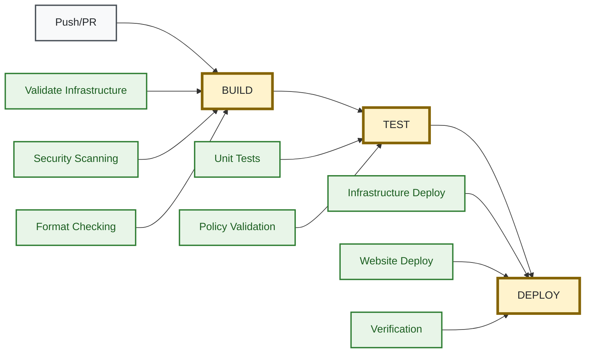

# 🚀 Deployment Guide

Complete guide for deploying and managing your AWS static website infrastructure.

## 🎯 Deployment Options

### Option 1: GitHub Actions (Recommended)
Fully automated CI/CD with security scanning and zero-downtime deployments.

### Option 2: Manual Deployment  
Local deployment for development and testing.

---

## 🤖 GitHub Actions Deployment

### Prerequisites
- GitHub repository with this code
- AWS account with appropriate permissions
- GitHub OIDC configured ([Setup Guide](oidc-authentication.md))

### 1. Repository Configuration

Add these secrets to your GitHub repository (`Settings` → `Secrets and variables` → `Actions`):

```bash
# Get role ARN from Terraform output
cd terraform
AWS_ROLE_ARN=$(tofu output -raw github_actions_role_arn)

# Add to GitHub repository secrets:
# AWS_ROLE_ARN: arn:aws:iam::123456789012:role/github-actions-role
# AWS_REGION: us-east-1
```

### 2. Workflow Overview



### 3. Available Workflows

#### BUILD Workflow (`build.yml`)
Triggered on: `push`, `pull_request`
- OpenTofu validation and planning
- Security scanning (Checkov, Trivy)
- Website build preparation  
- Cost estimation

#### TEST Workflow (`test.yml`)
Triggered on: `push`, `pull_request`
- Unit tests for all infrastructure modules
- Policy validation with OPA/Conftest
- Security compliance checking

#### DEPLOY Workflow (`deploy.yml`)
Triggered on: `push to main`, `manual dispatch`
- Infrastructure provisioning with OpenTofu
- Website content deployment to S3
- CloudFront cache invalidation
- Post-deployment verification

### 4. Manual Workflow Dispatch

Deploy to specific environments:

```bash
# Full deployment to development
gh workflow run deploy.yml \
  --field environment=dev \
  --field deploy_infrastructure=true \
  --field deploy_website=true

# Content-only deployment to production
gh workflow run deploy.yml \
  --field environment=prod \
  --field deploy_infrastructure=false \
  --field deploy_website=true

# Infrastructure-only deployment
gh workflow run deploy.yml \
  --field environment=staging \
  --field deploy_infrastructure=true \
  --field deploy_website=false
```

### 5. Monitor Workflow Execution

```bash
# Check workflow status
gh run list --workflow=deploy.yml

# View specific workflow run
gh run view --job deploy-info
gh run view --job infrastructure-deployment
gh run view --job website-deployment

# Download artifacts
gh run download --name "deploy-123-infrastructure-plan"
gh run download --name "deploy-123-website-archive"
```

### 5. Environment Protection

Configure branch protection rules:
- **Development**: Auto-deploy on push to `develop` branch
- **Staging**: Manual approval required
- **Production**: Manual approval + required reviewers

---

## 🛠️ Manual Deployment

### Prerequisites
- AWS CLI configured with admin permissions
- OpenTofu 1.6+ installed
- Terraform state backend configured

### 1. Infrastructure Deployment

```bash
cd terraform

# Initialize backend
tofu init -backend-config=backend.hcl

# Plan deployment
tofu plan -var-file="terraform.tfvars"

# Apply changes
tofu apply -var-file="terraform.tfvars"
```

### 2. Website Content Deployment

```bash
# Get bucket name from Terraform output
S3_BUCKET=$(tofu output -raw s3_bucket_id)

# Sync website files
aws s3 sync ../src/ "s3://$S3_BUCKET" \
  --delete \
  --cache-control "text/html:max-age=300,public" \
  --cache-control "text/css,application/javascript:max-age=31536000,public"

# Invalidate CloudFront cache
CF_DISTRIBUTION=$(tofu output -raw cloudfront_distribution_id)
aws cloudfront create-invalidation \
  --distribution-id "$CF_DISTRIBUTION" \
  --paths "/*"
```

### 3. Verification

```bash
# Check deployment status
aws cloudfront get-distribution --id "$CF_DISTRIBUTION" \
  --query 'Distribution.Status'

# Test website
curl -I $(tofu output -raw cloudfront_distribution_url)

# Check monitoring
aws cloudwatch get-dashboard \
  --dashboard-name $(tofu output -raw cloudwatch_dashboard_name)
```

---

## 🔧 Configuration Management

### Environment-Specific Configuration

Create separate `.tfvars` files for each environment:

```bash
# terraform/environments/dev.tfvars
project_name = "mysite"
environment = "dev"
cloudfront_price_class = "PriceClass_100"
enable_cross_region_replication = false

# terraform/environments/prod.tfvars  
project_name = "mysite"
environment = "prod"
cloudfront_price_class = "PriceClass_All"
enable_cross_region_replication = true
domain_aliases = ["www.example.com"]
```

Deploy with environment-specific config:
```bash
tofu apply -var-file="environments/prod.tfvars"
```

### Workspace Management

Use Terraform workspaces for environment isolation:

```bash
# Create workspace
tofu workspace new production

# List workspaces
tofu workspace list

# Switch workspace
tofu workspace select production

# Deploy to current workspace
tofu apply
```

---

## 📊 Monitoring Deployment

### Deployment Metrics

Monitor deployment health:
- **Infrastructure drift**: Regular `tofu plan` checks
- **Deployment success rate**: GitHub Actions metrics
- **Rollback time**: Time to revert failed deployments

### Automated Alerts

Set up monitoring for:
- Failed deployments
- Infrastructure drift detection
- Security policy violations
- Cost threshold breaches

### Health Checks

Post-deployment verification:
```bash
# Website accessibility
curl -f $(tofu output -raw cloudfront_distribution_url)

# Security headers
curl -I $(tofu output -raw cloudfront_distribution_url)

# Performance check
curl -w "%{time_total}" -o /dev/null -s $(tofu output -raw cloudfront_distribution_url)
```

---

## 🔄 Rollback Procedures

### Infrastructure Rollback

```bash
# Revert to previous state
tofu apply -var-file="previous-config.tfvars"

# Or use state management
tofu state pull > backup.tfstate
tofu state push previous.tfstate
```

### Content Rollback

```bash
# Rollback website content
aws s3 sync previous-version/ "s3://$S3_BUCKET" --delete

# Clear CDN cache
aws cloudfront create-invalidation \
  --distribution-id "$CF_DISTRIBUTION" \
  --paths "/*"
```

### Emergency Procedures

For critical issues:
1. **Immediate**: Put CloudFront in maintenance mode
2. **Short-term**: Rollback to last known good state
3. **Long-term**: Fix issues and redeploy

---

## 🚀 Advanced Deployment

### Blue-Green Deployment

Deploy new version alongside existing:
```bash
# Deploy to blue environment
tofu workspace select blue
tofu apply -var="environment=blue"

# Test blue environment
# Switch traffic to blue
# Destroy green environment
```

### Canary Deployment

Use CloudFront weighted routing:
```bash
# Deploy new version with 10% traffic
tofu apply -var="canary_percentage=10"

# Gradually increase traffic
tofu apply -var="canary_percentage=50"
tofu apply -var="canary_percentage=100"
```

**Next Steps:**
- 🔒 [Security Configuration](security.md)
- 📊 [Monitoring Setup](monitoring.md)  
- 🛠️ [Troubleshooting](troubleshooting.md)