# Advanced Deployment Guide

> **Note**: For step-by-step deployment instructions from scratch, see the [Complete Deployment Guide](../DEPLOYMENT_GUIDE.md).

This guide covers advanced deployment strategies, patterns, and optimizations for the AWS Static Website Infrastructure.

## Deployment Overview

The infrastructure supports three deployment environments with progressive security and feature enhancement:

```mermaid
%%{init: {'theme':'default', 'themeVariables': {'fontSize':'16px'}}}%%
graph LR
    accTitle: Progressive Environment Deployment Strategy
    accDescr: Three-tier progressive deployment architecture balancing cost optimization with security enhancement through graduated feature sets. Development environment implements cost-optimized configuration at approximately one to five dollars monthly using S3-only static hosting with direct access eliminating CDN costs, minimal monitoring capturing essential metrics only, and budget limits preventing cost overruns while enabling rapid iteration and experimentation. Staging environment provides pre-production validation at approximately fifteen to twenty-five dollars monthly adding CloudFront CDN for global distribution testing, WAF protection validating security rules, enhanced monitoring with performance metrics, and production-equivalent infrastructure configuration without live user traffic enabling realistic validation before production deployment. Production environment delivers full security stack at approximately twenty-five to fifty dollars monthly with advanced CloudFront CDN features including custom SSL certificates and global edge locations, comprehensive WAF protection implementing OWASP Top 10 defenses and custom security rules, Route 53 DNS for custom domain management, complete monitoring with dashboards and alerts, and full backup and disaster recovery capabilities. This progressive architecture enables teams to develop rapidly in low-cost environments while ensuring production readiness through staging validation before exposing changes to end users, implementing cost-conscious infrastructure provisioning balancing budget constraints with operational requirements at each tier.

    A["🧪 Development<br/>Cost Optimized<br/>S3-only"] --> B["🚀 Staging<br/>Pre-production<br/>CloudFront + S3"]
    B --> C["🏭 Production<br/>Full Security<br/>Complete Stack"]

    A1["💰 ~$1-5/month"] --> A
    B1["💰 ~$15-25/month"] --> B
    C1["💰 ~$25-50/month"] --> C

    linkStyle 0 stroke:#333333,stroke-width:2px
    linkStyle 1 stroke:#333333,stroke-width:2px
    linkStyle 2 stroke:#333333,stroke-width:2px
    linkStyle 3 stroke:#333333,stroke-width:2px
    linkStyle 4 stroke:#333333,stroke-width:2px
```



## Environment Configuration

### Current Deployment Status

| Environment | Status | Account ID | Backend | Features |
|-------------|--------|------------|---------|----------|
| **Development** | ✅ **OPERATIONAL** | DEVELOPMENT_ACCOUNT_ID | Distributed | S3-only (cost optimized) |
| **Staging** | ⏳ Ready for Bootstrap | STAGING_ACCOUNT_ID | Ready | CloudFront + S3 + WAF |
| **Production** | ⏳ Ready for Bootstrap | PRODUCTION_ACCOUNT_ID | Ready | Full stack + monitoring |

### Environment-Specific Features

```mermaid
%%{init: {'theme':'default', 'themeVariables': {'fontSize':'16px'}}}%%
graph TD
    accTitle: Environment-Specific Feature Configuration
    accDescr: Detailed feature configuration for each deployment environment showing progressive capability enhancement from development through production. Development Environment provides cost-optimized foundation with S3 static hosting enabling direct HTTP access without CDN overhead suitable for rapid iteration, fifty-dollar budget limit preventing unexpected costs while allowing development activities, and basic monitoring capturing essential metrics including request counts and error rates sufficient for development troubleshooting. Staging Environment adds pre-production validation capabilities with CloudFront CDN providing global distribution for realistic performance testing and edge caching validation, WAF protection implementing security rules for attack pattern testing and policy validation, and seventy-five-dollar budget limit supporting enhanced features while maintaining cost discipline. Production Environment delivers enterprise-grade capabilities with CloudFront CDN enhanced features including custom SSL certificates for HTTPS support, advanced caching strategies for optimal performance, and global edge locations for minimal latency, Advanced WAF implementing full OWASP Top 10 protection with custom rules for application-specific threats and rate limiting for DDoS protection, Route 53 DNS management enabling custom domain configuration with health checks and failover routing, and two-hundred-dollar budget limit accommodating full feature stack including comprehensive monitoring, backup systems, and disaster recovery capabilities. This tiered feature configuration balances cost management with operational requirements enabling development velocity while ensuring production systems maintain enterprise security and reliability standards.

    subgraph Dev["🧪 Development Environment"]
        DevS3["🪣 S3 Static Hosting<br/>Direct Access"]
        DevBudget["💰 $50 Budget Limit<br/>Cost Optimized"]
        DevMonitor["📊 Basic Monitoring<br/>Essential Metrics"]
    end

    subgraph Staging["🚀 Staging Environment"]
        StagingCF["⚡ CloudFront CDN<br/>Global Distribution"]
        StagingWAF["🛡️ WAF Protection<br/>Security Rules"]
        StagingBudget["💰 $75 Budget Limit<br/>Balanced Features"]
    end

    subgraph Prod["🏭 Production Environment"]
        ProdCF["⚡ CloudFront CDN<br/>Enhanced Features"]
        ProdWAF["🛡️ Advanced WAF<br/>Full Protection"]
        ProdRoute53["🌐 Route 53 DNS<br/>Custom Domain"]
        ProdBudget["💰 $200 Budget Limit<br/>Full Features"]
    end
```



## Deployment Strategies

### 1. Bootstrap New Environment

> **📘 Detailed Bootstrap Instructions**: See [Phase 2: Bootstrap Infrastructure](../DEPLOYMENT_GUIDE.md#phase-2-bootstrap-infrastructure) in the Complete Deployment Guide for step-by-step bootstrap procedures including OIDC setup, state storage, and IAM roles.

**Quick Bootstrap Command**:
```bash
# Bootstrap staging environment
gh workflow run bootstrap-distributed-backend.yml \
  --field project_name=static-site \
  --field environment=staging \
  --field confirm_bootstrap=BOOTSTRAP-DISTRIBUTED

# Bootstrap production environment
gh workflow run bootstrap-distributed-backend.yml \
  --field project_name=static-site \
  --field environment=prod \
  --field confirm_bootstrap=BOOTSTRAP-DISTRIBUTED
```

**⏱️ Bootstrap Time**: ~2-3 minutes per environment

### 2. Infrastructure-Only Deployment

Deploy or update infrastructure without website content changes.

```bash
# Deploy infrastructure to development
gh workflow run run.yml \
  --field environment=dev \
  --field deploy_infrastructure=true \
  --field deploy_website=false

# Deploy infrastructure to staging
gh workflow run run.yml \
  --field environment=staging \
  --field deploy_infrastructure=true \
  --field deploy_website=false

# Deploy infrastructure to production
gh workflow run run.yml \
  --field environment=prod \
  --field deploy_infrastructure=true \
  --field deploy_website=false
```

**⏱️ Infrastructure Deployment Time**: ~30-45 seconds

### 3. Website-Only Deployment

Deploy website content changes without infrastructure modifications.

```bash
# Deploy website to development
gh workflow run run.yml \
  --field environment=dev \
  --field deploy_infrastructure=false \
  --field deploy_website=true

# Deploy website to staging
gh workflow run run.yml \
  --field environment=staging \
  --field deploy_infrastructure=false \
  --field deploy_website=true

# Deploy website to production
gh workflow run run.yml \
  --field environment=prod \
  --field deploy_infrastructure=false \
  --field deploy_website=true
```

**⏱️ Website Deployment Time**: ~20-30 seconds

### 4. Full Deployment

Deploy both infrastructure and website content together.

```bash
# Full deployment to development
gh workflow run run.yml \
  --field environment=dev \
  --field deploy_infrastructure=true \
  --field deploy_website=true

# Full deployment to staging
gh workflow run run.yml \
  --field environment=staging \
  --field deploy_infrastructure=true \
  --field deploy_website=true

# Full deployment to production
gh workflow run run.yml \
  --field environment=prod \
  --field deploy_infrastructure=true \
  --field deploy_website=true
```

**⏱️ Full Deployment Time**: ~1m30s - 2m

## Advanced Deployment Patterns

### Progressive Deployment Strategy

```mermaid
%%{init: {'theme':'default', 'themeVariables': {'fontSize':'16px'}}}%%
graph TD
    accTitle: Progressive Deployment Strategy with Validation Gates
    accDescr: Progressive deployment workflow implementing multi-stage validation with rollback capabilities at each tier. Developer changes start in feature branches enabling isolated development without impacting shared environments. Initial deployment to Development environment provides rapid feedback through functional testing validating basic functionality, unit tests, and component integration in cost-optimized infrastructure. Development validation confirms successful deployment before progression. Staging deployment provides pre-production testing in production-equivalent infrastructure validating performance, security controls, and operational procedures without live user exposure. Integration testing in staging validates cross-component interactions, third-party integrations, and end-to-end workflows ensuring system cohesion. Staging validation gates production deployment requiring explicit approval after successful validation. Production deployment delivers live release to end users with comprehensive health monitoring tracking response times, error rates, and business metrics. Production validation confirms deployment success through automated health checks and manual verification. Rollback processes protect each environment enabling rapid recovery from issues with automated rollback to development reverting failed changes immediately, rollback to staging restoring pre-production stability, and rollback to production executing emergency recovery procedures restoring last known good state. This progressive strategy balances deployment velocity with safety implementing validation gates at each tier catching issues progressively earlier where remediation costs are lower and blast radius is contained, while rollback capabilities ensure rapid recovery maintaining service availability and user trust.

    A["📝 Developer Changes<br/>Feature Branch"] --> B["🧪 Deploy to Dev<br/>Initial Testing"]
    B --> C["✅ Dev Validation<br/>Functional Testing"]
    C --> D["🚀 Deploy to Staging<br/>Pre-production Testing"]
    D --> E["✅ Staging Validation<br/>Integration Testing"]
    E --> F["🏭 Deploy to Production<br/>Live Release"]
    F --> G["✅ Production Validation<br/>Health Monitoring"]

    H["🔄 Rollback Process<br/>If Issues Detected"] --> B
    H --> D
    H --> F

    linkStyle 0 stroke:#333333,stroke-width:2px
    linkStyle 1 stroke:#333333,stroke-width:2px
    linkStyle 2 stroke:#333333,stroke-width:2px
    linkStyle 3 stroke:#333333,stroke-width:2px
    linkStyle 4 stroke:#333333,stroke-width:2px
    linkStyle 5 stroke:#333333,stroke-width:2px
    linkStyle 6 stroke:#333333,stroke-width:2px
    linkStyle 7 stroke:#333333,stroke-width:2px
    linkStyle 8 stroke:#333333,stroke-width:2px
```



### Automated Deployment Triggers

#### Branch-Based Deployments

```yaml
# Development: Automatic deployment on feature branch push
feature/* → BUILD → TEST → RUN (dev environment)

# Staging: Automatic deployment on main branch merge
main → BUILD → TEST → RUN (staging environment)

# Production: Manual deployment via workflow_dispatch
workflow_dispatch → BUILD → TEST → RUN (prod environment)
```

#### Manual Deployment Control

```bash
# Development - Immediate deployment
gh workflow run run.yml --field environment=dev

# Staging - Requires successful dev deployment
gh workflow run run.yml --field environment=staging

# Production - Requires manual authorization
gh workflow run run.yml --field environment=prod
```

## Deployment Validation

### Automated Health Checks

The deployment pipeline includes comprehensive validation:

```mermaid
%%{init: {'theme':'default', 'themeVariables': {'fontSize':'16px'}}}%%
graph LR
    accTitle: Automated Deployment Validation Pipeline
    accDescr: Comprehensive automated validation pipeline verifying deployment success across health, monitoring, security, and cost dimensions with automatic rollback on failure. Deployment completion triggers sequential validation checks ensuring system readiness. HTTP health checks verify website accessibility confirming HTTP 200 OK responses from both S3 direct access and CloudFront distributions when enabled, validating basic connectivity and DNS resolution. Monitoring setup validation confirms CloudWatch dashboards are operational with metrics collection active, alarms configured correctly, SNS topics subscribed, and logs flowing to destinations ensuring observability is established before traffic exposure. Security validation verifies WAF rules are active when CloudFront is enabled, security headers are present in responses, SSL certificates are valid for HTTPS endpoints, and bucket policies enforce proper access controls protecting against common vulnerabilities. Cost validation checks budget compliance confirming resource provisioning stays within allocated limits, cost anomaly detection is active, budget alerts are configured, and resource tagging is complete enabling cost allocation and analysis. Successful validation across all dimensions confirms deployment success marking infrastructure ready for traffic with full observability and protection. Validation failures at any stage trigger alert notifications through SNS for email alerts and GitHub Actions workflow notifications ensuring rapid team awareness. Automatic rollback executes immediately on validation failure restoring previous known good state preserving service availability and implementing fail-safe deployment practices preventing degraded or insecure deployments from serving traffic.

    A["🚀 Deployment Complete"] --> B["🔍 HTTP Health Check<br/>200 OK Response"]
    B --> C["📊 Monitoring Setup<br/>CloudWatch Dashboards"]
    C --> D["🛡️ Security Validation<br/>WAF Rules Active"]
    D --> E["💰 Cost Validation<br/>Budget Compliance"]
    E --> F["✅ Deployment Success<br/>Ready for Traffic"]

    G["❌ Validation Failure"] --> H["🚨 Alert Notifications<br/>SNS + GitHub"]
    H --> I["🔧 Automatic Rollback<br/>Previous Known Good"]

    B --> G
    C --> G
    D --> G
    E --> G

    linkStyle 0 stroke:#333333,stroke-width:2px
    linkStyle 1 stroke:#333333,stroke-width:2px
    linkStyle 2 stroke:#333333,stroke-width:2px
    linkStyle 3 stroke:#333333,stroke-width:2px
    linkStyle 4 stroke:#333333,stroke-width:2px
    linkStyle 5 stroke:#333333,stroke-width:2px
    linkStyle 6 stroke:#333333,stroke-width:2px
    linkStyle 7 stroke:#333333,stroke-width:2px
    linkStyle 8 stroke:#333333,stroke-width:2px
    linkStyle 9 stroke:#333333,stroke-width:2px
    linkStyle 10 stroke:#333333,stroke-width:2px
```



### Manual Validation Steps

After deployment, perform these validation checks:

```bash
# 1. Verify website accessibility
curl -I [WEBSITE_URL]
# Expected: HTTP/1.1 200 OK

# 2. Check CloudFront distribution (if enabled)
curl -I [CLOUDFRONT_URL]
# Expected: HTTP/1.1 200 OK with CloudFront headers

# 3. Validate security headers
curl -I [WEBSITE_URL] | grep -E "(X-|Strict|Content-Security)"
# Expected: Security headers present

# 4. Test WAF protection (if enabled)
# Attempt blocked request pattern
curl -X POST [WEBSITE_URL] --data "test=<script>alert('xss')</script>"
# Expected: 403 Forbidden

# 5. Verify monitoring
# Check CloudWatch dashboard for metrics
```

## Rollback Procedures

### Emergency Rollback

For critical production issues requiring immediate rollback:

```bash
# 1. Identify last known good deployment
gh run list --limit 10 --json conclusion,status,createdAt

# 2. Trigger emergency rollback workflow
gh workflow run emergency.yml \
  --field environment=prod \
  --field rollback_to_previous=true

# 3. Monitor rollback progress
gh run watch [ROLLBACK_RUN_ID]
```

### Planned Rollback

For planned rollbacks during maintenance windows:

```bash
# 1. Website content rollback (fast)
gh workflow run run.yml \
  --field environment=prod \
  --field deploy_infrastructure=false \
  --field deploy_website=true

# 2. Infrastructure rollback (if needed)
# Requires reverting terraform configuration first
git revert [COMMIT_HASH]
git push origin main

gh workflow run run.yml \
  --field environment=prod \
  --field deploy_infrastructure=true \
  --field deploy_website=false
```

## Security Considerations

### Production Deployment Security

```mermaid
%%{init: {'theme':'default', 'themeVariables': {'fontSize':'16px'}}}%%
graph TD
    accTitle: Production Deployment Security Gates and Controls
    accDescr: Multi-gate security validation workflow implementing defense-in-depth for production deployments with manual authorization and comprehensive scanning. Production deployment requests initiate through workflow dispatch requiring explicit human intervention preventing accidental or unauthorized production changes. Manual authorization verifies change requester identity, validates change management approval, confirms deployment window compliance, and documents business justification creating audit trails for compliance. Enhanced security scanning applies STRICT policy enforcement with zero tolerance for critical vulnerabilities, comprehensive Checkov scanning validating infrastructure-as-code security, Trivy vulnerability scanning detecting known CVEs, and custom security policy validation ensuring organizational standards compliance. Compliance validation implements zero tolerance for violations verifying HIPAA requirements when handling healthcare data, validating GDPR compliance for European user data, confirming SOC 2 control requirements, and ensuring industry-specific regulatory compliance. Pre-deployment review examines infrastructure changes analyzing Terraform plan outputs for unexpected resources, validating IAM permission changes for least privilege violations, reviewing network security group modifications, and confirming encryption configurations meet standards. Controlled deployment executes with comprehensive monitoring active including real-time CloudWatch metrics tracking, AWS X-Ray tracing enabled for request analysis, WAF logging capturing security events, and deployment progress tracking with automated health checks. Post-deployment validation confirms security controls remain active after deployment, performance metrics meet SLA requirements, security headers are present, and end-to-end functionality operates correctly. Security gate failures at any stage immediately block deployment requiring investigation to identify root cause, remediation of security violations, re-scanning after fixes, and approval before retry ensuring no compromised deployments reach production.

    A["🔐 Production Deployment Request"] --> B["👤 Manual Authorization<br/>workflow_dispatch Only"]
    B --> C["🛡️ Enhanced Security Scanning<br/>STRICT Policy Enforcement"]
    C --> D["📋 Compliance Validation<br/>Zero Tolerance for Violations"]
    D --> E["🔍 Pre-deployment Review<br/>Infrastructure Changes"]
    E --> F["🚀 Controlled Deployment<br/>Monitoring Active"]
    F --> G["✅ Post-deployment Validation<br/>Security + Performance"]

    H["❌ Security Gate Failure"] --> I["🚫 Deployment Blocked<br/>Investigation Required"]
    C --> H
    D --> H
    E --> H

    linkStyle 0 stroke:#333333,stroke-width:2px
    linkStyle 1 stroke:#333333,stroke-width:2px
    linkStyle 2 stroke:#333333,stroke-width:2px
    linkStyle 3 stroke:#333333,stroke-width:2px
    linkStyle 4 stroke:#333333,stroke-width:2px
    linkStyle 5 stroke:#333333,stroke-width:2px
    linkStyle 6 stroke:#333333,stroke-width:2px
    linkStyle 7 stroke:#333333,stroke-width:2px
    linkStyle 8 stroke:#333333,stroke-width:2px
    linkStyle 9 stroke:#333333,stroke-width:2px
```



### Security Controls by Environment

| Security Control | Development | Staging | Production |
|------------------|-------------|---------|------------|
| **Policy Enforcement** | INFORMATIONAL | WARNING | **STRICT** |
| **Manual Approval** | ❌ Not Required | ⚠️ Recommended | ✅ **Required** |
| **Security Scanning** | ✅ Standard | ✅ Enhanced | ✅ **Comprehensive** |
| **WAF Protection** | ⚠️ Basic | ✅ Standard | ✅ **Advanced** |
| **Monitoring** | ✅ Essential | ✅ Standard | ✅ **Full Observability** |

## Monitoring & Alerting

### Deployment Monitoring

```bash
# Real-time deployment monitoring
gh run watch [RUN_ID]

# Check deployment logs
gh run view [RUN_ID] --log

# Monitor specific job
gh run view [RUN_ID] --job="Infrastructure Deployment"
```

### Post-Deployment Monitoring

- **CloudWatch Dashboards**: Environment-specific dashboards
- **Budget Alerts**: Cost threshold notifications
- **Security Alerts**: WAF blocks and anomalies
- **Performance Metrics**: Website response times and availability

### Alert Channels

1. **GitHub Actions**: Workflow notifications and summaries
2. **SNS Email**: Budget and security alerts
3. **CloudWatch Alarms**: Infrastructure health monitoring
4. **AWS Budgets**: Cost control notifications

## Troubleshooting Deployments

### Common Deployment Issues

#### Bootstrap Failures
```bash
# Check bootstrap logs
gh run view [BOOTSTRAP_RUN_ID] --log | grep -A 10 "ERROR"

# Common causes:
# - Insufficient IAM permissions
# - Account limits or quotas
# - Region-specific resource constraints
```

#### Infrastructure Deployment Failures
```bash
# Check terraform logs
gh run view [RUN_ID] --log | grep -A 10 "terraform"

# Common causes:
# - Resource naming conflicts
# - IAM permission issues
# - Service quotas exceeded
# - Backend state locking
```

#### Website Deployment Failures
```bash
# Check S3 sync logs
gh run view [RUN_ID] --log | grep -A 10 "s3 sync"

# Common causes:
# - S3 bucket permissions
# - CloudFront invalidation issues
# - Large file upload timeouts
```

### Debug Commands

```bash
# Validate terraform configuration locally
cd terraform/environments/[environment]
tofu validate
tofu fmt -check

# Check GitHub workflow syntax
yamllint -d relaxed .github/workflows/*.yml

# Test AWS credentials and permissions
aws sts get-caller-identity
aws s3 ls s3://[bucket-name]
```

## Cost Management

### Cost Optimization per Environment

```mermaid
%%{init: {'theme':'default', 'themeVariables': {'fontSize':'16px'}}}%%
graph TD
    accTitle: Environment Cost Breakdown and Control Mechanisms
    accDescr: Three-tier cost structure with progressive capability enhancement and environment-specific control mechanisms balancing functionality with budget constraints. Development environment optimizes for minimal cost at one to five dollars monthly using S3-only static hosting without CDN overhead, eliminating CloudFront transfer fees, using minimal monitoring with essential CloudWatch metrics only, implementing lifecycle policies for automatic log cleanup, and leveraging AWS free tier resources maximizing complimentary allocations. Staging environment balances features with cost at fifteen to twenty-five dollars monthly adding CloudFront CDN for realistic performance testing incurring edge location fees, implementing WAF protection with rule evaluation costs, enhanced monitoring capturing performance and security metrics, and automated testing infrastructure supporting integration validation workflows. Production environment delivers full capability stack at twenty-five to fifty dollars monthly with advanced CloudFront features including custom SSL certificates and enhanced security, comprehensive WAF protection with managed rule groups and custom rules, Route 53 DNS for custom domain management, complete monitoring and observability with detailed CloudWatch dashboards and alarms, backup and disaster recovery systems ensuring business continuity, and high-availability configurations maintaining uptime SLAs. Cost control mechanisms implement graduated protection strategies with Development using budget alerts at 80%, 100%, and 120% thresholds triggering email notifications and requiring manual intervention to prevent overruns, Staging using feature flags enabling conditional resource provisioning toggling CloudFront and WAF based on testing needs reducing costs when features aren't actively validated, and Production using Cost Explorer with usage analytics providing detailed cost attribution, identifying optimization opportunities, tracking spending trends, and enabling data-driven budget planning. This tiered cost structure enables cost-conscious development while ensuring production systems maintain enterprise capabilities balancing operational requirements with budget constraints at each tier.

    subgraph Costs["💰 Monthly Cost Breakdown"]
        A["🧪 Development<br/>$1-5/month<br/>S3 only"]
        B["🚀 Staging<br/>$15-25/month<br/>CloudFront + S3"]
        C["🏭 Production<br/>$25-50/month<br/>Full stack"]
    end

    subgraph Controls["🎛️ Cost Controls"]
        D["📊 Budget Alerts<br/>80%, 100%, 120%"]
        E["🎚️ Feature Flags<br/>Conditional Resources"]
        F["📈 Cost Explorer<br/>Usage Analytics"]
    end

    A --> D
    B --> E
    C --> F

    linkStyle 0 stroke:#333333,stroke-width:2px
    linkStyle 1 stroke:#333333,stroke-width:2px
    linkStyle 2 stroke:#333333,stroke-width:2px
```



### Budget Monitoring

```bash
# Check current costs via AWS CLI
aws budgets describe-budgets --account-id YOUR_ACCOUNT_ID

# View cost and usage reports
aws ce get-cost-and-usage \
  --time-period Start=2025-09-01,End=2025-09-30 \
  --granularity MONTHLY \
  --metrics BlendedCost
```

## Best Practices

### Deployment Best Practices

1. **Always Test in Dev First**: Validate changes in development before promoting
2. **Use Infrastructure as Code**: All changes through Terraform/OpenTofu
3. **Monitor Budget Impact**: Review cost implications before deployment
4. **Validate Security**: Ensure all security scans pass before production
5. **Document Changes**: Update documentation with infrastructure modifications

### Security Best Practices

1. **Least Privilege Access**: Use environment-specific IAM roles
2. **No Direct Production Access**: All changes through CI/CD pipeline
3. **Security Scanning**: Mandatory Checkov + Trivy scans
4. **Policy Compliance**: OPA/Rego policy validation
5. **Audit Trail**: All deployments logged and monitored

### Operational Best Practices

1. **Incremental Deployments**: Small, frequent changes over large releases
2. **Rollback Readiness**: Always have rollback plan before deployment
3. **Monitoring Setup**: Ensure monitoring active before go-live
4. **Documentation**: Keep deployment guides current
5. **Team Communication**: Coordinate deployments across team members

## Next Steps

- **Staging Deployment**: Bootstrap and deploy staging environment
- **Production Deployment**: Bootstrap and deploy production environment
- **Custom Domain**: Configure Route 53 DNS for production
- **SSL Certificates**: Set up ACM certificates for HTTPS
- **Advanced Monitoring**: Implement custom CloudWatch dashboards
- **Disaster Recovery**: Test backup and recovery procedures

For detailed architecture information, see [Architecture Guide](architecture.md).
For quick deployments, see [Quick Start Guide](quickstart.md).