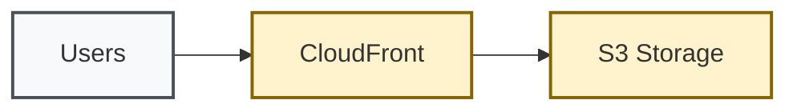

# Development Documentation

Technical resources for developers contributing to the AWS static website infrastructure project.

## Workflow Development

### Workflow Conditions
GitHub Actions workflows use environment-specific conditions for deployment routing:

```yaml
# Development auto-deploy for feature branches
if: contains(github.ref, 'refs/heads/feature/') || contains(github.ref, 'refs/heads/bugfix/')

# Staging deployment for main branch
if: github.ref == 'refs/heads/main' && github.event_name == 'push'

# Production deployment requires manual trigger
if: github.event.inputs.environment == 'prod'
```

### Environment Resolution Logic
- **Feature/Bugfix Branches**: Auto-deploy to development
- **Main Branch**: Deploy to staging with approval gates
- **Tagged Releases**: Environment determined by version pattern
- **Manual Dispatch**: Direct environment selection

## Policy Development

### OPA/Rego Policy Structure
Infrastructure policies use Open Policy Agent with environment-aware enforcement:

```rego
package terraform.security

# S3 encryption policy
deny[msg] {
  input.resource_changes[_].type == "aws_s3_bucket_server_side_encryption_configuration"
  not input.resource_changes[_].change.after.rule[_].apply_server_side_encryption_by_default.sse_algorithm
  msg := "S3 buckets must have server-side encryption enabled"
}
```

### Policy Examples
- **S3 Security**: Encryption, public access blocking, versioning
- **CloudFront Security**: HTTPS enforcement, security headers
- **IAM Security**: Least privilege, no wildcard permissions
- **Resource Tagging**: Required tags for cost allocation

## UX Guidelines

### Documentation Standards
- **Audience-First**: Clear audience identification in headers
- **Scannable Content**: Use headings, bullets, and code blocks
- **Action-Oriented**: Focus on what users need to do
- **Progressive Disclosure**: Basic to advanced information flow

### Accessibility
- **High Contrast**: Use accessibility-compliant colors in diagrams
- **Alt Text**: Provide descriptive alt text for all diagrams
- **Screen Reader**: Structure content for screen reader navigation

### Mermaid Diagram Style


## Contribution Guidelines

### Code Standards
- **OpenTofu/Terraform**: Use consistent formatting with `tofu fmt`
- **Shell Scripts**: Follow bash best practices with error handling
- **YAML**: Maintain consistent indentation and structure
- **Documentation**: Update relevant docs with code changes

### Testing Requirements
- **Unit Tests**: All infrastructure modules must have comprehensive tests
- **Security Scanning**: Code must pass Checkov and Trivy scans
- **Policy Validation**: Infrastructure must comply with OPA policies

### Review Process
1. **Code Review**: Technical review by maintainers
2. **Security Review**: Security implications assessment
3. **Documentation Review**: Ensure documentation is updated
4. **Testing**: All tests must pass before merge

For detailed contribution guidelines, see the main repository documentation.