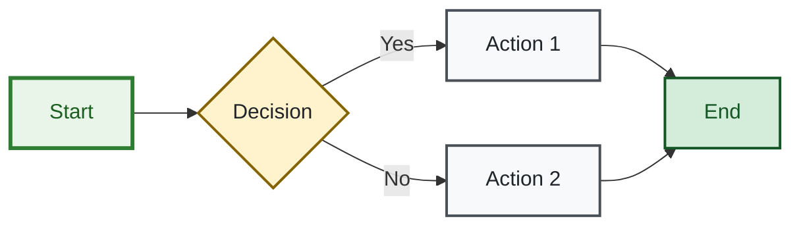
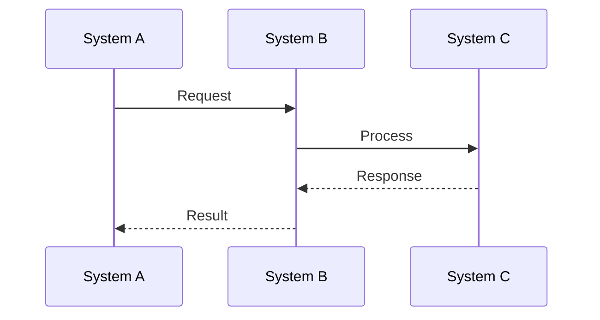
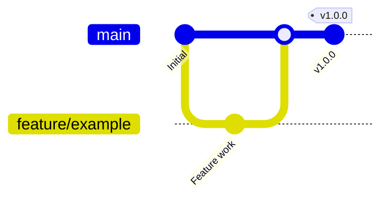
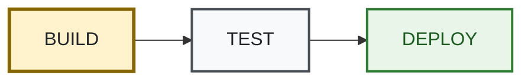
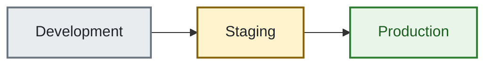
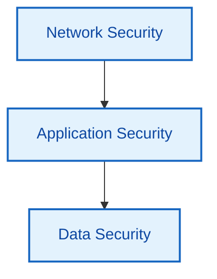

# Mermaid Diagram Style Guide

> **🎯 Target Audience**: Documentation authors, developers  
> **📊 Complexity**: ⭐⭐ Intermediate  
> **📋 Prerequisites**: Basic Mermaid knowledge  
> **⏱️ Reading Time**: 10 minutes

## Overview

This guide establishes consistent styling standards for all Mermaid diagrams in the project documentation to ensure accessibility, visual coherence, and maintainability.

## Accessibility Requirements

### Mandatory Elements

All Mermaid diagrams MUST include:

```mermaid
graph LR
    %% Accessibility
    accTitle: Brief diagram title (max 50 characters)
    accDescr: Detailed description explaining diagram flow, relationships, and purpose (max 200 characters)
```

### WCAG 2.1 AA Compliance

- **Color Contrast**: Minimum 4.5:1 ratio for normal text
- **Color Independence**: Information must be conveyed without relying solely on color
- **Text Size**: Minimum 14px equivalent for diagram text
- **Focus Indicators**: Clear visual focus for interactive elements

## Standardized Color Palette

### Primary Colors (High Contrast)

```mermaid
graph LR
    %% Standard color definitions
    classDef buildBox fill:#fff3cd,stroke:#856404,stroke-width:3px,color:#212529
    classDef testBox fill:#f8f9fa,stroke:#495057,stroke-width:2px,color:#212529
    classDef deployBox fill:#e8f5e8,stroke:#2e7d32,stroke-width:2px,color:#1b5e20
    classDef securityBox fill:#e3f2fd,stroke:#1565c0,stroke-width:2px,color:#0d47a1
    classDef errorBox fill:#f8d7da,stroke:#721c24,stroke-width:2px,color:#721c24
    classDef warningBox fill:#fff3cd,stroke:#856404,stroke-width:2px,color:#212529
    classDef successBox fill:#d4edda,stroke:#155724,stroke-width:2px,color:#155724
    classDef neutralBox fill:#e9ecef,stroke:#6c757d,stroke-width:2px,color:#212529
```

### Color Usage Guidelines

| Color | Purpose | Use Cases | Accessibility Notes |
|-------|---------|-----------|-------------------|
| **Build Yellow** (`#fff3cd`) | Build/Development processes | BUILD workflows, dev environments | High contrast, colorblind safe |
| **Test Gray** (`#f8f9fa`) | Testing/Validation | TEST workflows, validation steps | Neutral, high contrast |
| **Deploy Green** (`#e8f5e8`) | Deployment/Production | DEPLOY workflows, prod environments | Success indication, colorblind safe |
| **Security Blue** (`#e3f2fd`) | Security/Authentication | WAF, IAM, security controls | Professional, high contrast |
| **Error Red** (`#f8d7da`) | Errors/Failures | Failed states, critical issues | Clear error indication |
| **Warning Yellow** (`#fff3cd`) | Warnings/Cautions | RC deployments, approval gates | Attention-getting, safe |
| **Success Green** (`#d4edda`) | Success/Completion | Completed states, passed tests | Clear success indication |
| **Neutral Gray** (`#e9ecef`) | Generic/Default | General nodes, containers | Versatile, accessible |

## Diagram Type Standards

### Flow Charts (`graph` syntax)



### Sequence Diagrams



### Git Graphs



## Style Implementation

### ClassDef Patterns

Use consistent `classDef` patterns across all diagrams:

```mermaid
%% Standard class definitions (include in all diagrams)
classDef buildBox fill:#fff3cd,stroke:#856404,stroke-width:3px,color:#212529
classDef testBox fill:#f8f9fa,stroke:#495057,stroke-width:2px,color:#212529
classDef deployBox fill:#e8f5e8,stroke:#2e7d32,stroke-width:2px,color:#1b5e20
classDef securityBox fill:#e3f2fd,stroke:#1565c0,stroke-width:2px,color:#0d47a1
classDef errorBox fill:#f8d7da,stroke:#721c24,stroke-width:2px,color:#721c24
classDef warningBox fill:#fff3cd,stroke:#856404,stroke-width:2px,color:#212529
classDef successBox fill:#d4edda,stroke:#155724,stroke-width:2px,color:#155724
classDef neutralBox fill:#e9ecef,stroke:#6c757d,stroke-width:2px,color:#212529
```

### Stroke Width Guidelines

- **Primary elements**: 3px stroke width
- **Secondary elements**: 2px stroke width  
- **Supporting elements**: 1px stroke width
- **Decorative elements**: No stroke or 1px

### Text Guidelines

- **Node labels**: Clear, concise (max 3 lines)
- **Edge labels**: Action-oriented verbs
- **Subgraph titles**: Descriptive group names
- **Font considerations**: System fonts for accessibility

## Common Patterns

### CI/CD Pipelines



### Environment Flow



### Security Architecture



## Quality Checklist

Before submitting diagrams, verify:

- [ ] **Accessibility**: `accTitle` and `accDescr` present
- [ ] **Colors**: Using standardized color palette
- [ ] **Contrast**: 4.5:1 minimum contrast ratio
- [ ] **Clarity**: Diagram purpose immediately clear
- [ ] **Consistency**: Matches established patterns
- [ ] **Completeness**: All nodes and edges labeled appropriately
- [ ] **Simplicity**: No unnecessary complexity
- [ ] **Responsiveness**: Readable at different screen sizes

## Migration Guide

### For Existing Diagrams

1. **Add accessibility annotations**:
   ```mermaid
   %% Accessibility
   accTitle: [Brief title]
   accDescr: [Detailed description]
   ```

2. **Update colors** to use standard palette
3. **Standardize stroke widths** (3px primary, 2px secondary)
4. **Apply consistent classDef** patterns
5. **Verify WCAG compliance**

### For New Diagrams

1. Start with appropriate template from this guide
2. Customize content while maintaining styling
3. Test accessibility with screen reader tools
4. Validate color contrast ratios
5. Review against quality checklist

## Tools and Resources

### Accessibility Testing

- **Color Contrast**: [WebAIM Contrast Checker](https://webaim.org/resources/contrastchecker/)
- **Screen Reader**: Test with NVDA, JAWS, or VoiceOver
- **Color Blindness**: [Coblis Simulator](https://www.color-blindness.com/coblis-color-blindness-simulator/)

### Mermaid Resources

- **Official Documentation**: [Mermaid.js](https://mermaid.js.org/)
- **Live Editor**: [Mermaid Live Editor](https://mermaid.live/)
- **Accessibility**: [Mermaid Accessibility Guide](https://mermaid.js.org/config/accessibility.html)

## Examples

See examples in:
- `docs/development/workflow-conditions.md` - CI/CD pipeline pattern
- `docs/guides/multi-environment-strategy.md` - Environment flow pattern
- `docs/guides/security-guide.md` - Security architecture pattern
- `docs/architecture/infrastructure.md` - Complex system architecture

---

*This style guide ensures all Mermaid diagrams in the project maintain consistent accessibility, visual appeal, and professional standards.*