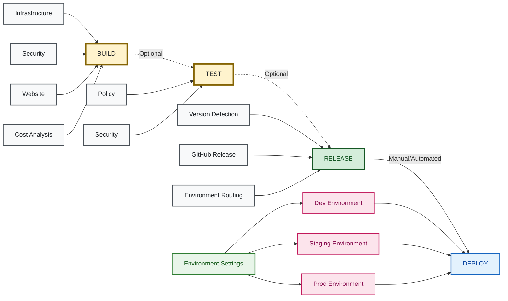

# GitHub Actions Workflow Conditions Guide

## 📋 Executive Summary

This guide documents the conditional execution logic in the BUILD-TEST-DEPLOY CI/CD pipeline, explaining when workflows run, when steps are skipped, and how the pipeline optimizes based on detected changes.

**🎯 Purpose**: Understand and troubleshoot workflow execution patterns, optimization strategies, and conditional logic.

**👥 Target Audience**: DevOps engineers, developers, and teams managing the CI/CD pipeline.

**⏱️ Reading Time**: 15-20 minutes for complete understanding

**🔑 Key Topics**:
- Workflow trigger conditions and dependencies
- Change detection and optimization logic
- Environment resolution and selection
- Matrix strategies for parallel execution
- Skip conditions and performance optimization

---

## Pipeline Overview

The CI/CD pipeline consists of multiple workflows including the new RELEASE workflow that orchestrates tag-based deployments:



## BUILD Workflow Conditions

### Trigger Conditions

The BUILD workflow runs when:

1. **Manual Dispatch** (`workflow_dispatch`)
   - User manually triggers via GitHub UI or CLI
   - Can specify environment and force build options

2. **Pull Request** events:
   - When PR is opened against `main` branch
   - When PR is synchronized (new commits pushed)

3. **Push** events:
   - Direct pushes to `main` branch
   - Triggers automatic deployment pipeline

### Change Detection Logic

The BUILD workflow includes sophisticated change detection in the `detect-changes` step:

```yaml
# Conditions checked in order:
1. Manual dispatch with force_build=true → Run everything
2. Pull request → Compare with origin/main
3. Feature branch push → Compare with origin/main  
4. Main branch push → Run everything (safety)
```

#### File Categories Detected:

- **Infrastructure Changes** (`has_tf_changes`):
  - Files matching: `terraform/.*\.(tf|tfvars)$`
  - Terraform modules in `terraform/modules/`
  
- **Content Changes** (`has_content_changes`):
  - Files in `src/` directory
  
- **Workflow Changes** (`has_workflow_changes`):
  - Files matching: `.github/workflows/.*\.yml$`
  
- **Test Changes** (`has_test_changes`):
  - Files in `test/` directory
  
- **Documentation Changes** (`has_doc_changes`):
  - Files matching: `\.(md|txt)$`

### Job Skip Conditions

#### Infrastructure Validation Job

**Runs when**:
```
if: needs.build-info.outputs.has_tf_changes > 0 || needs.build-info.outputs.has_changes > 0
```

**Skipped when**:
- Only documentation changes detected
- No Terraform files modified
- No infrastructure-related changes

#### Security Scanning Job

**Runs when**:
```
if: needs.build-info.outputs.needs_security_scan == '1' || needs.build-info.outputs.has_tf_changes > 0
```

**Matrix Strategy**:
```yaml
matrix:
  scanner: [checkov, trivy]
fail-fast: false  # Both scanners run independently
```

#### Website Build Job

**Runs when**:
```
if: needs.build-info.outputs.has_content_changes > 0 || needs.build-info.outputs.has_changes > 0
```

**Skipped when**:
- No changes to `src/` directory
- Only infrastructure changes detected

### Optimization for Documentation-Only Changes

Special optimization when only documentation files change:
```bash
if [ "$HAS_CHANGES" -eq 0 ] && [ "$HAS_DOC_CHANGES" -gt 0 ]; then
  echo "ℹ️ Documentation-only changes detected - optimizing pipeline"
  HAS_CHANGES=0  # This will skip most jobs
fi
```

## TEST Workflow Conditions

### Trigger Conditions

1. **Manual Dispatch** with options:
   - `environment`: Target environment selection
   - `build_id`: Reference specific build
   - `skip_build_check`: Bypass BUILD dependency

2. **Workflow Run** (automatic):
   ```yaml
   workflow_run:
     workflows: ["BUILD - Infrastructure and Website Preparation"]
     types: [completed]
     branches: [main, 'feature/*']
   ```

### Dependency Checking

```yaml
# Check BUILD Status (if triggered by workflow_run)
if: github.event_name == 'workflow_run' && github.event.inputs.skip_build_check != 'true'

# Fail if BUILD failed:
if [ "${{ github.event.workflow_run.conclusion }}" != "success" ]; then
  echo "BUILD workflow failed - cannot proceed with TEST"
  exit 1
fi
```

### Test Skip Conditions

#### Documentation-Only Changes Skip

```bash
# Skip tests if only documentation changes
if echo "$CHANGED_FILES" | grep -qE '\.(md|txt|rst)$' && \
   ! echo "$CHANGED_FILES" | grep -qvE '\.(md|txt|rst)$'; then
  SKIP_TESTS=1
  echo "⚡ Only documentation changes detected - skipping tests"
fi
```

#### Policy Testing

**Runs when**:
```yaml
if: needs.test-info.outputs.skip_tests != '1' && needs.test-info.outputs.has_tf_changes == '1'
```

Executes policy validation and security compliance checks on infrastructure.

#### Policy Validation

**Additional condition**:
```
if: needs.test-info.outputs.skip_tests != '1' && needs.test-info.outputs.has_tf_changes == '1'
```

Only runs when infrastructure changes are detected.

#### Integration Tests

**Complex conditions**:
```
if: needs.test-info.outputs.skip_tests != '1' && (success() || needs.policy-validation.result == 'skipped')
```

Runs after unit tests succeed, even if policy validation was skipped.

## RELEASE Workflow Conditions

### Tag-Based Trigger Conditions

The RELEASE workflow is triggered by Git tags following semantic versioning:

```yaml
on:
  push:
    tags:
      - 'v*.*.*'        # Stable releases (v1.0.0)
      - 'v*.*.*-rc*'    # Release candidates (v1.0.0-rc1)
      - 'v*.*.*-hotfix*' # Hotfix releases (v1.0.1-hotfix.1)
```

#### Version Type Detection

```bash
# Version pattern matching:
if [[ "$TAG" =~ ^v[0-9]+\.[0-9]+\.[0-9]+$ ]]; then
    VERSION_TYPE="stable"
    TARGET_ENV="prod"
elif [[ "$TAG" =~ ^v[0-9]+\.[0-9]+\.[0-9]+-rc[0-9]+$ ]]; then
    VERSION_TYPE="rc" 
    TARGET_ENV="staging"
elif [[ "$TAG" =~ ^v[0-9]+\.[0-9]+\.[0-9]+-hotfix\.[0-9]+$ ]]; then
    VERSION_TYPE="hotfix"
    TARGET_ENV="prod"
else
    VERSION_TYPE="unknown"
    # Workflow fails with invalid tag format
fi
```

### Environment Routing Logic

| Tag Pattern | Version Type | Target Environment | Deployment Strategy |
|-------------|--------------|-------------------|-------------------|
| `v1.0.0` | stable | production | Full validation + approval gates |
| `v1.0.0-rc1` | rc | staging | Pre-production validation |
| `v1.0.1-hotfix.1` | hotfix | production | Emergency deployment path |

### GitHub Release Creation

**Conditions for release creation**:
```yaml
if: steps.version-info.outputs.version_type != 'unknown'
```

**Release type determination**:
```bash
case "$VERSION_TYPE" in
  "stable")
    PRERELEASE=false
    LATEST=true
    ;;
  "rc")
    PRERELEASE=true  
    LATEST=false
    ;;
  "hotfix")
    PRERELEASE=false
    LATEST=true
    ;;
esac
```

### Deployment Triggering

The RELEASE workflow triggers appropriate deployment workflows:

```yaml
# For RC versions → staging
- name: Trigger Staging Deployment
  if: steps.version-info.outputs.version_type == 'rc'
  run: |
    gh workflow run deploy.yml \
      --field environment=staging \
      --field deploy_infrastructure=true \
      --field deploy_website=true

# For stable/hotfix → production  
- name: Trigger Production Deployment
  if: steps.version-info.outputs.version_type == 'stable' || steps.version-info.outputs.version_type == 'hotfix'
  run: |
    gh workflow run deploy.yml \
      --field environment=prod \
      --field deploy_infrastructure=true \
      --field deploy_website=true
```

## Deployment Workflow Conditions

### Unified Deployment Workflow (`deploy.yml`)

The deployment workflow has been simplified to handle all environments through parameters.

#### Trigger Conditions:
1. **Manual Dispatch** with environment selection:
   - `environment`: Target environment (dev/staging/prod)
   - `test_id`: Optional reference
   - `build_id`: Optional reference
   - `skip_test_check`: Emergency override
   - `deploy_infrastructure`: Infrastructure deployment toggle
   - `deploy_website`: Website deployment toggle

2. **RELEASE Workflow Orchestration** (Primary Method):
   - Triggered automatically by version tags
   - Routes to appropriate environment based on version type

3. **TEST Workflow Completion**:
   ```yaml
   workflow_run:
     workflows: ["TEST - Policy and Validation"]
     types: [completed]
     branches: [main]
   ```

#### Environment Settings:
```yaml
TF_VAR_environment: dev
TF_VAR_cloudfront_price_class: PriceClass_100
TF_VAR_waf_rate_limit: 1000
TF_VAR_enable_cross_region_replication: false
TF_VAR_enable_detailed_monitoring: false
TF_VAR_force_destroy_bucket: true
TF_VAR_monthly_budget_limit: "10"
TF_VAR_log_retention_days: 7
```

#### Environment-Specific Settings:

**Development Environment** (env=dev):
```yaml
TF_VAR_environment: dev
TF_VAR_cloudfront_price_class: PriceClass_100
TF_VAR_waf_rate_limit: 1000
TF_VAR_enable_cross_region_replication: false
TF_VAR_enable_detailed_monitoring: false
TF_VAR_force_destroy_bucket: true
TF_VAR_monthly_budget_limit: "10"
TF_VAR_log_retention_days: 7
```

**Staging Environment** (env=staging):
```yaml
TF_VAR_environment: staging
TF_VAR_cloudfront_price_class: PriceClass_200
TF_VAR_waf_rate_limit: 2000
TF_VAR_enable_cross_region_replication: true
TF_VAR_enable_detailed_monitoring: true
TF_VAR_force_destroy_bucket: false
TF_VAR_monthly_budget_limit: "25"
TF_VAR_log_retention_days: 30
```

**Production Environment** (env=prod):
```yaml
TF_VAR_environment: prod
TF_VAR_cloudfront_price_class: PriceClass_All
TF_VAR_waf_rate_limit: 5000
TF_VAR_enable_cross_region_replication: true
TF_VAR_enable_detailed_monitoring: true
TF_VAR_force_destroy_bucket: false
TF_VAR_monthly_budget_limit: "50"
TF_VAR_log_retention_days: 90
```

#### Deployment Flow Priority:
1. **RELEASE Workflow** (Recommended):
   - Tag-based deployment with version routing
   - Automatic environment determination
   - Full traceability and audit trail

2. **Manual Deployment**:
   - Direct invocation with environment parameter
   - Emergency override capabilities
   - Requires manual approvals for production

### Deploy Infrastructure Job

**Complex condition**:
```
if: needs.deploy-info.outputs.deploy_infrastructure == 'true' && 
    (needs.deploy-info.outputs.has_tf_changes == '1' || 
     github.event.inputs.deploy_infrastructure == 'true')
```

Requires both:
1. Infrastructure deployment enabled
2. Either infrastructure changes detected OR manual override

### Deploy Website Job

**Layered conditions**:
```
if: needs.deploy-info.outputs.deploy_website == 'true' && 
    (needs.deploy-infrastructure.result == 'success' || 
     needs.deploy-infrastructure.result == 'skipped') && 
    (needs.deploy-info.outputs.has_content_changes == '1' || 
     github.event.inputs.deploy_website == 'true')
```

Requires:
1. Website deployment enabled
2. Infrastructure deployment succeeded or was skipped
3. Content changes detected OR manual override

## Environment Resolution Hierarchy

All workflows use the same environment resolution pattern:

```bash
# Priority order (first non-empty wins):
1. Manual input: github.event.inputs.environment
2. Repository variable: vars.DEFAULT_ENVIRONMENT
3. Hardcoded fallback: "dev"

# Example from workflows:
if [ -n "${{ github.event.inputs.environment }}" ]; then
  RESOLVED_ENV="${{ github.event.inputs.environment }}"
  ENV_SOURCE="Manual Input"
elif [ -n "${{ vars.DEFAULT_ENVIRONMENT }}" ]; then
  RESOLVED_ENV="${{ vars.DEFAULT_ENVIRONMENT }}"
  ENV_SOURCE="Repository Variable"
else
  RESOLVED_ENV="dev"
  ENV_SOURCE="Hardcoded Fallback"
fi
```

## Concurrency Control

Each workflow implements concurrency control:

### BUILD Workflow
```yaml
concurrency:
  group: static-site-build-${{ github.ref }}
  cancel-in-progress: true  # New builds cancel old ones
```

### TEST Workflow
```yaml
concurrency:
  group: static-site-test-${{ github.ref }}
  cancel-in-progress: true  # New tests cancel old ones
```

### DEPLOY Workflow
```yaml
concurrency:
  group: static-site-deployment-${{ github.event.inputs.environment || 'dev' }}
  cancel-in-progress: false  # Never cancel deployments
```

## Optimization Strategies

### 1. Smart Change Detection

The pipeline optimizes execution based on what changed:

| Changes Detected | BUILD Jobs Run | TEST Jobs Run | DEPLOY Jobs Run |
|-----------------|----------------|---------------|-----------------|
| Documentation only | build-info only | Skipped | Skipped |
| Infrastructure only | validation, security | unit, policy | infrastructure |
| Content only | website build | unit, integration | website |
| Mixed changes | All jobs | All jobs | All jobs |

### 2. Parallel Execution

Parallel execution strategies:

- **Security scanning**: Checkov and Trivy run simultaneously with separate thresholds:
  - Critical: 0
  - High: 0
  - Medium: 3
  - Low: 10
- **Infrastructure operations**: Plan and security scan run in parallel
- **Website operations**: Build and validation run concurrently
- **No fail-fast**: Jobs continue independently after failures

### 3. Conditional Artifact Downloads

Artifacts are only downloaded when needed:
```yaml
- name: Download BUILD Artifacts
  if: github.event_name == 'workflow_run'
  continue-on-error: true  # Don't fail if artifacts missing
```

## Manual Workflow Triggers

### Tag-Based Release Deployment

**Primary deployment method using RELEASE workflow**:
```bash
# Create and push a release tag
git tag v1.0.0
git push origin v1.0.0
# → Automatically triggers RELEASE workflow → Production deployment

# Create release candidate
git tag v1.0.0-rc1  
git push origin v1.0.0-rc1
# → Automatically triggers RELEASE workflow → Staging deployment

# Create hotfix release
git tag v1.0.1-hotfix.1
git push origin v1.0.1-hotfix.1  
# → Automatically triggers RELEASE workflow → Production deployment
```

### Manual Workflow Triggers

**Force specific workflows**:
```bash
# BUILD with force
gh workflow run build.yml \
  --field environment=prod \
  --field force_build=true

# TEST with specific build
gh workflow run test.yml \
  --field environment=prod \
  --field build_id=build-12345 \
  --field skip_build_check=true

# DEPLOY directly (bypassing RELEASE)
gh workflow run deploy.yml \
  --field environment=prod \
  --field deploy_infrastructure=true \
  --field deploy_website=true \
  --field skip_test_check=true
```

### Selective Deployment
```bash
# Deploy only infrastructure
gh workflow run deploy.yml \
  --field environment=staging \
  --field deploy_infrastructure=true \
  --field deploy_website=false

# Deploy only website content
gh workflow run deploy.yml \
  --field environment=prod \
  --field deploy_infrastructure=false \
  --field deploy_website=true
```

## Troubleshooting Workflow Conditions

### Common Issues

1. **Jobs unexpectedly skipped**
   - Check change detection output in build-info job
   - Verify file paths match detection patterns
   - Review skip_tests output values

2. **Workflow doesn't trigger**
   - Verify branch names in trigger conditions
   - Check workflow_run dependencies
   - Ensure previous workflow succeeded
   - For RELEASE workflow: verify tag format matches patterns

3. **RELEASE workflow issues**
   - Check tag format follows semantic versioning (v1.0.0, v1.0.0-rc1)
   - Verify tag push permissions and GitHub token access
   - Review version type detection in workflow logs

4. **Wrong environment selected**
   - Check environment resolution in workflow logs
   - Verify repository variables are set
   - Review manual input parameters
   - For RELEASE workflow: verify version type to environment mapping

### Debug Outputs

Key debug outputs available:
```yaml
# BUILD outputs:
has_tf_changes: Infrastructure file changes
has_content_changes: Website content changes
has_workflow_changes: GitHub Actions changes
has_doc_changes: Documentation updates
needs_security_scan: Security scan required
needs_full_tests: Full test suite needed

# TEST outputs:
skip_tests: Test execution flag
policy_status: Policy validation status

# RELEASE outputs:
version_type: Detected version type (stable/rc/hotfix)
target_environment: Resolved target environment
release_created: GitHub release creation status
release_url: Created release URL

# DEPLOY outputs:
deployment_status: Overall status
website_url: Deployed site URL
s3_bucket_id: Target bucket
cloudfront_distribution_id: CDN ID
```

## Best Practices

1. **Use tag-based deployment as primary method**: RELEASE workflow provides best traceability
2. **Use force flags sparingly**: Only when you need to override smart detection
3. **Monitor skip patterns**: Ensure important tests aren't accidentally skipped
4. **Follow semantic versioning**: Proper tag formats ensure correct environment routing
5. **Test conditions locally**: Use act or similar tools to test workflow logic
6. **Document custom conditions**: Add comments explaining complex conditions
7. **Regular condition audits**: Review and optimize conditions quarterly

## Development Tools

### Badge Logic Validation
Test the deployment status analysis logic used in workflows:

```bash
# Test badge generation logic
./docs/development/test-badge-logic.sh
```

This script validates the deployment status analysis logic with 8 test scenarios covering all deployment outcome combinations.

## Related Documentation

- [Deployment Guide](../guides/deployment-guide.md) - Overall deployment strategies and RELEASE workflow
- [Version Management](../guides/version-management.md) - Git-based versioning and release process
- [Testing Guide](../guides/testing-guide.md) - Test execution details  
- [Quick Reference](../quick-reference.md) - Common workflow commands
- [Troubleshooting](../guides/troubleshooting.md) - Debugging workflow issues
- [CI/CD Architecture](../architecture/cicd.md) - Complete pipeline documentation including status tracking