# Disaster Recovery Guide

**⭐⭐ Intermediate** - Backup strategies, recovery procedures, and business continuity planning for your static website infrastructure.

> **💡 For deployment**, see [Deployment Guide](../DEPLOYMENT.md).
> **💡 For monitoring**, see [Monitoring Guide](monitoring.md).
> **💡 For architecture**, see [Architecture Guide](architecture.md).

---

## Overview

This guide covers disaster recovery (DR) strategies, backup procedures, and recovery processes to ensure business continuity for your AWS static website infrastructure.

### DR Objectives

```mermaid
%%{init: {'theme':'default', 'themeVariables': {'fontSize':'16px'}}}%%
graph LR
    accTitle: Disaster Recovery Lifecycle and Key Objectives
    accDescr: Disaster recovery lifecycle implementing comprehensive backup, recovery, validation, and reporting processes with defined RTO and RPO objectives. The Backup phase captures all critical data and configurations with RPO target of less than 15 minutes ensuring minimal data loss through S3 versioning for website content providing point-in-time recovery, cross-region replication for geographic redundancy protecting against regional failures, Git repository backups for infrastructure-as-code preserving configuration history, Terraform state file backups in S3 enabling infrastructure recreation, and CloudWatch log archival for forensic analysis and compliance. The Recovery phase restores services within RTO target of less than 1 hour through automated Terraform deployment recreating infrastructure from code, S3 object restoration from versioned backups or replicas, CloudFront cache invalidation ensuring fresh content delivery, and DNS failover redirecting traffic to recovered infrastructure. The Validation phase verifies recovery success through automated health checks confirming HTTP 200 responses and proper security headers, performance testing validating acceptable response times, security scanning ensuring no configuration drift introduced vulnerabilities, and functional testing confirming all features operate correctly. The Reporting phase documents incidents and recovery actions through incident timelines recording events and decisions, recovery metrics measuring actual RTO and RPO against targets, lessons learned identifying improvement opportunities, and compliance documentation satisfying audit requirements. This lifecycle ensures business continuity through rapid recovery capabilities with clear objectives balancing recovery speed with data preservation.

    A["💾 Backup"] --> B["🔄 Recovery"]
    B --> C["✅ Validation"]
    C --> D["📊 Reporting"]

    E["RTO:<br/>< 1 hour"] --> B
    F["RPO:<br/>< 15 min"] --> A

    style A fill:#e1f5fe
    style B fill:#c8e6c9
    style E fill:#fff9c4
    style F fill:#ffcdd2

    linkStyle 0 stroke:#333333,stroke-width:2px
    linkStyle 1 stroke:#333333,stroke-width:2px
    linkStyle 2 stroke:#333333,stroke-width:2px
    linkStyle 3 stroke:#333333,stroke-width:2px
    linkStyle 4 stroke:#333333,stroke-width:2px
```



**Key Metrics:**
- **RTO (Recovery Time Objective)**: < 1 hour
- **RPO (Recovery Point Objective)**: < 15 minutes
- **Data Durability**: 99.999999999% (11 nines via S3)
- **Infrastructure Recovery**: Fully automated via Terraform

---

## Quick Access - Common DR Scenarios

### 🚨 Emergency Recovery
**Website is down, need to recover immediately?**

Go directly to:
- [Emergency Rollback](#emergency-rollback) - Quick rollback to last working state
- [Full Recovery from Backup](#full-infrastructure-recovery) - Complete infrastructure recovery
- [Regional Failover](#regional-failover) - Switch to backup region

### 📦 Restore Specific Components
**Need to recover individual resources?**

Jump to:
- [Restore Website Content](#website-content-recovery) - Recover S3 objects
- [Restore Terraform State](#terraform-state-recovery) - Fix corrupted state
- [Restore from Version](#s3-version-recovery) - Recover specific file version

### 🧪 Testing & Preparation
**Preparing for potential disasters?**

Review:
- [DR Testing Procedures](#testing--validation) - Test your recovery plan
- [Backup Verification](#backup-verification) - Confirm backups are working
- [Runbook Preparation](#incident-response-runbook) - Document procedures

### 📋 Post-Incident
**Recovering from an incident and documenting?**

Follow:
- [Post-Recovery Validation](#post-recovery-validation) - Verify recovery
- [Incident Documentation](#incident-documentation) - Document what happened
- [Lessons Learned](#lessons-learned-template) - Improve processes

---

## Table of Contents

1. [Recovery Objectives](#recovery-objectives)
2. [Backup Strategy](#backup-strategy)
3. [Recovery Procedures](#recovery-procedures)
4. [Testing & Validation](#testing--validation)
5. [Incident Response](#incident-response)
6. [Business Continuity](#business-continuity)

---

## Recovery Objectives

### Definitions

**RTO (Recovery Time Objective)**
- Maximum acceptable downtime
- Time to restore service after incident
- **Target**: < 1 hour for production

**RPO (Recovery Point Objective)**
- Maximum acceptable data loss
- Time between last backup and incident
- **Target**: < 15 minutes for production

**MTD (Maximum Tolerable Downtime)**
- Absolute maximum before business impact
- **Target**: 4 hours for production

### Tier Classification

| Tier | Environment | RTO | RPO | Recovery Priority |
|------|-------------|-----|-----|-------------------|
| **Tier 1** | Production | < 1 hour | < 15 min | Critical |
| **Tier 2** | Staging | < 4 hours | < 1 hour | High |
| **Tier 3** | Development | < 24 hours | < 1 day | Low |

---

## Backup Strategy

### What Gets Backed Up

```mermaid
%%{init: {'theme':'default', 'themeVariables': {'fontSize':'16px'}}}%%
graph TD
    accTitle: Comprehensive Backup Strategy and Targets
    accDescr: Multi-layer backup strategy protecting all critical assets required for complete disaster recovery including website content, infrastructure configuration, state management, and operational logs. Website Content backups utilize S3 Versioning providing point-in-time recovery for all objects with automatic version retention enabling rollback to any previous state, combined with Cross-Region Replication copying objects to geographically separate regions protecting against regional failures and providing low-latency access for disaster recovery scenarios. Infrastructure Configuration backups leverage Git Repository version control maintaining complete history of infrastructure-as-code changes with branches, tags, and commit history enabling recreation of any historical state, combined with Terraform Code backups preserving module definitions, variable configurations, and deployment scripts ensuring reproducible infrastructure provisioning. State Files backups protect Terraform state through S3 State Backend with versioning enabled allowing recovery of any state version and supporting concurrent operations safely, combined with DynamoDB Lock Table backups preserving state locking mechanism preventing concurrent modifications during recovery operations. Logs and Data backups capture operational intelligence through CloudWatch Logs archival preserving application logs, security events, and performance metrics for forensic analysis and compliance requirements, combined with Access Logs retention storing S3 and CloudFront request logs documenting all access patterns for security auditing and troubleshooting. This comprehensive strategy ensures no single point of failure with redundancy at multiple levels providing defense-in-depth for data protection and enabling complete infrastructure recreation from backups.

    A["💾 Backup Targets"] --> B["🌐 Website Content"]
    A --> C["🏗️ Infrastructure Config"]
    A --> D["📊 State Files"]
    A --> E["📝 Logs & Data"]

    B --> B1["S3 Versioning"]
    B --> B2["Cross-Region Replication"]

    C --> C1["Git Repository"]
    C --> C2["Terraform Code"]

    D --> D1["S3 State Backend"]
    D --> D2["DynamoDB Lock Table"]

    E --> E1["CloudWatch Logs"]
    E --> E2["Access Logs"]

    style A fill:#fff9c4
    style B fill:#c8e6c9
    style C fill:#e1f5fe
    style D fill:#ffecb3
    style E fill:#d1c4e9

    linkStyle 0 stroke:#333333,stroke-width:2px
    linkStyle 1 stroke:#333333,stroke-width:2px
    linkStyle 2 stroke:#333333,stroke-width:2px
    linkStyle 3 stroke:#333333,stroke-width:2px
    linkStyle 4 stroke:#333333,stroke-width:2px
    linkStyle 5 stroke:#333333,stroke-width:2px
    linkStyle 6 stroke:#333333,stroke-width:2px
    linkStyle 7 stroke:#333333,stroke-width:2px
    linkStyle 8 stroke:#333333,stroke-width:2px
    linkStyle 9 stroke:#333333,stroke-width:2px
    linkStyle 10 stroke:#333333,stroke-width:2px
    linkStyle 11 stroke:#333333,stroke-width:2px
```



### 1. Website Content Backup

**S3 Versioning (Enabled by Default):**
```bash
# Verify versioning is enabled
aws s3api get-bucket-versioning \
  --bucket static-site-ENVIRONMENT-ACCOUNT_ID

# List versions of a file
aws s3api list-object-versions \
  --bucket static-site-ENVIRONMENT-ACCOUNT_ID \
  --prefix index.html

# Restore previous version
aws s3api copy-object \
  --bucket static-site-ENVIRONMENT-ACCOUNT_ID \
  --copy-source static-site-ENVIRONMENT-ACCOUNT_ID/index.html?versionId=VERSION_ID \
  --key index.html
```

**Cross-Region Replication:**
```bash
# Verify replication status
aws s3api get-bucket-replication \
  --bucket static-site-ENVIRONMENT-ACCOUNT_ID

# Check replication progress
aws s3api head-object \
  --bucket static-site-ENVIRONMENT-ACCOUNT_ID-replica \
  --key index.html \
  --query 'ReplicationStatus'
```

**Manual Backup (Point-in-Time):**
```bash
#!/bin/bash
# backup-website.sh

ENVIRONMENT=${1:-prod}
BACKUP_DATE=$(date +%Y%m%d-%H%M%S)
SOURCE_BUCKET="static-site-$ENVIRONMENT-ACCOUNT_ID"
BACKUP_BUCKET="static-site-backups-$ENVIRONMENT"

# Create timestamped backup
aws s3 sync \
  s3://$SOURCE_BUCKET/ \
  s3://$BACKUP_BUCKET/backups/$BACKUP_DATE/ \
  --storage-class GLACIER_IR

echo "✅ Backup complete: s3://$BACKUP_BUCKET/backups/$BACKUP_DATE/"
```

### 2. Infrastructure Configuration Backup

**Git Repository (Primary Backup):**
```bash
# Verify all infrastructure code is committed
git status

# Tag releases
git tag -a v1.0.0 -m "Production release 2025-10-07"
git push origin v1.0.0

# Create backup of repository
git clone --mirror https://github.com/username/static-site.git backup-repo
```

**Terraform State Backup:**
```bash
# State is automatically versioned in S3
# List state versions
aws s3api list-object-versions \
  --bucket static-site-state-ENVIRONMENT-ACCOUNT_ID \
  --prefix environments/ENVIRONMENT/terraform.tfstate

# Download specific state version
aws s3api get-object \
  --bucket static-site-state-ENVIRONMENT-ACCOUNT_ID \
  --key environments/ENVIRONMENT/terraform.tfstate \
  --version-id VERSION_ID \
  terraform.tfstate.backup

# Restore state (use with extreme caution!)
aws s3 cp terraform.tfstate.backup \
  s3://static-site-state-ENVIRONMENT-ACCOUNT_ID/environments/ENVIRONMENT/terraform.tfstate
```

### 3. Log Backup

**CloudWatch Logs Export:**
```bash
# Export logs to S3
aws logs create-export-task \
  --log-group-name /aws/s3/static-site-ENVIRONMENT \
  --from $(date -d '7 days ago' +%s)000 \
  --to $(date +%s)000 \
  --destination static-site-logs-ENVIRONMENT-ACCOUNT_ID \
  --destination-prefix cloudwatch-exports/$(date +%Y/%m/%d)

# Verify export status
aws logs describe-export-tasks \
  --status-code COMPLETED
```

### Backup Schedule

| Data Type | Frequency | Retention | Method |
|-----------|-----------|-----------|--------|
| **Website Content** | Real-time | 90 days | S3 Versioning |
| **Cross-Region Replica** | Real-time | Same as source | S3 Replication |
| **Manual Snapshots** | Daily | 30 days | Automated script |
| **Terraform State** | On change | Unlimited | S3 Versioning |
| **Git Repository** | On push | Unlimited | GitHub |
| **CloudWatch Logs** | Weekly | 90 days | S3 Export |

---

## Recovery Procedures

### Scenario 1: Website Content Corruption

**Problem**: Website files corrupted or accidentally deleted

**Recovery Time**: 5-15 minutes

**Procedure:**
```bash
# 1. Identify last known good version
aws s3api list-object-versions \
  --bucket static-site-prod-ACCOUNT_ID \
  --prefix index.html \
  | jq '.Versions[] | {Key: .Key, VersionId: .VersionId, LastModified: .LastModified}'

# 2. Restore from version (specific file)
aws s3api copy-object \
  --bucket static-site-prod-ACCOUNT_ID \
  --copy-source static-site-prod-ACCOUNT_ID/index.html?versionId=VERSION_ID \
  --key index.html

# 3. Or restore entire website from backup
aws s3 sync \
  s3://static-site-backups-prod/backups/BACKUP_DATE/ \
  s3://static-site-prod-ACCOUNT_ID/ \
  --delete

# 4. Invalidate CloudFront cache
DIST_ID=$(cd terraform/environments/prod && tofu output -raw cloudfront_distribution_id)
aws cloudfront create-invalidation \
  --distribution-id $DIST_ID \
  --paths "/*"

# 5. Verify website accessibility
curl -I https://your-website.com
```

**Validation:**
- ✅ Website returns HTTP 200
- ✅ Content displays correctly
- ✅ No console errors
- ✅ CloudFront serving updated content

### Scenario 2: Infrastructure Failure

**Problem**: AWS region outage or infrastructure destroyed

**Recovery Time**: 30-60 minutes

**Procedure:**
```bash
# 1. Assess damage
cd terraform/environments/prod
tofu refresh

# 2. Review what needs recreation
tofu plan

# 3. Recreate infrastructure
tofu apply

# 4. Restore website content from replica or backup
aws s3 sync \
  s3://static-site-prod-ACCOUNT_ID-replica/ \
  s3://static-site-prod-ACCOUNT_ID/ \
  --region us-west-2

# 5. Verify infrastructure
tofu output

# 6. Run health checks
./scripts/health-check.sh prod
```

### Scenario 3: Terraform State Corruption

**Problem**: Terraform state file corrupted or lost

**Recovery Time**: 15-30 minutes

**Procedure:**
```bash
# 1. List available state versions
aws s3api list-object-versions \
  --bucket static-site-state-prod-ACCOUNT_ID \
  --prefix environments/prod/terraform.tfstate

# 2. Download last known good state
aws s3api get-object \
  --bucket static-site-state-prod-ACCOUNT_ID \
  --key environments/prod/terraform.tfstate \
  --version-id PREVIOUS_VERSION_ID \
  terraform.tfstate.restored

# 3. Verify state contents
tofu show terraform.tfstate.restored

# 4. Replace current state (backup first!)
aws s3 cp \
  s3://static-site-state-prod-ACCOUNT_ID/environments/prod/terraform.tfstate \
  ./terraform.tfstate.before-restore

aws s3 cp terraform.tfstate.restored \
  s3://static-site-state-prod-ACCOUNT_ID/environments/prod/terraform.tfstate

# 5. Verify infrastructure matches state
cd terraform/environments/prod
tofu plan  # Should show no changes
```

### Scenario 4: Complete Account Loss

**Problem**: AWS account compromised or deleted

**Recovery Time**: 2-4 hours

**Procedure:**
```bash
# 1. Create new AWS account
# (Manual step via AWS Console)

# 2. Set up new account credentials
aws configure --profile new-prod-deploy

# 3. Bootstrap new infrastructure
cd terraform/bootstrap
tofu init
tofu apply \
  -var="environment=prod" \
  -var="aws_account_id=NEW_ACCOUNT_ID"

# 4. Deploy infrastructure from code
cd ../environments/prod
tofu init
tofu apply

# 5. Restore website content
# From cross-region replica (if different account)
aws s3 sync \
  s3://static-site-prod-OLD_ACCOUNT_ID-replica/ \
  s3://static-site-prod-NEW_ACCOUNT_ID/ \
  --source-region us-west-2

# Or from Git LFS/external backup
git lfs pull
aws s3 sync ./src/ s3://static-site-prod-NEW_ACCOUNT_ID/

# 6. Update DNS (if using Route 53)
# Point domain to new CloudFront distribution

# 7. Validate complete recovery
./scripts/full-validation.sh prod
```

### Scenario 5: Region Outage

**Problem**: Primary AWS region (us-east-1) unavailable

**Recovery Time**: 30-60 minutes

**Procedure:**
```bash
# 1. Verify replica region (us-west-2) is healthy
aws s3 ls s3://static-site-prod-ACCOUNT_ID-replica/ --region us-west-2

# 2. Update DNS to point to replica bucket or new CloudFront
# (If using Route 53 with health checks, this may be automatic)

# 3. Create temporary CloudFront distribution in healthy region
cd terraform/dr-failover
tofu init
tofu apply \
  -var="source_bucket=static-site-prod-ACCOUNT_ID-replica" \
  -var="region=us-west-2"

# 4. Update DNS records
aws route53 change-resource-record-sets \
  --hosted-zone-id ZONE_ID \
  --change-batch file://dns-failover.json

# 5. Monitor and communicate status
echo "Failover complete. Website serving from us-west-2"

# 6. When primary region recovers, failback
tofu destroy  # Remove temporary resources
# Update DNS back to primary
```

---

## Emergency Rollback

**Purpose**: Quick rollback to last working state using emergency workflow

**Recovery Time**: 5-10 minutes

**When to Use**:
- Production deployment failed and needs immediate rollback
- Critical bug discovered requiring instant reversion
- Security incident requiring immediate version change
- Infrastructure changes causing service degradation

### Emergency Workflow Rollback Methods

The emergency workflow (`.github/workflows/emergency.yml`) provides four rollback strategies:

#### 1. Last Known Good (Recommended)

Rollback to most recent version tag:

```bash
gh workflow run emergency.yml \
  --field operation=rollback \
  --field environment=prod \
  --field rollback_method=last_known_good \
  --field reason="Production incident - reverting to last stable version"
```

**Use when**: Need to quickly revert to previous working version

#### 2. Specific Commit

Rollback to known-good commit SHA:

```bash
gh workflow run emergency.yml \
  --field operation=rollback \
  --field environment=prod \
  --field rollback_method=specific_commit \
  --field commit_sha=abc123def456 \
  --field reason="Rolling back to pre-deployment commit"
```

**Use when**: Know exact commit that was working

#### 3. Infrastructure Only

Rollback infrastructure without changing website content:

```bash
gh workflow run emergency.yml \
  --field operation=rollback \
  --field environment=prod \
  --field rollback_method=infrastructure_only \
  --field reason="Revert infrastructure configuration changes"
```

**Use when**: Infrastructure changes caused issue but content is fine

#### 4. Content Only

Rollback website content without changing infrastructure:

```bash
gh workflow run emergency.yml \
  --field operation=rollback \
  --field environment=prod \
  --field rollback_method=content_only \
  --field reason="Revert website content to previous version"
```

**Use when**: Content changes caused issue but infrastructure is fine

### Post-Rollback Validation

After emergency rollback:

```bash
# 1. Verify website is accessible
curl -I https://your-domain.com

# 2. Check CloudFront distribution status
aws cloudfront get-distribution --id DISTRIBUTION_ID

# 3. Review CloudWatch logs for errors
aws logs tail /aws/cloudfront/your-distribution --follow

# 4. Test critical user paths
# (Use your test suite or manual verification)

# 5. Monitor for 15-30 minutes
# Watch for errors, performance issues, or user reports
```

### Authorization Requirements

- **Production**: Requires CODEOWNERS authorization
- **Staging**: No authorization required (recommended for testing)
- **Audit Trail**: All emergency operations logged in workflow runs

**See Also**:
- [Emergency Operations Runbook](emergency-operations.md) - Complete emergency procedures
- [Workflow Reference](reference.md) - All workflow commands
- [ADR-007](architecture/ADR-007-emergency-operations-workflow.md) - Emergency workflow design decisions

---

## Testing & Validation

### Monthly DR Drill

**Schedule**: First Monday of each month

**Test Scenario**: Website content restore

```bash
#!/bin/bash
# monthly-dr-drill.sh

echo "🧪 Starting monthly DR drill..."

# 1. Create test backup
BACKUP_DATE=$(date +%Y%m%d-DRILL)
aws s3 sync \
  s3://static-site-prod-ACCOUNT_ID/ \
  s3://static-site-dr-test/drill-$BACKUP_DATE/

# 2. Simulate failure (modify single file)
echo "<h1>DR Drill - Modified</h1>" > drill-test.html
aws s3 cp drill-test.html s3://static-site-prod-ACCOUNT_ID/index.html

# 3. Perform recovery
aws s3 sync \
  s3://static-site-dr-test/drill-$BACKUP_DATE/ \
  s3://static-site-prod-ACCOUNT_ID/

# 4. Validate
STATUS=$(curl -s -o /dev/null -w "%{http_code}" https://your-website.com)
if [ "$STATUS" = "200" ]; then
  echo "✅ DR Drill successful"
else
  echo "❌ DR Drill failed"
  exit 1
fi

# 5. Document results
echo "DR Drill $(date): SUCCESS" >> dr-drill-log.txt
```

### Quarterly Full Recovery Test

**Schedule**: End of each quarter

**Test Scenario**: Complete infrastructure recreation

```bash
#!/bin/bash
# quarterly-dr-test.sh

echo "🔥 Starting quarterly full DR test..."

# 1. Snapshot current state
tofu plan -out=pre-drill.plan

# 2. Destroy non-production environment
cd terraform/environments/staging
tofu destroy -auto-approve

# 3. Recreate from scratch
tofu init
tofu apply -auto-approve

# 4. Restore website content
aws s3 sync \
  s3://static-site-backups-staging/latest/ \
  s3://static-site-staging-ACCOUNT_ID/

# 5. Comprehensive validation
./scripts/full-validation.sh staging

# 6. Document recovery time
RECOVERY_TIME=$SECONDS
echo "Full recovery completed in $RECOVERY_TIME seconds"
```

### Validation Checklist

After any recovery:

- [ ] Website returns HTTP 200
- [ ] All pages load correctly
- [ ] Images and assets display
- [ ] No JavaScript errors
- [ ] CloudFront serving content (if enabled)
- [ ] SSL certificate valid (if HTTPS)
- [ ] Monitoring dashboards active
- [ ] Logs being collected
- [ ] Alerts functioning
- [ ] DNS resolving correctly
- [ ] Performance within SLA
- [ ] Security controls active (WAF)

---

## Incident Response

### Incident Classification

| Severity | Description | Example | Response Time |
|----------|-------------|---------|---------------|
| **P1 - Critical** | Total service outage | Website down | < 15 min |
| **P2 - High** | Major degradation | 50% error rate | < 1 hour |
| **P3 - Medium** | Partial degradation | Slow performance | < 4 hours |
| **P4 - Low** | Minor issue | Single page broken | < 24 hours |

### Incident Response Flow

```mermaid
%%{init: {'theme':'default', 'themeVariables': {'fontSize':'16px'}}}%%
graph TD
    accTitle: Incident Response and Recovery Workflow
    accDescr: Structured incident response workflow implementing severity-based escalation with continuous improvement feedback loop. Incident detection triggers through automated monitoring alerts from CloudWatch alarms, health check failures, security events, or user reports initiating the response process immediately. Team alerting uses PagerDuty, Slack, or email to notify on-call engineers and relevant stakeholders ensuring rapid mobilization. Severity assessment evaluates impact scope, affected users, data exposure risk, and business criticality classifying incidents as P1 Critical for total outages requiring less than 15-minute response, P2 High for major degradation requiring less than 1-hour response, P3 Medium for partial degradation requiring less than 4-hour response, or P4 Low for minor issues requiring less than 24-hour response. The severity classification determines response pathway with P1 Critical incidents triggering immediate response procedures including emergency escalation, all-hands mobilization, status page activation, and executive notification, while P2-P4 incidents follow standard response procedures with scheduled team assignments and normal communication channels. Recovery execution implements appropriate remediation strategies whether deploying fixes, restoring from backups, failing over to redundant infrastructure, or applying emergency patches. Recovery validation confirms resolution through automated health checks, performance testing, security scanning, and user acceptance testing. Unresolved issues loop back to recovery execution for additional remediation attempts. Successful resolution triggers comprehensive incident documentation capturing timeline, root cause analysis, impact assessment, and actions taken creating permanent records for compliance and learning. Post-mortem analysis reviews incident handling identifying what worked well and improvement opportunities. Procedure improvement implements lessons learned through runbook updates, automation enhancements, monitoring improvements, and team training ensuring continuous improvement of incident response capabilities reducing future MTTR.

    A["🚨 Incident Detected"] --> B["📞 Alert Team"]
    B --> C["🔍 Assess Severity"]
    C --> D{"Severity?"}

    D -->|P1| E["🔥 Immediate Response"]
    D -->|P2-P4| F["📋 Standard Response"]

    E --> G["🔄 Execute Recovery"]
    F --> G

    G --> H["✅ Validate Recovery"]
    H --> I{"Resolved?"}

    I -->|No| G
    I -->|Yes| J["📝 Document Incident"]

    J --> K["📊 Post-Mortem"]
    K --> L["🎯 Improve Procedures"]

    linkStyle 0 stroke:#333333,stroke-width:2px
    linkStyle 1 stroke:#333333,stroke-width:2px
    linkStyle 2 stroke:#333333,stroke-width:2px
    linkStyle 3 stroke:#333333,stroke-width:2px
    linkStyle 4 stroke:#333333,stroke-width:2px
    linkStyle 5 stroke:#333333,stroke-width:2px
    linkStyle 6 stroke:#333333,stroke-width:2px
    linkStyle 7 stroke:#333333,stroke-width:2px
    linkStyle 8 stroke:#333333,stroke-width:2px
    linkStyle 9 stroke:#333333,stroke-width:2px
    linkStyle 10 stroke:#333333,stroke-width:2px
    linkStyle 11 stroke:#333333,stroke-width:2px
    linkStyle 12 stroke:#333333,stroke-width:2px
```



### Response Procedures

**P1 - Critical Incident:**
1. **Immediate** (0-15 min):
   - Page on-call engineer
   - Create incident channel (#incident-YYYYMMDD)
   - Begin status page updates
   - Start incident log

2. **Assessment** (15-30 min):
   - Identify root cause
   - Determine recovery strategy
   - Assemble response team

3. **Recovery** (30-60 min):
   - Execute recovery procedure
   - Monitor progress
   - Update stakeholders every 15 min

4. **Validation** (60-90 min):
   - Run health checks
   - Verify functionality
   - Confirm with stakeholders

5. **Resolution**:
   - All-clear announcement
   - Schedule post-mortem
   - Document timeline

### Communication Templates

**Initial Alert:**
```
🚨 INCIDENT: Website Outage (P1)
Status: Investigating
Impact: Complete service unavailable
Started: 2025-10-07 14:23 UTC
ETA: Under investigation
Updates: Every 15 minutes
Channel: #incident-20251007
```

**Update:**
```
📊 UPDATE: Website Outage (P1)
Status: Recovering
Progress: Infrastructure recreated, restoring content
Impact: Still unavailable
ETA: 30 minutes
Next Update: 15:15 UTC
```

**Resolution:**
```
✅ RESOLVED: Website Outage (P1)
Status: Service restored
Duration: 47 minutes
Root Cause: [Brief description]
Next Steps: Post-mortem scheduled for tomorrow 10am
Thank you for your patience.
```

---

## Business Continuity

### Continuity Planning

**Critical Functions:**
1. Website availability
2. Content updates
3. Monitoring and alerting
4. Incident response
5. Data backup

**Dependencies:**
- AWS services (S3, CloudFront, Route 53)
- GitHub (infrastructure code)
- Terraform/OpenTofu (deployment)
- DNS provider
- On-call personnel

### Alternative Procedures

**If primary tools unavailable:**

| Tool | Primary | Alternative |
|------|---------|-------------|
| **Deployment** | GitHub Actions | Local Terraform apply |
| **DNS** | Route 53 | Cloudflare/other provider |
| **CDN** | CloudFront | Direct S3 access |
| **Monitoring** | CloudWatch | Third-party monitoring |
| **Communication** | Slack | Email/SMS |

### Contact Information

**Maintain updated contact list:**

```yaml
# contacts.yaml
teams:
  oncall:
    primary: "+1-XXX-XXX-XXXX"
    secondary: "+1-XXX-XXX-XXXX"
  infrastructure:
    lead: "infra-lead@example.com"
    team: "infrastructure@example.com"
  management:
    director: "director@example.com"

external:
  aws_support: "+1-866-XXXXX (Premium Support)"
  github_support: "support@github.com"

escalation:
  - Level 1: On-call engineer (15 min)
  - Level 2: Infrastructure lead (30 min)
  - Level 3: Director (1 hour)
```

---

## Best Practices

### Prevention

1. **Regular Backups** - Automate and verify
2. **Test Recoveries** - Monthly drills
3. **Document Procedures** - Keep updated
4. **Monitor Health** - Proactive detection
5. **Version Everything** - Infrastructure as code
6. **Redundancy** - Cross-region replication
7. **Access Controls** - Limit blast radius

### Documentation

1. **Keep Runbooks Updated** - Test procedures regularly
2. **Document Changes** - Every infrastructure modification
3. **Incident Reports** - Learn from failures
4. **Contact Lists** - Maintain current information
5. **Architecture Diagrams** - Visual references

### Continuous Improvement

1. **Post-Mortem Review** - After every incident
2. **Drill Results** - Analyze test outcomes
3. **Update Procedures** - Incorporate learnings
4. **Train Team** - Regular DR training
5. **Review Metrics** - Track RTO/RPO achievement

---

## Additional Resources

- **[Architecture Guide](architecture.md)** - Infrastructure design
- **[Monitoring Guide](monitoring.md)** - Health monitoring
- **[Deployment Guide](../DEPLOYMENT.md)** - Deployment procedures
- **[Troubleshooting Guide](troubleshooting.md)** - Problem resolution
- **[AWS Disaster Recovery](https://aws.amazon.com/disaster-recovery/)** - AWS best practices

---

**Last Updated**: 2025-10-07
**Version**: 1.0.0
