# 🚀 Deployment Guide

> **🎯 Target Audience**: DevOps engineers, platform teams, content managers  
> **📊 Complexity**: ⭐⭐ Intermediate  
> **📋 Prerequisites**: Basic AWS knowledge, Git familiarity, Terraform understanding  
> **⏱️ Reading Time**: 20 minutes  
> **🔄 Last Updated**: 2025-08-21

## Executive Summary

This guide provides complete procedures for deploying and managing the AWS static website infrastructure. It covers both automated GitHub Actions workflows and manual deployment methods, with emphasis on the recommended automated approach that includes security scanning and policy validation.

## 🎯 Deployment Options

### Option 1: Release Workflow (Recommended)
**Primary deployment method** using semantic versioning and automated environment promotion.

### Option 2: Direct GitHub Actions
Individual workflow execution for specific environments or testing.

### Option 3: Manual Deployment  
Local deployment for development and testing.

---

## 🚀 Release Workflow Deployment (Recommended)

### Overview

The Release workflow (`release.yml`) is the **primary deployment method** that orchestrates the entire deployment pipeline using semantic versioning and automated environment promotion. It integrates with existing BUILD, TEST, and DEPLOY workflows to provide a unified release management system.

### Release Process Flow

```mermaid
graph LR
    %% Accessibility
    accTitle: Release Workflow Process
    accDescr: Shows complete release workflow from version creation through environment deployment. Process includes version determination, BUILD triggering, GitHub release creation, and environment-specific deployment based on version type.
    
    A[Create Version] --> B[Trigger BUILD]
    B --> C[Generate Release Notes]
    C --> D[Create GitHub Release]
    D --> E{Version Type?}
    
    E -->|v1.0.0-rc1| F[Deploy to Staging]
    E -->|v1.0.0| G[Deploy to Production]
    E -->|v1.0.1-hotfix.1| H[Deploy to Staging → Prod]
    
    F --> I[Validation Gates]
    G --> J[Production Gates]
    H --> K[Emergency Procedures]
    
    style A fill:#e8f5e9
    style E fill:#fff3cd
    style F fill:#e3f2fd
    style G fill:#f8d7da
    style H fill:#ffebee
```



### Version-Based Deployment Strategy

| Version Pattern | Example | Target Environment | Approval Required | Auto-Deploy |
|----------------|---------|-------------------|-------------------|-------------|
| **Release Candidate** | `v1.2.0-rc1` | Staging | 1 reviewer | Yes |
| **Stable Release** | `v1.2.0` | Production | 2 reviewers | Manual trigger |
| **Hotfix** | `v1.2.1-hotfix.1` | Staging → Production | Emergency approval | Expedited |

### Creating Releases

#### Method 1: Using Helper Script (Recommended)

```bash
# Create a minor release (v1.1.0)
./scripts/create-release.sh minor

# Create a release candidate (v1.2.0-rc1)
./scripts/create-release.sh rc

# Create a patch release (v1.1.1)
./scripts/create-release.sh patch

# Create a hotfix (v1.1.2-hotfix.1)
./scripts/create-release.sh hotfix

# Use custom version
./scripts/create-release.sh custom v2.0.0
```

#### Method 2: Manual GitHub Actions Trigger

1. **Navigate to Actions** → `RELEASE - Version Management`
2. **Click "Run workflow"**
3. **Configure options**:
   - **Version type**: patch/minor/major/rc/hotfix
   - **Custom version**: Optional override
   - **Deploy to staging**: Auto-deploy RC to staging
   - **Deploy to production**: Require manual approval
   - **Generate release notes**: Auto-generate from commits

#### Method 3: Git Tag Trigger

```bash
# Create and push version tag (triggers automatic release)
git tag -a v1.2.0 -m "Release version 1.2.0

Features:
- Enhanced security monitoring
- Multi-environment support

Tested in staging: v1.2.0-rc1"

git push origin v1.2.0
```

### Release Workflow Features

#### Automatic Version Calculation
- **Current version detection** from git tags
- **Semantic version incrementing** based on type
- **Release candidate numbering** (rc1, rc2, etc.)
- **Hotfix version management** with proper sequencing

#### Release Notes Generation
- **Automatic commit categorization** (feat, fix, docs)
- **Change impact analysis** (features, bugs, documentation)
- **Deployment instructions** based on environment
- **Rollback procedures** included in notes

#### Environment Orchestration
- **Staging deployment** for release candidates
- **Production deployment** for stable releases
- **BUILD workflow integration** with artifact passing
- **TEST workflow validation** before deployment

### Environment Promotion Flow

#### Development → Staging

1. **Create Release Candidate**:
   ```bash
   ./scripts/create-release.sh rc
   ```

2. **Automatic Staging Deployment**:
   - Release candidate automatically deploys to staging
   - Validation gates ensure successful deployment
   - Integration tests run automatically

3. **Staging Validation**:
   - Performance testing
   - User acceptance testing
   - Security scan validation
   - Manual testing verification

#### Staging → Production

1. **Create Stable Release**:
   ```bash
   # After staging validation
   ./scripts/create-release.sh minor  # or major/patch
   ```

2. **Production Approval**:
   - **2 reviewers required** for production deployment
   - **GitHub Environment protection** enforces approval
   - **Deployment window** restrictions (if configured)

3. **Production Deployment**:
   - Manual trigger after approval
   - Real-time monitoring during deployment
   - Automatic rollback on failure

### Emergency Hotfix Process

#### Rapid Hotfix Deployment

1. **Create Hotfix Branch**:
   ```bash
   git checkout -b hotfix/critical-security-fix main
   # Apply fix
   git commit -m "hotfix: critical security vulnerability fix"
   git push origin hotfix/critical-security-fix
   ```

2. **Create Hotfix Release**:
   ```bash
   ./scripts/create-release.sh hotfix
   ```

3. **Expedited Approval**:
   - Hotfix deploys to staging first
   - Emergency approval process for production
   - Compressed testing cycle

4. **Production Hotfix**:
   ```bash
   # After staging validation
   ./scripts/create-release.sh patch
   ```

---

## 🤖 Direct GitHub Actions Deployment

### Prerequisites
- GitHub repository with this code
- AWS account with appropriate permissions
- GitHub OIDC configured ([Setup Guide](oidc-authentication.md))

### 1. Repository Configuration

Add these secrets to your GitHub repository (`Settings` → `Secrets and variables` → `Actions`):

```bash
# Get role ARN from Terraform output
cd terraform
AWS_ROLE_ARN=$(tofu output -raw github_actions_role_arn)

# Add to GitHub repository secrets:
# AWS_ROLE_ARN: arn:aws:iam::123456789012:role/github-actions-role
# AWS_REGION: us-east-1
```

### 2. Simplified Workflow Architecture


### 3. Available Workflows

#### RELEASE Workflow (`release.yml`) - **PRIMARY**
Triggered on:
- `push` with version tags (v*.*.*, v*.*.*-rc*, v*.*.*-hotfix.*)
- Manual dispatch with options:
  - version type selection (major/minor/patch/rc/hotfix)
  - custom version override
  - deployment target selection
  - release notes generation

Jobs:
- **Version analysis and validation**
- **BUILD workflow orchestration** with environment context
- **GitHub release creation** with automated release notes
- **Environment-specific deployment** based on version type:
  - Release candidates → Staging
  - Stable releases → Production (with approval)
  - Hotfixes → Staging → Production (expedited)

#### BUILD Workflow (`build.yml`)
Triggered on:
- `pull_request` to main branch
- `push` to main branch
- Manual dispatch with options:
  - environment selection
  - force build flag

Jobs:
- Infrastructure validation and planning
- Security scanning (Checkov and Trivy in parallel)
  - Critical threshold: 0
  - High threshold: 0
  - Medium threshold: 3
  - Low threshold: 10
- Website content validation and build
- Cost estimation with thresholds:
  - Development: ~$27/month
  - Staging: ~$35/month
  - Production: ~$45/month

#### TEST Workflow (`test.yml`)
Triggered on:
- Successful BUILD workflow completion
- Manual dispatch with options:
  - test_id reference
  - build_id reference
  - skip_build_check flag

Jobs:
- Policy validation with OPA/Conftest
- Security compliance validation
- Infrastructure state validation

#### DEPLOY Workflow

##### Unified Deployment (`deploy.yml`)
Single workflow that handles all environments through environment parameter.

**Trigger Conditions**:
- Manual dispatch with environment selection
- RELEASE workflow orchestration
- TEST workflow completion

**Environment Configurations**:

**Development** (env=dev):
- CloudFront: PriceClass_100
- WAF rate limit: 1000
- Cross-region replication: disabled
- Detailed monitoring: disabled

**Staging** (env=staging):
- CloudFront: PriceClass_200
- WAF rate limit: 2000
- Cross-region replication: enabled
- Detailed monitoring: enabled

**Production** (env=prod):
- CloudFront: PriceClass_All (global)
- WAF rate limit: 5000
- Cross-region replication: enabled
- Detailed monitoring: enabled
- Environment protection rules
- Requires approval for deployment

### 4. Manual Workflow Dispatch

Deploy to specific environments:

```bash
# Full deployment to development
gh workflow run deploy.yml \
  --field environment=dev \
  --field deploy_infrastructure=true \
  --field deploy_website=true

# Content-only deployment to production
gh workflow run deploy.yml \
  --field environment=prod \
  --field deploy_infrastructure=false \
  --field deploy_website=true

# Infrastructure-only deployment
gh workflow run deploy.yml \
  --field environment=staging \
  --field deploy_infrastructure=true \
  --field deploy_website=false
```

### 5. Monitor Workflow Execution

```bash
# Check workflow status
gh run list --workflow=deploy.yml

# View specific workflow run
gh run view --job deploy-info
gh run view --job infrastructure-deployment
gh run view --job website-deployment

# Download artifacts
gh run download --name "deploy-123-infrastructure-plan"
gh run download --name "deploy-123-website-archive"
```

### 5. Environment Protection

Configure branch protection rules:
- **Development**: Auto-deploy on push to `develop` branch
- **Staging**: Manual approval required
- **Production**: Manual approval + required reviewers

---

## 🛠️ Manual Deployment

### Prerequisites
- AWS CLI configured with admin permissions
- OpenTofu 1.6+ installed
- Terraform state backend configured

### 1. Infrastructure Deployment

```bash
cd terraform

# Initialize backend
tofu init -backend-config=backend.hcl

# Plan deployment
tofu plan -var-file="terraform.tfvars"

# Apply changes
tofu apply -var-file="terraform.tfvars"
```

### 2. Website Content Deployment

```bash
# Get bucket name from Terraform output
S3_BUCKET=$(tofu output -raw s3_bucket_id)

# Sync website files
aws s3 sync ../src/ "s3://$S3_BUCKET" \
  --delete \
  --cache-control "text/html:max-age=300,public" \
  --cache-control "text/css,application/javascript:max-age=31536000,public"

# Invalidate CloudFront cache
CF_DISTRIBUTION=$(tofu output -raw cloudfront_distribution_id)
aws cloudfront create-invalidation \
  --distribution-id "$CF_DISTRIBUTION" \
  --paths "/*"
```

### 3. Verification

```bash
# Check deployment status
aws cloudfront get-distribution --id "$CF_DISTRIBUTION" \
  --query 'Distribution.Status'

# Test website
curl -I $(tofu output -raw cloudfront_distribution_url)

# Check monitoring
aws cloudwatch get-dashboard \
  --dashboard-name $(tofu output -raw cloudwatch_dashboard_name)
```

---

## 🔧 Configuration Management

### Environment Configuration

#### Required Secrets
Add to GitHub repository secrets:
```bash
# AWS Role ARNs for OIDC authentication
AWS_ASSUME_ROLE_DEV       # Development deployment role
AWS_ASSUME_ROLE_STAGING   # Staging deployment role
AWS_ASSUME_ROLE           # Production deployment role

# Monitoring configuration
ALERT_EMAIL_ADDRESSES     # JSON array of alert recipients
```

#### Environment Variables
Repository variables (optional):
```bash
# Set in repository Settings -> Variables
AWS_REGION                # Default: us-east-1
DEFAULT_ENVIRONMENT       # Default: dev
MONTHLY_BUDGET_LIMIT      # Default: 50
```

#### Environment-Specific Settings
Automatically set by workflows:

##### Development
```hcl
TF_VAR_environment = "dev"
TF_VAR_cloudfront_price_class = "PriceClass_100"
TF_VAR_waf_rate_limit = 1000
TF_VAR_enable_cross_region_replication = false
TF_VAR_enable_detailed_monitoring = false
TF_VAR_force_destroy_bucket = true
TF_VAR_monthly_budget_limit = 10
TF_VAR_log_retention_days = 7
```

##### Staging
```hcl
TF_VAR_environment = "staging"
TF_VAR_cloudfront_price_class = "PriceClass_200"
TF_VAR_waf_rate_limit = 2000
TF_VAR_enable_cross_region_replication = true
TF_VAR_enable_detailed_monitoring = true
TF_VAR_force_destroy_bucket = false
TF_VAR_monthly_budget_limit = 25
TF_VAR_log_retention_days = 30
```

##### Production
```hcl
TF_VAR_environment = "prod"
TF_VAR_cloudfront_price_class = "PriceClass_All"
TF_VAR_waf_rate_limit = 5000
TF_VAR_enable_cross_region_replication = true
TF_VAR_enable_detailed_monitoring = true
TF_VAR_force_destroy_bucket = false
TF_VAR_monthly_budget_limit = 50
TF_VAR_log_retention_days = 90
```

### Workspace Management

Use Terraform workspaces for environment isolation:

```bash
# Create workspace
tofu workspace new production

# List workspaces
tofu workspace list

# Switch workspace
tofu workspace select production

# Deploy to current workspace
tofu apply
```

---

## 📊 Monitoring Deployment

### Deployment Metrics

Monitor deployment health:
- **Infrastructure drift**: Regular `tofu plan` checks
- **Deployment success rate**: GitHub Actions metrics
- **Rollback time**: Time to revert failed deployments

### Automated Alerts

Set up monitoring for:
- Failed deployments
- Infrastructure drift detection
- Security policy violations
- Cost threshold breaches

### Health Checks

Post-deployment verification:
```bash
# Website accessibility
curl -f $(tofu output -raw cloudfront_distribution_url)

# Security headers
curl -I $(tofu output -raw cloudfront_distribution_url)

# Performance check
curl -w "%{time_total}" -o /dev/null -s $(tofu output -raw cloudfront_distribution_url)
```

---

## 🔄 Rollback Procedures

### Infrastructure Rollback

```bash
# Revert to previous state
tofu apply -var-file="previous-config.tfvars"

# Or use state management
tofu state pull > backup.tfstate
tofu state push previous.tfstate
```

### Content Rollback

```bash
# Rollback website content
aws s3 sync previous-version/ "s3://$S3_BUCKET" --delete

# Clear CDN cache
aws cloudfront create-invalidation \
  --distribution-id "$CF_DISTRIBUTION" \
  --paths "/*"
```

### Emergency Procedures

For critical issues:
1. **Immediate**: Put CloudFront in maintenance mode
2. **Short-term**: Rollback to last known good state
3. **Long-term**: Fix issues and redeploy

---

## ✅ Success Validation Gates

### Development Environment Validation

**Technical Criteria:**
- [ ] Infrastructure deployed without errors
- [ ] Website content accessible via CloudFront URL
- [ ] Security headers present (X-Frame-Options, CSP, etc.)
- [ ] SSL/TLS certificate valid and active
- [ ] WAF rules functioning (rate limiting enabled)
- [ ] S3 bucket accessible only via CloudFront (no direct access)

**Performance Criteria:**
- [ ] Page load time < 3 seconds
- [ ] CloudFront cache hit ratio > 80%
- [ ] No 5xx errors in first hour of deployment

**Cost Criteria:**
- [ ] Daily costs within $0.50 budget
- [ ] No unexpected charges for unused resources

### Staging Environment Validation

**Technical Criteria:**
- [ ] All development criteria met
- [ ] Cross-region replication functioning (if enabled)
- [ ] Detailed monitoring active in CloudWatch
- [ ] Log aggregation working (access logs, error logs)
- [ ] Backup procedures tested and verified

**Business Criteria:**
- [ ] Content review completed by stakeholders
- [ ] User acceptance testing passed
- [ ] Performance benchmarks met
- [ ] Security scan results reviewed and approved

**Compliance Criteria:**
- [ ] All required tags present on resources
- [ ] IAM permissions follow least privilege principle
- [ ] Audit logging active and accessible

### Production Environment Validation

**Technical Criteria:**
- [ ] All staging criteria met
- [ ] Global CDN distribution active (PriceClass_All)
- [ ] Maximum WAF protection enabled (5000 req/5min)
- [ ] 99.9% availability target confirmed
- [ ] Response time < 1 second globally

**Business Criteria:**
- [ ] Go-live approval from business stakeholders
- [ ] Communication plan executed (user notifications)
- [ ] Support team briefed on new deployment
- [ ] Incident response procedures updated

**Operational Criteria:**
- [ ] Monitoring alerts configured and tested
- [ ] Backup and disaster recovery validated
- [ ] Documentation updated with production URLs
- [ ] Post-deployment monitoring scheduled (24-48 hours)

### Environment-Specific Success Metrics

| Environment | Availability | Response Time | Error Rate | Cost Limit |
|-------------|-------------|---------------|------------|------------|
| **Development** | >95% | <3s | <10% | $10/month |
| **Staging** | >99% | <2s | <5% | $25/month |
| **Production** | >99.9% | <1s | <1% | $50/month |

### Validation Commands

```bash
# Check deployment status
tofu output deployment_status

# Validate website accessibility
curl -I $(tofu output -raw cloudfront_distribution_url)

# Check security headers
curl -I $(tofu output -raw cloudfront_distribution_url) | grep -E "(X-Frame-Options|Content-Security-Policy|Strict-Transport-Security)"

# Performance validation
curl -w "Total time: %{time_total}s\n" -o /dev/null -s $(tofu output -raw cloudfront_distribution_url)

# Cost check (requires AWS CLI)
aws ce get-cost-and-usage \
  --time-period Start=2025-08-01,End=2025-08-21 \
  --granularity DAILY \
  --metrics BlendedCost \
  --group-by Type=DIMENSION,Key=SERVICE
```

### Failure Response Procedures

**If validation fails:**
1. **Document the failure** with screenshots and logs
2. **Check troubleshooting guide** for known issues
3. **Rollback if critical** using rollback procedures
4. **Create incident ticket** if issue persists
5. **Notify stakeholders** of deployment status

---

## 🚀 Advanced Deployment


**Next Steps:**
- 🔒 [Security Configuration](security.md)
- 📊 [Monitoring Setup](monitoring.md)  
- 🛠️ [Troubleshooting](troubleshooting.md)