# Multi-Environment Deployment Strategy

> **🎯 Target Audience**: Platform engineers, DevOps teams, infrastructure architects  
> **📊 Complexity**: ⭐⭐⭐ Advanced  
> **📋 Prerequisites**: Understanding of Terraform, GitHub Actions, AWS services  
> **⏱️ Reading Time**: 15-20 minutes

## Executive Summary

This guide establishes a comprehensive multi-environment deployment strategy for the AWS static website infrastructure. The strategy provides clear separation between development, staging, and production environments with appropriate resource configurations, cost optimizations, and security controls for each environment.

## Environment Overview

### Environment Tiers

| Environment | Purpose | Branch | Version Strategy | Approval Required |
|-------------|---------|--------|------------------|-------------------|
| **Development** | Rapid iteration and testing | `develop`, `feature/*` | Latest commits | No |
| **Staging** | Pre-production validation | `main` | Release candidates (v1.0.0-rc1) | 1 reviewer |
| **Production** | Live website serving | `main` | Stable releases (v1.0.0) | 2 reviewers + deployment window |

### Resource Configuration Matrix

| Configuration | Development | Staging | Production |
|--------------|-------------|---------|------------|
| **CloudFront Price Class** | PriceClass_100 | PriceClass_200 | PriceClass_All |
| **WAF Rate Limit** | 1000 req/5min | 2000 req/5min | 5000 req/5min |
| **Cross-Region Replication** | Disabled | Enabled | Enabled |
| **Detailed Monitoring** | Disabled | Enabled | Enabled |
| **S3 Versioning** | Enabled (7 days) | Enabled (30 days) | Enabled (90 days) |
| **Log Retention** | 7 days | 30 days | 90 days |
| **Budget Limit** | $10/month | $25/month | $50/month |
| **Force Destroy** | Enabled | Disabled | Disabled |

## Environment Configuration Files

### Directory Structure

```
terraform/
├── main.tf                 # Main infrastructure configuration
├── variables.tf            # Variable definitions
├── environments/           # Environment-specific configurations
│   ├── dev.tfvars         # Development environment
│   ├── staging.tfvars     # Staging environment
│   └── prod.tfvars        # Production environment
```

### Development Environment (`dev.tfvars`)

```hcl
# terraform/environments/dev.tfvars
environment                      = "dev"
cloudfront_price_class          = "PriceClass_100"
waf_rate_limit                   = 1000
enable_cross_region_replication = false
enable_detailed_monitoring       = false
force_destroy_bucket            = true
monthly_budget_limit            = "10"
log_retention_days              = 7
s3_versioning_days              = 7

# Development-specific tags
tags = {
  Environment = "dev"
  Purpose     = "Development and Testing"
  AutoShutdown = "true"
  CostCenter  = "Engineering"
}
```

### Staging Environment (`staging.tfvars`)

```hcl
# terraform/environments/staging.tfvars
environment                      = "staging"
cloudfront_price_class          = "PriceClass_200"
waf_rate_limit                   = 2000
enable_cross_region_replication = true
enable_detailed_monitoring       = true
force_destroy_bucket            = false
monthly_budget_limit            = "25"
log_retention_days              = 30
s3_versioning_days              = 30

# Staging-specific tags
tags = {
  Environment = "staging"
  Purpose     = "Pre-production Validation"
  AutoShutdown = "false"
  CostCenter  = "Engineering"
}
```

### Production Environment (`prod.tfvars`)

```hcl
# terraform/environments/prod.tfvars
environment                      = "prod"
cloudfront_price_class          = "PriceClass_All"
waf_rate_limit                   = 5000
enable_cross_region_replication = true
enable_detailed_monitoring       = true
force_destroy_bucket            = false
monthly_budget_limit            = "50"
log_retention_days              = 90
s3_versioning_days              = 90

# Production-specific tags
tags = {
  Environment = "prod"
  Purpose     = "Production Website"
  AutoShutdown = "false"
  CostCenter  = "Operations"
  Compliance  = "Required"
}
```

## Deployment Workflows

### Environment-Specific Workflows

Deployments use a unified workflow with environment-specific configurations:

1. **Unified Deployment** (`deploy.yml`)
   - Handles all environments through environment parameter
   - **Development** (env=dev): Rapid testing and iteration
   - **Staging** (env=staging): Pre-production validation  
   - **Production** (env=prod): Live website updates

2. **Environment-Specific Behavior**:
   - **Development**: Auto-deploy via RELEASE workflow, no approval required
   - **Staging**: Manual trigger with approval (1 reviewer required)
   - **Production**: Manual trigger with approval (2 reviewers + deployment window)

3. **Trigger Sources**:
   - RELEASE workflow orchestration (primary method)
   - Manual dispatch with environment selection
   - TEST workflow completion (for automated flows)

### Deployment Commands

```bash
# Deploy to development
terraform plan -var-file=environments/dev.tfvars
terraform apply -var-file=environments/dev.tfvars

# Deploy to staging
terraform plan -var-file=environments/staging.tfvars
terraform apply -var-file=environments/staging.tfvars

# Deploy to production
terraform plan -var-file=environments/prod.tfvars
terraform apply -var-file=environments/prod.tfvars
```

## Environment Promotion Strategy

### Promotion Flow

```mermaid
graph LR
    A[Feature Branch] -->|Merge| B[develop]
    B -->|Auto Deploy| C[Dev Environment]
    C -->|Create RC Tag| D[v1.0.0-rc1]
    D -->|Manual Deploy| E[Staging Environment]
    E -->|Testing Complete| F[Create Release Tag]
    F -->|v1.0.0| G[Production Environment]
    
    style C fill:#e8f5e9
    style E fill:#fff3cd
    style G fill:#f8d7da
```



### Promotion Gates

1. **Dev → Staging**
   - All tests passing in dev
   - Security scan completed
   - Release candidate tag created
   - Approval from tech lead

2. **Staging → Production**
   - Staging validation complete
   - Performance benchmarks met
   - Security review passed
   - Change advisory board approval
   - Deployment window scheduled

## Cost Optimization by Environment

### Development Environment
- **Strategy**: Minimize costs for experimentation
- **Optimizations**:
  - Smallest CloudFront distribution (PriceClass_100)
  - Minimal monitoring and logging
  - Force destroy enabled for quick cleanup
  - Shorter retention periods

### Staging Environment
- **Strategy**: Balance cost with production-like testing
- **Optimizations**:
  - Medium CloudFront distribution (PriceClass_200)
  - Essential monitoring enabled
  - Moderate retention periods
  - Cross-region replication for testing

### Production Environment
- **Strategy**: Prioritize reliability and performance
- **Investments**:
  - Full CloudFront distribution (PriceClass_All)
  - Comprehensive monitoring and alerting
  - Extended retention for compliance
  - Maximum security controls

## Security Controls by Environment

### Development
- Basic WAF rules (1000 requests/5min limit)
- Developer access permitted
- Relaxed change controls
- Testing of new security features

### Staging
- Production-like WAF rules (2000 requests/5min limit)
- Limited access (approved testers)
- Change tracking required
- Security scanning mandatory

### Production
- Strict WAF rules (5000 requests/5min limit)
- Restricted access (operations team only)
- Full change management process
- Continuous security monitoring

## Monitoring and Alerting

### Environment-Specific Dashboards

Each environment has dedicated CloudWatch dashboards:

1. **Development Dashboard**
   - Basic metrics (availability, response time)
   - Error tracking
   - Cost tracking

2. **Staging Dashboard**
   - Performance metrics
   - Security events
   - Deployment tracking
   - Test results

3. **Production Dashboard**
   - Real-time performance metrics
   - Security monitoring
   - User experience metrics
   - Cost and budget alerts

### Alert Thresholds

| Metric | Development | Staging | Production |
|--------|-------------|---------|------------|
| Error Rate | >10% | >5% | >1% |
| Response Time | >3s | >2s | >1s |
| Availability | <95% | <99% | <99.9% |
| Cost Overrun | >150% | >120% | >110% |

## Disaster Recovery

### Backup Strategy

| Environment | Backup Frequency | Retention | RTO | RPO |
|-------------|------------------|-----------|-----|-----|
| Development | Daily | 7 days | 24 hours | 24 hours |
| Staging | Daily | 30 days | 4 hours | 12 hours |
| Production | Continuous | 90 days | 1 hour | 15 minutes |

### Recovery Procedures

1. **Development**: Rebuild from latest code
2. **Staging**: Restore from daily backup
3. **Production**: Failover to replica region

## Best Practices

### Configuration Management
1. Never hardcode environment-specific values
2. Use tfvars files for all environment configs
3. Version control all configuration files
4. Document configuration changes

### Deployment Safety
1. Always deploy to dev first
2. Validate in staging before production
3. Use version tags for deployments
4. Maintain rollback procedures

### Cost Management
1. Monitor environment-specific budgets
2. Use auto-shutdown for dev resources
3. Regular cost optimization reviews
4. Tag all resources appropriately

## Troubleshooting

### Common Issues

1. **Wrong environment deployed**
   - Check terraform workspace
   - Verify tfvars file used
   - Review deployment logs

2. **Configuration drift**
   - Run terraform plan regularly
   - Use state locking
   - Document manual changes

3. **Cost overruns**
   - Review CloudWatch cost alerts
   - Check for unused resources
   - Verify auto-shutdown working

## Environment Variables and Repository Configuration

### Required Repository Secrets
```yaml
AWS_ASSUME_ROLE_DEV: Development role ARN
AWS_ASSUME_ROLE_STAGING: Staging role ARN  
AWS_ASSUME_ROLE: Production role ARN
ALERT_EMAIL_ADDRESSES: ["admin@example.com"]
```

### Optional Repository Variables
```yaml
AWS_REGION: Default region (us-east-1)
DEFAULT_ENVIRONMENT: Default environment (dev)
MONTHLY_BUDGET_LIMIT: Cost threshold
```

### Environment Resolution Logic

The workflow resolves the target environment in this order:

```bash
1. Manual input (github.event.inputs.environment)
2. Repository variable (vars.DEFAULT_ENVIRONMENT)  
3. Hardcoded fallback ("dev")
```

## Workflow Dependencies

### Development Environment
- Can deploy independently
- Optional test requirements
- Automatic triggers on push to develop/feature branches
- Concurrent deployments allowed
- Immediate cache invalidation

### Staging Environment
- Requires successful dev deployment or manual trigger
- Required test and build IDs for traceability
- Manual approval required (1 reviewer)
- Enhanced validation and testing
- Controlled cache invalidation

### Production Environment
- Requires test completion and approval
- Required reviewers (2 minimum)
- Manual deployment only
- Strict validation and monitoring
- Controlled cache invalidation with validation

## Access Control Configuration

### Development Access
```yaml
# AWS Role Configuration
AWS_ASSUME_ROLE_DEV: Development IAM role ARN

# Permission Scope
- Limited WAF rules (basic protection)
- Basic monitoring capabilities
- Single region deployment
- Relaxed resource constraints
```

### Staging Access
```yaml
# AWS Role Configuration  
AWS_ASSUME_ROLE_STAGING: Staging IAM role ARN

# Permission Scope
- Enhanced WAF rules (production-like)
- Full monitoring capabilities
- Multi-region support enabled
- Production-like resource constraints
```

### Production Access
```yaml
# AWS Role Configuration
AWS_ASSUME_ROLE: Production IAM role ARN

# Permission Scope
- Full WAF protection (maximum security)
- Comprehensive monitoring and alerting
- Global distribution capabilities
- Strict resource management
```

## Environment Protection Rules

### Development Protection
- **Auto-deploy**: Enabled on push
- **Validation Level**: Basic infrastructure checks
- **Cost Controls**: Aggressive optimization for minimal spend
- **Rollback**: Automatic on failure

### Staging Protection
- **Manual Approval**: Required (1 reviewer)
- **Validation Level**: Enhanced with performance testing
- **Monitoring**: Full CloudWatch integration
- **Rollback**: Controlled rollback procedures

### Production Protection
- **Manual Approval**: Required (2 reviewers minimum)
- **Validation Level**: Strict with comprehensive testing
- **Monitoring**: Real-time alerts and dashboards
- **Rollback**: Emergency procedures with approval gates

## Related Documentation

- [Deployment Guide](deployment-guide.md) - Detailed deployment procedures
- [Version Management](version-management.md) - Versioning and release strategy
- [Troubleshooting Guide](troubleshooting.md) - Common issues and solutions
- [Security Guide](security-guide.md) - Security best practices

---

*Last Updated: 2025-08-21*  
*Version: 1.0.0*  
*Status: Implementation Ready*