# Policy-as-Code Governance Framework

> **🎯 Target Audience**: Security teams, platform engineers, compliance officers  
> **📊 Complexity**: ⭐⭐⭐⭐ Expert  
> **📋 Prerequisites**: Understanding of OPA, AWS Config, Service Control Policies  
> **⏱️ Reading Time**: 30-35 minutes  
> **🔄 Last Updated**: 2025-08-25

## Executive Summary

This document establishes a comprehensive policy-as-code governance framework that integrates Open Policy Agent (OPA), AWS Config, and Service Control Policies to create multi-layered security and compliance architecture. The framework enables automated policy enforcement across the infrastructure lifecycle while maintaining enterprise-grade governance and audit capabilities.

## Policy Validation Overview

This project implements **Policy-as-Code** using [Open Policy Agent (OPA)](https://www.openpolicyagent.org/) and [Conftest](https://www.conftest.dev/) to automatically validate infrastructure changes against security and compliance requirements. All Terraform plans are validated against predefined policies before deployment to ensure consistent security posture and operational standards.

### How It Works

1. **Automated Integration**: Policy validation runs automatically in the TEST workflow
2. **Terraform Plan Analysis**: Policies analyze the JSON output of `terraform plan`
3. **Two-Tier Validation**: 
   - **Security policies** (DENY) - Block deployment on violations
   - **Compliance policies** (WARN) - Alert on best practice deviations
4. **Continuous Validation**: Every pull request and deployment is validated

### Policy Types

#### Security Policies (`deny` rules)
These policies **block deployment** if violated and must be fixed before proceeding.

| Policy | Description | Impact |
|--------|-------------|--------|
| S3 Encryption | All S3 buckets must have server-side encryption | 🚫 Deployment blocked |
| S3 Public Access | S3 buckets must block public access | 🚫 Deployment blocked |
| CloudFront HTTPS | CloudFront must redirect HTTP to HTTPS | 🚫 Deployment blocked |
| WAF Protection | CloudFront distributions must have WAF enabled | 🚫 Deployment blocked |

#### Compliance Policies (`warn` rules)
These policies **generate warnings** but allow deployment to continue.

| Policy | Description | Impact |
|--------|-------------|--------|
| Resource Tags | Resources must have required tags | ⚠️ Warning only |
| S3 Naming | S3 buckets must follow DNS naming convention | ⚠️ Warning only |
| Security Headers | CloudFront functions should include security headers | ⚠️ Warning only |
| IAM Least Privilege | IAM roles should avoid overly broad permissions | ⚠️ Warning only |

## Policy Development Framework

### Policy Architecture

```mermaid
graph TB
    %% Accessibility
    accTitle: Policy as Code Governance Architecture
    accDescr: Shows multi-layer policy governance with policy development lifecycle, CI/CD validation, runtime monitoring, account-level controls, and unified governance reporting.
    
    subgraph "Policy Development"
        DEV[Policy Development<br/>🔧 OPA Rego Language]
        TEST[Policy Testing<br/>🧪 Unit & Integration Tests]
        DEPLOY[Policy Deployment<br/>🚀 Multi-Layer Distribution]
    end
    
    subgraph "CI/CD Layer"
        OPA[OPA/Conftest<br/>🔍 Terraform Plan Validation]
        GATE[Security Gates<br/>🚫 Block Dangerous Configs]
    end
    
    subgraph "Runtime Layer"
        CONFIG[AWS Config<br/>📊 Resource Compliance]
        MONITOR[Continuous Monitoring<br/>⚠️ Drift Detection]
    end
    
    subgraph "Account Layer"
        SCP[Service Control Policies<br/>🛡️ Account Boundaries]
        PREVENT[Preventive Controls<br/>🚨 Block Dangerous Actions]
    end
    
    subgraph "Governance & Reporting"
        DASH[Compliance Dashboard<br/>📈 Unified Reporting]
        AUDIT[Audit Evidence<br/>📋 Compliance Artifacts]
        ALERT[Alert Management<br/>🔔 Violation Response]
    end
    
    DEV --> TEST
    TEST --> DEPLOY
    DEPLOY --> OPA
    DEPLOY --> CONFIG
    DEPLOY --> SCP
    
    OPA --> GATE
    CONFIG --> MONITOR
    SCP --> PREVENT
    
    GATE --> DASH
    MONITOR --> DASH
    PREVENT --> DASH
    
    DASH --> AUDIT
    DASH --> ALERT
```



### Policy Structure

```
.github/workflows/test.yml
├── Security Policies (static-website-security.rego)
│   ├── Package: terraform.static_website.security
│   ├── Rules: deny[msg] { ... }
│   └── Impact: Blocks deployment
└── Compliance Policies (static-website-compliance.rego)
    ├── Package: terraform.static_website.compliance
    ├── Rules: warn[msg] { ... }
    └── Impact: Warnings only
```

## Policy Implementation Guide

### 1. Writing Security Policies

Security policies use `deny` rules that block deployment when violated:

```rego
package terraform.static_website.security

# Deny S3 buckets without encryption
deny[msg] {
    input.resource_changes[_].type == "aws_s3_bucket"
    bucket := input.resource_changes[_]
    not bucket.change.after.server_side_encryption_configuration
    msg := sprintf("S3 bucket %s must have server-side encryption enabled", [bucket.name])
}

# Deny S3 buckets with public access
deny[msg] {
    input.resource_changes[_].type == "aws_s3_bucket_public_access_block"
    block := input.resource_changes[_]
    block.change.after.block_public_acls == false
    msg := sprintf("S3 bucket %s must block public ACLs", [block.name])
}

# Deny CloudFront distributions without HTTPS redirect
deny[msg] {
    input.resource_changes[_].type == "aws_cloudfront_distribution"
    dist := input.resource_changes[_]
    dist.change.after.default_cache_behavior[_].viewer_protocol_policy != "redirect-to-https"
    msg := "CloudFront distribution must redirect HTTP to HTTPS"
}
```

### 2. Writing Compliance Policies

Compliance policies use `warn` rules that generate warnings but allow deployment:

```rego
package terraform.static_website.compliance

# Required tags for all resources
required_tags = ["Environment", "Project", "ManagedBy"]

# Warn about missing required tags
warn[msg] {
    input.resource_changes[_].type != "data"
    resource := input.resource_changes[_]
    tag := required_tags[_]
    not resource.change.after.tags[tag]
    msg := sprintf("Resource %s should have tag: %s", [resource.type, tag])
}

# Warn about S3 bucket naming convention
warn[msg] {
    input.resource_changes[_].type == "aws_s3_bucket"
    bucket := input.resource_changes[_]
    not regex.match("^[a-z0-9][a-z0-9-]*[a-z0-9]$", bucket.change.after.bucket)
    msg := sprintf("S3 bucket %s should follow DNS naming convention", [bucket.change.after.bucket])
}
```

### 3. Policy Testing Framework

Create unit tests for policies to ensure they work correctly:

```rego
package terraform.static_website.security_test

import data.terraform.static_website.security

# Test S3 encryption requirement
test_s3_encryption_required {
    deny[_] with input as {
        "resource_changes": [{
            "type": "aws_s3_bucket",
            "name": "test-bucket",
            "change": {
                "after": {
                    "bucket": "test-bucket"
                    # Missing server_side_encryption_configuration
                }
            }
        }]
    }
}

test_s3_encryption_allowed {
    count(deny) == 0 with input as {
        "resource_changes": [{
            "type": "aws_s3_bucket",
            "name": "test-bucket",
            "change": {
                "after": {
                    "bucket": "test-bucket",
                    "server_side_encryption_configuration": [{}]
                }
            }
        }]
    }
}
```

## Policy Validation in CI/CD

### Workflow Integration

Policy validation runs in the **TEST workflow** (`test.yml`) during the `policy-validation` job:

1. **Tools Installation**: OPA v0.57.0 and Conftest v0.46.0
2. **Policy Creation**: Policies are generated dynamically from embedded rules
3. **Plan Generation**: Temporary Terraform plan created for validation
4. **Policy Execution**: Both security and compliance policies run
5. **Results Reporting**: Violations and warnings reported in job summary

### When Validation Runs

- ✅ **Pull Requests**: All policy validation on proposed changes
- ✅ **Main Branch**: Validation before deployment
- ✅ **Manual Workflows**: On-demand validation runs

### Understanding Policy Results

#### Example: Security Policy Failure

```
❌ Security policy violations found:

S3 buckets must have server-side encryption enabled
```

**How to Fix**: Ensure all S3 buckets have encryption configured:

```hcl
resource "aws_s3_bucket_server_side_encryption_configuration" "example" {
  bucket = aws_s3_bucket.example.id
  
  rule {
    apply_server_side_encryption_by_default {
      sse_algorithm = "AES256"
    }
  }
}
```

#### Example: Compliance Policy Warning

```
⚠️ Compliance policy warnings:

Resource aws_s3_bucket should have tag: Environment
```

**How to Fix**: Add required tags to resources:

```hcl
resource "aws_s3_bucket" "example" {
  bucket = "my-bucket"
  
  tags = {
    Environment = "production"
    Project     = "static-website"
    ManagedBy   = "opentofu"
  }
}
```

## Required Tags Policy

All resources must include these tags for compliance:

- **Environment**: `dev`, `staging`, `prod`
- **Project**: Project identifier
- **ManagedBy**: `opentofu`

## Running Policy Validation Locally

### Prerequisites

```bash
# Install OPA
curl -L -o opa https://openpolicyagent.org/downloads/v0.57.0/opa_linux_amd64_static
chmod +x opa && sudo mv opa /usr/local/bin/

# Install Conftest
curl -L -o conftest.tar.gz https://github.com/open-policy-agent/conftest/releases/download/v0.46.0/conftest_0.46.0_Linux_x86_64.tar.gz
tar xzf conftest.tar.gz && sudo mv conftest /usr/local/bin/
```

### Local Validation Steps

1. **Generate Terraform Plan**:
```bash
cd terraform
terraform init
terraform plan -out=plan.tfplan
terraform show -json plan.tfplan > plan.json
```

2. **Extract Policies** (from GitHub Actions workflow):
```bash
# Create policies directory
mkdir -p policies

# Copy policy files from .github/workflows/test.yml
# (Extract the embedded policy content between EOF markers)
```

3. **Run Validation**:
```bash
# Security validation (fails on violations)
conftest verify --policy policies/static-website-security.rego plan.json

# Compliance validation (warnings only)  
conftest verify --policy policies/static-website-compliance.rego plan.json
```

## Policy Examples Repository

### IAM Policy Examples

#### GitHub Actions Trust Policy
```json
{
  "Version": "2012-10-17",
  "Statement": [
    {
      "Effect": "Allow",
      "Principal": {
        "Federated": "arn:aws:iam::ACCOUNT:oidc-provider/token.actions.githubusercontent.com"
      },
      "Action": "sts:AssumeRole",
      "Condition": {
        "StringEquals": {
          "token.actions.githubusercontent.com:aud": "sts.amazonaws.com"
        },
        "StringLike": {
          "token.actions.githubusercontent.com:sub": "repo:OWNER/REPO:*"
        }
      }
    }
  ]
}
```

#### Core Infrastructure Policy (Secure)
```json
{
  "Version": "2012-10-17",
  "Statement": [
    {
      "Effect": "Allow",
      "Action": [
        "s3:GetObject",
        "s3:PutObject",
        "s3:DeleteObject",
        "s3:ListBucket"
      ],
      "Resource": [
        "arn:aws:s3:::static-site-*",
        "arn:aws:s3:::static-site-*/*"
      ],
      "Condition": {
        "StringEquals": {
          "aws:RequestedRegion": ["us-east-1", "us-west-2"]
        }
      }
    }
  ]
}
```

### Security Control Policies

#### S3 Security Policy
- **Encryption**: All buckets must use server-side encryption
- **Public Access**: Block all public access by default
- **Versioning**: Enable versioning for data protection
- **Lifecycle**: Configure intelligent tiering and cleanup

#### CloudFront Security Policy
- **HTTPS**: Force HTTPS redirect for all traffic
- **Security Headers**: Mandatory security headers via CloudFront Functions
- **WAF Integration**: All distributions must have WAF protection
- **Access Control**: Use Origin Access Control (OAC) instead of OAI

#### WAF Security Policy
- **Rate Limiting**: Configure per-IP rate limits
- **OWASP Rules**: Include AWS Managed OWASP rule sets
- **Geographic Blocking**: Optional geo-restriction capabilities
- **Logging**: Enable request logging for analysis

## Policy Maintenance

### Updating Policies

1. **Modify Rules**: Edit policy content in `.github/workflows/test.yml`
2. **Test Changes**: Run validation locally before committing
3. **Version Control**: All policy changes are tracked in Git
4. **Documentation**: Update this guide when adding new policies

### Adding New Policies

When adding new policy rules:

1. **Write the Policy**: Create Rego rules following the established patterns
2. **Add Tests**: Create unit tests for the new policy
3. **Update Documentation**: Document the policy purpose and impact
4. **Test Integration**: Validate the policy works in CI/CD pipeline

### Policy Versioning

- **Git Tags**: Policy versions align with infrastructure releases
- **Rollback Support**: Previous policy versions can be restored
- **Change Documentation**: All policy changes documented in commit messages
- **Testing Requirements**: New policies must have comprehensive tests

## Policy Exceptions

Currently, the project does not support policy exceptions. All security policies must pass for deployment to proceed. If you need an exception:

1. **Temporary Fix**: Modify the policy rule in the workflow
2. **Permanent Fix**: Update the infrastructure to comply
3. **Policy Update**: Propose changes to the policy rules

## Troubleshooting Policy Validation

### Common Issues

**Issue**: `rego_parse_error: unexpected import path`
```
Error: unexpected import path, must begin with one of: {data, future, input}, got: rego
```
**Solution**: Update to OPA v0.44.0+ or remove `import rego.v1` statements.

**Issue**: Policy files not found
```
Error: stat policies/static-website-security.rego: no such file or directory
```
**Solution**: Ensure policies are created before validation runs. Check workflow job dependencies.

**Issue**: Resource pattern mismatch
```
Error: S3 bucket name doesn't match required pattern
```
**Solution**: Follow DNS-compliant naming: lowercase, hyphens allowed, 3-63 characters.

### Debug Mode

Enable detailed policy evaluation logging:

```bash
# Run with verbose output
conftest verify --policy policies/ --output json plan.json

# Test individual policies
opa eval -d policies/ -i plan.json "data.terraform.static_website.security.deny"
```

## Security Considerations

- **Principle of Least Privilege**: Policies enforce minimal required permissions
- **Defense in Depth**: Multiple layers of validation (syntax, security, compliance)  
- **Audit Trail**: All policy validation results are logged and tracked
- **Immutable Policies**: Policies are embedded in workflow (tamper-resistant)

## Related Documentation

- [Policy Validation Guide](../policy-validation.md) - Detailed validation procedures
- [Security Documentation](security-guide.md) - Overall security strategy
- [GitHub Actions Workflows](../development/workflow-conditions.md) - CI/CD integration
- [OPA Documentation](https://www.openpolicyagent.org/docs/) - Official OPA docs
- [Conftest Documentation](https://www.conftest.dev/) - Official Conftest docs

---

*Last Updated: 2025-08-25*  
*Version: 1.0.0*  
*Status: Implementation Ready*