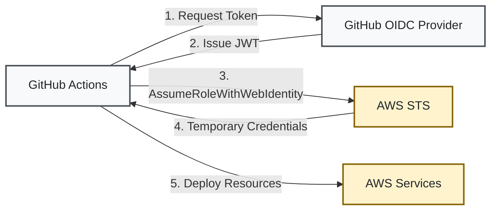

# Security Guide

Comprehensive security implementation guide for the AWS static website infrastructure.

## Security Architecture Overview

The infrastructure implements defense-in-depth security with multiple layers:

1. **Edge Security**: CloudFront + WAF protection
2. **Access Control**: Origin Access Control (OAC) and IAM policies
3. **Encryption**: At-rest and in-transit encryption
4. **Authentication**: OIDC-based GitHub Actions with no long-lived credentials
5. **Monitoring**: CloudWatch alerts and logging
6. **Compliance**: ASVS L1/L2 and OWASP Top 10 protection

## GitHub Actions OIDC Authentication

### Overview

OIDC (OpenID Connect) eliminates the need for storing AWS credentials in GitHub:



### Setup

See [IAM Setup Guide](iam-setup.md) for detailed OIDC configuration steps.

### Security Benefits

- **No Long-Lived Credentials**: Temporary tokens expire after 1 hour
- **Granular Access Control**: Repository and branch-specific permissions
- **Audit Trail**: All actions tracked through CloudTrail
- **Reduced Attack Surface**: No credentials to leak or rotate

## WAF Protection

### OWASP Top 10 Protection

The WAF module implements AWS Managed Rule Sets:

```hcl
# Core rule set for OWASP Top 10
aws_wafv2_web_acl_rule {
  name     = "AWSManagedRulesCommonRuleSet"
  priority = 1
  
  override_action {
    none {}
  }
  
  statement {
    managed_rule_group_statement {
      name        = "AWSManagedRulesCommonRuleSet"
      vendor_name = "AWS"
    }
  }
}
```

### Rate Limiting

Protect against DDoS and brute force:

```hcl
rate_based_statement {
  limit              = 2000
  aggregate_key_type = "IP"
}
```

### Geo-Blocking

Optional country-based restrictions:

```hcl
geo_match_statement {
  country_codes = var.blocked_countries
}
```

## Encryption

### Data at Rest

All data encrypted using AWS KMS:

- **S3 Buckets**: SSE-KMS encryption
- **CloudWatch Logs**: Encrypted log groups
- **SNS Topics**: KMS encryption for notifications

### Data in Transit

- **CloudFront to Users**: TLS 1.2+ enforced
- **CloudFront to S3**: HTTPS only
- **API Calls**: All AWS API calls use TLS

### KMS Key Management

```bash
# Create KMS key for encryption
aws kms create-key \
  --description "Static site encryption key" \
  --key-policy file://kms-policy.json

# Create alias for easier reference
aws kms create-alias \
  --alias-name alias/static-site \
  --target-key-id KEY_ID
```

## S3 Security

### Bucket Policies

Restrict access to CloudFront only:

```json
{
  "Version": "2012-10-17",
  "Statement": [
    {
      "Sid": "AllowCloudFrontServicePrincipal",
      "Effect": "Allow",
      "Principal": {
        "Service": "cloudfront.amazonaws.com"
      },
      "Action": "s3:GetObject",
      "Resource": "arn:aws:s3:::BUCKET_NAME/*",
      "Condition": {
        "StringEquals": {
          "AWS:SourceArn": "arn:aws:cloudfront::ACCOUNT:distribution/DISTRIBUTION"
        }
      }
    }
  ]
}
```

### Public Access Blocking

All public access blocked by default:

```hcl
block_public_acls       = true
block_public_policy     = true
ignore_public_acls      = true
restrict_public_buckets = true
```

### Versioning and Lifecycle

- **Versioning**: Enabled for rollback capability
- **Lifecycle Rules**: Automatic cleanup of old versions
- **MFA Delete**: Optional for production buckets

## CloudFront Security Headers

### Security Headers Function

JavaScript function adds security headers to all responses:

```javascript
function handler(event) {
    const response = event.response;
    const headers = response.headers;
    
    // Security headers
    headers['strict-transport-security'] = {
        value: 'max-age=31536000; includeSubDomains; preload'
    };
    headers['x-content-type-options'] = {
        value: 'nosniff'
    };
    headers['x-frame-options'] = {
        value: 'DENY'
    };
    headers['x-xss-protection'] = {
        value: '1; mode=block'
    };
    headers['referrer-policy'] = {
        value: 'strict-origin-when-cross-origin'
    };
    headers['content-security-policy'] = {
        value: "default-src 'self'; script-src 'self' 'unsafe-inline'; style-src 'self' 'unsafe-inline';"
    };
    
    return response;
}
```

## Security Scanning

### Checkov Integration

Static analysis of Terraform code:

```bash
# Run Checkov scan
checkov -d terraform \
  --framework terraform \
  --output json \
  --soft-fail
```

### Trivy Configuration Scanning

Misconfiguration detection:

```bash
# Run Trivy scan
trivy config terraform/ \
  --severity CRITICAL,HIGH,MEDIUM \
  --format json
```

### Security Thresholds

Pipeline fails if thresholds exceeded:
- **Critical**: 0 allowed
- **High**: 0 allowed
- **Medium**: ≤ 3 allowed
- **Low**: ≤ 10 allowed

## Monitoring and Alerting

### CloudWatch Alarms

Critical security alarms:

1. **WAF Blocked Requests**: Alert on spike in blocked requests
2. **4xx/5xx Errors**: Detect potential attacks or misconfigurations
3. **Unusual S3 Access**: Alert on direct S3 access attempts
4. **Budget Alerts**: Detect potential resource abuse

### CloudTrail Logging

Enable CloudTrail for audit logging:

```bash
aws cloudtrail create-trail \
  --name static-site-trail \
  --s3-bucket-name audit-bucket \
  --include-global-service-events \
  --is-multi-region-trail \
  --enable-log-file-validation
```

## Incident Response

### Security Incident Playbook

1. **Detection**
   - CloudWatch alarm triggered
   - Unusual activity in logs
   - User report

2. **Containment**
   - Activate WAF emergency rules
   - Block suspicious IPs
   - Invalidate CloudFront cache if compromised

3. **Investigation**
   - Review CloudTrail logs
   - Analyze WAF logs
   - Check S3 access logs

4. **Recovery**
   - Remove malicious content
   - Restore from S3 versioning
   - Update security rules

5. **Post-Incident**
   - Document lessons learned
   - Update security policies
   - Improve monitoring

### Emergency Contacts

Configure SNS topic for security alerts:

```bash
aws sns create-topic --name security-alerts
aws sns subscribe \
  --topic-arn arn:aws:sns:REGION:ACCOUNT:security-alerts \
  --protocol email \
  --notification-endpoint security@example.com
```

## Compliance

### ASVS L1 Compliance

- ✅ Authentication and Session Management
- ✅ Access Control
- ✅ Input Validation (WAF)
- ✅ Cryptography at Rest and in Transit

### ASVS L2 Compliance

- ✅ Security Logging and Monitoring
- ✅ Data Protection
- ✅ Communications Security
- ⚠️ Error Handling (partial)

### OWASP Top 10 Coverage

| Risk | Protection |
|------|------------|
| A01 - Broken Access Control | OAC, IAM policies |
| A02 - Cryptographic Failures | TLS 1.2+, KMS encryption |
| A03 - Injection | WAF SQL injection rules |
| A04 - Insecure Design | Secure architecture patterns |
| A05 - Security Misconfiguration | Security scanning, hardening |
| A06 - Vulnerable Components | No server components (serverless) |
| A07 - Authentication Failures | OIDC, no passwords |
| A08 - Data Integrity | S3 versioning, CloudTrail |
| A09 - Logging Failures | Comprehensive logging |
| A10 - SSRF | WAF protection |

## Security Hardening Checklist

### Pre-Deployment

- [ ] Replace all placeholder values
- [ ] Configure OIDC authentication
- [ ] Review and customize WAF rules
- [ ] Set up KMS encryption keys
- [ ] Configure CloudTrail logging
- [ ] Set up security alert emails
- [ ] Review IAM policies (least privilege)
- [ ] Enable MFA for console access

### Post-Deployment

- [ ] Verify WAF is active
- [ ] Test security headers
- [ ] Confirm S3 public access blocked
- [ ] Validate CloudFront OAC
- [ ] Check encryption status
- [ ] Test alerting system
- [ ] Run security scan
- [ ] Document security contacts

## Security Best Practices

1. **Least Privilege**: Grant minimum required permissions
2. **Defense in Depth**: Multiple security layers
3. **Encryption Everywhere**: Encrypt at rest and in transit
4. **No Secrets in Code**: Use AWS Secrets Manager or Parameter Store
5. **Regular Updates**: Keep dependencies and rules updated
6. **Monitoring**: Comprehensive logging and alerting
7. **Incident Response**: Have a plan and test it
8. **Security Reviews**: Regular security assessments

## Security Tools and Commands

### Useful AWS CLI Commands

```bash
# Check S3 bucket public access
aws s3api get-public-access-block --bucket BUCKET_NAME

# List WAF rules
aws wafv2 list-web-acls --scope CLOUDFRONT --region us-east-1

# Check CloudFront distribution security
aws cloudfront get-distribution-config --id DISTRIBUTION_ID

# Review IAM policies
aws iam get-role-policy --role-name ROLE_NAME --policy-name POLICY_NAME

# Check KMS key policy
aws kms get-key-policy --key-id KEY_ID --policy-name default
```

### Security Validation

```bash
# Test security headers
curl -I https://your-domain.com | grep -i "strict-transport-security"

# Check TLS configuration
nmap --script ssl-enum-ciphers -p 443 your-domain.com

# Validate WAF is working
curl -X POST https://your-domain.com -d "sql='OR'1'='1"
```

## Additional Resources

- [AWS Security Best Practices](https://aws.amazon.com/security/best-practices/)
- [OWASP ASVS](https://owasp.org/www-project-application-security-verification-standard/)
- [AWS Well-Architected Security Pillar](https://docs.aws.amazon.com/wellarchitected/latest/security-pillar/)
- [GitHub Actions Security Hardening](https://docs.github.com/en/actions/security-guides/)