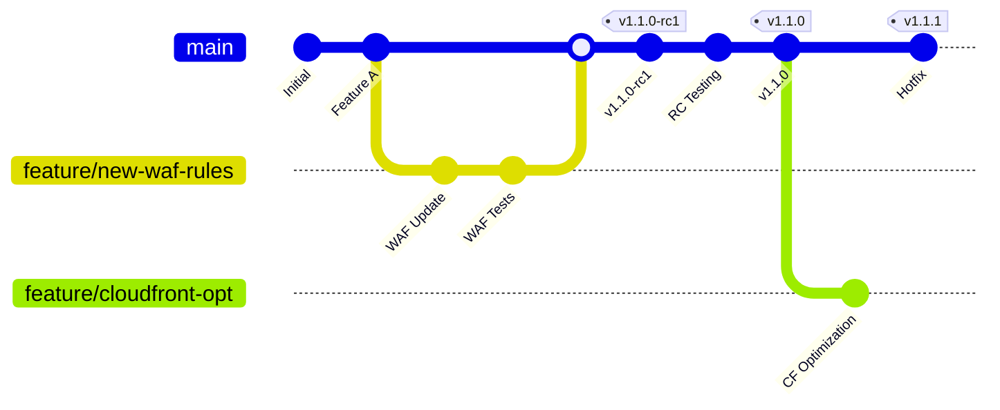
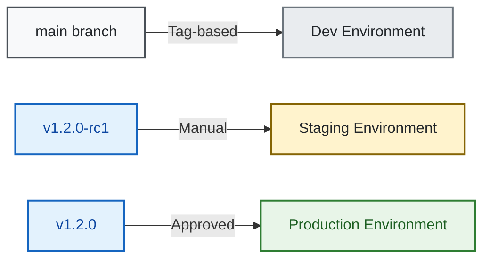

# Git-Based Version Management Guide

> **🎯 Target Audience**: DevOps engineers, platform teams, release managers  
> **📊 Complexity**: ⭐⭐⭐ Advanced  
> **📋 Prerequisites**: Git workflows, semantic versioning, GitHub Actions  
> **⏱️ Reading Time**: 15-20 minutes

## Executive Summary

This guide establishes a comprehensive git-based version management strategy for the AWS static website infrastructure. Using semantic versioning with git tags, this approach provides precise version control, automated deployments, and reliable rollback capabilities without vendor lock-in.

## Version Management Strategy

### Semantic Versioning

We follow [Semantic Versioning 2.0.0](https://semver.org/) with the format: `MAJOR.MINOR.PATCH`

- **MAJOR** (v1.0.0 → v2.0.0): Breaking changes, major infrastructure updates
- **MINOR** (v1.0.0 → v1.1.0): New features, backwards-compatible changes
- **PATCH** (v1.0.0 → v1.0.1): Bug fixes, security patches, minor updates

### Version Types

| Version Type | Format | Example | Purpose | Environment |
|-------------|--------|---------|---------|-------------|
| Development | branch name | `develop` | Active development | dev |
| Release Candidate | `vX.Y.Z-rcN` | `v1.2.0-rc1` | Pre-production testing | staging |
| Stable Release | `vX.Y.Z` | `v1.2.0` | Production deployment | prod |
| Hotfix | `vX.Y.Z-hotfix.N` | `v1.2.1-hotfix.1` | Emergency fixes | prod |

## Branch Strategy

### Branch Model



### Branch Purposes

| Branch | Purpose | Deploy To | Protected | Auto-Deploy |
|--------|---------|-----------|-----------|-------------|
| `main` | Stable releases | Tag-based deployment | Yes | Via tags |
| `feature/*` | Feature development | Manual deployment | No | No |
| `hotfix/*` | Emergency fixes | Tag-based deployment | No | Via tags |

## Release Process

### 1. Feature Development

```bash
# Create feature branch
git checkout -b feature/cloudfront-optimization
git push -u origin feature/cloudfront-optimization

# Work on feature
git add .
git commit -m "feat: optimize CloudFront cache behaviors"
git push

# Create pull request to develop
gh pr create --base develop --title "CloudFront optimization"
```

### 2. Release Candidate Creation

```bash
# From main branch (tag-based deployment)
git checkout main
git pull origin main

# Create release candidate tag
git tag -a v1.2.0-rc1 -m "Release candidate 1.2.0-rc1

Features:
- CloudFront optimization
- Enhanced monitoring

Testing required:
- Performance validation
- Cost analysis"

git push origin v1.2.0-rc1
```

### 3. Production Release

```bash
# After RC validation
git checkout main
git merge develop
git tag -a v1.2.0 -m "Release version 1.2.0

Features:
- CloudFront optimization (#45)
- Enhanced monitoring (#46)

Tested in staging: v1.2.0-rc1
Approved by: @tech-lead"

git push origin main --tags
```

### 4. Hotfix Process

```bash
# Create hotfix from main
git checkout -b hotfix/critical-waf-fix main

# Apply fix
git commit -m "hotfix: critical WAF rule correction"

# Tag hotfix
git tag -a v1.2.1-hotfix.1 -m "Hotfix: WAF rule correction"
git push origin v1.2.1-hotfix.1

# After validation, create patch release
git checkout main
git merge hotfix/critical-waf-fix
git tag -a v1.2.1 -m "Patch release: WAF fix"
git push origin main --tags
```

## Automated Release Workflow

### GitHub Actions Release Automation

The release workflow automates version tagging and deployment based on commit messages and branch patterns.

### Workflow Triggers

| Event | Action | Example |
|-------|--------|---------|
| Tag push `v*-rc*` | Deploy to staging | `v1.2.0-rc1` |
| Tag push `v*.*.*` | Create GitHub release | `v1.2.0` |
| Release published | Deploy to production | Via GitHub UI |
| Workflow dispatch | Manual deployment | Emergency deploy |

## Environment Mapping

### Version to Environment



### Deployment Rules

| Environment | Version Sources | Approval | Rollback |
|-------------|----------------|----------|----------|
| Development | Manual deployment | None | Redeploy previous version |
| Staging | `v*-rc*` tags | 1 reviewer | Deploy previous RC |
| Production | `v*.*.*` tags | 2 reviewers | Deploy previous stable |

## Rollback Procedures

### Quick Rollback Script

```bash
#!/bin/bash
# scripts/rollback-deployment.sh

ENVIRONMENT=$1
PREVIOUS_VERSION=$2

case $ENVIRONMENT in
  dev)
    git checkout develop
    git reset --hard $PREVIOUS_VERSION
    git push --force-with-lease
    ;;
  staging)
    gh workflow run deploy-staging.yml \
      -f version=$PREVIOUS_VERSION \
      -f action=rollback
    ;;
  prod)
    gh workflow run deploy-prod.yml \
      -f version=$PREVIOUS_VERSION \
      -f action=rollback \
      -f emergency=true
    ;;
esac
```

### Rollback via GitHub UI

1. Navigate to Actions → Deploy Workflow
2. Click "Run workflow"
3. Enter previous version tag
4. Select "rollback" action
5. Approve deployment

## Version Tracking

### Infrastructure Version File

Create `terraform/VERSION` to track deployed versions:

```
environment: prod
version: v1.2.0
deployed: 2025-08-21T10:30:00Z
deployed_by: github-actions[bot]
commit: abc123def456
```

### Terraform State Tagging

```hcl
locals {
  version_tag = var.deployment_version != "" ? var.deployment_version : "latest"
  
  common_tags = merge(
    var.tags,
    {
      Version     = local.version_tag
      DeployDate  = timestamp()
      GitCommit   = var.git_commit
    }
  )
}
```

## Release Notes Generation

### Automatic Release Notes

GitHub Actions can generate release notes from commit messages:

```yaml
- name: Generate Release Notes
  run: |
    git log $(git describe --tags --abbrev=0)..HEAD \
      --pretty=format:"- %s (%h)" \
      --grep="^feat\|^fix\|^perf" > RELEASE_NOTES.md
```

### Commit Message Convention

Follow [Conventional Commits](https://www.conventionalcommits.org/):

- `feat:` New feature
- `fix:` Bug fix
- `docs:` Documentation
- `perf:` Performance improvement
- `refactor:` Code refactoring
- `test:` Test updates
- `chore:` Maintenance tasks

## CI/CD Integration

### Version-Based Deployment

```yaml
name: Deploy on Version Tag

on:
  push:
    tags:
      - 'v*.*.*'
      - 'v*.*.*-rc*'

jobs:
  deploy:
    runs-on: ubuntu-latest
    steps:
      - name: Determine Environment
        run: |
          if [[ "${{ github.ref }}" == *"-rc"* ]]; then
            echo "ENVIRONMENT=staging" >> $GITHUB_ENV
          else
            echo "ENVIRONMENT=prod" >> $GITHUB_ENV
          fi
      
      - name: Deploy Infrastructure
        run: |
          terraform apply -var-file=environments/${{ env.ENVIRONMENT }}.tfvars \
            -var="deployment_version=${{ github.ref_name }}"
```

## Best Practices

### Version Tagging
1. Always use annotated tags with descriptions
2. Include ticket/PR references in tag messages
3. Sign tags for production releases
4. Never reuse or move tags

### Branch Protection
1. Protect `main` and `develop` branches
2. Require PR reviews before merging
3. Enforce status checks
4. Restrict force pushes

### Release Documentation
1. Maintain CHANGELOG.md
2. Generate release notes automatically
3. Include breaking changes warnings
4. Document rollback procedures

## Version History Commands

### Useful Git Commands

```bash
# List all versions
git tag -l "v*" --sort=-version:refname

# Show version details
git show v1.2.0

# Compare versions
git diff v1.1.0..v1.2.0

# Find when feature was introduced
git log --all --grep="feature-name"

# Check current deployed version
git describe --tags --always

# List versions by date
git tag -l --sort=-creatordate --format='%(refname:short) %(creatordate:short)'
```

## Troubleshooting

### Common Issues

1. **Wrong version deployed**
   - Check GitHub Actions logs
   - Verify tag format matches workflow triggers
   - Ensure correct environment mapping

2. **Failed deployment**
   - Review terraform plan output
   - Check for configuration conflicts
   - Validate version compatibility

3. **Rollback failures**
   - Ensure previous version state exists
   - Check for breaking changes
   - Use force deployment if necessary

## Related Documentation

- [Multi-Environment Strategy](multi-environment-strategy.md) - Environment configurations
- [Deployment Guide](deployment-guide.md) - Deployment procedures
- [GitHub Actions Workflows](../development/workflow-conditions.md) - CI/CD details

---

*Last Updated: 2025-08-21*  
*Version: 1.0.0*  
*Status: Implementation Ready*