# IAM Deep Dive: Direct OIDC Architecture

**⭐⭐⭐ Advanced** - Comprehensive guide to AWS IAM permissions using direct OIDC authentication.

> **💡 For architecture overview**, see [Architecture Guide](architecture.md).
> **💡 For deployment instructions**, see [Deployment Guide](../DEPLOYMENT.md).
> **💡 For region configuration**, see [scripts/bootstrap/config.sh](../scripts/bootstrap/config.sh).

---

Comprehensive documentation of the AWS IAM permissions model for the static website infrastructure, implementing AWS's recommended direct OIDC authentication pattern.

## Executive Summary

The project implements **Direct OIDC authentication** from GitHub Actions to environment-specific IAM roles, following [AWS IAM best practices](https://docs.aws.amazon.com/IAM/latest/UserGuide/best-practices.html) for OIDC federation. This architecture eliminates unnecessary role chaining, reduces attack surface, and simplifies security auditing.

###Quick Status
- **✅ OIDC Providers**: Configured in all environment accounts (dev, staging, prod)
- **✅ GitHub Actions Roles**: Direct OIDC trust, per-environment isolation
- **✅ Read-Only Console Roles**: Cross-account access for engineers
- **✅ Terraform-Managed**: All roles defined in infrastructure-as-code

### Key Security Benefits
- **No Stored Credentials**: GitHub OIDC eliminates long-lived access keys
- **Direct Authentication**: Single-hop role assumption (simpler = more secure)
- **Repository Scope**: Roles trust only specific repository workflows
- **Account Isolation**: Each environment has independent role in isolated account
- **Audit Trail**: Clear CloudTrail logs showing GitHub → Environment → Resources

---

## The Direct OIDC Architecture

### Design Philosophy

Direct OIDC implements **security through simplicity**:
- **Single Authentication Hop**: GitHub OIDC → Environment Role → AWS Services
- **Repository-Scoped Trust**: Roles trust specific GitHub repository only
- **Environment Isolation**: Each account has dedicated role with least-privilege permissions
- **No Centralized Role**: Eliminates single point of failure and complexity

### Architecture Diagram

```mermaid
%%{init: {'theme':'default', 'themeVariables': {'fontSize':'16px'}}}%%
graph TB
    accTitle: "Direct OIDC Authentication Architecture"
    accDescr: "Direct OIDC architecture showing GitHub Actions authenticating directly to environment-specific roles via OIDC without stored credentials. Each environment account (Dev, Staging, Prod) has its own OIDC provider and two dedicated roles: GitHubActions role for CI/CD deployments and ReadOnly role for human console access. GitHub Actions workflows authenticate via OIDC AssumeRoleWithWebIdentity action directly to target environment role. No central orchestration role needed. Trust policies scope access to specific GitHub repository. This implements AWS 2025 best practice for GitHub Actions authentication, eliminating role chaining complexity and reducing attack surface."

    subgraph GitHub["🐙 GitHub Actions Repository<br/>Celtikill/static-site"]
        Workflow["🔄 Workflow Run<br/>No Stored Credentials"]
    end

    subgraph Dev["🧪 Dev Account (859340968804)"]
        DevOIDC["🔐 OIDC Provider<br/>token.actions.githubusercontent.com"]
        DevDeploy["🚀 GitHubActions-static-site-Dev-Role<br/>Deployment Permissions"]
        DevReadOnly["👁️ static-site-ReadOnly-dev<br/>AWS ReadOnlyAccess"]
    end

    subgraph Staging["🚀 Staging Account (927588814642)"]
        StagingOIDC["🔐 OIDC Provider<br/>token.actions.githubusercontent.com"]
        StagingDeploy["🚀 GitHubActions-static-site-Staging-Role<br/>Deployment Permissions"]
        StagingReadOnly["👁️ static-site-ReadOnly-staging<br/>AWS ReadOnlyAccess"]
    end

    subgraph Prod["🏭 Production Account (546274483801)"]
        ProdOIDC["🔐 OIDC Provider<br/>token.actions.githubusercontent.com"]
        ProdDeploy["🚀 GitHubActions-static-site-Prod-Role<br/>Deployment Permissions"]
        ProdReadOnly["👁️ static-site-ReadOnly-prod<br/>AWS ReadOnlyAccess"]
    end

    subgraph Mgmt["🏢 Management Account (223938610551)"]
        Engineers["👤 Engineers<br/>IAM Users with MFA"]
    end

    Workflow -->|"OIDC AssumeRoleWithWebIdentity"| DevDeploy
    Workflow -->|"OIDC AssumeRoleWithWebIdentity"| StagingDeploy
    Workflow -->|"OIDC AssumeRoleWithWebIdentity"| ProdDeploy

    Engineers -->|"Console Switchrole"| DevReadOnly
    Engineers -->|"Console Switchrole"| StagingReadOnly
    Engineers -->|"Console Switchrole"| ProdReadOnly

    DevDeploy --> DevResources["☁️ S3, CloudFront<br/>Route53, ACM"]
    StagingDeploy --> StagingResources["☁️ S3, CloudFront<br/>Route53, ACM"]
    ProdDeploy --> ProdResources["☁️ S3, CloudFront<br/>Route53, ACM"]

    style DevDeploy fill:#e1f5e1
    style StagingDeploy fill:#e1f5e1
    style ProdDeploy fill:#e1f5e1
    style DevReadOnly fill:#e1f1ff
    style StagingReadOnly fill:#e1f1ff
    style ProdReadOnly fill:#e1f1ff
```



### Why Direct OIDC?

**AWS Best Practice (2025)**:
- **Recommended Pattern**: [AWS documentation](https://docs.aws.amazon.com/IAM/latest/UserGuide/id_roles_providers_oidc.html) explicitly recommends direct OIDC for GitHub Actions
- **Simpler is Safer**: Fewer hops = fewer potential misconfiguration points
- **Native Integration**: GitHub OIDC designed specifically for this use case
- **Industry Standard**: Adopted by major organizations migrating from stored credentials

**Security Advantages**:
- **No Credential Rotation**: OIDC tokens are short-lived and auto-rotated
- **No Secrets Storage**: Zero long-lived credentials in GitHub or code
- **Reduced Attack Surface**: Fewer roles = fewer trust relationships to secure
- **Clear Audit Trail**: Single-hop makes CloudTrail analysis straightforward

**Operational Benefits**:
- **Faster Deployments**: One role assumption instead of chained assumptions
- **Easier Troubleshooting**: Simple authentication flow to debug
- **Lower Latency**: ~200ms vs ~400ms for multi-hop architectures
- **Terraform-Managed**: All roles defined in version-controlled modules

---

## Role Definitions

### GitHub Actions Deployment Roles

These roles enable CI/CD pipelines to deploy infrastructure and applications.

#### Role Template

```yaml
Role Name: GitHubActions-static-site-{Environment}-Role
Account: Target environment account
Module: terraform/modules/iam/github-actions-oidc-role
Purpose: Deploy and manage application infrastructure via GitHub Actions

Trust Policy (OIDC):
  Principal:
    Federated: arn:aws:iam::{ACCOUNT_ID}:oidc-provider/token.actions.githubusercontent.com
  Action: sts:AssumeRoleWithWebIdentity
  Condition:
    StringEquals:
      token.actions.githubusercontent.com:aud: sts.amazonaws.com
    StringLike:
      token.actions.githubusercontent.com:sub: repo:Celtikill/static-site:*

Permissions (Inline Policy - DeploymentPolicy):
  - S3 state bucket and website bucket management
  - DynamoDB locks table access
  - CloudFront distribution management
  - ACM certificate management
  - Route53 DNS management
  - KMS key management
  - IAM role read access
  - CloudWatch logs and metrics
  - SNS topic management
  - Budget management

Tags:
  Environment: {environment}
  ManagedBy: terraform
  Project: static-site
  Purpose: GitHubActionsDeployment
```

#### Deployed Roles

| Environment | Role ARN | Account ID |
|-------------|----------|------------|
| Dev | `arn:aws:iam::859340968804:role/GitHubActions-static-site-Dev-Role` | 859340968804 |
| Staging | `arn:aws:iam::927588814642:role/GitHubActions-static-site-Staging-Role` | 927588814642 |
| Production | `arn:aws:iam::546274483801:role/GitHubActions-static-site-Prod-Role` | 546274483801 |

### Read-Only Console Access Roles

These roles enable engineers to view AWS resources via web console for debugging and monitoring.

#### Role Template

```yaml
Role Name: static-site-ReadOnly-{environment}
Account: Target environment account
Module: terraform/modules/iam/readonly-console-role
Purpose: Human console access with read-only permissions

Trust Policy (Cross-Account):
  Principal:
    AWS: arn:aws:iam::223938610551:root
  Action: sts:AssumeRole
  # No MFA condition (AWS Console doesn't pass MFA context during switchrole)

Permissions (Managed Policy):
  - arn:aws:iam::aws:policy/ReadOnlyAccess

Console Switchrole URLs:
  Format: https://signin.aws.amazon.com/switchrole?account={ACCOUNT_ID}&roleName={ROLE_NAME}&displayName={PROJECT}-{ENV}-ReadOnly

Tags:
  Environment: {environment}
  ManagedBy: terraform
  Project: static-site
  Purpose: ReadOnlyConsoleAccess
```

#### Deployed Roles and Console URLs

| Environment | Role ARN | Console Switchrole URL |
|-------------|----------|------------------------|
| Dev | `arn:aws:iam::859340968804:role/static-site-ReadOnly-dev` | [Dev Console](https://signin.aws.amazon.com/switchrole?account=859340968804&roleName=static-site-ReadOnly-dev&displayName=StaticSite-Dev-ReadOnly) |
| Staging | `arn:aws:iam::927588814642:role/static-site-ReadOnly-staging` | [Staging Console](https://signin.aws.amazon.com/switchrole?account=927588814642&roleName=static-site-ReadOnly-staging&displayName=StaticSite-Staging-ReadOnly) |
| Production | `arn:aws:iam::546274483801:role/static-site-ReadOnly-prod` | [Prod Console](https://signin.aws.amazon.com/switchrole?account=546274483801&roleName=static-site-ReadOnly-prod&displayName=StaticSite-Prod-ReadOnly) |

**Usage**: When logged into Management Account (223938610551), click URL to assume role and access environment console.

---

## Authentication Flows

### GitHub Actions Deployment Flow


**Workflow Configuration Example**:

```yaml
# .github/workflows/run.yml
permissions:
  id-token: write  # Required for OIDC
  contents: read

jobs:
  deploy:
    runs-on: ubuntu-latest
    steps:
      - uses: aws-actions/configure-aws-credentials@v4
        with:
          role-to-assume: arn:aws:iam::859340968804:role/GitHubActions-static-site-Dev-Role
          aws-region: us-east-2  # See scripts/bootstrap/config.sh for region configuration

      - name: Deploy
        run: |
          # Credentials automatically available
          aws s3 sync ./dist s3://static-site-dev-website/
```

### Engineer Console Access Flow


**Console Access Steps**:

1. **Login**: Authenticate to Management Account with MFA
2. **Switchrole**: Click console URL or manually switch role
3. **Access**: View resources with read-only permissions
4. **Bookmark**: Save URLs for quick future access

**Security Notes**:
- MFA enforced at login (cannot be enforced at switchrole by AWS limitation)
- 1-hour session duration (shorter than default 12 hours)
- Full CloudTrail audit of role assumptions and API calls
- Access revocable by removing from CrossAccountAdmins group

---

## Permission Details

### GitHub Actions Role Permissions

The deployment roles have the following permission categories:

#### Infrastructure State Management
```json
{
  "Sid": "S3StateBucketAccess",
  "Effect": "Allow",
  "Action": [
    "s3:ListBucket",
    "s3:GetObject",
    "s3:PutObject",
    "s3:DeleteObject",
    "s3:GetBucketVersioning",
    "s3:GetBucketLocation"
  ],
  "Resource": [
    "arn:aws:s3:::static-site-state-*",
    "arn:aws:s3:::static-site-state-*/*"
  ]
}
```

**Purpose**: Terraform state storage and locking
**Scope**: Project-prefixed state buckets only

#### Application Deployment
```json
{
  "Sid": "S3WebsiteBucketManagement",
  "Effect": "Allow",
  "Action": [
    "s3:CreateBucket",
    "s3:DeleteBucket",
    "s3:Get*",
    "s3:Put*",
    "s3:List*",
    "s3:DeleteObject"
  ],
  "Resource": [
    "arn:aws:s3:::static-site-*",
    "arn:aws:s3:::static-site-*/*",
    "arn:aws:s3:::static-site-website-*",
    "arn:aws:s3:::static-site-website-*/*"
  ]
}
```

**Purpose**: Website content bucket management
**Scope**: Project-prefixed website buckets

#### CDN and Certificate Management

- **CloudFront**: Full distribution management for content delivery
- **ACM**: Certificate management for HTTPS
- **Route53**: DNS record management
- **KMS**: Encryption key management

#### Observability

- **CloudWatch**: Logs, metrics, alarms, and dashboards
- **SNS**: Notification topic management
- **Budgets**: Cost tracking and alerting

#### Limited IAM

```json
{
  "Sid": "IAMRoleRead",
  "Effect": "Allow",
  "Action": [
    "iam:GetRole",
    "iam:GetRolePolicy",
    "iam:ListAttachedRolePolicies",
    "iam:ListRolePolicies"
  ],
  "Resource": "*"
}
```

**Purpose**: Terraform needs to read IAM role state
**Scope**: Read-only access for state management

**Full Policy**: See [policies/iam-github-actions-deployment.json](../policies/iam-github-actions-deployment.json)

### Read-Only Role Permissions

Uses AWS-managed policy: `arn:aws:iam::aws:policy/ReadOnlyAccess`

**Includes**:
- View all AWS resources (EC2, S3, CloudFront, etc.)
- Read CloudWatch metrics and logs
- View IAM roles and policies (not modify)
- Read billing and cost data

**Excludes**:
- Create, modify, or delete resources
- Execute privileged operations
- Assume other roles
- Access to sensitive data storage (depending on bucket policies)

---

## Terraform Module Documentation

### github-actions-oidc-role Module

**Location**: `terraform/modules/iam/github-actions-oidc-role/`

**Purpose**: Creates IAM role for GitHub Actions OIDC authentication

**Input Variables**:
```hcl
variable "account_id" {
  description = "AWS account ID where role will be created"
  type        = string
}

variable "environment" {
  description = "Environment name (dev, staging, prod)"
  type        = string
}

variable "github_repo" {
  description = "GitHub repository in format owner/repo"
  type        = string
}

variable "project_short_name" {
  description = "Short project name for resource naming"
  type        = string
}

variable "management_account_id" {
  description = "Management account ID for assumable roles"
  type        = string
}
```

**Outputs**:
```hcl
output "role_arn" {
  description = "ARN of created GitHub Actions role"
  value       = aws_iam_role.github_actions.arn
}

output "role_name" {
  description = "Name of created role"
  value       = aws_iam_role.github_actions.name
}
```

**Usage**:
```hcl
module "github_actions_dev" {
  source = "../../modules/iam/github-actions-oidc-role"

  account_id            = "859340968804"
  environment           = "dev"
  github_repo           = "Celtikill/static-site"
  project_short_name    = "static-site"
  management_account_id = "223938610551"
}
```

### readonly-console-role Module

**Location**: `terraform/modules/iam/readonly-console-role/`

**Purpose**: Creates cross-account read-only role for console access

**Input Variables**:
```hcl
variable "account_id" {
  description = "AWS account ID where role will be created"
  type        = string
}

variable "environment" {
  description = "Environment name (dev, staging, prod)"
  type        = string
}

variable "project_short_name" {
  description = "Short project name for resource naming"
  type        = string
}

variable "management_account_id" {
  description = "Management account ID that can assume this role"
  type        = string
}
```

**Outputs**:
```hcl
output "role_arn" {
  description = "ARN of read-only console role"
  value       = aws_iam_role.readonly_console.arn
}

output "console_url" {
  description = "Pre-configured console switchrole URL"
  value       = local.console_url
}
```

**Console URL Format**:
The module automatically generates console switchrole URLs with project name for easy identification:
- `StaticSite-Dev-ReadOnly`
- `StaticSite-Staging-ReadOnly`
- `StaticSite-Prod-ReadOnly`

---

## Security Model

### Defense in Depth Layers

**Layer 1: Repository Scope**
- Roles trust only `repo:Celtikill/static-site:*`
- Cannot be assumed from other GitHub repositories
- Protects against forked repository attacks

**Layer 2: Account Isolation**
- Each environment in separate AWS account
- Dev role cannot access staging or prod resources
- Blast radius limited to single environment

**Layer 3: Least Privilege**
- Roles have minimum permissions for their function
- Project-prefixed resource restrictions where possible
- Read-only access for human console operations

**Layer 4: Audit Logging**
- CloudTrail captures all API calls
- Clear attribution: GitHub repo/workflow → Role → Action
- Retention and analysis for compliance

**Layer 5: Time-Limited Credentials**
- OIDC tokens expire quickly (~10 minutes)
- Assumed role credentials expire in 1 hour
- No long-lived credentials to rotate or leak

### Threat Model

#### Prevented Attacks

**✅ Stolen Credentials**
- No long-lived credentials exist to steal
- OIDC tokens are short-lived and workflow-specific

**✅ Repository Fork Attack**
- Trust policies require exact repository match
- Forked repos cannot assume roles

**✅ Privilege Escalation**
- Roles cannot assume other roles
- Account boundaries prevent lateral movement

**✅ Cross-Environment Access**
- Dev role cannot access staging/prod
- Each account isolated

#### Mitigated Risks

**⚠️ Compromised Workflow**
- **Risk**: Malicious workflow code could abuse role permissions
- **Mitigation**:
  - Branch protection on main
  - Pull request reviews required
  - CloudTrail monitoring for unusual activity
  - Budget alerts prevent cost-based attacks

**⚠️ OIDC Provider Compromise**
- **Risk**: GitHub OIDC provider compromise affects all customers
- **Mitigation**:
  - AWS validates tokens cryptographically
  - Short token lifetime limits exposure
  - Industry-standard security (billions in security investment)

### Compliance Considerations

**Audit Requirements**:
- CloudTrail provides complete audit trail
- Role assumptions logged with GitHub context
- Resource changes attributed to workflows

**Separation of Duties**:
- Read-only roles for engineers (no modify)
- Deployment roles for automation only (no human access)
- Management account controls role creation

**Least Privilege**:
- Roles scoped to minimum required permissions
- Resource restrictions where possible
- Regular permission reviews via Terraform

---

## Troubleshooting

### Common Issues

#### "No Such Identity Provider" Error

**Symptom**:
```
An error occurred (ValidationError) when calling AssumeRoleWithWebIdentity:
Cannot find Identity Provider with arn:aws:iam::859340968804:oidc-provider/token.actions.githubusercontent.com
```

**Diagnosis**:
```bash
# Check if OIDC provider exists
aws iam list-open-id-connect-providers

# Expected output should include:
# "Arn": "arn:aws:iam::859340968804:oidc-provider/token.actions.githubusercontent.com"
```

**Solution**:
```bash
# Run bootstrap script to create OIDC providers
cd scripts/bootstrap
./bootstrap-foundation.sh
```

#### "Not Authorized to Perform sts:AssumeRoleWithWebIdentity" Error

**Symptom**:
```
User: arn:aws:sts::859340968804:assumed-role/GitHubActions-static-site-Dev-Role/GitHubActions
is not authorized to perform: sts:AssumeRoleWithWebIdentity on resource:
arn:aws:iam::859340968804:role/GitHubActions-static-site-Dev-Role
```

**Diagnosis**:
```bash
# Check role trust policy
aws iam get-role --role-name GitHubActions-static-site-Dev-Role \
  --query 'Role.AssumeRolePolicyDocument'

# Verify repository name matches exactly
# Check for typos in GitHub repository name
```

**Common Causes**:
1. Repository name mismatch (check capitalization)
2. OIDC audience mismatch (should be `sts.amazonaws.com`)
3. Role doesn't exist or wrong account
4. GitHub Actions workflow missing `id-token: write` permission

#### "Console Switchrole Access Denied"

**Symptom**: Click console URL but get "You don't have permission to switch to this role"

**Diagnosis**:
```bash
# Verify you're logged into management account
aws sts get-caller-identity

# Should show: "Account": "223938610551"

# Check role trust policy
aws iam get-role --role-name static-site-ReadOnly-dev \
  --profile dev-deploy
```

**Solution**:
1. Ensure logged into Management Account (223938610551)
2. Verify your IAM user is in CrossAccountAdmins group
3. Check role trust policy allows management account root

---

## Bootstrap Process

### Creating Roles

All IAM roles are created via Terraform during bootstrap:

```bash
cd scripts/bootstrap
./bootstrap-foundation.sh
```

**What It Does**:
1. Creates OIDC providers in all environment accounts
2. Creates GitHub Actions deployment roles (6 roles: 3 environments)
3. Creates read-only console roles (3 roles)
4. Generates console switchrole URLs
5. Outputs role ARNs for GitHub Actions configuration

**Terraform Modules Used**:
- `terraform/modules/iam/github-actions-oidc-role`
- `terraform/modules/iam/readonly-console-role`

**Terraform Foundation**:
- `terraform/foundations/iam-roles/main.tf` (orchestrates module instantiation)

### Generated Outputs

After bootstrap, find generated outputs:

**Console URLs**: `scripts/bootstrap/output/console-urls.txt`
```
Dev Environment:
  Account: 859340968804
  Role: static-site-ReadOnly-dev
  URL:
https://signin.aws.amazon.com/switchrole?account=859340968804&roleName=static-site-ReadOnly-dev&displayName=StaticSite-Dev-ReadOnly
```

**Bootstrap Report**: `scripts/bootstrap/output/bootstrap-report.json`
```json
{
  "timestamp": "2025-11-04T11:08:44-05:00",
  "status": "success",
  "role_arns": {
    "github_actions": {
      "dev": "arn:aws:iam::859340968804:role/GitHubActions-static-site-Dev-Role",
      "staging": "arn:aws:iam::927588814642:role/GitHubActions-static-site-Staging-Role",
      "prod": "arn:aws:iam::546274483801:role/GitHubActions-static-site-Prod-Role"
    },
    "readonly_console": {
      "dev": "arn:aws:iam::859340968804:role/static-site-ReadOnly-dev",
      "staging": "arn:aws:iam::927588814642:role/static-site-ReadOnly-staging",
      "prod": "arn:aws:iam::546274483801:role/static-site-ReadOnly-prod"
    }
  },
  "console_urls": {
    "dev": "https://signin.aws.amazon.com/switchrole?account=859340968804&roleName=static-site-ReadOnly-dev&displayName=StaticSite-Dev-ReadOnly",
    "staging": "https://signin.aws.amazon.com/switchrole?account=927588814642&roleName=static-site-ReadOnly-staging&displayName=StaticSite-Staging-ReadOnly",
    "prod": "https://signin.aws.amazon.com/switchrole?account=546274483801&roleName=static-site-ReadOnly-prod&displayName=StaticSite-Prod-ReadOnly"
  }
}
```

---

## Related Documentation

### Primary References
- **[Architecture Guide](architecture.md)** - Infrastructure overview
- **[Bootstrap README](../scripts/bootstrap/README.md)** - Bootstrap process details
- **[Policies README](../policies/README.md)** - IAM policy documentation
- **[Security Policy](../SECURITY.md)** - Overall security architecture

### Configuration Files
- **[bootstrap/config.sh](../scripts/bootstrap/config.sh)** - Authoritative configuration source (region, account IDs)
- **[github-actions-oidc-role/main.tf](../terraform/modules/iam/github-actions-oidc-role/main.tf)** - GitHub Actions role module
- **[readonly-console-role/main.tf](../terraform/modules/iam/readonly-console-role/main.tf)** - Console access role module

### Policy Documents
- **[iam-github-actions-oidc-trust.json](../policies/iam-github-actions-oidc-trust.json)** - OIDC trust policy template
- **[iam-github-actions-deployment.json](../policies/iam-github-actions-deployment.json)** - Deployment permissions policy
- **[iam-readonly-console-trust.json](../policies/iam-readonly-console-trust.json)** - Console access trust policy

### External Resources
- **[AWS: Use IAM roles to connect GitHub Actions to AWS](https://docs.aws.amazon.com/IAM/latest/UserGuide/id_roles_providers_oidc_cognito.html)**
- **[GitHub: Configuring OpenID Connect in AWS](https://docs.github.com/en/actions/deployment/security-hardening-your-deployments/configuring-openid-connect-in-amazon-web-services)**
- **[AWS: Switching to an IAM role (console)](https://docs.aws.amazon.com/IAM/latest/UserGuide/id_roles_use_switch-role-console.html)**

---

## Conclusion

The Direct OIDC architecture provides a secure, simple, and maintainable IAM permissions model following AWS 2025 best practices. By eliminating role chaining complexity and leveraging native GitHub OIDC integration, the architecture achieves:

**Key Benefits**:
1. **Security**: No stored credentials, short-lived tokens, repository-scoped trust
2. **Simplicity**: Single-hop authentication, fewer roles to manage
3. **Auditability**: Clear CloudTrail attribution from GitHub to AWS resources
4. **Maintainability**: Terraform-managed infrastructure-as-code
5. **Developer Experience**: Console switchrole URLs for easy environment access

The architecture successfully balances security, operational simplicity, and developer productivity while following industry best practices for GitHub Actions integration with AWS.

---

**Last Updated**: 2025-11-04
**Version**: 2.0.0 (Complete rewrite to reflect direct OIDC implementation)
