# IAM Deep Dive: 3-Tier Permissions Architecture

**⭐⭐⭐ Advanced** - Comprehensive guide to AWS IAM permissions, security model, and migration roadmap.

> **💡 For architecture overview**, see [Architecture Guide](architecture.md).
> **💡 For deployment instructions**, see [Deployment Guide](../DEPLOYMENT.md).

---

Comprehensive documentation of the AWS IAM permissions model for the static website infrastructure, comparing current MVP implementation with the intended pure 3-tier architecture.

## Executive Summary

The project implements a **3-tier IAM security model** designed to provide separation of concerns, least privilege access, and clear audit trails. Currently, the system operates with **documented compromises** that enabled rapid MVP delivery while maintaining awareness of the target architecture.

### Quick Status
- **✅ Tier 1 (Bootstrap)**: Fully implemented and operational
- **✅ Tier 2 (Central)**: Restored to proper scope and working
- **❌ Tier 3 (Environment)**: Compromised with temporary bootstrap permissions

### Key Security Implications
- **Current Risk**: Environment roles have elevated permissions beyond intended scope
- **Mitigation**: All compromises documented with clear migration path
- **Timeline**: Architecture cleanup planned for next development cycle

---

## The 3-Tier Architecture Model

### Design Philosophy

The 3-tier model implements **defense in depth** through role separation:
- **Tier 1**: High-privilege infrastructure creation (rare, audited)
- **Tier 2**: Orchestration and coordination (medium privilege)
- **Tier 3**: Application deployment (low privilege, frequent)

### Intended Pure Architecture

```mermaid
graph TB
    subgraph GitHub["🐙 GitHub Actions"]
        OIDC["🔐 OIDC Authentication<br/>No Stored Credentials"]
    end

    subgraph Management["🏢 Management Account<br/>MANAGEMENT_ACCOUNT_ID"]
        Bootstrap["🎯 Tier 1: Bootstrap Role<br/>GitHubActions-Bootstrap-Central<br/>Infrastructure Creation"]
        Central["🌐 Tier 2: Central Role<br/>GitHubActions-StaticSite-Central<br/>Cross-Account Orchestration"]
    end

    subgraph DevAccount["🧪 Dev Account<br/>DEVELOPMENT_ACCOUNT_ID"]
        DevBootstrap["🎯 Dev Bootstrap Role<br/>GitHubActions-Bootstrap-Dev<br/>Account-Specific Infrastructure"]
        DevDeploy["🔧 Tier 3: Dev Deploy Role<br/>GitHubActions-StaticSite-Dev<br/>Application Deployment Only"]
    end

    subgraph StagingAccount["🚀 Staging Account<br/>STAGING_ACCOUNT_ID"]
        StagingBootstrap["🎯 Staging Bootstrap Role<br/>GitHubActions-Bootstrap-Staging<br/>Account-Specific Infrastructure"]
        StagingDeploy["🔧 Tier 3: Staging Deploy Role<br/>GitHubActions-StaticSite-Staging<br/>Application Deployment Only"]
    end

    OIDC --> Bootstrap
    OIDC --> Central
    Bootstrap --> DevBootstrap
    Bootstrap --> StagingBootstrap
    Central --> DevDeploy
    Central --> StagingDeploy
```



#### Tier 1: Bootstrap Role (Infrastructure Creation)
```yaml
Role: GitHubActions-Bootstrap-Central
Account: Management (MANAGEMENT_ACCOUNT_ID)
Purpose: Create foundational infrastructure (S3 backends, DynamoDB tables, KMS keys)
Trust: GitHub OIDC (main branch only)
Permissions:
  - Cross-account role assumption to bootstrap roles
  - S3 bucket creation and configuration
  - DynamoDB table creation for state locking
  - KMS key creation for encryption
Scope: Project-wide infrastructure creation
Usage: Rare, typically during environment setup
```

#### Tier 2: Central Role (Cross-Account Orchestration)
```yaml
Role: GitHubActions-StaticSite-Central
Account: Management (MANAGEMENT_ACCOUNT_ID)
Purpose: Coordinate deployments across multiple accounts
Trust: GitHub OIDC (all branches)
Permissions:
  - sts:AssumeRole to environment-specific deployment roles
  - No direct AWS service permissions
Scope: Cross-account deployment coordination
Usage: Every deployment workflow
```

#### Tier 3: Environment Roles (Application Deployment)
```yaml
Role: GitHubActions-StaticSite-{Environment}-Role
Account: Target environment account
Purpose: Deploy and manage application resources
Trust: Central Role only (no direct OIDC access)
Permissions:
  - S3 bucket management for website content
  - CloudFront distribution management
  - WAF configuration
  - CloudWatch monitoring setup
Scope: Environment-specific application resources
Usage: Frequent, for all application changes
```

---

## Current MVP Implementation Analysis

### What's Properly Implemented ✅

#### Tier 1: Bootstrap Role - FULLY OPERATIONAL
- **✅ Created**: `GitHubActions-Bootstrap-Central` exists and functional
- **✅ Trust Policy**: Properly configured for GitHub OIDC with main branch restriction
- **✅ Permissions**: Cross-account assume role capabilities working
- **✅ Workflow Integration**: Bootstrap workflow uses this role correctly
- **✅ Separation**: Distinct from deployment operations

#### Tier 2: Central Role - RESTORED TO PROPER SCOPE
- **✅ Created**: `GitHubActions-StaticSite-Central` operational
- **✅ Trust Policy**: GitHub OIDC for all branches
- **✅ Permissions**: Cleaned up to sts:AssumeRole only (bootstrap permissions removed)
- **✅ Workflow Integration**: Deployment workflows use proper role chain
- **✅ Orchestration**: Successfully coordinates cross-account deployments

### Current Compromises ❌

The following compromises were made to achieve MVP functionality:

#### Compromise 1: Environment Role Permission Escalation

**Issue**: Environment roles have bootstrap permissions they shouldn't need

```json
// CURRENT (Compromised)
{
  "PolicyName": "GitHubActions-Bootstrap-Dev",
  "PolicyDocument": {
    "Statement": [{
      "Effect": "Allow",
      "Action": [
        "s3:CreateBucket",
        "s3:PutBucketPolicy",
        "s3:PutBucketVersioning",
        "dynamodb:CreateTable",
        "dynamodb:DescribeTable",
        "kms:CreateKey",
        "kms:CreateAlias"
      ],
      "Resource": "*"
    }]
  }
}
```

```json
// INTENDED (Pure Architecture)
{
  "PolicyName": "GitHubActions-StaticSite-Dev",
  "PolicyDocument": {
    "Statement": [{
      "Effect": "Allow",
      "Action": [
        "s3:GetObject",
        "s3:PutObject",
        "s3:DeleteObject",
        "s3:ListBucket",
        "cloudfront:CreateInvalidation",
        "cloudwatch:PutMetricData"
      ],
      "Resource": [
        "arn:aws:s3:::static-site-dev-*",
        "arn:aws:s3:::static-site-dev-*/*"
      ]
    }]
  }
}
```

**Risk**: Environment roles can create infrastructure beyond their intended scope.

#### Compromise 2: Environment Role Trust Policy Expansion

**Issue**: Environment roles trust Bootstrap role directly

```json
// CURRENT (Compromised)
{
  "Principal": {
    "AWS": [
      "arn:aws:iam::MANAGEMENT_ACCOUNT_ID:role/GitHubActions-StaticSite-Central",
      "arn:aws:iam::MANAGEMENT_ACCOUNT_ID:role/GitHubActions-Bootstrap-Central"
    ]
  }
}
```

```json
// INTENDED (Pure Architecture)
{
  "Principal": {
    "AWS": [
      "arn:aws:iam::MANAGEMENT_ACCOUNT_ID:role/GitHubActions-StaticSite-Central"
    ]
  }
}
```

**Risk**: Bootstrap role can bypass orchestration layer and assume environment roles directly.

#### Compromise 3: Mixed Bootstrap/Deployment Operations

**Issue**: Bootstrap workflow uses environment roles for infrastructure creation

```bash
# CURRENT (Compromised)
# Bootstrap role assumes environment role to create resources
aws sts assume-role \
  --role-arn "arn:aws:iam::DEVELOPMENT_ACCOUNT_ID:role/GitHubActions-StaticSite-Dev-Role" \
  --external-id "github-actions-static-site"
```

```bash
# INTENDED (Pure Architecture)
# Bootstrap role assumes dedicated bootstrap role in target account
aws sts assume-role \
  --role-arn "arn:aws:iam::DEVELOPMENT_ACCOUNT_ID:role/GitHubActions-Bootstrap-Dev" \
  --external-id "github-actions-bootstrap"
```

**Risk**: Mixed concerns make audit trails unclear and violate separation of duties.

---

## Security Implications

### MFA Configuration for Console Access

**Configuration**: CrossAccountAdminRole uses `require_mfa = false` in trust policy

**Rationale**: AWS Console cannot pass MFA context during role switching. Setting `require_mfa = true` would block all console access despite users authenticating with MFA at login.

**Compensating Security Controls**:

1. **MFA Enforcement at Login**
   - IAM users must configure MFA device
   - Console prompts for MFA code every session
   - No console access without MFA authentication

2. **CloudTrail Audit Logging**
   - All cross-account role assumptions logged
   - Full audit trail: user, timestamp, source IP, actions
   - Enables security investigations and compliance reporting

3. **Short Session Duration**
   - Sessions limited to 1 hour (`max_session_duration = 3600`)
   - Automatic credential expiration reduces exposure window
   - Significantly shorter than AWS default (12 hours)

4. **Centralized Access Control**
   - Access granted via CrossAccountAdmins IAM group
   - Easy revocation by removing user from group
   - No direct role trust to individual users

5. **Account-Level Isolation**
   - Each workload account has separate admin role
   - No cross-environment access by default
   - Production requires explicit configuration

**Security Posture**: High security maintained through defense-in-depth approach.

**See Also**: [Cross-Account Role Management - MFA Security Model](cross-account-role-management.md#mfa-security-model) for detailed analysis.

### Current Risk Assessment

#### High Priority Risks
1. **Privilege Escalation**: Environment roles can create S3 buckets, DynamoDB tables, and KMS keys beyond their application scope
2. **Audit Trail Confusion**: Bootstrap and deployment activities mixed in same role, making compliance audits difficult
3. **Blast Radius Expansion**: Compromised environment role has infrastructure creation permissions

#### Medium Priority Risks
1. **Role Assumption Bypass**: Bootstrap role can assume environment roles directly, bypassing intended orchestration
2. **Permission Creep**: Easy to accidentally grant additional permissions to already-elevated environment roles
3. **Incident Response Complexity**: Unclear which role performed which actions during security investigations

#### Low Priority Risks
1. **Documentation Debt**: Current architecture doesn't match documented intended architecture
2. **Training Confusion**: New team members may not understand compromise vs. intended design
3. **Compliance Questions**: External auditors may question permission model consistency

### Risk Mitigation Strategies

#### Immediate (Implemented)
- **✅ Documentation**: All compromises explicitly documented in multiple locations
- **✅ Monitoring**: CloudTrail logging captures all role assumptions and API calls
- **✅ Budget Controls**: Cost alerts prevent accidental resource proliferation
- **✅ Policy Validation**: OPA policies prevent obviously dangerous configurations

#### Short-term (Next Sprint)
- **📋 Enhanced Monitoring**: Alert on infrastructure creation via environment roles
- **📋 Permission Auditing**: Regular review of actual vs. intended permissions
- **📋 Incident Response**: Documented procedures for investigating permission-related issues

#### Long-term (Target Architecture)
- **🎯 Pure 3-Tier Implementation**: Remove all compromises and restore intended architecture
- **🎯 Dedicated Bootstrap Roles**: Create account-specific bootstrap roles
- **🎯 Workflow Separation**: Separate bootstrap and deployment workflows completely

---

## Migration Roadmap

### Phase 1: Create Target Account Bootstrap Roles

**Objective**: Establish dedicated bootstrap roles in each target account

**Tasks**:
1. Create `GitHubActions-Bootstrap-Dev` in dev account (DEVELOPMENT_ACCOUNT_ID)
2. Create `GitHubActions-Bootstrap-Staging` in staging account (STAGING_ACCOUNT_ID)
3. Create `GitHubActions-Bootstrap-Prod` in prod account (PRODUCTION_ACCOUNT_ID)
4. Configure trust policies to allow assumption from `GitHubActions-Bootstrap-Central`
5. Grant minimal permissions required for backend creation

**Duration**: 1-2 days
**Risk Level**: Low (additive changes only)

**Success Criteria**:
- Bootstrap roles exist in all target accounts
- Trust relationships properly configured
- Bootstrap workflow can assume new roles
- No impact to current deployment workflows

### Phase 2: Update Bootstrap Workflow

**Objective**: Modify bootstrap operations to use dedicated account-specific roles

**Tasks**:
1. Update Terraform provider configuration to assume account-specific bootstrap roles
2. Modify `bootstrap-distributed-backend.yml` workflow
3. Test bootstrap functionality with new role chain
4. Update `GitHubActions-Bootstrap-Central` permissions to assume target bootstrap roles
5. Validate end-to-end bootstrap process

**Duration**: 2-3 days
**Risk Level**: Medium (modifies existing functionality)

**Success Criteria**:
- Bootstrap operations use: `Bootstrap-Central → Bootstrap-{Account} → Resources`
- All environments can be bootstrapped successfully
- No permission errors during bootstrap process
- Clean separation between bootstrap and deployment operations

### Phase 3: Remove Compromises

**Objective**: Restore environment roles to deployment-only permissions

**Tasks**:
1. Remove bootstrap permissions from environment roles
2. Update environment role trust policies to Central-only
3. Test deployment workflows continue working
4. Delete temporary bootstrap policies attached to environment roles
5. Validate no deployment functionality is broken

**Duration**: 1 day
**Risk Level**: High (removes existing permissions)

**Success Criteria**:
- Environment roles have only application deployment permissions
- Environment roles trust only Central role
- All deployment workflows continue working
- No bootstrap permissions in deployment roles

### Phase 4: Validation and Documentation

**Objective**: Confirm pure 3-tier architecture is working and update documentation

**Tasks**:
1. End-to-end testing of bootstrap process
2. End-to-end testing of deployment process
3. Audit CloudTrail logs for proper role usage
4. Update all documentation to reflect current implementation
5. Create runbook for operating pure 3-tier architecture

**Duration**: 1 day
**Risk Level**: Low (validation and documentation)

**Success Criteria**:
- Bootstrap audit trail shows: `Bootstrap-Central → Bootstrap-{Account} → Resources`
- Deployment audit trail shows: `Central → Environment → Application Resources`
- Zero permission overlap between bootstrap and deployment roles
- Documentation accurately reflects implementation

---

## Implementation Details

### Role Definitions

#### Tier 1: Bootstrap Role (Management Account)

```yaml
Role Name: GitHubActions-Bootstrap-Central
Account: MANAGEMENT_ACCOUNT_ID (Management)
Description: Cross-account infrastructure bootstrap coordinator

Trust Policy:
  Principal:
    Federated: arn:aws:iam::MANAGEMENT_ACCOUNT_ID:oidc-provider/token.actions.githubusercontent.com
  Condition:
    StringEquals:
      token.actions.githubusercontent.com:sub: repo:Celtikill/static-site:ref:refs/heads/main
      token.actions.githubusercontent.com:aud: sts.amazonaws.com

Permission Policy:
  Statement:
    - Effect: Allow
      Action: sts:AssumeRole
      Resource:
        - arn:aws:iam::DEVELOPMENT_ACCOUNT_ID:role/GitHubActions-Bootstrap-Dev
        - arn:aws:iam::STAGING_ACCOUNT_ID:role/GitHubActions-Bootstrap-Staging
        - arn:aws:iam::PRODUCTION_ACCOUNT_ID:role/GitHubActions-Bootstrap-Prod
      Condition:
        StringEquals:
          sts:ExternalId: github-actions-bootstrap
```

#### Tier 1: Account-Specific Bootstrap Roles

```yaml
Role Name: GitHubActions-Bootstrap-{Environment}
Account: Target environment account
Description: Account-specific infrastructure creation

Trust Policy:
  Principal:
    AWS: arn:aws:iam::MANAGEMENT_ACCOUNT_ID:role/GitHubActions-Bootstrap-Central
  Condition:
    StringEquals:
      sts:ExternalId: github-actions-bootstrap

Permission Policy:
  Statement:
    - Effect: Allow
      Action:
        - s3:CreateBucket
        - s3:PutBucketPolicy
        - s3:PutBucketVersioning
        - s3:PutBucketEncryption
        - s3:PutPublicAccessBlock
        - dynamodb:CreateTable
        - dynamodb:DescribeTable
        - dynamodb:TagResource
        - kms:CreateKey
        - kms:CreateAlias
        - kms:TagResource
        - kms:PutKeyPolicy
      Resource: "*"
      Condition:
        StringLike:
          aws:RequestedRegion: ["us-east-1", "us-west-2"]
```

#### Tier 2: Central Role (Management Account)

```yaml
Role Name: GitHubActions-StaticSite-Central
Account: MANAGEMENT_ACCOUNT_ID (Management)
Description: Cross-account deployment coordinator

Trust Policy:
  Principal:
    Federated: arn:aws:iam::MANAGEMENT_ACCOUNT_ID:oidc-provider/token.actions.githubusercontent.com
  Condition:
    StringLike:
      token.actions.githubusercontent.com:sub: repo:Celtikill/static-site:*
    StringEquals:
      token.actions.githubusercontent.com:aud: sts.amazonaws.com

Permission Policy:
  Statement:
    - Effect: Allow
      Action: sts:AssumeRole
      Resource:
        - arn:aws:iam::DEVELOPMENT_ACCOUNT_ID:role/GitHubActions-StaticSite-Dev-Role
        - arn:aws:iam::STAGING_ACCOUNT_ID:role/GitHubActions-StaticSite-Staging-Role
        - arn:aws:iam::PRODUCTION_ACCOUNT_ID:role/GitHubActions-StaticSite-Prod-Role
      Condition:
        StringEquals:
          sts:ExternalId: github-actions-static-site
```

#### Tier 3: Environment Roles (Target Accounts)

```yaml
Role Name: GitHubActions-StaticSite-{Environment}-Role
Account: Target environment account
Description: Application deployment and management

Trust Policy:
  Principal:
    AWS: arn:aws:iam::MANAGEMENT_ACCOUNT_ID:role/GitHubActions-StaticSite-Central
  Condition:
    StringEquals:
      sts:ExternalId: github-actions-static-site

Permission Policy:
  Statement:
    - Effect: Allow
      Action:
        # S3 website management
        - s3:GetObject
        - s3:PutObject
        - s3:DeleteObject
        - s3:ListBucket
        - s3:PutBucketWebsite
        - s3:GetBucketWebsite
        - s3:PutBucketPolicy
        - s3:GetBucketPolicy

        # CloudFront management
        - cloudfront:GetDistribution
        - cloudfront:GetDistributionConfig
        - cloudfront:UpdateDistribution
        - cloudfront:CreateInvalidation
        - cloudfront:GetInvalidation
        - cloudfront:ListInvalidations

        # WAF management
        - wafv2:GetWebACL
        - wafv2:UpdateWebACL
        - wafv2:AssociateWebACL
        - wafv2:DisassociateWebACL

        # CloudWatch monitoring
        - cloudwatch:PutMetricData
        - cloudwatch:GetMetricStatistics
        - logs:CreateLogGroup
        - logs:PutLogEvents

      Resource:
        - arn:aws:s3:::static-site-{environment}-*
        - arn:aws:s3:::static-site-{environment}-*/*
        - arn:aws:cloudfront::*:distribution/*
        - arn:aws:wafv2:*:*:regional/webacl/*/*
        - arn:aws:cloudwatch:*:*:*
        - arn:aws:logs:*:*:*
```

### Authentication Flow Diagrams

#### Current Compromise Flow

```mermaid
graph LR
    A["🐙 GitHub Actions"] --> B["🔐 OIDC Authentication"]
    B --> C["🎯 Bootstrap Role<br/>Management Account"]
    B --> D["🌐 Central Role<br/>Management Account"]

    C --> E["⚠️ Environment Role<br/>Target Account<br/>COMPROMISE: Has bootstrap perms"]
    D --> E

    E --> F["☁️ AWS Resources<br/>Mixed Bootstrap + Deployment"]

    style E fill:#ffcccc
    style F fill:#ffcccc
```



#### Intended Pure Architecture Flow

```mermaid
graph LR
    A["🐙 GitHub Actions"] --> B["🔐 OIDC Authentication"]
    B --> C["🎯 Bootstrap Role<br/>Management Account"]
    B --> D["🌐 Central Role<br/>Management Account"]

    C --> E["🎯 Bootstrap Role<br/>Target Account"]
    D --> F["🔧 Environment Role<br/>Target Account<br/>Deployment Only"]

    E --> G["🏗️ Infrastructure<br/>Backends, Tables, Keys"]
    F --> H["🌐 Applications<br/>Website, CDN, Monitoring"]

    style E fill:#ccffcc
    style F fill:#ccffcc
    style G fill:#ccffcc
    style H fill:#ccffcc
```



### Permission Boundaries

#### What Each Tier Can Do

| Permission Category | Bootstrap Role | Central Role | Environment Role |
|-------------------|----------------|--------------|------------------|
| **Create S3 Buckets** | ✅ Backends only | ❌ None | ❌ None (pure) / ⚠️ Any (current) |
| **Create DynamoDB Tables** | ✅ State locking only | ❌ None | ❌ None (pure) / ⚠️ Any (current) |
| **Create KMS Keys** | ✅ Backend encryption | ❌ None | ❌ None (pure) / ⚠️ Any (current) |
| **Manage S3 Content** | ❌ None | ❌ None | ✅ Website files |
| **Manage CloudFront** | ❌ None | ❌ None | ✅ Distributions |
| **Manage WAF** | ❌ None | ❌ None | ✅ Web ACLs |
| **Cross-Account Access** | ✅ Bootstrap roles | ✅ Environment roles | ❌ None |
| **Direct AWS Services** | ❌ Assumes other roles | ❌ Assumes other roles | ✅ Application services |

#### What Each Tier Cannot Do

| Restriction | Bootstrap Role | Central Role | Environment Role |
|-------------|----------------|--------------|------------------|
| **Application Deployment** | ❌ Cannot deploy websites | ❌ Cannot deploy websites | ✅ Primary function |
| **Direct Service Access** | ❌ Must assume other roles | ❌ Must assume other roles | N/A |
| **Cross-Account Direct** | ❌ Must use proper chain | ❌ Must use proper chain | ❌ Account-scoped only |
| **Infrastructure Creation** | ✅ Primary function | ❌ Cannot create infra | ❌ Should not create (⚠️ currently can) |

---

## Troubleshooting & Operations

### Common Permission Issues

#### "Access Denied" During Bootstrap

**Symptom**: Bootstrap workflow fails with AssumeRole access denied

**Diagnosis**:
```bash
# Check if Bootstrap role exists and trust policy is correct
aws iam get-role --role-name GitHubActions-Bootstrap-Central \
  --query 'Role.AssumeRolePolicyDocument'

# Verify OIDC provider configuration
aws iam list-open-id-connect-providers

# Check if target bootstrap roles exist (in target account)
aws iam get-role --role-name GitHubActions-Bootstrap-Dev
```

**Common Causes**:
1. OIDC trust policy has incorrect repository or branch conditions
2. Target account bootstrap roles don't exist yet (Phase 1 incomplete)
3. External ID mismatch between roles
4. AWS account ID mismatch in role ARNs

#### "Access Denied" During Deployment

**Symptom**: Deployment workflow fails when assuming environment role

**Diagnosis**:
```bash
# Check Central role can assume environment role
aws sts assume-role \
  --role-arn arn:aws:iam::DEVELOPMENT_ACCOUNT_ID:role/GitHubActions-StaticSite-Dev-Role \
  --role-session-name test \
  --external-id github-actions-static-site

# Check environment role permissions
aws iam list-attached-role-policies \
  --role-name GitHubActions-StaticSite-Dev-Role

# Check environment role trust policy
aws iam get-role --role-name GitHubActions-StaticSite-Dev-Role \
  --query 'Role.AssumeRolePolicyDocument'
```

**Common Causes**:
1. Environment role doesn't trust Central role
2. External ID mismatch
3. Environment role lacks necessary application permissions
4. AWS service quotas exceeded

#### Mixed Bootstrap/Deployment Permissions

**Symptom**: Environment role has both bootstrap and deployment permissions (current state)

**Diagnosis**:
```bash
# List all policies attached to environment role
aws iam list-attached-role-policies \
  --role-name GitHubActions-StaticSite-Dev-Role

# Check for bootstrap permissions
aws iam get-role-policy \
  --role-name GitHubActions-StaticSite-Dev-Role \
  --policy-name GitHubActions-Bootstrap-Dev
```

**Expected During Migration**:
- This is expected in current MVP compromise state
- Will be resolved in Phase 3 of migration roadmap
- Monitor CloudTrail for usage of bootstrap permissions by environment roles

### Audit Trail Validation

#### Proper Bootstrap Audit Trail

**What to look for in CloudTrail**:
```json
{
  "eventName": "AssumeRole",
  "sourceIPAddress": "github-actions-runner",
  "userIdentity": {
    "type": "AssumedRole",
    "arn": "arn:aws:sts::MANAGEMENT_ACCOUNT_ID:assumed-role/GitHubActions-Bootstrap-Central/bootstrap-session",
    "principalId": "...:bootstrap-session"
  },
  "resources": [{
    "ARN": "arn:aws:iam::DEVELOPMENT_ACCOUNT_ID:role/GitHubActions-Bootstrap-Dev"
  }]
}
```

**Red flags in audit trail**:
```json
{
  "eventName": "CreateBucket",
  "userIdentity": {
    "type": "AssumedRole",
    "arn": "arn:aws:sts::DEVELOPMENT_ACCOUNT_ID:assumed-role/GitHubActions-StaticSite-Dev-Role/deploy-session"
  }
}
```
*This shows environment role creating infrastructure (current compromise)*

#### Proper Deployment Audit Trail

**What to look for**:
```json
{
  "eventName": "AssumeRole",
  "userIdentity": {
    "type": "AssumedRole",
    "arn": "arn:aws:sts::MANAGEMENT_ACCOUNT_ID:assumed-role/GitHubActions-StaticSite-Central/deployment-session"
  },
  "resources": [{
    "ARN": "arn:aws:iam::DEVELOPMENT_ACCOUNT_ID:role/GitHubActions-StaticSite-Dev-Role"
  }]
}
```

### Emergency Access Patterns

#### Break-Glass Access

**Scenario**: Critical production issue requires immediate infrastructure changes

**Process**:
1. Use emergency workflow with manual approval
2. Temporarily assume Bootstrap role with extended permissions
3. Document all actions taken in incident report
4. Audit trail review within 24 hours
5. Revert any temporary permission changes

**Commands**:
```bash
# Emergency infrastructure change
gh workflow run emergency.yml \
  --field environment=prod \
  --field action=infrastructure-fix \
  --field justification="P1 incident #12345"
```

#### Role Recovery

**Scenario**: Role trust policies corrupted or permissions removed

**Root Account Recovery Process**:
1. Use AWS root account to restore role trust policies
2. Verify OIDC provider configuration intact
3. Test role assumption from GitHub Actions
4. Document changes made and root cause
5. Implement additional safeguards

---

## Performance Impact Considerations

### Role Assumption Latency

**Current Measurements**:
- OIDC → Bootstrap Role: ~200ms
- Bootstrap Role → Environment Role: ~150ms (compromise flow)
- OIDC → Central Role: ~200ms
- Central Role → Environment Role: ~150ms

**Target Architecture Impact**:
- OIDC → Bootstrap Role: ~200ms (same)
- Bootstrap Role → Bootstrap-{Account}: ~150ms (new hop)
- Total bootstrap latency: +150ms (~300ms vs 200ms)

**Deployment Impact**: Negligible (bootstrap operations are rare)

### API Rate Limiting

**Considerations**:
- Each role assumption consumes STS API quota
- Pure architecture adds one additional STS call per bootstrap operation
- Current STS limits: 5,000 requests per second per region
- Project usage: <10 requests per hour

**Mitigation**: No action needed, well within STS limits

### Monitoring Overhead

**CloudTrail Volume**:
- Current: ~50 events per deployment
- Target: ~55 events per deployment (+5 for additional role assumptions)
- CloudTrail costs: Negligible increase

**Performance Monitoring**:
- Add CloudWatch metrics for role assumption latency
- Alert on role assumption failures
- Track permission denied events

---

## Related Documentation

### Primary References
- **[MVP Architectural Compromises](mvp-architectural-compromises.md)** - Detailed compromise analysis
- **[Security Policy](../SECURITY.md)** - Overall security architecture
- **[IAM Policies](iam-policies/)** - Specific policy documents
- **[Architecture Guide](architecture.md)** - Infrastructure overview

### Operational Guides
- **[Deployment Guide](deployment.md)** - Using the permission model
- **[Troubleshooting Guide](troubleshooting.md)** - Permission error resolution
- **[Reference Guide](reference.md)** - Command reference

### Planning Documents
- **[TODO.md](../TODO.md)** - Implementation roadmap
- **[WISHLIST.md](../WISHLIST.md)** - Future enhancements

---

## Conclusion

The 3-tier permissions architecture provides a robust security foundation for the AWS static website infrastructure. While current MVP compromises exist, they are well-documented, monitored, and have a clear migration path to the intended pure architecture.

**Key Takeaways**:
1. **Current State**: Functional with documented security compromises
2. **Target State**: Pure 3-tier separation with minimal permission overlap
3. **Migration Path**: Clear 4-phase roadmap with defined success criteria
4. **Risk Management**: Comprehensive monitoring and mitigation strategies

The architecture successfully balances security, operational simplicity, and development velocity while maintaining awareness of the long-term target state.

---

**Last Updated**: 2025-09-22
**Next Review**: After Phase 3 migration completion
**Version**: 1.0.0